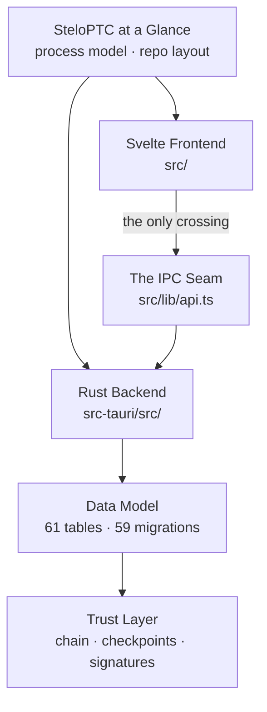

> [!abstract] In one sentence
> The `Architecture/` folder describes **what SteloPTC is** — one OS process in which a Rust crate
> owns a single `rusqlite::Connection` behind one mutex, a Svelte 5 WebView owns the screen, and
> exactly one function call crosses between them — six notes that together let you place any file
> in the repository without opening it.

---

## The domain in one diagram

---

## The notes

| Note | Status | What it actually tells you |
|---|---|---|
| [[SteloPTC at a Glance]] | `pre-v1` | The whole system on one page: one OS process, `main.rs` → `stelo_ptc_lib::run()`, the repository tree, the measured counts at `v0.54.0`, and the three lab profiles that share one binary and one database. Ends with the honest shipped-vs-dormant précis — including the compliance profile-gating bug, named with its three call sites |
| [[Rust Backend]] | `shipped` | `src-tauri/src/` as a crate: `stelo-ptc` / lib name `stelo_ptc_lib`, `crate-type = ["lib","cdylib","staticlib"]`, the module map, `AppState`'s single `Mutex<Database>`, the five-step command convention, `Result<T, String>` everywhere, the in-memory degraded fallback. **Carries the trap that costs the most time**: `commands/` is behind the default `tauri-commands` feature, so `--no-default-features` never compiles it and a type error there passes every headless gate |
| [[Svelte Frontend]] | `shipped` | `src/` as a Svelte 5 runes SPA with no router, no state library and no CSS framework — navigation is one store plus a 23-branch `{#if}` chain in `App.svelte`, 56 components inventoried by role, `export let` count across the codebase: **0**. Also documents two things that look like features and are not: `$lib/*` type-checks but does not bundle, and every Svelte a11y warning is dropped at build time |
| [[The IPC Seam]] | `binding` | The `call<T>()` wrapper in `src/lib/api.ts` — token injection, string-rejection normalisation, the one exact substring that clears auth — and the camelCase-versus-snake_case boundary that breaks most new commands. Ends with the end-to-end recipe for adding a command, which is the single most-used procedure in this vault |
| [[Data Model]] | `shipped` | The entity graph: specimens as the hub, the self-referencing lineage via `parent_specimen_id` / `root_specimen_id`, per-table column detail for the ten tables that matter, what "lab-scoped" means when there is no `lab_id` column anywhere — and the three denormalised caches (`species.taxon_path`, `specimens_fts`, the 60-second dashboard cache) that are the source of most real schema bugs |
| [[Trust Layer]] | `shipped` | Six layered mechanisms and how they compose: hash chain → Merkle checkpoints → portable proofs → Ed25519 signed ledger → on-chain anchor → passport, plus the read-only self-check that catches what none of them would. Opens with the five frozen primitives (`ZERO_HASH`, the canonical byte layout, the hash function, the timestamp format, Ed25519) and the rule that none may change |

---

## How to read this domain

**Start at [[SteloPTC at a Glance]]** — it is the only note that fits the whole system on one screen
and it tells you which of the other five you actually need. From there the split is by question:

- *"Where does this code live?"* → [[Rust Backend]] and [[Svelte Frontend]], each of which is a
  module/component map before it is anything else.
- *"How do I add a feature?"* → [[The IPC Seam]]. Almost every change is a new command plus a new
  wrapper plus a new call site, and the recipe there covers all three.
- *"Why is this number wrong?"* → [[Data Model]]. In this codebase a wrong number is usually a stale
  denormalised cache, not a bad query.
- *"What does the product actually prove?"* → [[Trust Layer]], then [[Hash-Chained Provenance]] in
  Core Concepts for the invariant underneath it.

### The binding rules that constrain this domain

> [!danger] Four constraints that outrank any design you propose
> 1. **One connection, one mutex.** `AppState` holds a single `rusqlite::Connection` behind a
>    `Mutex`. Every command locks it. Anything that could panic while holding it poisons the lock
>    for the rest of the session — which is why the AI client's chunk decoder operates on `&[u8]`
>    and never on `&str`. See [[Rust Backend]].
> 2. **Nothing crosses the seam except through `call<T>()`.** No component imports `invoke`
>    directly. See [[The IPC Seam]].
> 3. **Canonical byte layouts are append-only.** Never reorder a field in a hashed or signed
>    structure; only add at the end. `build_merkle_root`'s duplicate-last rule is permanently
>    frozen. See [[Trust Layer]].
> 4. **Model field names are the API contract.** There is no `#[serde(rename)]` in `models/` except
>    `UserRole`, so renaming a Rust field silently renames a JSON key the frontend reads. See
>    [[Data Model]] and [[Command Reference]].

> [!warning] Two gates are not one gate
> `cargo test --lib --no-default-features` does not compile `src-tauri/src/commands/`. Run the
> full-feature build before pushing anything in that directory — [[Build and Test Commands]] gives
> the exact commands and the release this rule was written after.

### Where this domain hands off

| Question this domain raises | Answered in |
|---|---|
| What does the hash chain guarantee, precisely? | [[Hash-Chained Provenance]] |
| Why does one setting change the whole vocabulary? | [[Lab Profiles]] |
| Why is `taxa` missing every species? | [[Taxonomy Backbone]] |
| Which role can call this command? | [[Roles and Permissions]] · [[Command Reference]] |
| What is the exact column list? | [[Database Schema]] |
| Is this subsystem actually live? | [[Shipped vs Dormant]] |

---

**Back to [[Home]]** · Sibling maps: [[MOC - Core Concepts]] · [[MOC - Workflows]] · [[MOC - Reference]]

#moc #meta #architecture
