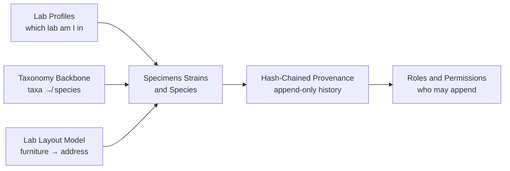

> [!abstract] In one sentence
> The `Core_Concepts/` folder holds the six ideas the rest of the codebase leans on — a chain that
> makes edits detectable, a profile switch that re-vocabularies everything, a taxonomy joined by a
> JSON column rather than a foreign key, a three-level identity model, three permission predicates,
> and furniture that is a footprint *plus* a shelf breakdown — and every one of them explains a
> design decision you would otherwise read as a mistake.

---

## Why these six

Each of these notes exists because a reader who does not know the concept **will misread the code**.
They are not background reading; they are the decoder ring.

---

## The notes

| Note | Status | What it actually tells you |
|---|---|---|
| [[Hash-Chained Provenance]] | `binding` | **Only `audit_log` is chained** — domain tables are ordinary mutable rows and the chain sits beside them. Documents the four nullable chain columns, the frozen eight-field canonical form, the genesis rules, the head lookup that tolerates two generations of legacy rows, and the reclassification hazard. States plainly what the chain does *not* prove |
| [[Lab Profiles]] | `shipped` | One admin-only setting — `app_config.lab_profile` — re-vocabularies the entire application, and every specimen is **stamped** with the profile it was created under, so switching changes which lab you are *looking at* and never what existing data means. Covers the `check_profile_change_allowed` pure function, the `CHANGE PROFILE` confirmation, the domain manifests on the frontend, and the views that appear and disappear |
| [[Taxonomy Backbone]] | `shipped` | The vault's most consequential correction of intuition: **`taxa` is `CHECK`-constrained to kingdom…genus, there is no `species.taxon_id`, and the only link is the JSON array in `species.taxon_path`.** A species with a `NULL` or `'[]'` path is invisible in the whole Taxonomy Navigator regardless of how complete its registry row is. Explains why the tree rendered empty for real labs and exactly what `v0.54.0` changed |
| [[Specimens Strains and Species]] | `shipped` | The three levels of identity and the one decision that shapes the lineage tree: **passage versus split**. Includes the three counters people confuse, the strain status ladder, hybrids and the pedigree DAG, contamination, death and archival — and three sharp edges, starting with `specimens.strain_id` having **no foreign key** because `migration_019` added it with a bare `ALTER TABLE` |
| [[Roles and Permissions]] | `shipped` | Four roles collapse into three concentric predicates — `is_admin ⊂ can_manage ⊂ can_write` — checked in Rust on every command and **mirrored by hand in ~40 separate Svelte expressions**. The gap between those two lists is the standing hazard, and the note carries a `v0.54.0` example where it drifted in both directions in one feature. Also covers field-level permissions (WP-55), where an absent row means *visible* |
| [[Lab Layout Model]] | `shipped` | Why a lab plan is not a floor planner: a five-shelf rack is **one rectangle on the floor and five places to put a culture**, so every `FurnitureItem` carries a footprint *and* `tiers × rows × cols`. Documents the address grammar the drawing generates, the caps and why they exist, and why the plan is one JSON blob in `locations.layout_json` rather than normalised tables |

---

## How to read this domain

**Start at [[Taxonomy Backbone]]**, even though it is the fourth entry alphabetically. It is the
concept most likely to be assumed wrong, it explains the largest bug the project has shipped, and
[[Home]] names it first in the "if you only read three notes" list.

Then read in dependency order rather than folder order:

1. [[Taxonomy Backbone]] — how organisms are classified, and what is *not* a foreign key.
2. [[Specimens Strains and Species]] — how a physical culture gets an identity on top of that.
3. [[Hash-Chained Provenance]] — how the record of what happened to it becomes hard to alter.
4. [[Roles and Permissions]] — who is allowed to append to it.
5. [[Lab Profiles]] — the switch that decides which vocabulary all of the above is spoken in.
6. [[Lab Layout Model]] — where the culture physically sits, and how that string is generated.

> [!important] The two concepts most often conflated
> **Passage vs. split.** A passage moves a culture forward; a split creates new specimens. The
> lineage tree is built from the second, so recording a split as a passage silently loses a branch
> and cannot be corrected without breaking the chain. [[Specimens Strains and Species]] and
> [[Daily Bench Work]] both treat this as the decision of the day.
> **`taxa` vs. `species`.** They are separate tables with no join. Everything the Taxonomy Navigator
> renders is derived from `species.taxon_path`, a cache. [[Taxonomy Backbone]].

### The binding rules that constrain this domain

> [!danger] Invariants, not conventions
> - **`taxa.rank` may never be `species`.** The CHECK constraint is deliberate; a species-rank row
>   cannot be inserted. [[Taxonomy Backbone]]
> - **The audit canonical form is frozen** — eight fields, in order, NULL optionals as the empty
>   string. Append only at the end, never reorder. [[Hash-Chained Provenance]]
> - **The three predicates are the only authorisation primitive on the backend.** No policy engine,
>   no permission strings, no role hierarchy object. Every command validates the session, then calls
>   one of `can_write()` / `can_manage()` / `is_admin()`, and the returned `String` **is** the UI
>   message. [[Roles and Permissions]]
> - **A specimen's `lab_profile` stamp is immutable.** Switching the active profile never relabels,
>   merges or deletes existing data. [[Lab Profiles]]

> [!warning] A frontend gate is not a permission
> The Svelte side re-implements role checks by hand so the UI can hide what will be refused. That
> mirror can drift, and has. The backend check is the real one; a missing frontend gate is a UX bug,
> a missing backend gate is a security bug. [[Roles and Permissions]]

### Where this domain hands off

| Question this domain raises | Answered in |
|---|---|
| What does the technician actually do with all this? | [[Daily Bench Work]] |
| How does a drawing become a specimen's address? | [[Drawing the Lab]] |
| How do taxa get into the database in the first place? | [[Importing NCBI Taxonomy]] |
| What is the machinery under the chain? | [[Trust Layer]] |
| Which predicate guards which of the 263 commands? | [[Command Reference]] |
| What are the real column names and constraints? | [[Database Schema]] |

---

**Back to [[Home]]** · Sibling maps: [[MOC - Architecture]] · [[MOC - Workflows]] · [[MOC - Reference]]

#moc #meta #lab-ops #trust
