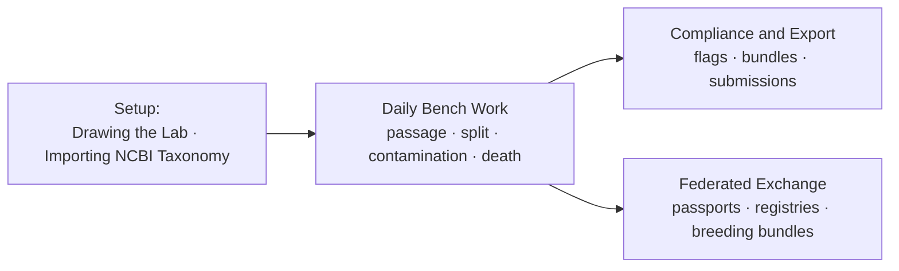

> [!abstract] In one sentence
> The `Workflows/` folder follows five end-to-end paths a real operator takes — the daily bench
> loop, drawing a room, pasting NCBI data in, producing a compliance bundle, and handing a signed
> document to another lab — each one traced from the click to the command to the row it writes, and
> each one ending in an honest-limits section.

---

## Who runs which path

| Workflow | Who | How often | Reaches the network |
|---|---|---|---|
| [[Daily Bench Work]] | Technician and up (`can_write`) | Every shift | No |
| [[Drawing the Lab]] | Supervisor and up (`can_manage`) | Once, then on change | No |
| [[Importing NCBI Taxonomy]] | Admin only | On setup, then rarely | **No** — the operator carries the round trip by hand |
| [[Compliance and Export]] | Mixed; bundles need `can_manage` | Per inspection or filing | No — every export writes a file to local disk |
| [[Federated Exchange]] | Admin / supervisor (the Audit Log view) | Per collaboration | No — files a human copies |

---

## The notes

| Note | Status | What it actually tells you |
|---|---|---|
| [[Daily Bench Work]] | `shipped` | The technician's loop: dashboard → work queue → one specimen at a time. Explains what each dashboard number is really counting, the **five work-queue rules evaluated in order**, what a passage silently also does, post-split check-ins, the three easily-confused counters, and how contamination and death are recorded. The only irreversible decision of the day is passage vs. split, because the lineage tree is built from it |
| [[Drawing the Lab]] | `shipped` | Eight steps from *+ New Location* to a specimen carrying an address: create the location, arm a stamp, drop and drag furniture, set `tiers × rows × cols` in the inspector, read the elevation with every tray labelled, watch occupancy shading fill from live counts, save with `save_location_layout`, then find those addresses in Add Specimen's dropdowns — **replacing the hardcoded Room 1–5 / Rack A–D list that shipped before `v0.54.0`** |
| [[Importing NCBI Taxonomy]] | `shipped` | Every input shape the one paste box accepts — `esummary` JSON, `efetch` XML with `LineageEx` expanded, `taxdump` `nodes.dmp`/`names.dmp`, CSV/TSV, plain JSON under any usual field spelling — plus the preview table with per-row checkboxes, the dry run, the three write phases, and how to read `parents_linked` and `skipped_records`. Opens with four independent pieces of evidence that **the app has no network code at all**, which is why the E-utilities round trip is a human with a Copy URL button |
| [[Compliance and Export]] | `shipped` | Untangles the four separate things that wear the word "export": a flag engine with waivers, a regulatory bundle builder, a submission pipeline with background auto-generation, and the ordinary CSV/JSON/Excel path. Ends in a shipped-vs-stub table that records which bundles are signed (Part 11: yes; USDA and CITES: no) and that **nothing here transmits to any agency** |
| [[Federated Exchange]] | `shipped` | Three ways two labs share something verifiable — a **specimen passport**, a **taxonomy registry**, a **breeding coordination bundle** — all Ed25519-signed JSON with a shared canonical-bytes shape (fixed field order, `0x1F`/`0x1E` framing, SHA-256 content hash). "Federated" here means **files, not a network**: no server, no key directory, no discovery, no revocation list, and public keys exchanged out of band |

---

## How to read this domain

**Start at [[Daily Bench Work]]** — it is the workflow the product exists to serve, and the other
four are either setup for it or output from it. If you are onboarding a lab rather than reading
code, the real order is chronological:

1. [[Drawing the Lab]] — so specimens have somewhere to live.
2. [[Importing NCBI Taxonomy]] — so species can be classified. (Or skip it: a lab can hand-build
   a backbone, and `v0.54.0` files species under their genus automatically either way.)
3. [[Daily Bench Work]] — the loop, forever.
4. [[Compliance and Export]] and [[Federated Exchange]] — what comes out the other end.

> [!tip] Each of these notes has an `## Honest limits` section — read it first
> The limits sections are where the workflow notes earn their keep. They record things like:
> occupancy shading being a count, not a capacity check; the work queue having no notion of
> weekends; exports excluding archived specimens; and imports writing no audit entry.

### The rules that constrain this domain

> [!danger] Three constraints every workflow inherits
> 1. **Every step is one Tauri command.** There is no client-side transaction and no multi-command
>    atomicity — a workflow that half-fails leaves the earlier commands committed. [[The IPC Seam]]
> 2. **Nothing here touches the network.** Not the NCBI import, not the regulatory exports, not the
>    federated documents. This is a property of the build — no HTTP client in `src-tauri/Cargo.toml`
>    and no `http:*` permission in `src-tauri/capabilities/default.json` — not a policy someone
>    could relax in a config file. [[Shipped vs Dormant]]
> 3. **A write that matters is chained.** Passage, split, death, archive and creation all append to
>    `audit_log`, and five of the six also append a signed ledger event. Export and Excel import do
>    **not** write audit entries — that asymmetry is deliberate and documented.
>    [[Hash-Chained Provenance]]

> [!warning] The compliance workflow is gated on the wrong table
> `get_compliance_flags` and the submission readiness check read the lab profile from
> `app_settings`, a key nothing ever writes, instead of `app_config.lab_profile`. Every lab is
> therefore gated as `plant_tissue_culture`: the citrus rule fires everywhere and the mycology and
> mycoplasma rules never fire. Three call sites, named in [[Shipped vs Dormant]] and
> [[Compliance and Export]]. The row-level filters inside the same functions are correct.

### Where this domain hands off

| Question this domain raises | Answered in |
|---|---|
| Why is passage vs. split irreversible? | [[Specimens Strains and Species]] |
| What does the address string actually encode? | [[Lab Layout Model]] |
| Why can't a species be a taxon? | [[Taxonomy Backbone]] |
| What signs these documents, and how is it verified? | [[Trust Layer]] |
| Which role can run this step? | [[Roles and Permissions]] · [[Command Reference]] |
| What does this error message mean? | [[Failure Reference]] |
| Is this part of the workflow actually live? | [[Shipped vs Dormant]] |

---

**Back to [[Home]]** · Sibling maps: [[MOC - Architecture]] · [[MOC - Core Concepts]] · [[MOC - Reference]]

#moc #meta #workflow #lab-ops
