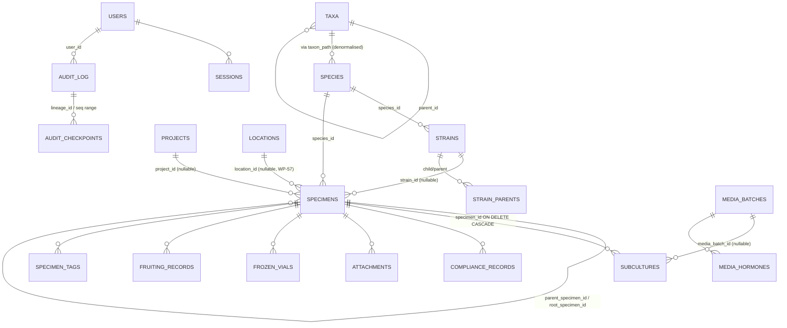

> [!abstract] In one sentence
> One SQLite file holds 61 application tables built up by 59 sequential migrations, keyed around a
> specimen that carries a stamped `lab_profile` and an append-only audit lineage — plus two
> denormalised caches (`species.taxon_path` and `specimens_fts`) whose invalidation rules are the
> subject of most of the schema's real bugs.

## Core entities



The two things that diagram cannot show, and that matter most:

- **`species.taxon_path` is not a foreign key.** It is a JSON array of taxon ids stored as TEXT,
  matched with `LIKE` patterns. See the caches section below.
- **`specimens.location`** (a free-text `"Room / Unit / Shelf / Position"` string) and
  **`specimens.location_id`** (an FK into `locations`) are two parallel systems. The lab map draws
  the room; specimen placement still lives in the string, which the layout *generates* rather than
  replaces.

## Table detail

### `specimens` — 45 columns, the widest table

| Column | Type | Meaning / constraint |
|---|---|---|
| `id` | TEXT PK | uuid v4 |
| `accession_number` | TEXT UNIQUE | The human key. Split children take `A`–`Z` suffixes; running out of all 26 is a `DbError::Constraint` |
| `species_id` | TEXT → `species(id)` | Required |
| `project_id` | TEXT → `projects(id)` | Nullable |
| `stage`, `custom_stage` | TEXT | **No CHECK since migration 016** — validated in code against the `stages` vocabulary for the active profile |
| `propagation_method` | TEXT | Also un-CHECKed since 016; validated against `propagation_methods` |
| `acclimatization_status` | TEXT | CHECK retained: `not_applicable`/`in_vitro`/`hardening`/`greenhouse`/`field`/`completed` |
| `provenance`, `source_plant`, `initiation_date` | TEXT | Origin narrative; `initiation_date` NOT NULL |
| `location`, `location_details` | TEXT | Free-text placement path (see above) |
| `location_id` | TEXT → `locations(id)` | Migration 040, nullable |
| `health_status` | TEXT | Default `'healthy'` |
| `disease_status`, `quarantine_flag`, `quarantine_release_date` | | Phytosanitary state |
| `permit_number`, `permit_expiry`, `ip_flag`, `ip_notes` | | Regulatory / IP |
| `subculture_count` | INTEGER | Maintained by the passage path; a **death row does not increment it** |
| `parent_specimen_id`, `root_specimen_id`, `generation`, `lineage_passage_offset` | | Genealogy (migration 010) |
| `contamination_flag`, `contamination_notes` | | Set at archive time; distinct from the aggregate across subcultures |
| `strain_id`, `strain_chain_seq` | | Migration 019 |
| `cumulative_pdl` | REAL | Cell-culture population doubling level, NULL until cell counts exist |
| `biosafety_level` | TEXT | CHECK BSL-1 / BSL-2 / BSL-2+ / BSL-3 |
| `origin_type` | TEXT | CHECK `multi_spore`/`isolated_dikaryon`/`tissue_clone` (mycology) |
| `is_best_performer` | INTEGER | Selection flag |
| `is_archived`, `archived_at` | | Nothing is hard-deleted — `delete_specimen` archives |
| `employee_id`, `created_by`, `created_at`, `updated_at`, `qr_code_data`, `notes`, `environmental_notes` | | |
| **`lab_profile`** | TEXT NOT NULL DEFAULT `'plant_tissue_culture'` | **The tenancy column.** Migration 053 |

### `subcultures` — 40 columns

The passage record. `specimen_id` cascades on delete. Beyond the obvious (`passage_number`, `date`,
`media_batch_id`, `ph`, `temperature_c`, `light_cycle`, `vessel_*`, `location_from`/`location_to`,
before/after temp-humidity-light readings, `performed_by`, `notes`, `observations`):

| Column | Meaning |
|---|---|
| `event_type` | Default `'passage'`. `'death'` is the terminal variant: it **archives** the specimen and does **not** increment `subculture_count` |
| `seed_cell_count`, `harvest_cell_count`, `split_ratio`, `pdl_gained`, `doubling_time_hours` | Cell-culture metrics (migration 024) |
| `colonization_pct` | REAL, `CHECK(… IS NULL OR (>= 0.0 AND <= 100.0))` (mycology, migration 028) |
| `contaminant_type` | Free text against the frontend's `CONTAMINANT_TYPE_LABELS` — **no DB CHECK backs it** |
| `health_status`, `contamination_flag`, `contamination_notes` | Per-passage assessment |

### `species` — 11 columns

`id`, `genus`, `species_name`, `common_name`, `species_code` UNIQUE,
`default_subculture_interval_days` (default 28), `notes`, `created_at`, `updated_at`, plus the two
added by migration 020: **`taxon_path`** (JSON array of taxon ids, TEXT) and `ncbi_taxon_id`.

### `taxa` — 12 columns

`id` PK, `rank` CHECK IN (`kingdom`,`phylum`,`class`,`order`,`family`,`genus`) — note there is
**no `species` rank**; species live in their own table — `name`, `parent_id` → `taxa(id)`,
`ncbi_taxon_id`, `ncbi_updated_at`, `local_override`, `taxon_path`, `status` (default
`'accepted'`, migration 034), `provisional_notes`, timestamps. Indexed on `parent_id`, `rank`,
`name`. See [[Taxonomy Backbone]].

### `strains` — 17 columns

`UNIQUE(species_id, code)`. `strain_type` default `'wildtype'`; `status` CHECK IN
(`unverified`,`claimed`,`confirmed_manual`,`confirmed_genomic`) with `claimed_by`, `claimed_at`,
`confirmation_basis`; `genomic_fingerprint` (one of the three field-permission-maskable columns);
`is_hybrid`, `is_cross_species`, `is_archived`, `archived_at`. See
[[Specimens Strains and Species]].

### `users` and `sessions`

`users`: `id`, `username` UNIQUE, `password_hash` (bcrypt `DEFAULT_COST`), `display_name`, `email`,
`role` CHECK IN (`admin`,`supervisor`,`tech`,`guest`) default `'tech'`, `is_active`,
`must_change_password`, timestamps.

`sessions`: `id`, `user_id`, `token` UNIQUE, `created_at`, `expires_at`.

> [!important] `sessions.token` stores a digest, not a token
> The column holds `SHA-256(token)` base64-url-encoded. Migration 055 deleted every pre-existing
> row when the storage changed. Plain SHA-256 rather than bcrypt/Argon2 is deliberate: the token is
> 256 bits of CSPRNG output, so there is nothing to brute-force, and a slow KDF would add ~100 ms
> to *every* authenticated command. TTL is 24 hours.

### `audit_log` — 14 columns

`id`, `user_id`, `action`, `entity_type`, `entity_id`, `old_value`, `new_value`, `ip_address`,
`details`, `created_at`, then the hash-chain columns appended by migrations 008 and 009:
`chain_seq` INTEGER, `prev_hash` TEXT, `entry_hash` TEXT, `lineage_id` TEXT. All four are
nullable — rows written before v1.5.0 have NULL, and the chain-head lookup handles that with a dual
predicate. Mechanics in [[Hash-Chained Provenance]].

> [!note] `ip_address` is dead
> The column has existed since migration 001 and no code path ever writes it — `log_audit_impl`'s
> INSERT omits it entirely. A local desktop app has no meaningful client IP to record.

### `app_config` — the single-row lab identity

```sql
CREATE TABLE IF NOT EXISTS app_config (
    id          INTEGER PRIMARY KEY CHECK (id = 1),
    lab_profile TEXT NOT NULL DEFAULT 'plant_tissue_culture'
                CHECK (lab_profile IN ('plant_tissue_culture','cell_culture','mycology')),
    updated_at  TEXT NOT NULL DEFAULT (datetime('now'))
);
```
Migration 032 adds `domain` (default `'Plantae'`, **deliberately no CHECK** so a future
`Bacteria`/`Archaea` needs no migration). `smtp_config` and `signing_keys` use the same
`CHECK (id = 1)` single-row idiom.

### `app_settings` — key/value

Three columns: `key` TEXT PK, `value` TEXT NOT NULL, `updated_at`. Read through
`queries::read_setting(conn, key, default)`, which **swallows every error** — missing key, missing
table — and returns the default. Seeded keys: `auto_checkpoint_enabled` (`"1"`),
`auto_checkpoint_interval` (`"100"`), `auto_checkpoint_on_backup` (`"1"`), `backend_type`
(`"sqlite"`), `notification_check_interval_minutes` (`"15"`), `pedigree_max_depth` (`"10"`).
Written on demand: `analytics_panel_config`, `lab_name`, the four `ai_*` keys, the `myco_*` and
`mycoplasma_test_interval_days` thresholds, `sensor_<type>_min`/`_max`.

### `locations` — 9 columns

`id`, `name` UNIQUE, `description`, `floor_plan_image` (base64, inline), `floor_plan_x`,
`floor_plan_y` (fractional 0–1), timestamps — plus **`layout_json`**, added nullable by
migration 059.

> [!info] Why the room geometry is a blob
> The layout is a *document*: read whole, written whole, never queried across rooms. Normalising it
> would buy a join nobody needs at the cost of a migration every time the editor grows a field.
> What *is* queried — specimen placement — stays in `specimens.location`, which the layout
> generates rather than replaces. `save_location_layout` validates that the payload parses as JSON
> and enforces a size limit before storing it. The schema of the document itself lives in
> `src/lib/labLayout.ts`; see [[Lab Layout Model]].

### Vocabulary tables

`stages`, `propagation_methods`, `hormone_types`, `compliance_record_types`, `compliance_agencies`,
`inventory_categories` all share:

```sql
id INTEGER PRIMARY KEY AUTOINCREMENT, profile TEXT NOT NULL, code TEXT NOT NULL,
label TEXT NOT NULL, sort_order INTEGER NOT NULL DEFAULT 0, UNIQUE(profile, code)
```

`stages` adds `is_terminal INTEGER NOT NULL DEFAULT 0` — a terminal stage is never selectable on
create. These six are the **only** tables a plugin may seed
(`plugins::manifest::SEEDABLE_VOCAB_TABLES`).

## Lab scoping

> [!danger] There is no `lab_id` column anywhere in this repository
> The multi-tenancy axis is `lab_profile` — a three-valued **lab type** discriminator, not a tenant
> id. Two labs of the same type cannot share a database.

Membership is **stamped at creation** onto `specimens.lab_profile` and never rewritten. Switching
the active profile changes what you are looking at; it never relabels, hides permanently, or merges
existing data. Four helpers in `src-tauri/src/db/vocabulary.rs` enforce it:

| Helper | Role |
|---|---|
| `active_profile(conn)` | Reads `app_config.lab_profile`; falls back to `plant_tissue_culture` on any error |
| `active_lab_sql(alias)` | Returns the bare predicate `"{alias}.lab_profile = COALESCE((SELECT lab_profile FROM app_config WHERE id = 1), 'plant_tissue_culture')"` |
| `specimen_lab_profile(conn, id)` | Reads the stamped column; `"Specimen not found"` otherwise |
| `require_active_lab_profile(conn, id)` | **Default-deny by-ID guard** — the enforcement point every by-ID specimen command routes through |

`active_lab_sql` is written as a correlated subquery rather than a bind parameter **on purpose**:
the queries that need it carry wildly different numbers of positional parameters, and threading a
new `?N` through each is exactly the index-arithmetic edit that silently binds the wrong value —
and the failure mode is one lab seeing another lab's data. List and search paths instead bind the
profile as the **first** predicate, with a comment recording that lab isolation is unconditional
and is not a user-supplied filter.

Migration 053 exists because the profile used to be *derived* by joining `specimens.stage` against
`stages.profile`. That is wrong in both directions: `archived`, `custom`, `suspension`,
`contaminated`, `discarded` and `other` are each defined for two or three profiles, and the list
and search paths never applied the join at all — so the Dashboard and the specimen list disagreed
about what was in the lab. Full treatment in [[Lab Profiles]].

Switching profiles is admin-only and, when specimens exist, requires the caller to type exactly
`CHANGE PROFILE` (`queries::check_profile_change_allowed`).

## The denormalised caches

Three caches exist. Two are in the schema; one is in memory.

### 1. `species.taxon_path` — JSON array of taxon ids

The Taxonomy Navigator resolves **every column** through this one TEXT column, matching with
`LIKE '%"<taxon_id>"%'` and, for "is this species filed directly under that taxon", with
`LIKE '%"<taxon_id>"]'` — the id as the **last** element. Taxon ids are UUIDs (hex and hyphens
only), which is what makes the `LIKE` pattern safe.

Its writers, and when each fires:

| Writer | Trigger |
|---|---|
| `queries::link_species_to_genus` | `create_species`, and the genus half of `update_species`; also the xlsx importer |
| `queries::rebuild_species_taxonomy` | `migration_058`, the `rebuild_species_taxonomy` command, and taxonomy-registry import |
| `queries::resync_species_paths_under` | After a taxon's parent changes: `update_taxon` and NCBI import |
| `queries::recompute_taxon_path` | Rewrites `taxa.taxon_path` for a taxon and every descendant; cycle-safe |

> [!danger] Two `v0.54.0` fixes, both invalidation failures
> **(1) The column had one writer and no ongoing writer.** `migration_020` back-filled a genus
> taxon for every species that existed at the time, and nothing kept doing it. Every species added
> through the UI afterwards landed with `taxon_path = NULL` and was **invisible in the Taxonomy
> tab** — a lab could have a complete species registry and an entirely empty tree.
> `migration_058` repairs drifted databases and `rebuild_species_taxonomy` exposes the same repair
> as a supervisor action. It is idempotent, genus matching is case-insensitive (`citrus` and
> `Citrus` are one genus), and a species deliberately classified under a deeper hand-built
> Kingdom → … → Genus backbone is never flattened back to a bare genus.
> **(2) The column had no invalidation when a taxon moved.** `species.taxon_path` is a *copy* of
> its genus taxon's path. Re-parenting a taxon — precisely what NCBI import now does when it wires
> up `parent_ncbi_id` — moved the taxon without moving the species hanging off it. The damage was
> quiet rather than blank: the species stayed visible (the last path element does not change), but
> ancestor columns counted zero strains and zero specimens, and `locate_species` handed the
> navigator a one-element chain that no longer began at a root, so "Open in Taxonomy" from the
> Species Registry walked into nothing. `resync_species_paths_under` is the fix.

> [!tip] The rule to keep
> Any code path that changes a taxon's `parent_id` **must** call `recompute_taxon_path` for the
> subtree and `resync_species_paths_under` for the species hanging off it. Any code path that
> creates or renames a species' genus **must** call `link_species_to_genus`. Both walks are
> cycle-guarded with a `HashSet` — a hand-edited parent link must never hang the app while it holds
> the database lock.

### 2. `specimens_fts` — FTS5 external content

```sql
CREATE VIRTUAL TABLE IF NOT EXISTS specimens_fts USING fts5(
    accession_number, notes, location, provenance, source_plant,
    content='specimens', content_rowid='rowid', tokenize='trigram');
```

**Trigram, not unicode61**, so a partial accession still matches — searching `0042` must find
`FIX-00000042`. External content, so the text is not duplicated. Three triggers
(`specimens_fts_insert`, `_delete`, `_update`) keep it in step, and the delete/update triggers must
write the OLD values into the `'delete'` command row first. `queries::FTS_MIN_QUERY_LEN = 3` —
shorter needles fall back to a `LIKE` scan.

The integrity self-check verifies this cache two ways: comparing `COUNT(*) FROM specimens` against
`specimens_fts_docsize`, and running
`INSERT INTO specimens_fts (specimens_fts, rank) VALUES ('integrity-check', 1)` — the `rank = 1`
argument is **required**, because the plain one-argument form only checks the index's internal
consistency and returns OK for an index that silently stopped tracking the table.

### 3. The dashboard cache — in memory, 60 s

`AppState.dashboard_cache` holds `DashboardCacheEntry { profile, computed_at, specimen_stats,
contamination_stats }`. A hit requires **both** the same profile and `elapsed < 60 s`. Twelve write
paths call `invalidate_dashboard_cache`. Never persisted.

## Schema evolution

Migrations are a flat sequence of `if current < N { apply(conn, N, migration_N_slug)?; }` blocks in
`src-tauri/src/db/migrations.rs`, stamped one row per version into `schema_version`. Head is
**59**, numbered 1–59 with no gaps; 52 use the transactional `apply()` harness and 7
transaction-hostile legacy migrations use `apply_untransacted`. The full index, the harness
rationale and the recipe for migration 60 live in [[Migrations]]; the flat column lookup lives in
[[Database Schema]].

## See also

- [[Lab Profiles]] · [[Taxonomy Backbone]] · [[Specimens Strains and Species]] · [[Lab Layout Model]]
- [[Importing NCBI Taxonomy]] — the workflow that exercises every `taxon_path` writer at once.
- [[Hash-Chained Provenance]] · [[Trust Layer]] · [[Rust Backend]]

**Back to [[Home]]**

#architecture #database #sqlite #schema
