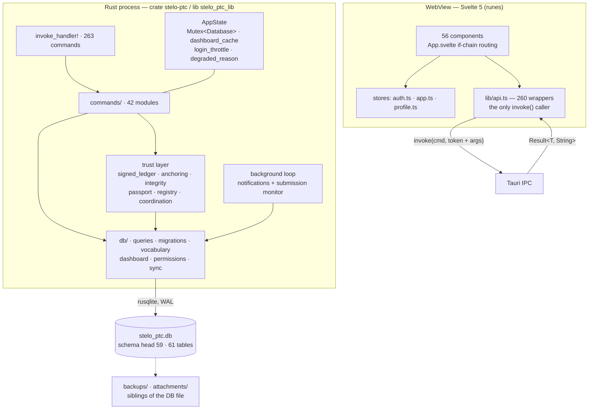

> [!abstract] In one sentence
> SteloPTC is a local-first Tauri v2 desktop and Android application for plant tissue culture,
> cell culture and mycology labs, in which one Rust process owns a single SQLite file and one
> WebView runs a Svelte 5 UI, and every mutation is written into a hash-chained, tamper-evident
> audit log.

## What the product is

A **lab notebook that can prove it was not edited afterwards.** The domain is culture work —
specimens, passages (subcultures), media batches, contamination, cryostorage, breeding — and the
distinguishing feature is that the record of that work is cryptographically append-only. Everything
runs on the operator's own machine: there is no server, no account system beyond local users, and
no HTTP client anywhere in the backend.

Three lab types share one binary and one database, discriminated by `app_config.lab_profile`:

| Profile | Domain | What changes |
|---|---|---|
| `plant_tissue_culture` | Plantae | Media Logs view visible; PTC stage/propagation vocabulary |
| `cell_culture` | Animalia | PDL tracking, biosafety level, mycoplasma rules |
| `mycology` | Fungi | Fruiting view visible; colonization %, contaminant types, spore/dikaryon origin |

Switching the active profile changes *what you are looking at*. It never relabels, merges or
deletes existing data — see [[Lab Profiles]].

## Process model

One OS process. `src-tauri/src/main.rs` calls `stelo_ptc_lib::run()`, which builds a Tauri app,
`manage()`s a single `AppState` holding a `Mutex<Database>` (one `rusqlite::Connection`), registers
**263** commands in one `generate_handler!` list, runs migrations, and spawns exactly one background
loop. The WebView is a separate rendering context that can only reach Rust through Tauri IPC — it
has no filesystem, network or database access of its own.

> [!important] The mutex is the concurrency model
> Every command serialises on one `Mutex<Database>`. That is why read-max-then-insert sequences
> (ledger `seq`, checkpoint building) are race-free without explicit transactions, and why the
> standing rule in `SKILLS.md` §5 is *never hold the DB lock across a network call* — the AI
> commands drop the guard before talking to Ollama and re-lock to persist.

## Repository layout

| Path | What lives there |
|---|---|
| `src/` | The Svelte 5 frontend: `App.svelte`, `main.ts`, `lib/api.ts`, `lib/components/` (56), `lib/stores/`, `lib/styles/tokens.css`, and the pure util modules that carry the 203 TS tests |
| `src-tauri/src/` | The Rust backend: `lib.rs` (AppState + handler list), `commands/` (42 modules), `db/`, `models/`, `auth/`, and the trust / federation / integration subsystems that sit beside them |
| `src-tauri/tests/`, `src-tauri/benches/` | Integration tests over migrations + the death workflow; Criterion benchmarks that talk to `db::` directly so they build without GTK/WebKit |
| `src-tauri/capabilities/`, `src-tauri/gen/schemas/` | Tauri v2 capability grants (deliberately minimal) and the generated, committed ACL schemas |
| `docs/` | Twelve subsystem specs — wire formats, canonical byte layouts, standalone Python verifiers |
| `Obsidian/` | This vault |
| `scripts/`, `public/`, `.github/workflows/` | Android setup script; PWA icons; five CI workflows (`test`, `benchmarks`, `build-windows`, `build-android`, `build-ios`) |
| Root `.md` files | `README.md`, `CHANGELOG.md` (work-packet history, append-only), `ROADMAP.md`, `SKILLS.md` (the repo's own operating rules), `UserManual.md`, `SteloPTC.md`, `DailyClaudeRoutineCheckup.md` |

## The numbers, as of `v0.54.0`

| Measure | Value |
|---|---|
| Tauri commands defined / registered | 263 / 263 — no orphans, verified by diffing `#[tauri::command]` against the `generate_handler!` list |
| Migrations applied | **59**, numbered 1–59 with no gaps, head `migration_059_location_layout`. 52 go through the transactional `apply()` harness; 7 legacy ones use `apply_untransacted` |
| Application tables | 61 (plus the `specimens_fts` virtual table and its four FTS5 shadow tables) |
| Rust tests | `cargo test --lib` **758 passing** under the full `tauri-commands` feature |
| TypeScript tests | `npm test` **203 passing** across 8 files |
| Type-check | `npm run check` — 0 errors, 0 warnings |
| Version carriers kept in lockstep | `package.json`, `package-lock.json`, `src-tauri/Cargo.toml`, `Cargo.lock`, `tauri.conf.json`, Android `build.gradle.kts` |

> [!info] Why `0.54.0` follows `1.53.2`
> Everything through `1.53.2` shipped under a `1.x` series. The project is pre-1.0 by the
> maintainer's judgement, so at this release the major number dropped and the minor carried on
> unbroken: `1.53` → `0.54`. Historical CHANGELOG entries keep the version they actually shipped
> under. The Android `versionCode` still *increased* (28 → 29) because it is independent of the
> version name and a decreasing one would break upgrades.

## Where to go next

- [[Rust Backend]] — module map, `AppState`, the command convention, the degraded fallback.
- [[Svelte Frontend]] — runes conventions, the routing model, the component inventory.
- [[The IPC Seam]] — how `invoke` is wrapped and the complete recipe for adding a command.
- [[Data Model]] — the schema, lab scoping, and the denormalised caches that bite.
- [[Trust Layer]] — hash chain, Merkle checkpoints, signed ledger, anchoring, passports.
- [[Command Reference]] and [[Database Schema]] for the flat lookups.

## Honest shipped-vs-dormant summary

Read [[Shipped vs Dormant]] before quoting any capability at a customer. The short version:

> [!success] Genuinely working, offline, tested
> The specimen/passage/media/inventory/compliance core; the WP-18 hash chain and WP-20/21 Merkle
> checkpoints and portable proofs; the Ed25519 signed event ledger; the data-integrity self-check;
> regulatory export bundles; specimen passports, taxonomy registries and breeding-coordination
> bundles (sign, verify, import); the lab-map room designer; the NCBI paste-and-import box; local
> AI via a user-supplied Ollama endpoint.

> [!caution] Shipped but dormant — real code, no live path
> **PostgreSQL backend** — a connector plus a five-table bootstrap behind an off-by-default cargo
> feature; SQLite is the only live backend. **LAN sync** — change detection and conflict recording
> exist, but nothing transports them and incoming changes are never replayed into domain tables.
> **The frontend offline queue** — tested, IndexedDB-ready, and imported by nothing but its own
> test. **Cloud backup scheduling** — `schedule_cron` is validated on write and never read.
> **Plugins** — vocabulary seeding is live; WASM modules, panels and report templates are metadata
> only, and a plugin-introduced lab profile can never be activated. **Sensor transports** — the
> `source` field is a caller-supplied label, not provenance.

> [!warning] Known-wrong, disclosed, still in the tree
> Compliance **rule gating** reads `read_setting(conn, "lab_profile", …)`, which queries
> `app_settings`; the profile actually lives in `app_config.lab_profile` and nothing ever writes
> that key. So every lab is gated as `plant_tissue_culture`: the citrus-HLB rule fires everywhere
> and the mycology and mycoplasma rules never fire. Three call sites:
> `src-tauri/src/commands/compliance.rs:235`, `:644`, and `src-tauri/src/reg_submission/mod.rs:168`.
> The row-level SQL filters inside those same functions are correct — it is only the rule gating
> that is wrong. Details in [[Failure Reference]].

**Back to [[Home]]**

#architecture #overview #tauri #svelte #rust #sqlite
