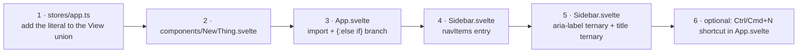
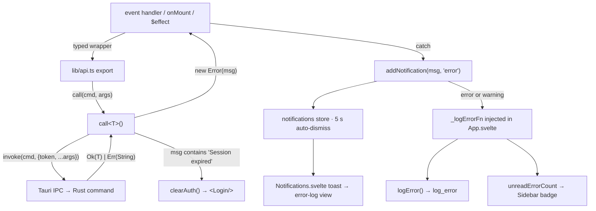

> [!abstract] In one sentence
> `src/` is a Svelte 5 runes-mode SPA with no router, no state-management library and no CSS
> framework: navigation is one writable store plus a 23-branch `{#if}` chain in `App.svelte`, all
> data flows through the single wrapper in `src/lib/api.ts`, and the design system is a handful of
> `:global()` classes and a `tokens.css` custom-property file.

## Stack

| Thing | Value |
|---|---|
| Framework | Svelte **5**, runes mode. `export let` count across `src/`: **0** |
| Language | TypeScript, `lang="ts"` on every `<script>` |
| Bundler / dev server | Vite 6, port **1420**, `strictPort: true`; HMR on 1421 only when `TAURI_DEV_HOST` is set |
| Build target | `["es2021", "chrome100", "safari15"]` |
| Type gate | `npm run check` → `svelte-check` (currently 0 errors, 0 warnings) |
| Tests | Vitest 3 + jsdom, `globals: false`, 8 files, **203 passing** |
| Codegen | `compilerOptions: { generate: "client" }` forced in *both* `vite.config.ts` and `svelte.config.js` — without it Svelte 5 can emit an SSR bundle where `mount()`/`onMount()` don't exist |

> [!danger] Two build traps that look like features
> **`$lib/*` is type-check-only.** `tsconfig.json` declares the path alias but Vite has no matching
> resolver, so `import … from '$lib/foo'` type-checks and then fails the build. Verified: zero such
> imports exist. Use relative paths.
> **All Svelte a11y lint warnings are suppressed at build time.** `vite.config.ts` drops any
> warning whose `code.startsWith("a11y")`, with the rationale "closed-network desktop app; the
> a11y rules add noise without value." The 49 `<!-- svelte-ignore a11y_* -->` comments in
> components therefore matter for `svelte-check`, not for the build — which means an accessibility
> regression is invisible to every gate.

## Boot

`index.html` paints a full-screen `#app-loader` from an inline `<style>` and installs
`window.onerror` / `unhandledrejection` handlers before any module runs. `src/main.ts` then:

1. Imports `./lib/styles/tokens.css` (despite that file's own header saying "import once in
   App.svelte" — it is imported here).
2. `Object.freeze(Object.prototype)` as the **first statement of the module body**, before mount.
   `xlsx` 0.18.5 carries GHSA-4r6h-8v6p-xvw6, prototype pollution reachable from `XLSX.read`,
   which is precisely what the Import screen does; the fix landed in 0.19.3+, which SheetJS never
   published to npm. `src/lib/prototypeHardening.test.ts` asserts a full xlsx write → read →
   `sheet_to_json` round trip still works with the prototype frozen — that is the test that would
   catch this mitigation breaking Import. `xlsx` itself is imported by `ImportManager`,
   `ExportManager` and `AnalyticsDashboard`, all of which mount after this line runs.
3. Service-worker registration, gated on `!isTauri()` — the SW must never intercept Tauri's
   `ipc://` requests, and `injectRegister: false` guarantees this is the only registration site.
4. `mount(App, { target: '#app' })`, then `document.body.classList.add('app-ready')` **only on
   success** — so a mount failure leaves the loader and its error box on screen rather than a
   white page.

## Runes conventions

Measured across `src/` (`*.svelte` + `*.ts`): `$state` **621**, `$derived` **100**, `$props`
**20**, `$effect` **18**. `$bindable`, `$inspect` and `$host` are unused.

```ts
let specimens = $state<any[]>([]);              // inline type param when non-primitive
let loading   = $state(true);
let error     = $state<string | null>(null);

let overdueItems = $derived(schedule.filter((e: any) => e.is_overdue));
let { onclose, onsave }: { onclose: () => void; onsave: () => void } = $props();
```

- **Reassignment, not mutation, for collections.** `SpecimenList`'s selection is rebuilt as a fresh
  `Set` on every toggle because Svelte 5 does not deep-proxy a `Set`.
- **`$derived.by` is not used anywhere**; plain expressions only. Both `let` and `const` appear —
  no enforced convention.
- **Callback props replace events entirely.** The naming rule is a lowercase `on`-prefixed word
  with no dash and no camel hump: `onclose`, `onsave`, `onretry`, `onemptyaction`, `onnavigate`,
  `onphotoschanged`, `oncreated`, `onscan`. (Two stragglers use camelCase: `FirstRun`'s
  `onAddSpecimen`/`onDemoLoaded` and `Sidebar`'s `ontoggleDark`.)
- **Children are `Snippet`s**: `let { children }: { children?: Snippet } = $props()` then
  `{#if children}{@render children()}{/if}` — `DataState.svelte` and `FormField.svelte`.
- **`$effect` is deliberately rare** (18 uses). The house tool for "read these deps but don't let
  my own writes re-trigger me" is `untrack` from `'svelte'` — `SpecimenDetail.svelte` uses it to
  reload when `$selectedSpecimenId` changes without looping on the loader's own state writes.

> [!danger] A plain `let` is not reactive in runes mode
> `App.svelte` carries the canonical warning verbatim: reassigning a plain `let` updates the
> variable but never re-renders, *silently hiding the startup-error screen*. This codebase has
> already been bitten by it. Anything a template reads must be `$state`.

## Routing

There is no router and no URL routing. Three pieces:

```ts
// src/lib/stores/app.ts
export type View = 'dashboard' | 'specimens' | 'specimen-detail' | 'media' | 'reminders'
  | 'compliance' | 'species' | 'inventory' | 'users' | 'audit' | 'error-log' | 'export'
  | 'import' | 'settings' | 'work-queue' | 'taxonomy' | 'ncbi-sync' | 'cryo' | 'breeding'
  | 'provisional-taxa' | 'analytics' | 'lab-map' | 'fruiting';

export const currentView = writable<View>('dashboard');

export function navigateTo(view: View, specimenId?: string) {
  currentView.set(view);
  if (specimenId) selectedSpecimenId.set(specimenId);
}
```

`App.svelte` renders a flat 23-branch `{#if $currentView === 'x'} … {:else if …}` chain with a
`{:else} <Dashboard />` fallback. **A component not referenced in that chain is dead.**

Companion hand-off stores, all `writable<string | null>(null)`: `selectedSpecimenId`,
`selectedStrainId`, and `focusSpeciesId`. The last two are *consumed once and cleared* by
`TaxonomyNavigator.onMount` — `focusSpeciesId` wins over `selectedStrainId`, and if neither is set
the navigator restores the user's saved column path from `localStorage['stelo_taxonomy_path']`.

The whole app is gated in this priority order: degraded banner (rendered **in addition to**
everything else, `role="alert"`, `z-index: 10000`) → startup error → `$initializing` →
`<Login />` → `<ForceChangePassword />` → the layout. `<PwaInstallPrompt />` sits outside `.app`
so it renders regardless of auth.

### Adding a view — the exact recipe



1. **`src/lib/stores/app.ts`** — add the string literal to the `View` union. TypeScript now rejects
   `navigateTo('typo')`.
2. **`src/lib/components/NewThing.svelte`** — create it.
3. **`src/App.svelte`** — add the import at the top and a branch to the if-chain.
4. **`src/lib/components/Sidebar.svelte`** — push a `NavItem`:
   `{ id: 'new-thing', label: 'New Thing', icon: '&#128300;', roles?: [...], profiles?: [...] }`.
   Icons are **HTML numeric entities rendered with `{@html item.icon}`**, not emoji literals.
5. **`Sidebar.svelte` again** — the `aria-label` and `title` are two independent giant ternary
   chains keyed on `item.id`. A new id that isn't added falls through to `item.label` and
   `` `Navigate to ${item.label}` ``.

> [!warning] Nav copy lives in three places
> `label`, `aria-label` and `title` are three separate lists keyed by `item.id`. They already
> disagree in tone (aria: "Dashboard — overview… (Ctrl+1)"; title: "Go to Dashboard — overview…"),
> and step 5 is the single easiest thing to forget.

Sidebar visibility is `canSee(item)`: a `profiles` array gates on `$labProfile`, a `roles` array
gates on `$currentUser?.role || 'guest'`, and absence of both means everyone. Live gates:
`media` → `plant_tissue_culture`; `fruiting` → `mycology`; `ncbi-sync`/`users`/`settings` → admin;
`audit` → admin + supervisor. `specimen-detail` has **no** nav entry by design — it is reachable
only through `navigateTo`. Two badges ride on nav items: `workQueueCount` and `unreadErrorCount`,
both clamped to `99+`.

Keyboard shortcuts, bound via `<svelte:window onkeydown>`: `Ctrl`/`Cmd` + 1–5 →
`dashboard`, `specimens`, `media`, `reminders`, `error-log`.

## Component inventory — 56 components

### Top-level views

| Component | Lines | View id | Purpose |
|---|---|---|---|
| `Dashboard.svelte` | 928 | `dashboard` | Stat cards, reminders, compliance flags, by-stage/by-species charts, cryo and lab-map roll-ups; admin backup/restore/reset; hosts the Dev Mode toggle; renders `FirstRun` when the lab is empty |
| `WorkQueue.svelte` | 211 | `work-queue` | Read-only urgency-sorted list of specimens needing attention; sets `workQueueCount` |
| `AnalyticsDashboard.svelte` | 901 | `analytics` | KPIs and charts over a `30d`/`90d`/`1y`/`all` range; xlsx export |
| `LabMap.svelte` | 849 | `lab-map` | Room list, floor-plan pins, heat maps, location CRUD; hosts the room designer |
| `SpecimenList.svelte` | 1348 | `specimens` | Virtualised specimen table, search/filter, batch actions, QR, print report; hosts `SpecimenForm` |
| `MediaList.svelte` | 1137 | `media` | Media-batch CRUD — plant-tissue-culture profile only |
| `FruitingOverview.svelte` | 145 | `fruiting` | Flush and yield roll-up across mycology specimens |
| `ReminderList.svelte` | 210 | `reminders` | Reminder CRUD, dismiss and snooze |
| `ComplianceView.svelte` | 407 | `compliance` | Records, auto-flags and waivers; hosts the export wizard and submission pipeline |
| `SpeciesManager.svelte` | 413 | `species` | Species registry; selectable rows lead to strains or into Taxonomy; hosts the taxon-path rebuild action |
| `TaxonomyNavigator.svelte` | 1328 | `taxonomy` | Miller-column taxonomy browser, keyboard-navigable, path persisted to localStorage |
| `NcbiSyncPanel.svelte` | 752 | `ncbi-sync` | NCBI paste-and-import with format detection, preview table and conflict resolution (admin) |
| `InventoryManager.svelte` | 758 | `inventory` | Inventory items and prepared solutions |
| `CryoManager.svelte` | 651 | `cryo` | Frozen-vial inventory, thaw and discard |
| `BreedingProgramManager.svelte` | 638 | `breeding` | Programs, records, generational summary |
| `ProvisionalTaxaManager.svelte` | 581 | `provisional-taxa` | Lab-internal taxa and Darwin Core export |
| `UserManager.svelte` | 135 | `users` | List/create users, change roles (admin) |
| `Settings.svelte` | 761 | `settings` | Notification prefs for everyone; lab profile, backend config, SMTP and four sub-panels for admins |
| `AuditLog.svelte` | 1118 | `audit` | Chain browse and verify, checkpoints, cursor-paginated lineage; hosts six trust-layer panels |
| `ErrorLog.svelte` | 694 | `error-log` | Persisted error records, filters, mark-read/clear, "open a GitHub issue" via `shellOpen` |
| `ExportManager.svelte` | 290 | `export` | CSV / JSON / six-sheet xlsx export |
| `ImportManager.svelte` | 545 | `import` | Two-phase xlsx dry-run preview then commit |
| `SpecimenDetail.svelte` | 2703 | `specimen-detail` | The largest component: passage timeline, split/death flows, photos, compliance, in-detail lineage navigation with its own back stack |

### Chrome, rendered outside the view chain

| Component | Lines | Purpose |
|---|---|---|
| `Login.svelte` | 102 | Username/password; hints "First login: admin / admin" |
| `ForceChangePassword.svelte` | 120 | Blocking form; client-side `length < 12` mirrors the backend `MIN_PASSWORD_LEN` |
| `Sidebar.svelte` | 423 | Nav, role/profile filtering, badges, dark toggle, logout, version string |
| `Notifications.svelte` | 84 | Top-right toast stack; error/warning toasts are clickable → `error-log` |
| `PwaInstallPrompt.svelte` | 66 | `beforeinstallprompt` banner, browser-only |

### Shared primitives

| Component | Lines | Props | Used by |
|---|---|---|---|
| `DataState.svelte` | 96 | `loading, error, empty, rows, cols, empty*, onemptyaction, onretry, children` | 14 views |
| `SkeletonLoader.svelte` | 53 | `rows=5, cols=4` | `DataState` only |
| `EmptyState.svelte` | 62 | `icon, title, message, actionLabel, onaction` | `DataState` only |
| `FormField.svelte` | 22 | `label, fieldId, required, title?, children` | `InventoryManager`, `MediaList` |
| `Tooltip.svelte` | 168 | `text, position='top'` | `QrModal`, `SpecimenDetail`, `SpecimenForm`, `SpecimenList` |

### Feature sub-components

| Component | Lines | Parent(s) | Purpose |
|---|---|---|---|
| `LabLayoutEditor.svelte` | 837 | `LabMap` | The room designer — grid, furniture stamps, drag/resize/rotate, undo, shelf inspector, occupancy shading |
| `SpecimenForm.svelte` | 758 | `SpecimenList` | Add Specimen; inline strain registration; location dropdowns fed from the drawn layout |
| `SpecimenPassageTimeline.svelte` | 745 | `SpecimenDetail` | Passage history, ancestral merge, dev-mode raw JSON |
| `SpecimenPhotoGallery.svelte` | 324 | `SpecimenDetail` | Photo attachments |
| `SpecimenComplianceTable.svelte` | 49 | `SpecimenDetail` | Compliance records for one specimen |
| `QrModal.svelte` / `QrScanner.svelte` | 371 / 441 | `SpecimenList`, `SpecimenDetail` | Print a QR label / resolve a scan to a specimen |
| `StrainManager.svelte` | 761 | `SpeciesManager`, `TaxonomyNavigator` | Strain CRUD and status ladder |
| `StrainDetail.svelte` | 553 | `StrainManager`, `TaxonomyNavigator` | One strain, its pedigree and provenance |
| `HybridWizard.svelte` | 773 | `StrainManager` | Cross/backcross creation with generation labelling |
| `FirstRun.svelte` | 275 | `Dashboard`, `SpecimenList` | Empty-lab onboarding and demo data |
| `ComplianceExportWizard.svelte` | 693 | `ComplianceView` | FDA Part 11 / USDA / CITES bundle export |
| `SubmissionPipelinePanel.svelte` | 301 | `ComplianceView` | Submission readiness and package lifecycle |
| `PermissionsEditor.svelte` | 171 | `Settings` | Field-level permission rules |
| `CloudBackupPanel.svelte` | 783 | `Settings` | Backup targets, encrypted cloud backup, reconciliation |
| `PluginManagerPanel.svelte` | 468 | `Settings` | Manifest validation and install |
| `AiSettingsPanel.svelte` | 295 | `Settings` | Ollama endpoint and model configuration |
| `OnChainAnchorPanel.svelte` | 265 | `AuditLog` | Checkpoint anchor prepare / record txid / verify |
| `SignedLedgerPanel.svelte` | 148 | `AuditLog` | Signed event ledger browse and whole-ledger verify |
| `SpecimenPassportPanel.svelte` | 353 | `AuditLog` | Issue, verify and import specimen passports |
| `TaxonomyRegistryPanel.svelte` | 362 | `AuditLog` | Export/preview/import shared taxonomy registries |
| `BreedingCoordinationPanel.svelte` | 394 | `AuditLog` | Export/import breeding coordination bundles |
| `DataIntegrityPanel.svelte` | 108 | `AuditLog` | Runs the read-only integrity self-check (admin) |

## House style

**`title=` on essentially everything — 944 occurrences.** This is the dominant idiom: every nav
button, stat card, table header, badge, form control and action button carries an explanatory
`title`. `Dashboard` puts a precise definition on every stat card ("Active specimens in the current
lab profile (excludes archived; excludes specimens from other profiles)"). Note honestly that
`title` is hover- and AT-only; it is not a substitute for a visible label, and most of these have
no `Tooltip` beside them.

**`DataState` wraps the fetch, not the component.** Four-way switch evaluated in order —
`loading` → `SkeletonLoader` inside a `.card`; `error` → `.ds-error.card` with `role="alert"`,
`aria-live="polite"`, the raw message and an optional "Try again"; `empty` → `<EmptyState>`;
otherwise `{@render children()}`. Fourteen views use it:

```svelte
<DataState {loading} {error} empty={items.length === 0}
  emptyIcon="🧫" emptyTitle="No specimens yet" emptyMessage="…"
  emptyActionLabel="Add specimen" onemptyaction={() => showForm = true}
  onretry={load} rows={8} cols={6}>
  <div class="card"> …table… </div>
</DataState>
```

**Global classes are the CSS framework.** `App.svelte`'s `<style>` defines them via `:global()` and
nothing else does: `.btn` / `.btn-primary` / `.btn-danger` / `.btn-sm`; `.card`; bare `input`,
`select`, `textarea` (all `width: 100%`, focus ring `#2563eb` + 3px alpha); bare `label`;
`.form-group` (16px bottom margin) and `.form-row` / `.form-row-3` (2- and 3-column grids that
collapse to one column at ≤1024px); bare `table`/`th`/`td`; `.badge` and six colour variants;
`.page-header`; `.empty-state`.

**Dark mode runs on two selectors at once.** One subscription in `stores/app.ts` writes
`localStorage['stelo_dark']`, toggles `.dark` on `<html>`, *and* sets
`data-theme="dark"|"light"`. `tokens.css` overrides via `[data-theme="dark"]`; 30 components
override via `:global(.dark) …`. Nothing is broken, but new code has to pick one and the choice
is undocumented.

`tokens.css` (103 lines) holds surfaces/text, accent/semantic, theme-invariant chart fills, an
always-dark sidebar group, a 4-pt spacing scale, type sizes, radii, shadows, two z-indices and two
transitions. The dark block overrides **only** the surface/text group. Adoption is partial — 35 of
56 components reference `var(--color…)`; the rest still hardcode `#6b7280`, `#2563eb`, `#dc2626`
and pair them with `:global(.dark)` overrides. Both idioms are current.

> [!tip] The token fallback pattern is the migration path
> `NcbiSyncPanel` was rendering light-on-light in dark mode because it hardcoded `#f9fafb`,
> `#fffbeb` and `#6b7280` inline. The fix in `v0.54.0` was `var(--color-text-muted, #6b7280)` —
> token first, old literal as the fallback. Copy that when de-hardcoding a component.

## Accessibility

| Affordance | Where |
|---|---|
| Skip-to-content link (WCAG 2.4.1) | `App.svelte`, `top: -40px` → `top: 0` on focus |
| `<main id="main-content">` landmark | `App.svelte` |
| Visible focus ring, `:focus-visible` only (WCAG 2.4.7) | `App.svelte` — 2px `#2563eb`, 2px offset |
| `aria-current="page"` on the active nav item | `Sidebar.svelte` |
| `aria-expanded` + `aria-controls` on the hamburger | `Sidebar.svelte` |
| `role="alert"` | degraded banner, `DataState` error |
| `aria-live="polite"` | `DataState` — the only one in the app |
| `aria-busy` on loading blocks | `SkeletonLoader`, `Settings`, 6 total |
| 48 px minimum touch targets at ≤1024px | `App.svelte`, `Sidebar.svelte` — the comment cites WCAG 2.5.8's 24×24 and Apple HIG's 44, and settles on 48 |

Modal convention is `role="dialog" aria-modal="true" aria-labelledby="<id>"` on the box, an overlay
with `role="presentation"`, and an Escape `onkeydown` handler.

> [!warning] No focus management anywhere
> There are 19 `role="dialog"` boxes, **zero** focus traps and **zero** focus restoration —
> Escape-to-close is the whole story. Combined with a11y warnings being suppressed at build time,
> a regression here is invisible to every automated gate.

## Data flow



The near-universal component shape is
`try { … } catch (e: any) { addNotification(e.message, 'error') } finally { loading = false }`.
Forms use the richer `addErrorWithContext(title, message, module, formPayload)`, which persists the
submitted values alongside the failure. The error logger is injected at runtime via
`setErrorLogger` rather than imported, purely to break a circular import — `stores/app.ts` must not
import `api.ts`, which imports `stores/auth.ts`.

## Tests, and what is not tested

`vitest.config.ts` includes only `src/**/*.test.ts`. Eight files, 203 tests, all covering the pure
util layer: `utils`, `printUtils`, `exportUtils`, `importUtils`, `profile`, `offlineQueue`,
`labLayout`, `ncbiParse`, `prototypeHardening`.

> [!warning] A live field-name bug the tests cannot see
> `Settings.svelte:37` does `hasData = (stats?.total ?? 0) > 0`, but `SpecimenStats`
> (`src-tauri/src/models/specimen.rs:148`) has `total_specimens`, not `total`. So `hasData` is
> always `false` on a successful load, the "CHANGE PROFILE" confirmation input is never rendered,
> `handleApply` sends `confirmation: undefined`, and the backend rejects with *"To confirm the
> change, type exactly: CHANGE PROFILE"* — into a field the user was never shown. Changing lab
> profile in a lab that already has specimens appears broken. This is exactly the class of defect
> that no type-check catches, because the wrapper returns `any`.

> [!warning] Zero component tests exist
> `@testing-library/svelte` and `@testing-library/jest-dom` are in `devDependencies` and are
> imported by nothing. There is no `setupFiles`, no `invoke` mock, and therefore no test of
> `api.ts`, routing, `navigateTo`, the stores or `DataState`. Everything the UI does is verified by
> hand.

## See also

- [[The IPC Seam]] — how these components actually reach Rust.
- [[Drawing the Lab]] — the room designer workflow this UI drives.
- [[Importing NCBI Taxonomy]] — what `NcbiSyncPanel` is for.
- [[Daily Bench Work]] · [[Rust Backend]] · [[Lab Layout Model]]

**Back to [[Home]]**

#architecture #svelte #frontend #accessibility
