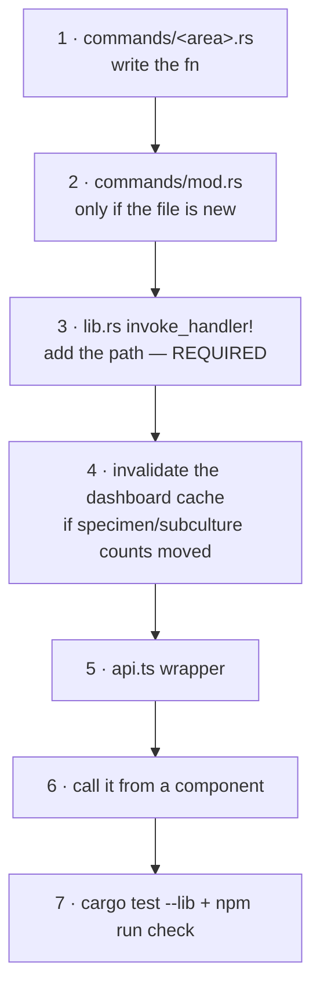

> [!abstract] In one sentence
> Every byte that crosses between the WebView and Rust goes through one 21-line `call<T>()` wrapper
> in `src/lib/api.ts` that injects the session token, normalises Tauri's string rejections into
> `Error` objects, and clears auth on one exact error substring — and the single most common way to
> break a new command is getting camelCase-versus-snake_case wrong on one side of it.

## The wrapper

```ts
// src/lib/api.ts
import { invoke } from '@tauri-apps/api/core';
import { token, clearAuth } from './stores/auth';
import { get } from 'svelte/store';

function getToken(): string {
  const t = get(token);
  if (!t) throw new Error('Not authenticated');
  return t;
}

async function call<T>(command: string, args: Record<string, unknown> = {}): Promise<T> {
  try {
    return await invoke<T>(command, { token: getToken(), ...args });
  } catch (e: unknown) {
    const msg = typeof e === 'string' ? e : (e instanceof Error ? e.message : 'Unknown error');
    if (msg.includes('Session expired or invalid') || msg.includes('Session expired')) {
      clearAuth();
    }
    throw new Error(msg);
  }
}
```

`api.ts` is 2389 lines: **260** exported async wrappers naming **243** distinct Tauri commands (a
few commands have more than one wrapper), out of the 263 the backend registers. It is the only
module in the app that calls `invoke` for business commands.

| Invariant | Consequence |
|---|---|
| `token` is injected first, then spread `...args` | Every command except `login` receives a token automatically. A caller passing its own `token` key would win — nothing does. |
| Errors are normalised | Tauri rejects with a raw **string** (the Rust `Err(String)`). `call` coerces `string \| Error \| unknown` into a real `Error` with a string `message`, so every component can uniformly do `catch (e: any) { addNotification(e.message, 'error') }`. |
| Auto-logout is a **string contract** | The substring match on `'Session expired or invalid'` is the only thing that clears auth on expiry. That literal is produced by `auth::validate_session` in Rust. Changing either side silently breaks auto-logout. |
| No token ⇒ no `invoke` | `getToken()` throws `Error('Not authenticated')` *before* reaching Tauri. |

`login` is the sole direct `invoke` — it cannot use `call()` because there is no token yet. It
still normalises its own error, defaulting the message to `'Login failed'`.

> [!warning] The one place the short-circuit bites
> `getDegradedReason()` is documented in `api.ts` as *"unauthenticated on purpose — the user has to
> see this before they enter data that will not survive the session"*, and the Rust command really
> is unauthenticated. But the wrapper routes it through `call()`, so on the login screen
> `getToken()` throws and `App.svelte` swallows the rejection. The red "Temporary storage — your
> work will NOT be saved" banner therefore only appears **after** login. See [[Failure Reference]].

## Argument naming — the real trap

Two different rules apply at two different depths, and they are opposites.

> [!danger] Top-level args convert. Struct fields do not.
> **Top-level command arguments** are written **camelCase** in TypeScript; Tauri converts them to
> the Rust `snake_case` parameter names.
> **Fields inside a `Deserialize` struct** are plain serde and get **no conversion at all** — they
> must be spelled exactly as the Rust field name, which in this codebase is always `snake_case`.
> Get this wrong and the command fails at deserialisation with a message about a missing field,
> not at compile time.

Worked examples, both live in the tree:

```ts
// Top-level args → converted by Tauri
export async function saveLocationLayout(locationId: string, layoutJson: string | null) {
  return call<void>('save_location_layout', { locationId, layoutJson });
}
```
```rust
pub fn save_location_layout(
    state: State<AppState>, token: String,
    location_id: String, layout_json: Option<String>,
) -> Result<(), String>
```

```ts
// Struct payload → NOT converted; note dry_run inside, dryRun outside
export async function importNcbiTaxonomy(taxa: NcbiTaxonRecord[], dryRun: boolean) {
  return call<ImportNcbiTaxonomyResult>('import_ncbi_taxonomy', {
    request: { taxa, dry_run: dryRun },
  });
}
```
```rust
pub struct ImportNcbiTaxonomyRequest { pub taxa: Vec<NcbiTaxonRecord>, pub dry_run: bool }
pub fn import_ncbi_taxonomy(state: State<AppState>, token: String,
                            request: ImportNcbiTaxonomyRequest) -> Result<…, String>
```

The same file contains `import_xlsx`, which mixes both in one call:
`call('import_xlsx', { payload, dryRun })` — `dryRun` → `dry_run` (top-level, converted), while
`payload.prepared_solutions` stays snake_case because it is a field of `ImportPayload`.

Structured payloads are conventionally passed under a single key named `request`; the exceptions
are `search`, `paramsInput`, `payload` and `config`. Common converted args in use: `specimenId`,
`perPage`, `userId`, `newRole`, `newPassword`, `currentPassword`, `dryRun`, `backupPath`,
`zipB64`, `locationId`, `layoutJson`, `speciesId`, `flagType`.

## Return shapes and typing discipline

Typing is mixed **and deliberately so**. Older domains are `any`
(`createSpecimen(request: any): Promise<any>`); every WP-3x-and-later domain has real interfaces —
`Taxon`, `TaxonNode`, `FrozenVial`, `BreedingProgram`, `SpecimenPassport`, `TaxonomyRegistry`,
`CoordinationBundle`, `LocationOccupancy`, `RebuildTaxonomyResult`. 102 exported
`interface`/`type` declarations live in this file.

Wrapper-level reshaping is rare but real: `listSubcultures` unwraps the backend's paginated
envelope and returns only `resp.items` (defaulting `perPage = 200`), while most paginated calls
return the raw `{ items, total, page, per_page, total_pages }` envelope for the caller to unpack.
`RESTRICTED_MARKER = '[RESTRICTED]'` is exported here — it is the sentinel a field-permission-masked
value carries, and `StrainManager` / `StrainDetail` compare against it. See
[[Roles and Permissions]].

## `isTauri()` and the "browser fallback"

```ts
// src/lib/isTauri.ts — the whole file
export function isTauri(): boolean {
  return typeof window !== 'undefined' && '__TAURI_INTERNALS__' in window;
}
```

Tauri v2 injects `window.__TAURI_INTERNALS__` into every WebView it controls; the global is absent
in a plain browser tab. It is consulted in exactly three places — service-worker registration in
`main.ts`, the version string in `Sidebar.svelte` (`getVersion()` vs the build-time
`__APP_VERSION__`), and the `beforeinstallprompt` banner in `PwaInstallPrompt.svelte`.

> [!caution] `api.ts` has no browser fallback and never consults `isTauri()`
> In a pure-browser PWA install every business command rejects at `invoke`. What actually works in
> a browser: the app shell, the loader, the install banner, the version string and dark mode.
> Nothing data-bearing. The PWA build is a *shell*, not an offline client.

Only four modules import from `@tauri-apps` at all: `api.ts` (`invoke` — the seam itself),
`Sidebar.svelte` (`getVersion`, guarded by `isTauri()`), `ErrorLog.svelte`
(`open as shellOpen` from `plugin-shell`, to open a prefilled GitHub issue URL), and
`QrScanner.svelte`, which imports `invoke` and **never uses it** — the scan actually resolves
through `searchSpecimens` from `api.ts`. That last one is a dead import.

## The offline queue

`src/lib/offlineQueue.ts` (140 lines) exports a pure, tested pair — `enqueue(queue, command, args,
nextId, now)` and `replayInOrder(queue, invoke)` — plus IndexedDB persistence
(`stelo_offline_queue` / `mutations`, version 1, `keyPath: 'id'`, `autoIncrement: true`).

Its key invariant: **replay is strict FIFO and stops at the first failure**, because enqueue order
*is* the order the backend audit chain's `chain_seq` must observe mutations in. `ReplayResult`
carries `{ succeededIds, remaining, firstError }`, and one of the four tests asserts `invoke` is
called exactly twice out of three when the second mutation fails.

> [!caution] Verified dormant
> The only importer of `offlineQueue` anywhere in `src/` is its own test file. `enqueueMutation` is
> never called by any component, `api.ts` never references it, and `navigator.onLine` appears
> **zero** times in the codebase. Nothing enqueues; nothing replays. The file's own header is
> honest about being "a tested, ready-to-wire mechanism" — the risk is a reader assuming the app
> already queues mutations offline.

## Adding a new command, end to end



1. **Write the function** in an existing `src-tauri/src/commands/<area>.rs`, following the
   convention in [[Rust Backend]]: `state: State<AppState>`, `token: String`, then your args;
   `validate_session` → role check → work → `queries::log_audit(...)` → `Ok(value)`. The return
   type must be `Serialize`; any argument struct must be `Deserialize`. Synchronous `fn`, never
   `async fn`.
2. **If the file is new**, add `pub mod <area>;` to `src-tauri/src/commands/mod.rs` — a flat list
   of 42 module declarations, nothing else.
3. **Add the path to `tauri::generate_handler![…]` in `src-tauri/src/lib.rs`.** This is the step
   that actually creates the command. The list is grouped by comment banners (`// Auth`,
   `// Specimens`, `// Media`, … `// WP-76: lab data-integrity self-check.`); put the entry in its
   section.
4. **If the command changes specimen or subculture counts**, call
   `crate::db::dashboard::invalidate_dashboard_cache(&state.dashboard_cache);` — otherwise the
   Dashboard shows stale numbers for up to 60 seconds.
5. **Add the wrapper to `src/lib/api.ts`**, in the section for its domain:
   `return call<MyResult>('my_command', { someId, someFlag });`. Do not pass `token`. Prefer a real
   interface over `any` for anything new.
6. **Call it from a component** and wrap the fetch in `DataState`.
7. **Run the gates**: `cargo test --lib` (full feature — `commands/` does not compile under
   `--no-default-features`), `npm run check`, `npm test`. See [[Build and Test Commands]].

> [!danger] There is no auto-registration
> `tauri::generate_handler!` is a compile-time macro over a literal list of paths. No inventory
> crate, no naming convention, no reflection. A command that compiles, has tests, and is missing
> from that list simply **does not exist** to the WebView. Today the diff of defined-versus-
> registered names is empty: 263 `#[tauri::command]` functions, 263 registered entries, zero
> orphans — keep it that way.

> [!tip] You almost never need to touch capabilities
> `src-tauri/capabilities/default.json` gates *plugin* commands, not custom
> `#[tauri::command]`s. Adding a normal command needs no capability edit. The granted set is
> deliberately minimal — `core:default`, several `core:window:*`, and `shell:allow-open`. `fs:*`
> and `dialog:*` were removed in the `v0.54.0` security pass because nothing calls them; the
> plugins are still `init()`ed in `lib.rs`, so restoring one is a one-line JSON change. The
> file's own embedded `_comment` explains that granting unscoped `fs:allow-write-file` to a WebView
> that never writes files is a standing arbitrary-write primitive — the exact escalation path the
> xlsx advisory would otherwise open. `withGlobalTauri` is `false`.

## See also

- [[Rust Backend]] · [[Svelte Frontend]] · [[Command Reference]] · [[Failure Reference]]

**Back to [[Home]]**

#architecture #ipc #tauri #api
