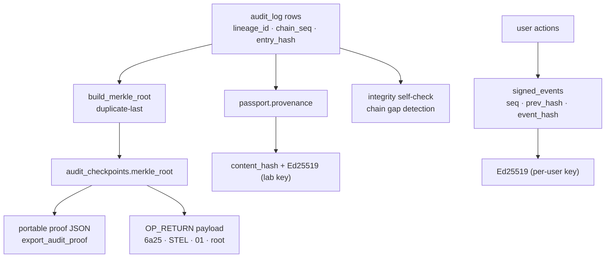

> [!abstract] In one sentence
> Six layered mechanisms make SteloPTC's records tamper-*evident* rather than tamper-*proof*: a
> SHA-256 hash chain over every audit entry, Merkle checkpoints and portable proofs over ranges of
> that chain, a per-user Ed25519-signed event ledger for non-repudiation, an optional on-chain
> anchor that publishes a checkpoint root, a signed per-specimen passport for cross-lab exchange,
> and a read-only self-check that looks for the damage none of the above would catch.

> [!important] Evident, not proof
> Nothing here prevents an operator with the database file from editing it. What it does is make an
> edit **detectable**: the chain, the checkpoints and the signatures all break in ways a verifier
> can name and locate. That is the honest claim, and it is the one the code makes.

## Shared primitives

All of it stands on five things, and none of them may change.

```
ZERO_HASH = "0" × 64
audit_canonical_bytes = "lineage_id|chain_seq|timestamp|user_id|entity_type|entity_id|action|details"
compute_entry_hash(canonical, prev_hash) = lowercase_hex(SHA256(canonical_bytes || prev_hash_bytes))
timestamps = %Y-%m-%dT%H:%M:%S%.3fZ  (UTC, millisecond precision)
signatures  = Ed25519 (ed25519-dalek v2, OsRng) — never RSA
```

> [!danger] Frozen serialisations
> Canonical byte layouts are append-only: **never reorder a field, only add at the end.** NULL
> optionals serialise as the empty string. `build_merkle_root`'s duplicate-last rule is permanently
> locked — changing it invalidates every proof ever exported. The `docs/` specs exist so an
> external verifier can reproduce these exactly, and `docs/merkle-proofs.md` ships a standalone
> Python verifier that matches the Rust.

The Phase-G document formats (passport, taxonomy registry, breeding coordination) share a second
canonical form, a `push_field` helper using ASCII control characters:
`buf += label; buf += 0x1F; buf += value; buf += 0x1E` (unit separator, record separator). The
`content_hash` is the lowercase hex of SHA-256 over that; the signature is over the **hex string**
of the hash, not the hash bytes.

Two Ed25519 key scopes exist, both lazily generated on first use:

| Scope | Table | Loader | Used by |
|---|---|---|---|
| Lab-wide (one per install) | `signing_keys` (id = 1) | `compliance_export::load_or_create_lab_signing_key` | Regulatory exports, submission packages, passports, registries, coordination bundles |
| Per user | `user_signing_keys` (PK `user_id`) | `signed_ledger::load_or_create_user_signing_key` | The signed event ledger only |

> [!warning] Private keys are stored in plaintext
> Both `signing_keys.private_key_b64` and `user_signing_keys.private_key_b64` sit base64 in SQLite.
> There is no OS-keychain integration anywhere in the codebase, and unlike `smtp_config.password`
> — which `create_backup` redacts to NULL in the copy — the signing keys travel in **every** local
> and cloud backup.



---

## 1. The hash chain (WP-18)

**What it is.** Every audit entry belongs to a *lineage* — normally the entity's own id, or
`"system"` — and carries `chain_seq`, `prev_hash` and `entry_hash`. Appending an entry recomputes
the canonical string, hashes it with the previous entry's hash, and stores the result. Editing any
field of any past row breaks every hash after it.

**Where.** `src-tauri/src/db/queries.rs` — `log_audit_impl` is the single writer, fed by eight
public entry points:

| Function | `chain_seq` | `prev_hash` | Use |
|---|---|---|---|
| `log_audit` | lineage head + 1 | that row's `entry_hash` | ordinary events |
| `log_audit_for_child` | **1** | the *parent* lineage's last hash | splits — both children share a `prev_hash`, making the fork cryptographically visible |
| `log_audit_at_seq_zero` | **0** | `ZERO_HASH` | legacy genesis; superseded, retained for old call sites |
| `log_audit_seeded_by_species` | 1 | species lineage head | a new root specimen bound to its species |
| `log_audit_species_genesis` | — | the genus taxon's `entry_hash` | WP-45 |
| `log_audit_taxon_genesis` | 0 | parent taxon's hash | WP-45 |
| `log_audit_strain_genesis` | — | genus/species-derived | WP-28 |
| `log_audit_seeded_by_strain` | — | strain lineage head | — |

The head lookup is deliberately a dual predicate —
`WHERE (lineage_id = ?1 OR (lineage_id IS NULL AND entity_id = ?1)) AND entry_hash IS NOT NULL` —
so pre-migration-009 rows with a NULL `lineage_id` still chain, and pre-WP-18 rows with no hash are
always excluded rather than poisoning the chain.

There are 104 `queries::log_audit*` call sites in `src-tauri/src/commands/` alone, 83 of which are
fire-and-forget (`.ok()`), so a failed audit write never fails the command — *except* inside a
transaction where atomicity matters: `create_specimen` wraps its INSERT and its audit entry in one
`unchecked_transaction` precisely so a specimen without an audit entry can never be committed.

> [!success] Verdict — fully shipped
> Offline, strictly verified, and reproducible by an outside party. `verify_audit_entry` and
> `verify_audit_lineage` are any-authenticated commands. One fix in the current tree is worth
> knowing about: a row-mapping failure in the verification path used to surface as *tamper
> evidence*. The verification paths now collect strictly, so a bug can never masquerade as an
> attack — but note that several older `list_*` paths still drop bad rows silently.

---

## 2. Merkle checkpoints and portable proofs (WP-20 / WP-21)

**What it is.** A checkpoint takes a contiguous `chain_seq` range of one lineage, builds a binary
Merkle tree over the entry hashes, and stores the root in `audit_checkpoints` along with
`start_seq`, `end_seq`, `entry_count`, `created_by`, and the `is_auto`/`auto_source` provenance
columns. A proof exports one leaf plus its sibling path, so a third party can verify a single
entry against a published root without seeing the rest of the log.

**Where.** `src-tauri/src/db/queries.rs` (`build_merkle_root`, `build_merkle_path`,
`verify_merkle_path`, `auto_checkpoint_lineages`) and `src-tauri/src/commands/audit.rs`.
Spec: `docs/merkle-checkpoints.md`, `docs/merkle-proofs.md`.

Construction rules, all locked:

- empty → `ZERO_HASH`; a single leaf → that leaf **verbatim**, no extra hash round;
- odd count at any level → duplicate the last node, then pair (Bitcoin-style);
- `parent = SHA256(left_hex_bytes || right_hex_bytes)` — it hashes the **hex strings**, not raw
  bytes;
- `position == "right"` ⇒ `SHA256(current || sibling)`; `"left"` ⇒ reversed.

Auto-checkpointing is real: `auto_checkpoint_lineages(conn, user_id, auto_source, min_uncovered)`
runs with `min_uncovered = 0` before every backup and with `auto_checkpoint_interval` (default 100)
on demand. It uses **`-1`** as the "no prior checkpoint" sentinel so that seq-0 genesis rows are
covered by the first checkpoint rather than skipped.

> [!success] Verdict — fully shipped
> Checkpoint creation, auto-checkpointing, proof export and proof verification all work offline.
> `docs/merkle-checkpoints.md` is **stale** where it says "no automatic checkpointing yet", "no
> proof export yet" and "`anchored_txid` is always NULL" — all three shipped. Believe the code.

---

## 3. The signed event ledger (WP-67 / WP-75)

**What it is.** A single **global**, gapless, hash-chained ledger where each entry additionally
carries a detached Ed25519 signature made with the *acting user's* key. The audit log gives
tamper-evidence but attributes actions to a `user_id` the database itself writes; this adds
**non-repudiation**.

**Where.** `src-tauri/src/signed_ledger/mod.rs` and `lifecycle.rs`; commands in
`src-tauri/src/commands/signed_events.rs`; UI in `src/lib/components/SignedLedgerPanel.svelte`.
Spec: `docs/signed-event-ledger.md`.

Its canonical form is **7 fields and different from the audit form** — do not conflate them:

```
seq|timestamp|user_id|event_type|entity_type|entity_id|payload
```

`append_signed_event` takes `next_seq = COALESCE(MAX(seq), -1) + 1` (so the first seq is **0**),
links `prev_hash` to the previous `event_hash` or `ZERO_HASH`, computes `event_hash`, and signs
the hash's **hex string**. Every wired call site uses `try_append_signed_event`, a best-effort
wrapper, so a ledger failure can never fail the primary mutation.

`verify_ledger` walks entries in `seq ASC` and stops at the first break, reporting one of five
named failures: sequence gap, broken linkage, content tampering, invalid signature, signing-key
mismatch — plus a sixth, **missing registered key**, which closes a real forgery path (delete the
`user_signing_keys` row, mint a fresh key, re-sign). That case has its own test,
`deleted_registered_key_forgery_is_detected`.

The vocabulary is six lifecycle events. Five are emitted:

| Event | Emitted from |
|---|---|
| `specimen_created` | `create_specimen` |
| `specimen_passaged` | `create_subculture` |
| `specimen_died` **and** `specimen_archived` | `record_specimen_death` — two events, because a death and the archival it causes are two facts a verifier may need to check independently |
| `specimen_archived` | `delete_specimen` (which archives) and `bulk_archive_specimens` |
| `specimen_split` | `split_specimen` — the child-fork event; a second archive event would be redundant |

> [!caution] Verdict — shipped, with one declared-but-unemitted event and a narrow scope
> **`SPECIMEN_STATUS_CHANGED` has a constant and a payload builder and no call site.** A stage or
> health-status change is invisible in the signed ledger even though the vocabulary advertises it.
> The tripwire test `every_declared_event_type_has_a_payload_builder` asserts *builders* exist, not
> call sites, so it does not catch this.
> Separately, **only specimen lifecycle events are signed.** Media, inventory, compliance, strain
> and taxon mutations are audited but not signed. And `record_signed_event` — the free-form
> command — performs **no validation against `lifecycle::ALL`**, so a caller can write any
> `event_type` string it likes.

---

## 4. On-chain anchoring (WP-66)

**What it is.** Publishing a checkpoint's Merkle root into a public blockchain, so the *time* of a
commitment is witnessed by something the lab does not control. SteloPTC builds and verifies the
payload; it does not move money.

**Where.** `src-tauri/src/anchoring/mod.rs` (pure) and `store.rs` (lifecycle);
`src-tauri/src/commands/anchoring.rs`; UI in `src/lib/components/OnChainAnchorPanel.svelte`.
Spec: `docs/on-chain-anchoring.md`, which the code audit found **accurate**.

```
0x6a       OP_RETURN
0x25       pushdata length = 37
"STEL"     4-byte marker
0x01       version
<32 bytes> the checkpoint Merkle root
```

Total script 39 bytes; the hex always begins `6a25`. `MAX_OP_RETURN_DATA = 80` is Dogecoin's
standard-relay cap, enforced so a payload that a node would refuse to relay can never be built.
`build_anchor_payload` **refuses an all-zero root** — anchoring an empty checkpoint would be a
commitment to nothing.

Lifecycle is `prepared` → `submitted` → `confirmed` in `checkpoint_anchors`. `record_anchor_txid`
validates a 64-hex-character txid, refuses to change an already-confirmed anchor, and writes back
`audit_checkpoints.anchored_txid` — the hook that has been reserved since migration 013.
`verify_anchor` is the trustless check: paste the on-chain `OP_RETURN` data and it compares,
tolerantly accepting either the full script or the bare payload.

> [!caution] Verdict — shipped, minus broadcast, deliberately
> There is **no Dogecoin node, no wallet, no HTTP client and no block-explorer polling anywhere in
> the codebase.** The operator broadcasts with their own wallet and pastes the txid and the
> `OP_RETURN` hex back in. Nothing polls for confirmation depth. The module comment states the
> reasoning: the trust guarantee does not depend on who broadcasts, so the verifiable core ships
> and the credential-bearing, value-moving step stays out of the app.
> Sharp edges: `chain_name` is free text that nothing validates and nothing behaves differently
> on; there is no unique constraint preventing multiple `prepared` anchors per checkpoint or the
> same txid on two anchors; and malformed pasted hex returns `Err`, not `ok: false`.

---

## 5. The specimen passport (WP-70)

**What it is.** A signed, self-contained JSON document attesting one specimen's provenance, meant
to travel with material to another lab. Format `steloptc.specimen-passport`, version `1`.

**Where.** `src-tauri/src/passport/mod.rs` (document + verification, pure) and `store.rs` (issue,
import, lab identity); `src-tauri/src/commands/passport.rs`; UI in
`src/lib/components/SpecimenPassportPanel.svelte`. Spec: `docs/specimen-passport.md`.

The document carries the issuer identity (`app_settings.lab_name` plus the lab-wide public key),
a specimen summary, the **full audit provenance** as `{chain_seq, canonical, prev_hash,
entry_hash}` entries — each `canonical` being exactly the WP-18 canonical string — an optional
Merkle anchor, a `content_hash` and a signature.

`verify_passport` runs six named checks in order and stops at the first failure: `format` →
`version` → `content_hash` → `issuer_signature` → `provenance_chain` → `merkle_anchor` (only if
present). Chain rules: strictly **ascending** `chain_seq` (not necessarily gapless), each
`prev_hash` equals the preceding `entry_hash`, each `entry_hash` recomputes. The **first entry's
`prev_hash` is accepted as given** — it may be `ZERO_HASH` or a parent lineage's hash for a forked
specimen.

`gather_merkle_anchor` is honest by construction: it attaches an anchor **only when** a stored
checkpoint root equals the root rebuilt from exactly the exported entry hashes, so a verifier's own
rebuild always matches. Issuing refuses a specimen with no hashed provenance. Importing verifies
first (`"Refusing to import an unverifiable passport: {message}"`), guards duplicates via
`UNIQUE(direction, passport_id)`, and wraps the audit entry and the register row in a single
transaction.

> [!caution] Verdict — shipped, fully offline, **no transport and no trust store**
> Issuing writes a row and hands the JSON to the frontend for download; importing takes pasted or
> loaded JSON. The issuing lab's public key must be exchanged **out of band** — there is no key
> directory, no trust store and no revocation mechanism. A verified signature proves the document
> came from whoever holds that key; it does not tell you who that is.
> One inconsistency worth knowing: `gather_provenance` uses `.filter_map(|r| r.ok())`, so a
> dropped row would produce a passport whose chain breaks only at the *receiver's* verification —
> a confusing failure mode for a document that is supposed to be self-attesting.

The taxonomy registry (WP-71) and breeding coordination bundle (WP-72) are the same pattern applied
to different payloads, with the same verdict: real signing, real verification, additive
accept/override/fork or accept/skip merges, **no server on either end**. Covered in
[[Federated Exchange]].

---

## 6. The integrity self-check (WP-76)

**What it is.** A read-only sweep for the damage the cryptography *cannot* see: dangling foreign
keys, duplicate accessions, gaps in an audit lineage, and a search index that has silently stopped
tracking its table.

**Where.** `src-tauri/src/integrity/mod.rs`, pure over `&Connection`, no I/O.
`commands/integrity.rs::run_data_integrity_check` is **admin only**. UI:
`src/lib/components/DataIntegrityPanel.svelte`.

`checks_run = ORPHAN_CHECKS.len() + 2` (currently **10**), pinned by a test that fails if the
constant and the checks actually executed drift apart. Issues sort critical → high → normal with
at most five examples each.

| Check | Severity | Detects |
|---|---|---|
| `specimen_unknown_lab_profile` | critical | A `lab_profile` outside the three allowed values — such a row is invisible in *every* lab |
| `specimen_missing_species` | critical | Dangling `species_id` |
| `specimen_missing_strain` / `_parent` | high | Dangling non-NULL `strain_id` / `parent_specimen_id` |
| `subculture_missing_specimen` | critical | Dangling `specimen_id` |
| `subculture_missing_media` | normal | Dangling non-NULL `media_batch_id` |
| `strain_missing_species` | critical | Dangling `species_id` |
| `duplicate_accession` | critical | `GROUP BY accession_number HAVING COUNT(*) > 1` |
| `audit_chain_gap` | critical | A lineage where `COUNT(*) <> MAX(chain_seq) + 1` over hashed entries |
| `search_index_out_of_sync` | critical | `specimens` vs `specimens_fts_docsize` counts, plus the FTS5 `('integrity-check', 1)` probe |

> [!success] Verdict — fully shipped, read-only, no network
> It reports and never repairs. The search-index message tells the operator to "rebuild it from
> Admin", but **no rebuild command is registered** in `lib.rs` — the only repair command in this
> family is `rebuild_species_taxonomy`, which fixes a different cache. Noted in
> [[Failure Reference]].

---

## Role gating

| Area | Any authenticated | `can_write` | `can_manage` | `is_admin` |
|---|---|---|---|---|
| Audit / checkpoints | `verify_audit_entry`, `verify_audit_lineage`, `verify_against_checkpoint`, `list_audit_checkpoints`, `export_audit_proof`, `verify_exported_proof`, `get_auto_checkpoint_config` | — | `get_audit_log`, `list_audit_entries_cursor`, `create_audit_checkpoint`, `set_auto_checkpoint_config`, `run_auto_checkpoint` | — |
| Signed ledger | `get_user_signing_public_key`, `list_signed_events`, `verify_signed_event_ledger` | `record_signed_event` | — | — |
| Anchoring | `list_checkpoint_anchors` | — | preview / prepare / record / verify | — |
| Passport | `get_lab_identity`, `verify_`, `list_`, `get_…_json` | `issue_` (+ lab-profile guard), `import_` | `set_lab_name` | — |
| Registry / coordination | `verify_`, `preview_`, `list_`, `get_…_json`, dispositions | `export_`, `import_` | — | — |
| Integrity | — | — | — | `run_data_integrity_check` |

## The honest summary

| Mechanism | Verdict |
|---|---|
| Hash chain (WP-18) | **Fully shipped**, offline, strict verification |
| Merkle checkpoints + portable proofs (WP-20/21) | **Fully shipped**, incl. auto-checkpointing; the standalone Python verifier matches the code |
| Signed event ledger (WP-67/75) | **Shipped**; 5 of 6 declared events emitted; only specimen lifecycle is covered |
| On-chain anchoring (WP-66) | **Shipped minus broadcast** — build and trustless verify are real; no wallet, node or explorer client exists |
| Specimen passport (WP-70) | **Shipped**; sign / verify / import all real; **no transport, no key directory** |
| Taxonomy registry (WP-71), coordination bundles (WP-72) | **Shipped**; additive merges; **no server** |
| Integrity self-check (WP-76) | **Fully shipped**, read-only; reports but never repairs |
| Regulatory exports (WP-60) | **Shipped**; Part 11 is signed, USDA is unsigned JSON, CITES is an **unsigned** zip — `docs/regulatory-exports.md` overstates this |

Cross-check anything you plan to say out loud against [[Shipped vs Dormant]].

## See also

- [[Hash-Chained Provenance]] — the chain and checkpoints as a concept, with worked examples.
- [[Compliance and Export]] · [[Federated Exchange]] · [[Data Model]] · [[Failure Reference]]

**Back to [[Home]]**

#architecture #provenance #cryptography #audit
