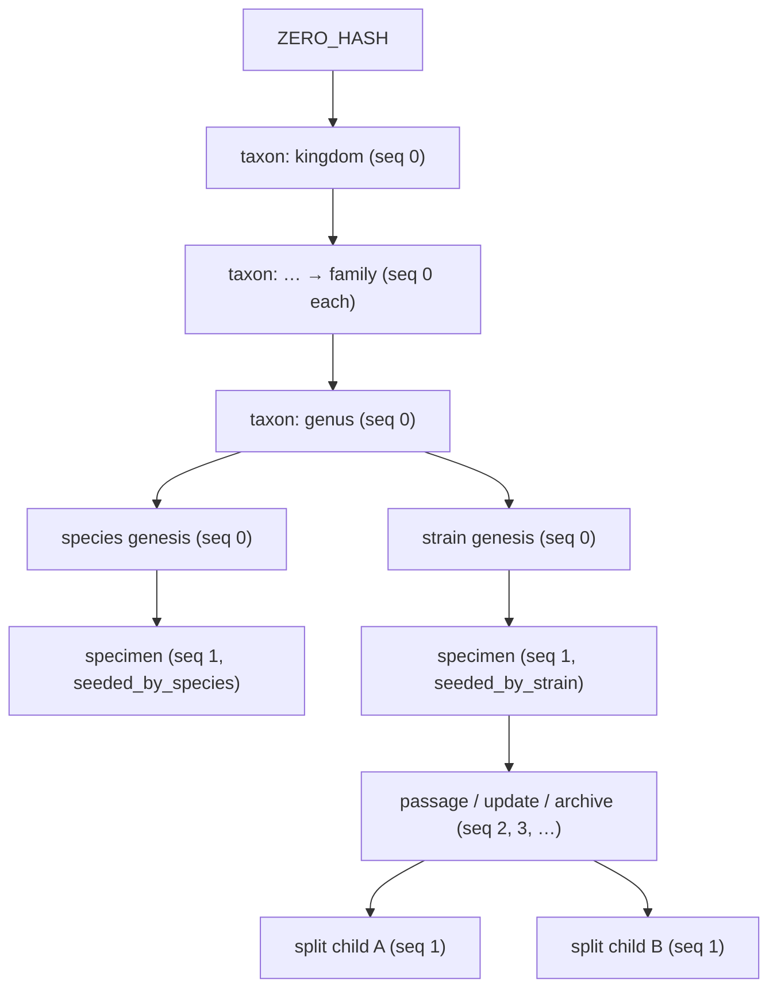

> [!abstract] In one sentence
> Every consequential write appends a row to `audit_log` whose SHA-256 `entry_hash` folds in the
> previous row's hash, one chain per entity ("lineage"), so history can be *appended to* but cannot
> be quietly edited or thinned out.

This is the idea the product is built on: a tissue-culture lab's value is in the record of what was
done to which culture, and a record that can be silently retyped is worth nothing in an audit.
SteloPTC's answer is not access control (that is [[Roles and Permissions]]) — it is making
alteration *detectable*.

---

## What is chained

Only `audit_log`. Domain tables (`specimens`, `strains`, `species`, `taxa`) are ordinary mutable
SQLite rows; the chain sits beside them and records what happened to them.

Four columns carry the chain, all added by later migrations and all **nullable** — rows written
before `v1.5.0` have none of them:

| Column | Meaning |
|---|---|
| `lineage_id` | Which chain this row belongs to. Normally the entity's own id; `"system"` when there is no entity |
| `chain_seq` | Position within that lineage, `0` or `1` at genesis, `+1` per append |
| `prev_hash` | The `entry_hash` of the row this one is anchored to |
| `entry_hash` | `SHA-256(canonical_bytes ‖ prev_hash_utf8)`, lowercase hex |

### The canonical form is frozen

```
lineage_id|chain_seq|timestamp|user_id|entity_type|entity_id|action|details
```

Pipe-separated UTF-8, no trailing newline, `NULL` optionals serialised as the empty string
(`audit_canonical_bytes`, `src-tauri/src/db/queries.rs`). Timestamps are
`chrono::Utc::now().format("%Y-%m-%dT%H:%M:%S%.3fZ")`.

> [!danger] Binding invariants
> - **Never reorder these fields, and never insert one in the middle.** New fields may only be
>   appended at the end, because every stored `entry_hash` in every existing database was computed
>   over this exact byte layout.
> - **`ZERO_HASH` is 64 ASCII `'0'` characters**, not a hash of anything. It is the anchor for a
>   root lineage and the fallback whenever an anchor cannot be resolved.
> - **`build_merkle_root` duplicates the last node on an odd count** (Bitcoin's rule). Changing that
>   invalidates every checkpoint proof ever exported. Empty input → `ZERO_HASH`; a single leaf is
>   returned verbatim with no extra hash round.

---

## Genesis rules

There are eight writers, all in `src-tauri/src/db/queries.rs`, and they differ only in *where the
first `prev_hash` comes from*. `log_audit_impl` is the single INSERT.

| Writer | `chain_seq` | `prev_hash` anchor |
|---|---|---|
| `log_audit` | lineage head + 1 (or `1` if none) | that head's `entry_hash`, else `ZERO_HASH` |
| `log_audit_for_child` | **1** | the *parent lineage's* last `entry_hash` |
| `log_audit_at_seq_zero` | **0** | `ZERO_HASH` — legacy species genesis, superseded |
| `log_audit_seeded_by_species` | 1 | the species lineage's head |
| `log_audit_seeded_by_strain` | 1 | the strain lineage's head |
| `log_audit_taxon_genesis` | **0** | the parent taxon's last `entry_hash`; `ZERO_HASH` for a root |
| `log_audit_species_genesis` | **0** | the genus taxon's last `entry_hash`, looked up **by genus name** |
| `log_audit_strain_genesis` | **0** | the genus taxon's hash, reached via `species.genus` |

Stacked up, that is the ladder the product advertises:



> [!important] A split is cryptographically visible; a passage is not a fork
> `log_audit_for_child` gives **both** children of a split the *same* `prev_hash` — the parent's
> `"split"` entry. Two lineages sharing one anchor is the on-disk signature of a fork. A passage
> (`create_subculture`) writes `log_audit("subcultured", "specimen", …)` on the **specimen's own**
> lineage, so it advances the chain rather than branching it. See
> [[Specimens Strains and Species]] for why that distinction matters at the bench.

### The head lookup tolerates two generations of legacy rows

```sql
WHERE (lineage_id = ?1 OR (lineage_id IS NULL AND entity_id = ?1))
  AND entry_hash IS NOT NULL
ORDER BY chain_seq DESC LIMIT 1
```

The `OR` clause lets pre-migration-009 rows (correct `entity_id`, `NULL` `lineage_id`) still act as
anchors. The `entry_hash IS NOT NULL` guard excludes pre-WP-18 rows that have no hash at all — for
those the anchor silently degrades to `ZERO_HASH` rather than erroring.

### Writing convention

The dominant pattern is fire-and-forget: `queries::log_audit(...).ok();`. A failed audit write does
**not** fail the command. The exception is where atomicity is the point — `create_specimen` wraps
the INSERT and the audit entry in one `unchecked_transaction` and uses `?`, so *a specimen without
an audit entry can never commit*. `record_specimen_death` does the same.

---

## What the chain proves — and what it does not

> [!success] What it genuinely gives you
> - **In-place edits are detectable.** `verify_audit_entry` recomputes the canonical bytes from the
>   stored columns and compares. A changed `details` or `created_at` yields
>   *"Hash mismatch — this record may have been tampered with!"*
> - **Deletions from the middle of a lineage are detectable.** The `audit_chain_gap` integrity check
>   (severity `critical`) flags any lineage where
>   `COUNT(*) <> MAX(chain_seq) + 1` over hashed rows.
> - **Forks are legible.** Two lineages with one shared `prev_hash` is a split, and nothing else
>   produces that shape.
> - **A point-in-time commitment can be published.** Merkle checkpoints over a lineage's
>   `entry_hash` list, with portable proofs (`export_audit_proof` / `verify_exported_proof`) and
>   optional external anchoring — see [[Trust Layer]].

> [!warning] What it does not prove
> - **Not authorship.** An ordinary `audit_log` row carries no signature; `user_id` is whatever the
>   command layer passed. Signatures live in a *separate* ledger (`signed_events`, Ed25519 per row,
>   keyed to `user_signing_keys`) which covers a subset of specimen lifecycle events, not the whole
>   audit log.
> - **Not time.** `created_at` is the app's own `Utc::now()`. Nothing external attests it.
> - **Not resistance to a writer with database access.** Anyone who can open the SQLite file can
>   recompute the chain forward from the point they altered and produce an internally consistent
>   history. The chain makes tampering *expensive and total* rather than *cheap and local* —
>   the actual defence against that threat is a checkpoint published somewhere the attacker does
>   not control.
> - **Not the anchor itself.** `verify_audit_lineage` starts from `rows[0].prev_hash` and accepts
>   it as given, because it cannot know whether the row is a root (`ZERO_HASH`) or a fork child
>   (a parent's hash) without walking a chain it was not asked about. It verifies every link *after*
>   the first and every `entry_hash` within the lineage. An earlier version hard-coded `ZERO_HASH`
>   as the anchor and reported *"Chain broken at seq 1"* for every split child.
> - **Nothing about pre-`v1.5.0` rows.** They return
>   `"This entry has no chain data (written before the hash chain was introduced in v1.5.0)."`

---

## How verification works

| Surface | Scope | Notes |
|---|---|---|
| `verify_audit_entry(entry_id)` | one row | Any authenticated user. Returns stored vs. computed hash |
| `verify_audit_lineage(lineage_id)` | one entity's whole chain | Reports `first_break_seq` and how many entries were verified before the break. Row mapping is **strict** — a mapping failure errors out rather than shortening the chain and masquerading as tamper evidence |
| `verify_against_checkpoint` | lineage vs. a stored Merkle root | |
| `export_audit_proof` / `verify_exported_proof` | one entry, portable | Merkle path, verifiable off-app |
| `verify_audit_range(from, to)` | every lineage in a date range | Connection-only, no session token; used inside compliance bundles. Linkage is checked only once a previous entry for that lineage has been seen *and* `chain_seq != 0` |
| `audit_chain_gap` integrity check | the whole database | Part of Data Integrity; see [[Failure Reference]] |

Checkpointing runs automatically: `auto_checkpoint_lineages` uses **`-1`** as the "no prior
checkpoint" sentinel specifically so that `chain_seq = 0` genesis rows fall inside the first
checkpoint. Config lives in `app_settings` (`auto_checkpoint_enabled`, `auto_checkpoint_interval`
default `100`, `auto_checkpoint_on_backup`).

---

## The reclassification hazard (WP-45 / WP-64)

This is the honest weak point, and the source comments say so themselves — `log_audit_taxon_genesis`
and its siblings are labelled **EXPERIMENTAL (WP-45)** in the code.

**The mechanism.** A species' genesis `prev_hash` is a *snapshot* of its genus taxon's `entry_hash`
at the moment the species was created. If that genus is later moved — filed under a family it did
not previously have, renamed, corrected — the taxon's own chain moves on, but every species, strain
and specimen genesis below it stays anchored to the classification as it was. Nothing errors.
Nothing is corrupted. The chain simply attests to a taxonomy the lab no longer believes.

> [!important] Two distinct consequences, often confused
> - **The `taxon_path` cache going stale** is a *navigation* bug, and it was fixed in `v0.54.0` by
>   `resync_species_paths_under`. See [[Taxonomy Backbone]].
> - **The genesis `prev_hash` going stale** is *this* problem, and it is unfixable by rewriting,
>   because rewriting a stored hash is exactly the operation the chain exists to prevent.

**The remedy: `reanchor_taxon_chain` (WP-64).** Admin-only, with a `reason` of at least
`REANCHOR_REASON_MIN_LEN = 20` characters, run as one transaction:

1. Walk `taxa → species → strains → specimens` below and including the target, parents first
   (`compute_reanchor_scope`). `reanchor_taxon_chain_dry_run` returns the same counts and writes
   nothing.
2. For every affected taxon, species and strain, write a **new** genesis-style row at `chain_seq = 0`
   in a *synthetic lineage* `"{entity_id}#reanchor-{event_id}"`, action `reanchor`.
3. Bridge specimens in aggregate: one row per affected species in
   `"{species_id}#reanchor-{event_id}-specimens"`, `entity_type = 'specimen_batch'`, with the
   specimen count in `details`.
4. Record the whole operation in `reanchor_events` (target taxon, performer, reason, four counts).

> [!important] Why a second lineage rather than a rewrite
> Re-anchoring asks for a *second* genesis for an entity that already has one. It cannot reuse
> `lineage_id = entity_id`, because `chain_seq = 0` would collide with the original genesis row.
> The synthetic lineage is an ordinary chain — `verify_audit_lineage` works on it unmodified — and
> **the original lineage is never written to again**, so the old chain survives byte-for-byte.
> `reanchor_events` is the durable index that tells an auditor a second lineage exists and why.

> [!warning] Honest limits of the re-anchor
> - **Specimens are aggregated, not individually re-anchored.** This is a deliberate, documented
>   scope reduction so the operation stays atomic for a species with thousands of cultures. The
>   justification given in the code: a specimen's own chain (its passage history) never encoded
>   taxonomic state — only its very first entry did — and that single dependency is what the
>   bridging row covers.
> - **`ensure_genus_taxon` writes no genesis entry.** Genus taxa created automatically by
>   `create_species`, `rebuild_species_taxonomy` or `migration_058` are outside the WP-45 chain
>   entirely. `create_taxon` does log a genesis; the auto-creation path does not.
> - **The genus lookup is case-sensitive while the genus *creation* is not.**
>   `ensure_genus_taxon` matches `name = ?1 COLLATE NOCASE`; `genus_entry_hash_by_name` matches
>   `name = ?1`. A species entered with genus `citrus` therefore links correctly to the existing
>   `Citrus` taxon but anchors its genesis to `ZERO_HASH`.
> - Net effect: for those species the advertised Kingdom → … → Genus → Species chain silently
>   degrades to a `ZERO_HASH` root. It is a correctness gap inside a feature the code marks
>   experimental — but it is undocumented outside this note.

> [!caution] Shipped but dormant
> `reanchor_taxon_chain` and `reanchor_taxon_chain_dry_run` are registered Tauri commands and are
> exported from `src/lib/api.ts` — and **no Svelte component calls either of them**. The
> reclassification warning in `src-tauri/src/commands/taxa.rs` points at a remedy that exists only
> as an IPC command. Tracked in [[Shipped vs Dormant]].

---

## Where to look in the code

| Concern | File |
|---|---|
| Canonical bytes, hashing, all eight writers, Merkle primitives | `src-tauri/src/db/queries.rs` |
| Verify / checkpoint / proof commands | `src-tauri/src/commands/audit.rs` |
| Chain-gap detection | `src-tauri/src/integrity/mod.rs` |
| Range verification for compliance bundles | `src-tauri/src/compliance_export/bundle.rs` |
| Re-anchoring (WP-64) | `src-tauri/src/db/queries.rs`, `src-tauri/src/commands/taxa.rs` |
| Signed-event ledger, anchoring | see [[Trust Layer]] |

---

**Back to [[Home]]**

#trust #hash-chain #provenance
