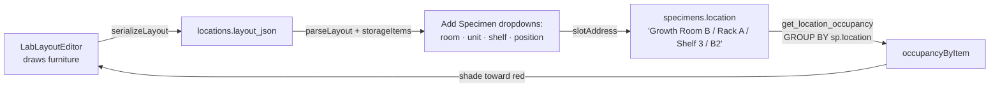

> [!abstract] In one sentence
> A room is drawn as furniture on a grid where every piece carries a **footprint** *and* a **shelf
> breakdown**, the drawing generates the `Room / Unit / Shelf N / B2` address strings that
> `specimens.location` has always held, and the whole plan is stored as one JSON document in
> `locations.layout_json`.

---

## What makes a lab plan different from a floor planner

The third dimension. A five-shelf rack occupies **one rectangle on the floor** but is **five places
you can put a culture**, and each of those shelves holds a grid of trays. A generic floor grid
cannot express that.

So every `FurnitureItem` in `src/lib/labLayout.ts` carries both:

```ts
interface FurnitureItem {
  id: string;
  kind: FurnitureKind;
  label: string;        // becomes the middle segment of every address this item generates
  x: number; y: number; // footprint origin, top-left of the plan
  w: number; h: number; // footprint size, in grid cells
  tiers: number;        // shelves / levels. 0 = "this holds nothing"
  rows: number;         // lettered  A, B, C …
  cols: number;         // numbered  1, 2, 3 …
  notes?: string;
}
```

`capacityOf(item) = tiers × rows × cols`, and **zero if any of the three is zero**. A bench, a flow
hood, an autoclave, a sink, a door or a wall is the degenerate case: real footprint, nothing to
store. That is also the elevation the inspector renders — the shelves stacked, each a small grid of
trays, each tray labelled with the address a specimen would record if it lived there.

### The palette

Defaults are chosen to match how the equipment is actually built, and every number is editable after
placing — these are a starting point, not a constraint.

| Kind | `w × h` | `tiers` | `rows × cols` | Capacity |
|---|---|---|---|---|
| `rack` — Culture rack | 3 × 1 | 5 | 2 × 3 | 30 |
| `shelf` — Shelf unit | 4 × 1 | 4 | 1 × 4 | 16 |
| `cabinet` | 2 × 1 | 2 | 2 × 2 | 8 |
| `incubator` | 2 × 2 | 3 | 2 × 2 | 12 |
| `growth-chamber` | 3 × 2 | 4 | 2 × 4 | 32 |
| `fridge` | 2 × 2 | 4 | 2 × 2 | 16 |
| `freezer` | 2 × 2 | 5 | 2 × 3 | 30 |
| `dewar` — Cryo dewar | 1 × 1 | 6 | 1 × 5 | 30 (canisters × boxes) |
| `hood` — Flow hood | 3 × 2 | 0 | 0 × 0 | **0** |
| `bench` | 4 × 1 | 0 | 0 × 0 | **0** |
| `autoclave` | 2 × 2 | 0 | 0 × 0 | **0** |
| `sink` · `door` · `wall` | 1 × 1 | 0 | 0 × 0 | **0** |

`specFor(kind)` falls back to the rack rather than throwing, so a layout saved by a newer build —
with a `kind` this build has never heard of — still renders instead of blanking the whole plan.

---

## The address grammar

```
Growth Room B / Rack A / Shelf 3 / B2
   room name      label     tier     position
```

| Function | Produces |
|---|---|
| `rowLetter(i)` | `0 → A`, `25 → Z`, `26 → AA` |
| `positionLabel(row, col)` | `A1`, `A2`, `B1` … — rows lettered, columns numbered **from 1** |
| `slotAddress(room, item, tier, row, col)` | the full path, ` / `-joined |
| `tierAddress(room, item, tier)` | `Room 1 / Rack A / Shelf 5` — the heading of one shelf in the editor |
| `enumerateSlots(layout, room)` | every address the plan generates, root-to-leaf in reading order |

Two segments are conditional, and the tests pin both:

- **The room segment is omitted** when there is no room name — which is what happens on a plan that
  has not been attached to a Location yet. `slotAddress('', rack, 0, 0, 0)` → `Rack A / Shelf 1 / A1`.
- **The position segment is dropped** when the shelves carry no grid (`rows` or `cols` is `0`):
  `Room 1 / Rack A / Shelf 1`.

> [!important] Auto-naming is load-bearing, not cosmetic
> `nextLabel` gives the first rack `Rack A`, the second `Rack B`, and once the alphabet runs out,
> `Rack A2`. Because the label *is* the middle of every address the item generates, an operator who
> never renames anything still gets addresses that read properly.

### Caps, and why they exist

Address enumeration is `tiers × rows × cols` per item and the Add Specimen dropdowns list them, so a
fat-fingered "500 shelves" would generate a hundred thousand options and lock up the form.

| Constant | Value | Guards |
|---|---|---|
| `MIN_GRID` / `MAX_GRID` | 4 / 60 | grid dimensions |
| `MAX_TIERS` | 30 | shelves per item |
| `MAX_ROWS` | **26** | one letter per row, A–Z |
| `MAX_COLS` | 40 | positions per row |
| `MAX_SLOTS_PER_LAYOUT` | 5000 | total generated addresses per room |
| `DEFAULT_GRID_COLS` × `ROWS` | 20 × 14 | a new empty plan |

`normalizeItem` clamps every field into range, refuses a zero or negative footprint, survives `NaN`
out of a number input, and gives a blank label the placeholder `'Unnamed'` — because a blank one
would produce `Room / / Shelf 1`. The `MAX_SLOTS_PER_LAYOUT` cap is **silent at this layer** by
design; callers that need to warn compare against `totalCapacity`.

---

## Interaction: a tile-map editor, not CAD

`LabLayoutEditor.svelte` renders **SVG rather than canvas** — hit-testing, focus, keyboard handling
and dark-mode theming all come free, and a lab plan is tens of rectangles, not thousands.

Arm a stamp from the palette, click to drop, drag to move, drag a corner to resize.
`R` rotates (swapping `w`/`h`, keeping the top-left corner put), `Delete` / `Backspace` removes,
arrow keys nudge, `Ctrl+Z` undoes, `Ctrl+Y` / `Ctrl+Shift+Z` redoes, `Ctrl+D` duplicates, `Escape`
deselects. No modal dialogs and nothing to confirm.

> [!important] Overlaps are tinted, not forbidden
> `findOverlaps` returns the ids of every item that intersects another, and the editor shades them.
> The reasoning in the source: real rooms have a rack tucked under a bench and a dewar wedged beside
> a freezer, and a planner that refuses to draw that is one people stop using.

The editor reads `initialJson` **once, on purpose** — re-deriving the layout from the prop would
throw away unsaved edits every time the parent refetched. `LabMap.svelte` keys the component by
location id, so switching rooms creates a fresh instance rather than mutating one.

---

## Why the layout is a JSON blob, not normalised tables

`migration_059` adds exactly one column:

```sql
ALTER TABLE locations ADD COLUMN layout_json TEXT;
```

> [!important] The reasoning, stated in the migration itself
> The geometry is a **document**: read whole, written whole, **never queried across rooms**. Nothing
> asks "which racks in the building are 3 cells wide". Normalising it would buy a join nobody needs
> at the cost of a migration per editor field — every time the palette grows a property, a
> `furniture` table would need a schema change.
>
> What *is* queried — specimen placement — stays where it already was, in `specimens.location`. The
> layout's job is to **generate** those paths, not to replace them. No existing record changes
> meaning, and a lab that never draws anything is completely unaffected.

The trade is real and worth naming: there is no referential integrity between a drawn slot and the
specimens that claim to live in it, and renaming a piece of furniture does not rewrite the
`specimens.location` strings that already reference the old label.

### Guarding a TEXT column that holds structure

`save_location_layout` (`can_write()`) is deliberately kept **separate from `update_location`**, for
the same reason `set_specimen_location_pin` is: it touches exactly one column, so an autosave from
the editor can never race a name or image edit and clobber it. Passing `None` clears the plan.

Two backend checks before the write:

- **Size**: `MAX_LAYOUT_BYTES = 512 KiB` → *"Floor plan is too large (N KB). The limit is 512 KB."*
- **Shape**: `serde_json::from_str::<Value>` must succeed → *"Floor plan is not valid JSON: …"*.
  Rejected at write time rather than read time, because a bad blob written now is a Lab Map that
  fails to open later with nothing pointing at when it broke.

On the read side, `parseLayout` is written defensively for the same reason: the input is a TEXT
column that can hold a layout from a newer build, a half-written string from a crash, or nothing at
all. A throw would take out the whole Lab Map view. So it returns `null` rather than throwing on
truncated input, drops malformed items while keeping the good ones, drops duplicate ids (which would
otherwise break keyed rendering), and clamps an out-of-range grid from a hand-edited blob.

---

## How the drawing joins up with `specimens.location`



### Add Specimen

`SpecimenForm.svelte` loads every location, parses each `layout_json`, and keeps only those with at
least one storage item. If there are any, four dropdowns come from the drawing and compose the
address with `slotAddress`. Selecting a different room or piece invalidates the shelf and position
beneath it — *shelf 5 of a two-shelf cabinet is not a place*.

> [!success] What this replaced
> Four **hardcoded** lists: rooms 1–5, racks A–D, shelves 1–5, trays A–F. Invented rather than
> measured, so a lab whose racks are lettered E and F literally could not record where anything was.
>
> The fallback is deliberate: a lab that never opens the designer keeps the old fixed lists
> unchanged, so nothing shifts underneath an existing installation.

### Occupancy shading

`get_location_occupancy` groups the free-text `specimens.location` strings server-side —
`WHERE is_archived = 0 AND location IS NOT NULL AND TRIM(location) != ''`, returning
`specimen_count` and `contaminated_count` per distinct path. Archived specimens are excluded on the
principle that *a rack full of archived cultures is an empty rack*. Contamination folds in both
`quarantine_flag` and any subculture with `contamination_flag = 1`.

`occupancyByItem` then folds those rows back onto furniture:

> [!important] Matching is on ` / `-delimited **segments**, not substrings
> A naive `includes` would let **"Rack A" absorb the count for "Rack A2"**. The function splits the
> location path on `/`, trims and lower-cases each segment, and stops at the first segment that
> names a piece in the plan. There is a test for exactly that case.

`occupancyBySlot` is the finer-grained sibling, keyed on the whole address, case- and
whitespace-normalised.

---

## Honest limits

> [!warning] Known gaps at `v0.54.0`
> - **Renaming furniture orphans existing addresses.** `specimens.location` holds the label as it
>   was when the specimen was filed; nothing rewrites it and nothing warns.
> - **`get_location_occupancy` is not scoped to the active [[Lab Profiles|lab profile]].** It counts
>   every non-archived specimen in the installation, so shading in a mycology-configured lab
>   includes plant tissue culture cultures stored in the same room.
> - **`locations.name` is `UNIQUE` but a furniture `label` is not.** `nextLabel` avoids collisions
>   *within a kind* in one room; two different kinds can share a label, and two rooms certainly can,
>   at which point `occupancyByItem` attributes by first matching segment.
> - **The user manual is stale here.** `UserManual.md` §20 *Interactive Lab Map* still describes only
>   the pre-`v0.54.0` workflow — upload a floor-plan image, drop one pin per location — and does not
>   mention the designer, the shelf breakdown, or the generated dropdowns. `UserManual.md` §0 does
>   cover the room plan; §20 needs rewriting. Believe the code.
> - The image-and-pin map (`floor_plan_image`, `floor_plan_x/y`, `set_specimen_location_pin`) still
>   exists and is **a separate system** from the drawn plan. Do not conflate `specimens.location_id`
>   (a pin on the old map) with `specimens.location` (the address string the layout generates).

---

## Where to look

| Concern | File |
|---|---|
| Pure model: geometry, addresses, capacity, occupancy, serialisation | `src/lib/labLayout.ts` — no Svelte, no DOM, no API calls, so it is testable directly |
| Its tests | `src/lib/labLayout.test.ts` — 44 cases |
| The SVG editor | `src/lib/components/LabLayoutEditor.svelte` |
| The Lab Map view that hosts it | `src/lib/components/LabMap.svelte` |
| Persistence and occupancy | `src-tauri/src/commands/locations.rs` |
| The column | `migration_059_location_layout` in `src-tauri/src/db/migrations.rs` |

---

## Related

[[Drawing the Lab]] · [[Specimens Strains and Species]] · [[Svelte Frontend]] · [[Database Schema]] ·
[[Migrations]] · [[Lab Profiles]]

---

**Back to [[Home]]**

#lab-ops #lab-map #layout
