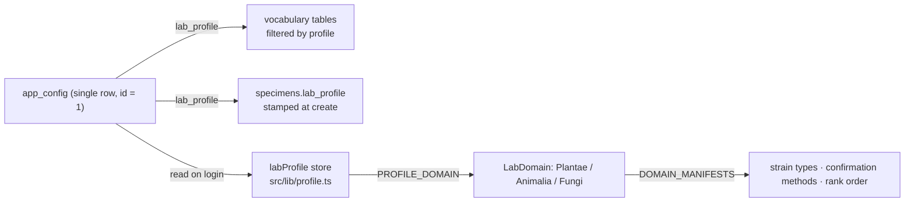

> [!abstract] In one sentence
> One admin-only setting — `app_config.lab_profile`, one of `plant_tissue_culture`, `cell_culture`,
> `mycology` — re-vocabularies the entire application, and every specimen carries an immutable stamp
> of the profile it was created under so switching changes *which lab you are looking at*, never
> what the data means.

---

## The switch itself



| Command | Gate | Behaviour |
|---|---|---|
| `get_lab_profile` | any session | Reads `app_config.lab_profile`, falls back to `plant_tissue_culture` |
| `set_lab_profile` | **`is_admin()`** | Validates against the three allowed values, then `check_profile_change_allowed` |

`check_profile_change_allowed(specimen_count, confirmation)` is a **pure function**, unit-tested
without a database. With zero specimens it always passes. With any specimens it demands the operator
type exactly `CHANGE PROFILE`, and the refusal message is the design statement:

> This lab has *N* specimens. Switching the active lab profile changes which lab you are viewing —
> existing cultures keep the lab they were created in and will be hidden until you switch back.
> Nothing is deleted or relabelled.

---

## What a profile actually re-vocabularies

Six lookup tables, all shaped `(id, profile, code, label, sort_order[, is_terminal])` with
`UNIQUE(profile, code)`, all served through `src-tauri/src/commands/vocabulary.rs` and all filtered
by `db::vocabulary::active_profile`:

| Table | Command | Example difference between profiles |
|---|---|---|
| `stages` | `list_stages` | PTC `explant → callus → … → acclimatized`; mycology `spore_clone → agar → grain_spawn → bulk_substrate → colonizing → fruiting`; cell culture `primary → subculture → expansion → … → cryo_stock` |
| `propagation_methods` | `list_propagation_methods` | PTC `microprop`, `organogenesis`; mycology `agar_to_grain`, `grain_to_bulk`, `spore_syringe`; cell culture `trypsin_passage`, `feeder_free` |
| `hormone_types` | `list_hormone_types` | Mycology reuses this table for **substrate supplements** (`gypsum`, `bran`, `vermiculite`) rather than hormones |
| `compliance_record_types` | `list_compliance_record_types` | Cell culture `mycoplasma_test`, `gmp_batch_record`; mycology `cultivation_permit`, `grow_log` |
| `compliance_agencies` | `list_compliance_agencies` | Cell culture adds `FDA_CBER`, `EMA`, `ICH`; mycology has `USDA_APHIS`, `state_ag_dept` |
| `inventory_categories` | `list_inventory_categories` | Mycology `grain_spawn`, `bulk_substrate`; cell culture `serum`, `cryoprotectant` |

Adding a term is an `INSERT`, not a DDL change — the tables replaced the `CHECK` constraints that
used to live on `specimens.stage` and `specimens.propagation_method`.

### Frontend-side vocabulary: the domain manifests

`src/lib/profile.ts` holds what the *database does not*: a fixed map from profile → biological
domain, and per-domain UI vocabularies.

```ts
PROFILE_DOMAIN = {
  plant_tissue_culture: 'Plantae',
  cell_culture:         'Animalia',
  mycology:             'Fungi',
}
```

| Domain | `strainTypeLabels` keys | `confirmationMethodLabels` keys |
|---|---|---|
| Plantae | `cultivar`, `accession`, `ecotype`, `hybrid`, `landrace` | `morphological`, `molecular`, `isozyme`, `visual` |
| Animalia | `cell_line`, `primary`, `immortalized`, `transformed` | `str_profiling`, `karyotyping`, `morphological`, `flow_cytometry` |
| Fungi | `wild_type`, `cultivated`, `hybrid`, `mutant` | `morphological`, `molecular`, `cultural`, `mating` |

All three manifests currently declare the **same** `rankOrder`
(`kingdom → phylum → class → order → family → genus → species`), so that field is structural, not
differentiating — see [[Taxonomy Backbone]] for why `species` is in that list but not in the `taxa`
table.

Two mycology-only vocabularies also live in `profile.ts` rather than the database:

- `ORIGIN_TYPE_META` — `multi_spore`, `isolated_dikaryon`, `tissue_clone`. The file's own comment is
  the rule: these keys **must** stay in lock-step with the `origin_type` `CHECK` constraint added by
  `migration_029`, because adding one here without the migration lets the UI submit a value the
  database rejects.
- `CONTAMINANT_TYPE_LABELS` — `trich`, `wet_rot`, `cobweb`, `pin_mold`, `mycelium_abort`, `other`.
  `subcultures.contaminant_type` has **no** `CHECK`, so this list is the de facto vocabulary.

### Whole views appear and disappear

`Sidebar.svelte` filters nav items by profile as well as by role: **Media Logs** is
`plant_tissue_culture` only, **Fruiting** is `mycology` only. The Dashboard branches on the profile
for its mycology QC alert panel and its cell-culture and environmental panels.

> [!warning] `strains.strain_type` has no `CHECK` and its DB default is not in any manifest
> The column defaults to `'wildtype'` — which is not a key in Plantae's, Animalia's *or* Fungi's
> `strainTypeLabels` (Fungi spells it `wild_type`, with an underscore). `StrainManager` compensates
> by prepending whatever value is stored to its edit dropdown; `SpecimenForm` and the Taxonomy
> Navigator do not.

---

## The isolation guarantee

> [!danger] `specimens.lab_profile` is stamped at creation and never rewritten
> Added by `migration_053`. It is the **only** lab-scoping column in the domain schema. Nothing —
> not `set_lab_profile`, not a stage change, not a split — relabels an existing specimen.

The migration comment explains what it replaced, and it is the key to understanding the whole
design. Before `053`, profile membership was *inferred at read time* by joining `specimens.stage`
against `stages.profile`. That proxy was wrong in both directions: `list_specimens` and
`search_specimens` never applied the join at all, and — the deeper problem — **stage codes are not
unique across profiles**.

### Why stage codes are shared, and what it implies

`stages` is keyed `UNIQUE(profile, code)`, not `UNIQUE(code)`. That is deliberate: a profile owns
its own namespace, so each vocabulary can use the plainest word for the thing it means without
negotiating with the others. The overlaps that result are real:

| Code | Defined for | Meaning in each |
|---|---|---|
| `archived` | `plant_tissue_culture`, `cell_culture` | terminal in both |
| `custom` | `plant_tissue_culture`, `cell_culture` | free-form escape hatch |
| `suspension` | `plant_tissue_culture`, `cell_culture` | a plant cell suspension vs. a suspension cell line |
| `contaminated` | `mycology`, `cell_culture` | terminal in both |
| `discarded` | `mycology`, `cell_culture` | terminal in both |

> [!important] The implication
> A stage code is **not** an identity. `specimens.stage` alone cannot tell you which lab a culture
> belongs to, which is exactly why `db::vocabulary::specimen_lab_profile` reads the stamped column
> and its doc comment says it *"never re-derives it from the stage code, which is ambiguous across
> profiles"*. Any future code that tries to infer a profile from a stage is reintroducing the
> `migration_053` bug — a mycology culture sitting in `contaminated` counted by the cell-culture
> dashboard.

The `053` backfill handled the ambiguity honestly, in two passes: specimens whose stage code is
defined for exactly one profile were assigned that profile; the rest — the shared codes, and any
unknown code — fell back to the currently configured profile, because there was no information left
to recover.

### The enforcement points

| Layer | Mechanism |
|---|---|
| **By-ID access** | `require_active_lab_profile(conn, specimen_id)` — loads the specimen's stamped profile, compares to the active one, and refuses with *"This specimen belongs to the X lab, but the Y lab is currently active. Switch the active lab profile in Settings to work with it."* |
| **List / search reads** | An explicit `lab_profile = ?1` predicate, first and unconditional in `search_specimens` |
| **Aggregates and reports** | `active_lab_sql(alias)` — a correlated `COALESCE` sub-select rather than a bind parameter, deliberately, because threading a new `?N` through queries with wildly different parameter counts is exactly the edit that silently binds the wrong value, and the failure mode there is one lab seeing another's data |
| **Stage writes** | `require_selectable_stage(conn, profile, code)` — rejects terminal stages and cross-profile stages on both `create_specimen` and `bulk_update_stage` |

`require_active_lab_profile` is the load-bearing one: filtering reads is not enough on its own,
because an id obtained under one profile (a QR scan, a bookmark, a stale UI, a crafted IPC call)
would otherwise still resolve after switching. Every by-ID specimen command routes through it, so
the block is default-deny.

> [!warning] Reference data is *not* profile-scoped
> `taxa`, `species` and `strains` have no `lab_profile` or `lab_id` column at all. They are
> installation-global and shared across all three profiles. A mycology genus and a plant genus sit
> side by side in the same root column of the Taxonomy Navigator, and a rebuild of the taxonomy
> sweeps every species in the installation regardless of which profile is active. This is consistent
> with the rest of the reference data, but it means specimen *counts* are scoped in some places and
> not others — `list_strains_by_species` scopes its `specimen_count` to the active lab, while
> `get_taxon_column_items` and `get_species_for_taxon` do not.

---

## Dormant edge

> [!caution] `app_config.domain` is written once and then never again
> `migration_032` added the column and back-filled it with a `CASE` over `lab_profile`
> (`Plantae` / `Animalia` / `Fungi`, defaulting to `Plantae`). **`set_lab_profile` does not update
> it**, and `db::vocabulary::active_domain` has no non-test caller in the backend. Any database
> whose profile has been switched since install holds a stale `domain`. Nothing currently reads it,
> so nothing is currently wrong — but it is a trap for the next feature that decides to trust it.
> The live source of truth is `PROFILE_DOMAIN` in `src/lib/profile.ts`, derived on the client.

---

## Related

[[Specimens Strains and Species]] · [[Taxonomy Backbone]] · [[Daily Bench Work]] ·
[[Database Schema]] · [[Migrations]] · [[Shipped vs Dormant]]

---

**Back to [[Home]]**

#lab-ops #profiles #vocabulary
