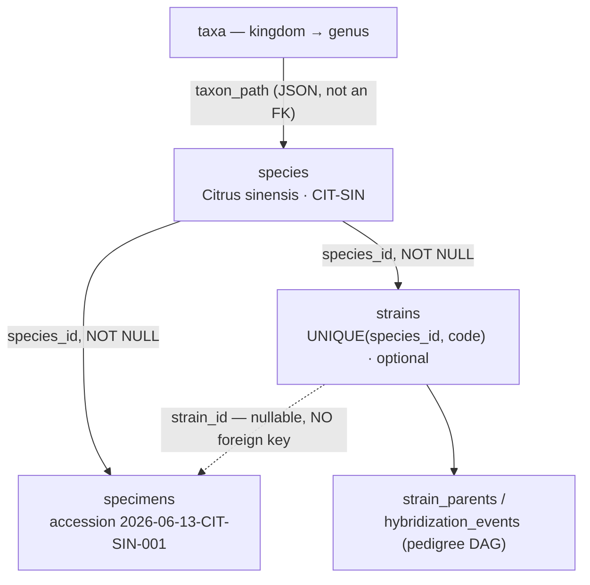
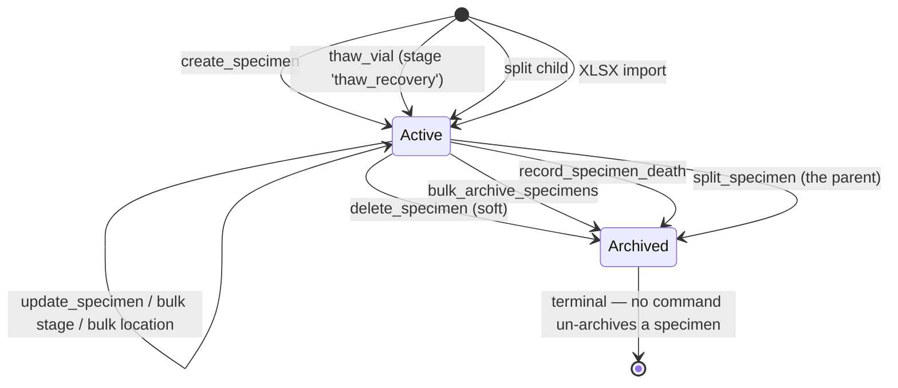

> [!abstract] In one sentence
> Three levels of identity — **species** (the organism), **strain** (a named line within it),
> **specimen** (one physical culture with an accession number) — and one lifecycle whose single most
> consequential decision is whether a bench event was a *passage* or a *split*.

---

## The three levels



| Level | Table | Cardinality rule | Notable |
|---|---|---|---|
| **Species** | `species` | `specimens.species_id` is `NOT NULL` — every culture has a species | `species_code` is `NOT NULL UNIQUE` and is the accession prefix. `default_subculture_interval_days` (default `28`) drives the work queue |
| **Strain** | `strains` | Optional. `UNIQUE(species_id, code)` | Carries a **status ladder** and, for hybrids, a pedigree |
| **Specimen** | `specimens` | The physical thing in the vessel | Carries the lab-profile stamp, the location string, and the audit lineage |

> [!important] Three sharp edges in this model
> - **`specimens.strain_id` has no foreign key.** `migration_019` added it with a bare
>   `ALTER TABLE … ADD COLUMN` because SQLite cannot attach a `REFERENCES` clause that way in older
>   versions. The safety net is the `specimen_missing_strain` integrity check at runtime, not the
>   database.
> - **`specimens.strain_chain_seq`** snapshots the strain's audit `chain_seq` at the moment the
>   specimen was created, so a later mutation of the strain is distinguishable from the state the
>   specimen was actually created against.
> - **The species↔taxonomy link is a `LIKE` on a JSON string**, not a foreign key. A species can sit
>   "under" a taxon with no referential integrity whatsoever — see [[Taxonomy Backbone]].

The user manual's framing is worth repeating because it is the mistake people make: *do not create a
new species for a new cultivar — that is a strain.*

---

## Creation and accessioning

`create_specimen` (`can_write()`) runs in this order, and the order matters:

1. **`require_selectable_stage(profile, stage)`** — rejects a terminal stage and a stage belonging
   to another profile. See [[Lab Profiles]].
2. Species must exist → else `"Species not found"`.
3. Mint the accession: `{initiation_date}-{species_code}-{seq:03}`, e.g. **`2026-06-13-CIT-SIN-001`**,
   where `seq` is `COUNT(*)` of accessions matching the prefix, plus one.
4. `qr_code_data = "STELO:{accession}"`.
5. Snapshot `strain_chain_seq` from the strain's audit chain — **before** the transaction opens.
6. **INSERT and the audit entry go in one `unchecked_transaction`**, so a specimen without an audit
   entry can never commit.
7. Anchor selection for that audit entry: `parent_specimen_id` → `log_audit_for_child`; else
   `strain_id` → `log_audit_seeded_by_strain`; else → `log_audit_seeded_by_species`.
8. Best-effort signed `specimen_created` event after commit.

Accession numbers are globally `UNIQUE` across all lab profiles.

---

## Passage vs. split — the distinction that actually matters

This is the one people get wrong, and it is not recoverable by editing later: the lineage tree is
built from it, and correcting it means writing correction entries rather than rewriting history
(see [[Hash-Chained Provenance]]).

> [!important] The one-line test
> **Did the number of cultures on the shelf change?**
> No → **passage**. Yes → **split**.

| | **Passage** (`create_subculture`) | **Split** (`split_specimen`) |
|---|---|---|
| What happens physically | The same culture moves to fresh media | One culture becomes two or more |
| Rows written | One `subcultures` row | The parent is archived; **N new `specimens` rows** |
| Specimen identity | Unchanged — same id, same accession | New ids, new accessions |
| Accession | `2026-06-13-CIT-SIN-001` stays | `…-001A`, `…-001B`; nested splits chain: `…-001B` → `…-001BA` |
| Counter moved | `specimens.subculture_count = passage_number` | `lineage_passage_offset` on each child |
| Audit chain | `log_audit("subcultured")` **on the specimen's own lineage** — the chain advances | `log_audit("split")` on the parent, then `log_audit_for_child` per child — **both children share that `prev_hash`**, making the fork cryptographically visible |
| Minimum count | 1 | 2 — `"Split requires at least 2 children"` |

### Passage in detail

`create_subculture` refuses an archived specimen (*"Cannot record a passage on an archived
specimen"*) and refuses one belonging to another lab. `passage_number = subculture_count + 1` —
**per specimen row**, not the lineage-absolute number.

Two derived metrics are computed here and nowhere else:

- `pdl_gained` = `log₂(harvest/seed)` when both cell counts are given, otherwise
  `log₂(split_ratio)`; `None` for non-positive inputs. It accumulates into
  `specimens.cumulative_pdl`.
- `doubling_time_hours` = `elapsed_hours × ln2 / ln(harvest/seed)`, requiring all three inputs **and**
  `harvest > seed`. `elapsed_hours` comes from the previous non-`death` passage's date, in whole
  days × 24.

The transaction also pushes `location ← location_to` and `health_status` onto the specimen row, so a
passage is how a culture *moves*.

### Split in detail

Genealogy is computed once for all children:

```
child_generation       = parent.generation + 1
child_passage_offset   = parent.lineage_passage_offset + parent.subculture_count + 1
child_root_specimen_id = parent.root_specimen_id ?? parent_specimen_id
```

Children inherit the parent's `lab_profile` **by construction**, not from the active profile —
so a split can never launder a culture into a different lab. They also inherit `provenance`,
`source_plant`, `cumulative_pdl` and `origin_type`. `is_best_performer` is deliberately **not**
carried: it resets to `0`.

> [!note] There is no auto-created "Passage 1" on a split child
> The split *is* the next passage, and `lineage_passage_offset` already accounts for it.

`preview_split_accessions` lets the form show what will be minted before committing; `count` must be
`1..=26`. Exhausting the 26 letters is a hard error naming the parent accession.

### The three counters, which are easy to confuse

| Column | Means | Written by |
|---|---|---|
| `subculture_count` | Passages recorded **on this specimen row** | `create_subculture` |
| `lineage_passage_offset` | Passages accumulated by all ancestors — absolute passage = `offset + subculture_count` | `split_specimen`, `thaw_frozen_vial` |
| `generation` | Split / thaw depth | `split` (`parent + 1`), `thaw` (`source + 1`) |
| `root_specimen_id` | Oldest ancestor | `parent.root ?? parent.id` |

---

## Strain status promotion

```
unverified ──▶ claimed ──▶ confirmed_manual ──▶ confirmed_genomic
                              needs a non-empty      needs a non-empty
                              confirmation_basis     genomic_fingerprint
```

A strain is born `unverified` — the column default. That is a statement of honesty, not a defect:
the app refuses to let a name imply a verification that was never done.

Enforced by `validate_strain_status_transition`, a pure function:

| Rule | Error |
|---|---|
| Unknown status | `"Unknown strain status: '{x}'"` |
| Downgrade from `confirmed_manual` or `confirmed_genomic` | `"Cannot downgrade strain status from '{a}' to '{b}'"` |
| → `confirmed_manual` without a basis | `"Status 'confirmed_manual' requires a non-empty confirmation_basis"` |
| → `confirmed_genomic` without a fingerprint | `"Status 'confirmed_genomic' requires a non-null genomic_fingerprint"` |

Skipping levels upward is allowed. `confirmed_genomic` is terminal. The audit action is
`"status_change"` with `old_value` / `new_value` populated.

> [!danger] The `[RESTRICTED]` write-back guard
> `genomic_fingerprint` is a **masked field** — a role without visibility reads back the literal
> `"[RESTRICTED]"` placeholder instead of the value (see [[Roles and Permissions]]). A UI that
> pre-fills an edit form from a masked read and submits unchanged would overwrite the real
> fingerprint with that string, destroying it permanently. `apply_strain_status_update` calls
> `reject_if_restricted_marker` before the UPDATE. This was found and fixed as a **real** bug, not
> a hypothetical one: `update_strain_status` used to write `genomic_fingerprint` unconditionally on
> every call while `StrainManager.svelte` pre-filled from the current value.

The vocabulary of `strain_type` and of `confirmation_basis` is per-domain — cultivar / accession /
ecotype for Plantae, cell_line / primary / immortalized for Animalia, wild_type / cultivated /
mutant for Fungi. See [[Lab Profiles]].

---

## Hybrids

`create_hybridization_event` (`can_write()`, plus `is_admin()` for the cross-species case) runs
every guard **before** any write:

1. Load both parents.
2. `is_cross_species = parent_a.species_id != parent_b.species_id`. If so, three refusals in order:
   without an explicit override → *"Cross-species hybridization is not permitted: parent strains
   must belong to the same species"*; non-admin → *"…requires administrator privileges"*; blank
   reason → *"Cross-species override requires a documented reason"*.
3. **Cycle detection** — a DFS over `strain_parents` in **both** directions →
   *"Cycle detected: strain '{a}' is an ancestor of '{b}'"*.
4. Backcross detection, walking up to depth 10.
5. Generation label resolution, in order: an explicit non-blank label → `BC{depth}F1` for a
   backcross → `suggest_generation_label(a, b)`, which knows `(None,None) → F1`, `(F1,F1) → F2`,
   `(F2,F2) → F3`, `(F3,F3) → F4` and returns `None` for anything else.
6. Snapshot both parents' `MAX(chain_seq)`.

Then **seven writes in one transaction**: the hybrid `strains` row (`is_hybrid = 1`,
`species_id = parent_a.species_id`) → strain genesis → `log_audit("hybridize")` → for a cross-species
cross, a `"cross_species_override"` entry that names the admin and quotes the reason → two
`strain_parents` rows (`parent_a` / `parent_b`) → the `hybridization_events` row →
`log_audit("used_as_parent")` on each parent's chain.

Pedigree reads are depth-capped: `max_depth.unwrap_or(5).min(configured_pedigree_max_depth)`, where
the configured cap is `app_settings['pedigree_max_depth']`, default `10`, clamped `[1, 20]`.
`get_strain_specimen_tree` also detects a circular pedigree at read time.

---

## Contamination

> [!important] Contamination is recorded in three places and they mean different things
> | Column | Means | Consumed by |
> |---|---|---|
> | `subcultures.contamination_flag` | Observed **during a specific passage** | Aggregated as `MAX(contamination_flag)` into the derived `Specimen.has_contamination`; drives the work queue's `contamination` rule and `ContaminationStats` |
> | `specimens.contamination_flag` / `contamination_notes` | Recorded **at archive time**; set by `split_specimen` and inherited by children | Surfaced on the specimen row |
> | `specimens.quarantine_flag` | A **regulatory hold** — a different concept entirely | Drives the `quarantine` rule and the compliance views |

Contamination inheritance on a split is unit-tested and deliberately sticky:

```
effective = parent.contamination_flag != 0 || request.contamination_flag == Some(true)
notes     = if effective { request.contamination_notes ?? parent.contamination_notes } else { None }
```

A contaminated parent produces contaminated children whether or not the operator ticks the box.

Mycology adds `subcultures.contaminant_type` — `trich`, `wet_rot`, `cobweb`, `pin_mold`,
`mycelium_abort`, `other`. That column has **no `CHECK` constraint**; the list in
`src/lib/profile.ts` is the de facto vocabulary.

---

## Death and archival



> [!danger] Archival is one-way
> `delete_specimen` is a **soft** delete (`is_archived = 1`, `archived_at = now()`). There is no
> hard-delete path for a specimen anywhere in the command layer, and **no command un-archives one**.

`record_specimen_death` is the explicit terminal event and differs from an archive in four ways:

- inserts a `subcultures` row with `event_type = 'death'` and `health_status = '0'`
  (`0` = Dead on the 0–4 scale: Dead / Poor / Fair / Good / Healthy);
- **does not increment `subculture_count`** — a death is not a passage, deliberately;
- refuses an already-archived specimen: *"Specimen is already archived — cannot record a death
  event"*;
- writes its audit entry inside the transaction with `?`, not `.ok()`, and emits **two** signed
  events: `specimen_died` and `specimen_archived`.

`archive_strain` is also soft — and it does **not** check for bound specimens.

---

## Honest limits

> [!warning] Known rough edges
> - **`update_specimen` does not re-validate `stage`** against the vocabulary, unlike
>   `create_specimen` and `bulk_update_stage`.
> - **`update_subculture` has no lab guard and no archived-parent check** — a passage record on any
>   specimen in any lab can be edited by any writer who knows the subculture id.
> - **Four unlinked mechanisms move a specimen**: `update_specimen{location}`,
>   `bulk_update_location`, `create_subculture{location_to}` (which overwrites
>   `specimens.location`), and `set_specimen_location_pin` — only the last touches the `locations`
>   table. See [[Lab Layout Model]].
> - Several `SplitChild` fields are accepted by the IPC boundary and **never written**:
>   `media_batch_id`, `vessel_type`; and on the request itself `observations`, `employee_id`,
>   `temperature_c`, `ph`, `light_cycle`.
> - **A species cannot be edited or archived from the UI.** `update_species` exists as a command but
>   has no caller, and there is no `archive_species` at all. See [[Shipped vs Dormant]].

---

## Related

[[Taxonomy Backbone]] · [[Lab Profiles]] · [[Hash-Chained Provenance]] · [[Daily Bench Work]] ·
[[Database Schema]] · [[Command Reference]] · [[Failure Reference]]

---

**Back to [[Home]]**

#lab-ops #lifecycle #specimens
