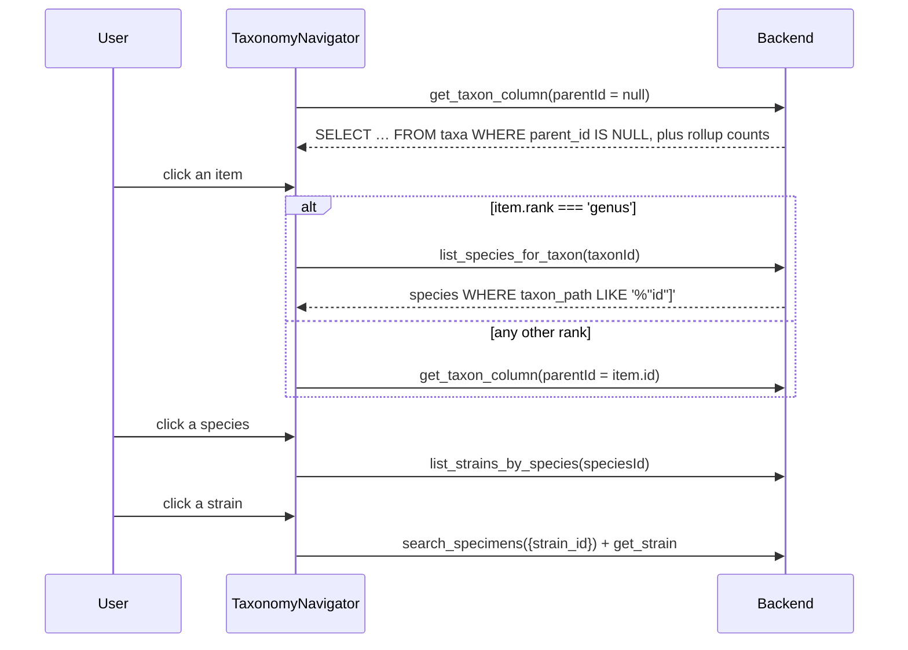
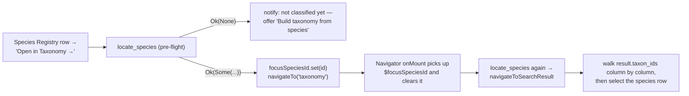

> [!abstract] In one sentence
> `taxa` holds kingdom through genus and **nothing below**; species live in their own table and
> reach the tree through exactly one thing — a JSON array of taxon ids cached in
> `species.taxon_path` — and every column, every count and every navigation path in the Taxonomy
> Navigator is derived from those two facts.

---

## The two facts

> [!danger] Binding invariants
> 1. **`taxa.rank` is `CHECK`-constrained to `kingdom | phylum | class | order | family | genus`.**
>    `species` is deliberately not a rank. A species-rank row cannot be inserted.
> 2. **There is no `species.taxon_id` column and no join table.** The *only* link from a species to
>    the tree is `species.taxon_path`: a JSON array of `taxa.id` strings ordered
>    root → … → most-specific ancestor, e.g. `["<kingdom-uuid>","<family-uuid>","<genus-uuid>"]`.
>    The **last** element is the species' immediate parent taxon.
> 3. A species whose `taxon_path` is `NULL`, `''` or `'[]'` is **invisible in the entire Taxonomy
>    Navigator**, no matter how complete its registry row is.

```mermaid
erDiagram
    taxa ||--o{ taxa : "parent_id (self-FK)"
    taxa {
        TEXT id PK
        TEXT rank "CHECK kingdom..genus — never 'species'"
        TEXT name
        TEXT parent_id FK
        INTEGER ncbi_taxon_id
        INTEGER local_override
        TEXT taxon_path "JSON array, root..self"
        TEXT status "accepted | provisional"
    }
    species {
        TEXT id PK
        TEXT genus "plain text — NOT a foreign key"
        TEXT species_name
        TEXT species_code UK
        TEXT taxon_path "JSON array — THE ONLY LINK TO taxa"
        INTEGER ncbi_taxon_id "never written by any code path"
    }
    strains { TEXT id PK
              TEXT species_id FK }
    specimens { TEXT id PK
                TEXT species_id FK "NOT NULL"
                TEXT strain_id "nullable, NO FK" }
    species ||--o{ strains : species_id
    species ||--o{ specimens : species_id
    species }o..o{ taxa : "taxon_path LIKE '%\"<id>\"%' — string match, no FK"
```

Note what this costs: **no referential integrity**. A species can name a taxon that no longer
exists, and SQLite will never complain, because the relationship is a `LIKE` against a text column.

### The two LIKE patterns mean different things

| Pattern | Used by | Means |
|---|---|---|
| `%"<taxon_id>"]` | `get_species_for_taxon`, `resync_species_paths_under` | the species' **immediate** parent taxon is this one (id is the *last* element) |
| `%"<taxon_id>"%` | `get_taxon_column_items` rollup sub-selects | the species is **anywhere beneath** this taxon (id appears at any depth) |

The raw `LIKE` is justified in-code by taxon ids being UUIDs — hex digits and hyphens only, so no
`%` or `_` metacharacters and no ambiguity. That reasoning holds only as long as every `taxa.id`
really is a UUID; `ensure_genus_taxon`, `create_taxon` and the registry importer all generate UUIDs,
so it currently holds in production data. Test fixtures use ids like `'k1'` and `'g1'`.

---

## How the navigator derives everything from those two facts

`src/lib/components/TaxonomyNavigator.svelte` is a **Miller-column browser**: an array of columns,
each `kind ∈ {'taxon','species','strain'}`, appended as you drill in.



**Tree shape** comes from `taxa.parent_id` alone — `get_taxon_column_items` is two hardcoded query
variants, one for `parent_id = ?1` and one for `parent_id IS NULL`.

**Where species hang** comes from `species.taxon_path` alone, matched on the last element.

**Every aggregate count** — the `"N str · M sp"` badge on a taxon row — comes from correlated
sub-selects that `LIKE '%"' || t.id || '"%'` against `species.taxon_path`, joining out to `strains`
and `specimens`. That is why a broken `taxon_path` shows up as *zeroes*, not as an error.

### Minimum database state to render anything

1. **At least one `taxa` row with `parent_id IS NULL`.** Otherwise the root column comes back empty,
   `rootIsEmpty` flips true, and the empty-tree recovery block renders instead.
2. **`taxa.rank` must literally equal `'genus'`** for a species column to ever appear — the branch is
   a string equality on the rank, not "is this a leaf".
3. **`species.taxon_path` must be a JSON array whose last element is that genus taxon's id.**
4. **`strains.species_id` with `is_archived = 0`** for the strain column.

---

## Why the tree rendered empty for real labs

This was the flagship bug fixed in `v0.54.0`, and the causal chain is short:

```
migration_020 created `taxa`, added `species.taxon_path`, and ran `backfill_genus_taxa` ONCE —
   a genus taxon per distinct `species.genus`, path set on every species that existed that day.
        ↓
`create_species` never picked the job up. INSERT → genesis audit row → re-SELECT. No link.
        ↓
Every species added through the Species Registry after that landed with taxon_path = NULL.
        ↓
`get_taxon_column_items(parent_id = NULL)` finds no taxa → returns []
        ↓
rootIsEmpty → "The taxonomy tree is empty"
```

> [!important] A full registry and an empty tree is the *diagnostic*, not a coincidence
> Two independent reasons the species stayed invisible, and both had to be true:
> - no genus taxon was ever created, so there was no column to hang them under; **and**
> - even if one had existed, `get_species_for_taxon` matches
>   `sp.taxon_path LIKE '%"<genus_id>"]'`, and in SQL `NULL LIKE anything` is `NULL`, which is not
>   true. A `NULL`-path species never matches any pattern.

A **fresh install** never showed this. `migration_003` seeds six demo species
(`Asparagus officinalis`, `Nandina domestica`, and four *Citrus*), `migration_020` runs after it,
and the back-fill produces three root genus taxa. The symptom is specific to a database that
accumulated species through the UI — or an import — after that one-shot pass.

---

## What `v0.54.0` changed

### The write path now links

| Function | File | What it does |
|---|---|---|
| `ensure_genus_taxon(conn, genus)` | `src-tauri/src/db/queries.rs` | Find-or-create the `rank='genus'` taxon for a genus name. Match is `name = ?1 COLLATE NOCASE`, so `citrus` and `Citrus` are one genus. Created as a **root** — `parent_id NULL`, `taxon_path = ["<own id>"]`. Blank genus → `DbError::Constraint("Genus name is required")`. **Never re-parents an existing taxon**, so a hand-built backbone survives |
| `link_species_to_genus(conn, species_id, genus)` | same | `ensure_genus_taxon`, then copies the genus taxon's **own** `taxon_path` onto the species — so a species under a deep hand-built backbone records the whole lineage, not just the genus |
| `rebuild_species_taxonomy(conn)` | same | The repair pass. Selects only `WHERE taxon_path IS NULL OR TRIM(taxon_path) = '' OR taxon_path = '[]'`, skips a blank genus, links each, returns `(genera_created, species_linked)` |
| `resync_species_paths_under(conn, taxon_id)` | same | Re-copies the authoritative `taxa.taxon_path` onto every species whose *most specific* ancestor is this taxon or one of its descendants. Iterative with a `seen` set, so a hand-edited parent cycle cannot hang the app while it holds the DB lock |

`create_species` now calls `link_species_to_genus` after its INSERT — and on the **genus half** of
an update only, so editing just a `common_name` never disturbs a deliberate deep classification.
The link failure is logged as a `warn` audit row rather than propagated, on the reasoning that a
species that exists but is unfiled is recoverable and a failed create is not.

### `migration_058` repairs databases that already drifted

`migration_058_relink_orphan_species` is a one-line migration that calls
`queries::rebuild_species_taxonomy`. The same repair is exposed as a supervisor action —
the `rebuild_species_taxonomy` command (`can_manage()`) — reachable from **two** places: a warning
banner in the Species Registry when any species is unclassified, and the navigator's
previously-bare empty state ("Build taxonomy from species").

> [!success] Why the repair is safe to run twice
> Six tests in `src-tauri/src/db/migrations.rs` pin the behaviour:
> links species with no path · puts two species of a genus under **one** taxon · is case-insensitive
> on the genus · **leaves an already-classified species alone** · is idempotent (asserts `(1,1)`
> then `(0,0)`) · skips a species with a blank genus.
>
> The "orphans only" `WHERE` clause is both the idempotency mechanism *and* the guarantee that a
> species deliberately re-parented under a hand-built Kingdom → … → Genus chain is never flattened
> back to a bare genus. A blank genus is skipped rather than erroring, because erroring would abort
> the migration and take the app down at startup.

### `resync_species_paths_under` closes the stale-cache class of bug

`species.taxon_path` is a denormalised copy with one writer and, until `v0.54.0`, no invalidation.
That became live the moment the NCBI importer started honouring `parent_ncbi_id` and re-parenting
genus taxa — the taxon moved and the species hanging off it did not.

The failure was quiet rather than blank:

| Row | After `Citrus` is filed under `Rutaceae` |
|---|---|
| `taxa` (Citrus) `.taxon_path` | `["<kingdom>","<phylum>",…,"<citrus>"]` — updated by `recompute_taxon_path` |
| `species` (*C. sinensis*) `.taxon_path` | `["<citrus>"]` — the old snapshot |

The species **stayed visible** (the match is on the last element, which did not change), but every
ancestor column counted zero strains and zero specimens (those counts match the whole path), and
`locate_species` handed the navigator a one-element chain that no longer began at a root — so
"Open in Taxonomy →" from the Species Registry walked into nothing and returned silently.

`resync_species_paths_under` is now called immediately after every `recompute_taxon_path`:

- inside the NCBI import's parent-wiring loop, in the same transaction;
- in `update_taxon`, which previously recomputed **nothing at all** when `parent_id` changed.

Matching on `LIKE '%"<id>"]'` — the id as the *last* element — is what makes this a re-copy and not
a reclassification: only species whose most specific ancestor is that taxon are touched.

### Every remaining door that could produce an unclassified species

| Path | Links now? |
|---|---|
| `create_species` | Yes — on create, and on the genus half of an update |
| `migration_003` demo seed | Picked up by `migration_020`'s back-fill |
| CSV import stubs (`src-tauri/src/commands/import.rs`) | Yes — `link_species_to_genus` right after the stub INSERT |
| Registry import (`src-tauri/src/registry/store.rs`) | Yes — but via **one `rebuild_species_taxonomy` pass at the end**, not per-insert. Records are applied in `source_key` order and `species\|…` sorts before `taxon\|…`, so linking during the species insert would create the genus *before* the registry's own taxon record reached it, and that record would then skip as a duplicate — silently turning a 3-record import into 2 |
| `src-tauri/src/db/fixtures.rs` benchmark fixture | No — test/bench only |

---

## Navigating into the tree from elsewhere

`locate_species(species_id)` resolves a species into the **same `TaxonomySearchResult` shape the
global search already returns**, so there is one code path that knows how to open a column chain
rather than two.



Hand-off stores are consumed on mount in priority order: `$focusSpeciesId` (Species Registry) →
`$selectedStrainId` (Specimen Detail) → the path saved in `localStorage['stelo_taxonomy_path']`.

---

## Honest limits at `v0.54.0`

> [!warning] A rebuilt tree is flat, and the column header says otherwise
> `rebuild_species_taxonomy` creates **only genus taxa**, as roots. There is no species-rank taxon
> (the `CHECK` forbids it) and no automatic kingdom/phylum/class/order/family chain. A repaired tree
> is therefore N root genera, each with its species. A deeper backbone has to come from an NCBI
> import — see [[Importing NCBI Taxonomy]] — or from `create_taxon`, which has no UI.
>
> Compounding it: the navigator hardcodes `rank: 'kingdom'` on column 0 and sets no rank on any
> deeper taxon column, and `colHeaderLabel` returns `col.rank ?? ''`. So column 0 always reads
> **"Kingdom"** even when it is full of auto-created genera, and every deeper taxon column has a
> **blank** header.

> [!warning] Other live gaps
> - **`taxa` has no uniqueness constraint on `(rank, name)`.** `ensure_genus_taxon`'s `query_row`
>   silently picks the first match if duplicates exist — and NCBI import plus a registry fork can
>   both create same-named taxa.
> - **`species` has no uniqueness on `(genus, species_name)`.** Only `species_code` is `UNIQUE`.
>   Two *Citrus sinensis* rows with different codes are legal and both link to the same genus taxon.
> - **`locate_species` returns `Ok(None)` for both** "no such species" and "species exists but is
>   unclassified", so the UI always shows the *not classified yet* message.
> - **`create_provisional_taxon` leaves `taxon_path` `NULL`.** A provisional taxon appears in the
>   navigator (columns key on `parent_id`) but its rollup counts are permanently `0` (counts key on
>   `taxon_path`), and a search hit on it walks nowhere. It also sets `local_override = 1`, so the
>   NCBI importer will always skip it.
> - **Rollup counts are not lab-scoped** while strain-level counts are. A genus column can read
>   "7 specimens" while drilling to its strains shows 3, because the deeper number excludes other
>   [[Lab Profiles]]. `taxa` and `species` have no profile column, so this cannot be fixed without
>   a schema decision.
> - **`species.ncbi_taxon_id` is never written by any code path.** It exists since `migration_020`
>   and is read-only in practice.

> [!caution] Shipped but dormant
> No Svelte component calls `createTaxon`, `updateTaxon`, `listTaxaByRank`, `getTaxonDescendants`,
> `updateSpecies` or `syncNcbiTaxon`. Consequences: **no UI anywhere creates a kingdom, phylum,
> class, order or family taxon**; no UI can rename or re-parent one; a species cannot be edited
> after creation; and the whole recursive `TaxonNode` API is unused (the navigator uses the lazy
> column API instead). There is also no `delete_species` or `archive_species` command at all, and
> `species` has no `is_archived` column. Tracked in [[Shipped vs Dormant]].

---

## Quick reference

**Legal `taxa.rank` values:** `kingdom`, `phylum`, `class`, `order`, `family`, `genus`.
**`species` is not among them.**

**Taxon statuses:** `accepted` (default), `provisional`. `synonym` appears only in
`export_darwin_core`'s output mapping and is never written.

**Migrations that shaped this:** `020` (created `taxa` + `taxon_path` + the one-shot back-fill),
`031` (taxon hash-chain genesis back-fill), `034` (provisional taxa), `050` (registry tables),
`058` (relink orphan species). See [[Migrations]].

---

## Related

[[Specimens Strains and Species]] · [[Hash-Chained Provenance]] · [[Importing NCBI Taxonomy]] ·
[[Federated Exchange]] · [[Data Model]] · [[Database Schema]] · [[Lab Profiles]]

---

**Back to [[Home]]**

#taxonomy #data-model #navigator
