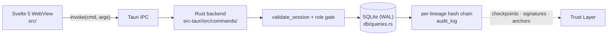

# SteloPTC — Vault Home

> [!abstract] In one sentence
> **SteloPTC** is a local-first desktop and Android application for plant tissue culture, cell
> culture, and mycology laboratories, built so that a culture's complete history can be *proved*
> rather than merely asserted — a Rust/Tauri backend owning a SQLite database, a Svelte 5 frontend,
> and a per-lineage hash chain running through every meaningful write. This vault is the complete
> map of how the backend and the frontend actually work, at `v0.54.0`. `#steloptc`

> [!quote] North Star
> **A lab notebook that cannot quietly change its own past.** Every meaningful action — registering
> a species, accessioning a culture, recording a passage, splitting a flask, flagging contamination
> — is written into a cryptographic hash chain where each entry carries a fingerprint of the one
> before it. Edit an entry after the fact and every later entry stops matching. Everything else in
> the product exists to make recording work *easy enough that people actually do it*, because a
> provenance record with gaps proves nothing.

> [!warning] Agents: read the status ledger before proposing work
> [[Shipped vs Dormant]] records what genuinely runs, what is deliberately dormant, and what shipped
> in `v0.54.0`. A capability being described in `README.md` or `UserManual.md` is not evidence that
> it is live — several ship deliberately incomplete and are labelled as such.

---

## The system at a glance

| | |
|---|---|
| **What it is** | Desktop (Windows · Linux · macOS) and Android app for lab provenance |
| **Backend** | Rust · Tauri v2 · SQLite (WAL) — `src-tauri/` |
| **Frontend** | Svelte 5 (runes) · TypeScript · Vite 6 — `src/` |
| **Seam** | Tauri IPC — one wrapped `invoke` in `src/lib/api.ts` |
| **Version** | `v0.54.0` — **pre-1.0**; releases through `1.53.2` used a 1.x series, see `CHANGELOG.md` |
| **Network** | None in normal operation. No HTTP client in the backend, no network permission in the Tauri capabilities. |
| **Disciplines** | Plant Tissue Culture · Cell Culture · Mycology, switched by one setting |

---

## The vault, folder by folder

### 🧭 Status — read this before planning

- [[Shipped vs Dormant]] — the honest ledger: what runs, what is a stub, what already shipped

### 🏛 Architecture — what the system *is*

- [[SteloPTC at a Glance]] — the whole system in one note: process model, repository layout, topology
- [[Rust Backend]] — `src-tauri/src/`: module map, `AppState`, the command convention, error handling
- [[Svelte Frontend]] — `src/`: runes conventions, the routing model, the component inventory, house style
- [[The IPC Seam]] — how `api.ts` and the Rust command layer meet, and the recipe for adding a command
- [[Data Model]] — the schema, the entity relationships, and the denormalised caches that bite
- [[Trust Layer]] — hash chain, Merkle checkpoints, signed ledger, anchoring, passports, integrity check

→ Map: [[MOC - Architecture]]

### 💡 Core Concepts — the ideas everything leans on

- [[Hash-Chained Provenance]] — what is chained, what it proves, and what it does not
- [[Lab Profiles]] — one switch that re-vocabularies the entire app
- [[Taxonomy Backbone]] — `taxa` holds kingdom→genus only; species reach the tree through one JSON column
- [[Specimens Strains and Species]] — the three-level identity model, and passage vs. split
- [[Roles and Permissions]] — the four roles, the three predicates, and how a UI gate drifts from its backend
- [[Lab Layout Model]] — furniture as footprint *plus* shelf breakdown, and the address grammar it generates

→ Map: [[MOC - Core Concepts]]

### 🔄 Workflows — how the app is used

- [[Daily Bench Work]] — the technician's loop: work queue, passage, split, contamination, death
- [[Drawing the Lab]] — the room designer, and how a drawing becomes a specimen's address
- [[Importing NCBI Taxonomy]] — every input shape the import accepts, and why it never touches the network
- [[Compliance and Export]] — flags, rules, waivers, regulatory exports, the submission pipeline
- [[Federated Exchange]] — passports, the shared taxonomy registry, cross-lab breeding coordination

→ Map: [[MOC - Workflows]]

### 📚 Reference — exact names and knobs

- [[Command Reference]] — every `#[tauri::command]`, its `api.ts` wrapper, parameters, and role gate
- [[Database Schema]] — every table, column, index, and constraint
- [[Migrations]] — the migration system, the full numbered list, and the recipe for the next one
- [[Build and Test Commands]] — what to run, what each command actually verifies, and the version lockstep
- [[Failure Reference]] — the error strings a user can see, and what each one means

→ Map: [[MOC - Reference]]

### 🗂 Meta — how this vault works

- [[Vault Conventions]] — the authoring contract: frontmatter, linking, callouts, the honesty rule
- [[Tag Index]] — the controlled tag vocabulary
- The four domain maps: [[MOC - Architecture]] · [[MOC - Core Concepts]] · [[MOC - Workflows]] · [[MOC - Reference]]

---

## If you only read three notes

1. [[Taxonomy Backbone]] — the single most misunderstood part of the data model, and the source of
   the "full species registry, empty taxonomy tree" symptom that `v0.54.0` fixed.
2. [[The IPC Seam]] — nothing crosses between frontend and backend except through here, so this is
   where almost every change lands.
3. [[Shipped vs Dormant]] — the rules that outrank every feature description in the repo.

---

## Relationship to the repo's own docs

This vault does not replace them; it explains the machinery underneath them.

| Repo file | What it is for | This vault instead gives you |
|---|---|---|
| `UserManual.md` | End-to-end guide for lab staff, workflow by workflow | Why the workflow is shaped that way, and what runs underneath it |
| `README.md` | One-page product overview | The component-level picture |
| `ROADMAP.md` | Per-feature engineering status, work packet by work packet | A single honest ledger in [[Shipped vs Dormant]] |
| `CHANGELOG.md` | Append-only release history — never rewritten | Current state, not history |
| `SKILLS.md` | The contributor contract and standing rules | The reference tables those rules refer to |
| `docs/` | Deep dives on individual trust subsystems | How they fit together — [[Trust Layer]] |

> [!info] Sources
> Built by reading the repository at `v0.54.0` (2026-07-29): `src-tauri/src/` and `src/` in full,
> plus `README.md`, `SteloPTC.md`, `ROADMAP.md`, `CHANGELOG.md`, `SKILLS.md`, `UserManual.md`, and
> `docs/`. Where a document and the code disagreed, the code won and the disagreement is noted.

---

*Local-first. Inspectable. Verifiable. Honest about what is not finished yet.*

#steloptc #moc #local-first #provenance
