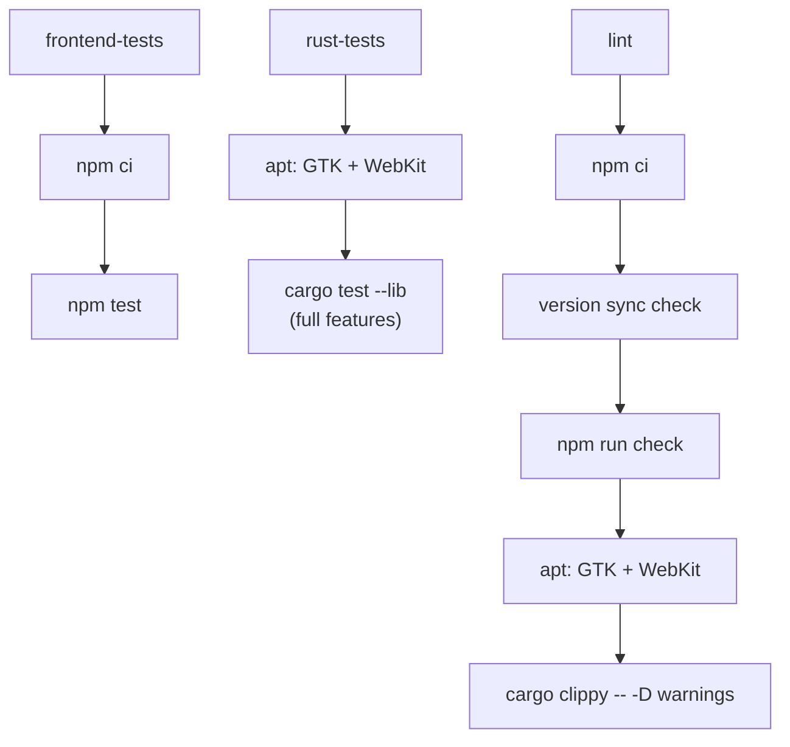

> [!abstract] In one sentence
> Every command needed to install, check, test, build and release SteloPTC — what each one actually
> verifies, why the two `cargo test` variants are not interchangeable, and the complete list of
> files a version bump has to touch together.

## The five gates, in the order to run them

All counts below were **measured on the repository at `v0.54.0`**, not copied from a document.

| # | Command | Where | Verifies | Result at `v0.54.0` |
|---|---|---|---|---|
| 1 | `npm test` | repo root | Vitest over `src/**/*.test.ts` — pure logic only, no components | **203 passing**, 8 files, ~2.4 s |
| 2 | `npm run check` | repo root | `svelte-check --tsconfig ./tsconfig.json` — TypeScript **and** Svelte template types | **424 files · 0 errors · 0 warnings** |
| 3 | `cargo test --lib --no-default-features` | `src-tauri/` | Every Rust test that compiles without GTK/WebKit | **708 passing**, ~57 s |
| 4 | `cargo test --lib` | `src-tauri/` | The above **plus** the 61 tests inside `commands/` | **769 passing**, ~57 s |
| 5 | `cargo clippy -- -D warnings` | `src-tauri/` | Lints as hard errors — this is a CI gate, not advice | clean |

`npm run build` (Vite production build) is a sixth gate in practice: a type error that
`svelte-check` tolerates can still break the bundle.

> [!danger] Gates 3 and 4 are not the same gate
> `src/commands/` is behind `#[cfg(feature = "tauri-commands")]`, which is **on by default but off
> under `--no-default-features`**. A type error in the entire 263-command layer is therefore
> invisible to gate 3.
> This is not theoretical. `v1.53.1` shipped with `master` red for six days because
> `commands/subcultures.rs:311` passed an `i32` where `signed_ledger::lifecycle::passage` wanted an
> `i64`. Every local gate a headless sandbox can run passed; every merge-gating workflow failed.
> **Run gate 4 before pushing anything under `src-tauri/src/commands/`.** `SKILLS.md` §3 carries the
> same standing rule.

The arithmetic is exact and worth knowing, because it is how you tell a broken build from a
mis-invoked one:

```
767  #[test] functions in src/
+ 2  #[tokio::test] in db/postgres.rs
———
769  cargo test --lib                        (default features)
- 61  #[test] functions in src/commands/
———
708  cargo test --lib --no-default-features
```

## Installing

```bash
npm install
```

> [!success] `--legacy-peer-deps` is no longer needed, as of `v0.54.0`
> `@sveltejs/vite-plugin-svelte@^4` peer-depends on Vite 5, and this project is on Vite 6, so a
> clean `npm install` used to fail outright and CI was papering over it with `--legacy-peer-deps`.
> `v0.54.0` upgraded the plugin to `^5`, which supports Vite 6 properly. `.github/workflows/test.yml`
> now runs a plain `npm ci`.
> **`README.md:190` still says `npm install --legacy-peer-deps`.** It is stale; the flag is harmless
> but unnecessary.

### Linux system packages

Only needed for the **full-feature** Rust build (gate 4), `cargo tauri dev` and `cargo tauri build`.
Gates 1–3 need none of them.

```bash
sudo apt-get install -y --no-install-recommends \
  libgtk-3-dev libwebkit2gtk-4.1-dev libayatana-appindicator3-dev \
  librsvg2-dev libssl-dev
```

`rusqlite` uses the **bundled** SQLite amalgamation, so there is no `libsqlite3-dev` in that list —
SQLite is compiled from source into the binary and the host's version is irrelevant.

```bash
pkg-config --exists gtk+-3.0 webkit2gtk-4.1 && echo "gate 4 will work"
```

## Running and building the app

| Command | What it does |
|---|---|
| `npm run dev` | Vite dev server alone on port **1420** (`strictPort: true`), browser only — no Rust, so every `invoke` fails |
| `npm run tauri dev` / `cargo tauri dev` | The real app. `beforeDevCommand` starts Vite, Tauri points the WebView at `http://localhost:1420` |
| `npm run build` | `vite build` → `dist/`. Emits a "chunks larger than 500 kB" warning; that is expected and not a failure |
| `cargo tauri build` | Production bundle. `beforeBuildCommand` runs `npm run build` first. Output lands in `src-tauri/target/release/bundle/` |
| `cargo tauri build --bundles msi` | Windows MSI + exe |
| `npm run android:dev` | `cargo tauri android dev` — HMR uses port 1421, and only when `TAURI_DEV_HOST` is set |
| `npm run android:build` | `cargo tauri android build --release` |
| `bash scripts/setup-android.sh [--build] [--release]` | Provisions the whole Android toolchain: Rust targets, JDK 17, SDK, NDK r27, `cargo-tauri`, `cargo tauri android init` |

```bash
cd src-tauri && cargo bench --bench performance   # Criterion, harness = false
```

Ten benchmarks (`list_specimens_10k`, `search_specimens_fts_100k`, `dashboard_aggregate_100k`,
`audit_chain_verify_10k`, …). They talk to `db::` directly and never touch the command layer, so
they build without GTK/WebKit. CI runs them with `--no-default-features`, `continue-on-error: true`,
and uploads `src-tauri/target/criterion` as a 90-day artifact. **There is no automated
regression threshold** — a maintainer compares artifacts by hand.

## What CI actually runs

`.github/workflows/test.yml` — three jobs, all merge gates, on push to `master` and `claude/**` and
on PRs to `master`.



The version-sync step is a shell block, not a script file, and it compares exactly three files:

```bash
VERSION_PKG=$(node -p "require('./package.json').version")
VERSION_TAURI=$(node -p "require('./src-tauri/tauri.conf.json').version")
VERSION_CARGO=$(grep '^version = ' src-tauri/Cargo.toml | head -1 | sed 's/version = "\(.*\)"/\1/')
```

> [!warning] The version gate checks three files out of the ~20 that carry a version
> `Cargo.lock`, `package-lock.json` and `gen/android/app/build.gradle.kts` all carry the version and
> none of them is checked. `package-lock.json` once lagged five releases behind (`1.48.0` while
> `1.53.1` shipped) with CI green throughout.

Other workflows: `build-windows.yml`, `build-android.yml`, `build-ios.yml` (scheduled),
`benchmarks.yml` (push to `master` only, non-blocking).

---

## The version-bump lockstep

Everything that must change together for one release. Items 1–6 are machine-readable and break the
build or an install if they disagree; 7 onward are documentation that silently rots.

### Manifests — these must match exactly

| # | File | Field | Trap |
|---|---|---|---|
| 1 | `package.json` | `.version` | Source of truth. Vite injects it as `__APP_VERSION__`, used only by `Sidebar.svelte` |
| 2 | `package-lock.json` | `.version` **and** `.packages[""].version` | ⚠️ Only refreshes on `npm install`. Not checked by CI |
| 3 | `src-tauri/Cargo.toml` | `[package] version` | Feeds `env!("CARGO_PKG_VERSION")` |
| 4 | `src-tauri/Cargo.lock` | `version` under `[[package]] name = "stelo-ptc"` | ⚠️ Only refreshes on a `cargo` invocation. Not checked by CI, and missing from `SKILLS.md` §10's own drift checklist |
| 5 | `src-tauri/tauri.conf.json` | `.version` **and** `.bundle.android.versionCode` | `autoIncrementVersionCode: false`, so `versionCode` is manual and **must only ever increase** — a decrease breaks upgrades for anyone already running a build |
| 6 | `src-tauri/gen/android/app/build.gradle.kts` | `versionName` **and** `versionCode` | A generated file that is nonetheless committed; must mirror #5 |

> [!example] The `v0.54.0` renumbering
> Everything through `1.53.2` shipped as a 1.x series. The project is pre-1.0 by the maintainer's
> judgement, so numbering continued at `0.54.0` — the minor number carries on from `1.53` unbroken
> and only the major drops. **The Android `versionCode` still went 28 → 29**, because it is
> independent of the version name and a decrease would be an upgrade-breaking change. Historical
> CHANGELOG entries keep the versions they actually shipped under.

### Documentation that carries live numbers

| File | What drifts |
|---|---|
| `README.md` | Version badge (`:9`), **test-count badge** (`:12`), and the same counts repeated in prose under *Testing & quality* (`~:278-281`) |
| `CHANGELOG.md` | New `## [X.Y.Z] - YYYY-MM-DD` entry at the top, plus the `**Current release:**` pointer in the header. Everything below is append-only and is never rewritten |
| `ROADMAP.md` | Header table (version, **schema/migration count**, **test counts**), *Status at a glance*, §10 *Versioning plan*, and the footer "Current release" paragraph |
| `UserManual.md` | The *Applies to* row, the TOC group-label version range, and §18 — features move from "planned" to "shipped" and the list is easy to forget |
| `SteloPTC.md` | Frontmatter (`version`, `tests_rust`, `tests_ts`, `migrations`, `updated`), *Quick facts*, and the release-timeline table |
| `SKILLS.md` | §2's migration count + "next is NNN", §3's test baseline, §8's open follow-ups |
| `docs/README.md` · `docs/*.md` | The spec index, and each spec's header table |
| `Obsidian/` | This vault: the `version:` frontmatter key and any measured count in a note |

`SKILLS.md` §10 ships three self-check commands for exactly this:

```bash
# 1. All four manifests carry the same version
grep -rn "$(node -p "require('./package.json').version")" package.json src-tauri/Cargo.toml \
  src-tauri/tauri.conf.json src-tauri/gen/android/app/build.gradle.kts

# 2. No stale test counts anywhere
grep -rnE "[0-9]{3} (Rust|pure-logic) tests?" README.md SKILLS.md SteloPTC.md ROADMAP.md

# 3. Every relative doc link still resolves
grep -rhoE "\]\([^)h#][^)]*\.md[^)]*\)" *.md docs/*.md | tr -d '])(' | cut -d'#' -f1 | sort -u
```

> [!warning] Documented counts are stale right now
> Measured at `v0.54.0`: `cargo test --lib` **769**, `--no-default-features` **708**, `npm test`
> **203**, `npm run check` **424 files**.
> `README.md:12` and `README.md:278-281` still say `679 Rust · 113 TS` / `642` — three releases
> behind. `SKILLS.md` §2 still says "52 migrations today; next is 053" when the head is **059**, and
> §3 still quotes `642 / 679 / 113`.
> `CHANGELOG.md`'s `[0.54.0]` entry says `cargo test --lib` is **766 passing**; the tree at that
> commit actually runs **769**. The changelog is append-only, so that line stays as shipped — but do
> not use it as a baseline.

> [!tip] Nothing in the app's own source hardcodes a version
> There is no version string in any Svelte component or TypeScript file — `Sidebar.svelte` reads the
> Vite-injected `__APP_VERSION__`. `index.html`, `public/`, the PWA manifest and every workflow file
> carry no app version. `build-android.yml` pins the **Tauri CLI** to `2.11.3`, which is unrelated.

## Quick copy-paste: the full local gate

```bash
# frontend
npm install
npm test && npm run check && npm run build

# backend — headless (fast, no system deps)
cd src-tauri
cargo test  --lib --no-default-features
cargo clippy --lib --no-default-features -- -D warnings

# backend — full (needs GTK/WebKit); required if you touched src/commands/
cargo test  --lib
cargo clippy -- -D warnings
```

**Back to [[Home]]**

#steloptc #reference #build #testing
