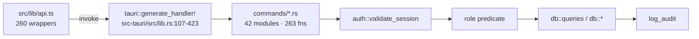

> [!abstract] In one sentence
> All **263** `#[tauri::command]` functions the backend registers in `src-tauri/src/lib.rs`, grouped
> by the 42 modules under `src-tauri/src/commands/`, each with its `src/lib/api.ts` wrapper, its
> parameters exactly as Rust declares them, its return type, and the role predicate that guards it.

## How to read these tables

Every command except `login` and `get_degraded_reason` takes `token: String` as its first real
parameter; it is omitted from the tables because it is universal and `api.ts` injects it for you
(see [[The IPC Seam]]). `state: State<AppState>` and `app: tauri::AppHandle` are Tauri injections
and never cross the wire.

**Returns** shows the `Ok` type. Every command's error type is `String` — the message *is* the UI
text, there is no error code ([[Failure Reference]]).

| Role column | Guard in the command body | Roles that pass |
|---|---|---|
| `admin` | `user.role.is_admin()` or `permissions::validate_admin_role` | Admin |
| `supervisor`+ | `user.role.can_manage()` | Admin, Supervisor |
| `tech`+ | `user.role.can_write()` | Admin, Supervisor, Tech |
| any | `auth::validate_session` only | Admin, Supervisor, Tech, Guest |

Distribution across the 263: **129** any · **54** `tech`+ · **52** `supervisor`+ · **26** `admin` ·
**2** unauthenticated. See [[Roles and Permissions]] for what the four roles mean.

> [!danger] The camelCase / snake_case boundary
> **Top-level command parameters** are declared `snake_case` in Rust and written **camelCase** in
> TypeScript — Tauri converts them. `per_page` → `perPage`, `params_input` → `paramsInput`,
> `data_b64` → `dataB64`, `op_return_hex` → `opReturnHex`, `config_json` → `configJson`.
> **Fields inside a struct payload get no conversion at all** — plain serde, and no
> `#[serde(rename_all)]` exists anywhere in `models/` except `UserRole` (`lowercase`). A
> `CreateSpecimenRequest` field is spelled `species_id` on both sides.
> The seven parameter names that carry a struct payload are `request`, `search`, `params_input`,
> `payload`, `config`, `record` and `scope`. Everything nested under those stays snake_case.

> [!warning] Three registered commands have no `api.ts` wrapper
> `store_qr_scan` is invoked directly by `src/lib/components/QrScanner.svelte:129` — the only
> business `invoke` outside `api.ts` — and it passes `token` by hand.
> `list_qr_scans` and `list_recent_notifications` have **no caller anywhere in `src/`**. They are
> reachable over IPC and do work, but nothing in the shipped UI calls them.

> [!note] Two commands sit outside the normal session gate
> `login` takes no token. `get_degraded_reason` takes **no token parameter at all** — deliberately,
> so the temporary-storage warning can reach a user before they log in. `get_current_user` and
> `change_password` use `validate_session_allow_password_change`, the only two commands permitted
> while `must_change_password` is set; everything else refuses with
> `"A password change is required before continuing."`

---

## The command tables

### `commands/auth.rs`

*Auth*

| Command | `api.ts` wrapper | Parameters (beyond `token`) | Returns | Role |
|---|---|---|---|---|
| `login` | `login` | `username: String` · `password: String` | `LoginResponse` | — *(unauthenticated)* |
| `get_current_user` | `getCurrentUser` | — | `UserPublic` | any |
| `list_users` | `listUsers` | — | `Vec<UserPublic>` | `supervisor`+ |
| `create_user` | `createUser` | `request: CreateUserRequest` | `UserPublic` | `admin` |
| `update_user_role` | `updateUserRole` | `user_id: String` · `new_role: String` | `()` | `admin` |
| `change_password` | `changePassword` | `new_password: String` · `current_password: Option<String>` | `()` | any |
| `logout` | `logout` | — | `()` | any |

### `commands/specimens.rs`

*Specimens*

| Command | `api.ts` wrapper | Parameters (beyond `token`) | Returns | Role |
|---|---|---|---|---|
| `list_specimens` | `listSpecimens` | `page: Option<u32>` · `per_page: Option<u32>` | `PaginatedResponse<Specimen>` | any |
| `get_specimen` | `getSpecimen` | `id: String` | `Specimen` | any |
| `create_specimen` | `createSpecimen` | `request: CreateSpecimenRequest` | `Specimen` | `tech`+ |
| `update_specimen` | `updateSpecimen` | `request: UpdateSpecimenRequest` | `Specimen` | `tech`+ |
| `delete_specimen` | `deleteSpecimen` | `id: String` | `()` | `supervisor`+ |
| `search_specimens` | `searchSpecimens` | `params_input: SpecimenSearchParams` | `PaginatedResponse<Specimen>` | any |
| `get_specimen_stats` | `getSpecimenStats` | — | `SpecimenStats` | any |
| `bulk_archive_specimens` | `bulkArchiveSpecimens` | `ids: Vec<String>` | `usize` | `supervisor`+ |
| `bulk_update_location` | `bulkUpdateLocation` | `ids: Vec<String>` · `location: String` | `usize` | `tech`+ |
| `bulk_update_stage` | `bulkUpdateStage` | `ids: Vec<String>` · `stage: String` | `usize` | `tech`+ |
| `split_specimen` | `splitSpecimen` | `request: SplitSpecimenRequest` | `SplitResult` | `tech`+ |
| `preview_split_accessions` | `previewSplitAccessions` | `parent_id: String` · `count: u32` | `Vec<String>` | any |
| `get_specimen_family` | `getSpecimenFamily` | `id: String` | `Vec<FamilyMember>` | any |

### `commands/media.rs`

*Media*

| Command | `api.ts` wrapper | Parameters (beyond `token`) | Returns | Role |
|---|---|---|---|---|
| `list_media` | `listMedia` | — | `Vec<MediaBatch>` | any |
| `get_media_batch` | `getMediaBatch` | `id: String` | `MediaBatch` | any |
| `create_media_batch` | `createMediaBatch` | `request: CreateMediaBatchRequest` | `MediaBatch` | `tech`+ |
| `create_draft_media_batch` | `createDraftMediaBatch` | `name: String` | `MediaBatch` | `tech`+ |
| `update_media_batch` | `updateMediaBatch` | `request: UpdateMediaBatchRequest` | `MediaBatch` | `tech`+ |
| `delete_media_batch` | `deleteMediaBatch` | `id: String` | `()` | `supervisor`+ |

### `commands/subcultures.rs`

*Subcultures · Cell-culture dashboard (WP-34) · WP-41: colonization history*

| Command | `api.ts` wrapper | Parameters (beyond `token`) | Returns | Role |
|---|---|---|---|---|
| `list_subcultures` | `listSubcultures` | `specimen_id: String` · `page: Option<u32>` · `per_page: Option<u32>` | `PaginatedResponse<Subculture>` | any |
| `list_all_subcultures` | `listAllSubcultures` | — | `Vec<Subculture>` | any |
| `create_subculture` | `createSubculture` | `request: CreateSubcultureRequest` | `Subculture` | `tech`+ |
| `record_specimen_death` | `recordSpecimenDeath` | `request: RecordSpecimenDeathRequest` | `Subculture` | `tech`+ |
| `update_subculture` | `updateSubculture` | `request: UpdateSubcultureRequest` | `()` | `tech`+ |
| `get_contamination_stats` | `getContaminationStats` | — | `ContaminationStats` | any |
| `get_subculture_schedule` | `getSubcultureSchedule` | — | `Vec<SubcultureScheduleEntry>` | any |
| `get_culture_maintenance_alerts` | `getCultureMaintenanceAlerts` | — | `Vec<CultureMaintenanceAlert>` | any |
| `get_colonization_history` | `getColonizationHistory` | `specimen_id: String` | `Vec<ColonizationEntry>` | any |

### `commands/reminders.rs`

*Reminders*

| Command | `api.ts` wrapper | Parameters (beyond `token`) | Returns | Role |
|---|---|---|---|---|
| `list_reminders` | `listReminders` | — | `Vec<Reminder>` | any |
| `create_reminder` | `createReminder` | `request: CreateReminderRequest` | `Reminder` | `tech`+ |
| `update_reminder` | `updateReminder` | `request: UpdateReminderRequest` | `()` | `tech`+ |
| `dismiss_reminder` | `dismissReminder` | `id: String` · `snooze: bool` · `snooze_days: Option<u32>` | `()` | any |
| `get_active_reminders` | `getActiveReminders` | — | `Vec<Reminder>` | any |

### `commands/compliance.rs`

*Compliance*

| Command | `api.ts` wrapper | Parameters (beyond `token`) | Returns | Role |
|---|---|---|---|---|
| `list_compliance_records` | `listComplianceRecords` | `specimen_id: Option<String>` · `page: Option<u32>` · `per_page: Option<u32>` | `PaginatedResponse<ComplianceRecord>` | any |
| `create_compliance_record` | `createComplianceRecord` | `request: CreateComplianceRequest` | `ComplianceRecord` | `tech`+ |
| `update_compliance_record` | `updateComplianceRecord` | `request: UpdateComplianceRequest` | `()` | `tech`+ |
| `get_compliance_flags` | `getComplianceFlags` | — | `Vec<ComplianceFlag>` | any |
| `list_compliance_rules` | `listComplianceRules` | — | `Vec<ActiveComplianceRule>` | any |
| `waive_compliance_flag` | `waiveComplianceFlag` | `flag_type: String` · `specimen_id: String` · `reason: String` · `expires_at: Option<String>` | `()` | `tech`+ |
| `list_compliance_waivers` | `listComplianceWaivers` | — | `Vec<ComplianceWaiver>` | any |
| `revoke_compliance_waiver` | `revokeComplianceWaiver` | `waiver_id: String` | `()` | `tech`+ |
| `get_mycoplasma_status` | `getMycoplasmaStatus` | — | `Vec<MycoplasmaStatus>` | any |

### `commands/species.rs`

*Species*

| Command | `api.ts` wrapper | Parameters (beyond `token`) | Returns | Role |
|---|---|---|---|---|
| `list_species` | `listSpecies` | — | `Vec<Species>` | any |
| `create_species` | `createSpecies` | `request: CreateSpeciesRequest` | `Species` | `supervisor`+ |
| `update_species` | `updateSpecies` | `request: UpdateSpeciesRequest` | `()` | `supervisor`+ |
| `rebuild_species_taxonomy` | `rebuildSpeciesTaxonomy` | — | `RebuildTaxonomyResult` | `supervisor`+ |
| `list_projects` | `listProjects` | — | `Vec<Project>` | any |

### `commands/audit.rs`

*Audit · WP-63: cursor-based per-lineage audit pagination · WP-21 — proof export, standalone verification, auto-checkpointing*

| Command | `api.ts` wrapper | Parameters (beyond `token`) | Returns | Role |
|---|---|---|---|---|
| `get_audit_log` | `getAuditLog` | `search: AuditSearchParams` | `PaginatedResponse<AuditEntry>` | `supervisor`+ |
| `verify_audit_entry` | `verifyAuditEntry` | `entry_id: String` | `VerifyEntryResult` | any |
| `verify_audit_lineage` | `verifyAuditLineage` | `lineage_id: String` | `VerifyChainResult` | any |
| `create_audit_checkpoint` | `createAuditCheckpoint` | `lineage_id: String` · `start_seq: Option<i64>` · `end_seq: Option<i64>` | `CreateCheckpointResult` | `supervisor`+ |
| `verify_against_checkpoint` | `verifyAgainstCheckpoint` | `checkpoint_id: String` | `VerifyCheckpointResult` | any |
| `list_audit_checkpoints` | `listAuditCheckpoints` | `lineage_id: Option<String>` | `Vec<AuditCheckpoint>` | any |
| `list_audit_entries_cursor` | `listAuditEntriesCursor` | `lineage_id: String` · `after_seq: Option<i64>` · `limit: i64` | `queries::CursorPage<AuditEntry>` | `supervisor`+ |
| `export_audit_proof` | `exportAuditProof` | `checkpoint_id: String` | `String` | any |
| `verify_exported_proof` | `verifyExportedProof` | `proof_json: String` | `VerifyProofResult` | any |
| `get_auto_checkpoint_config` | `getAutoCheckpointConfig` | — | `AutoCheckpointConfig` | any |
| `set_auto_checkpoint_config` | `setAutoCheckpointConfig` | `config: AutoCheckpointConfig` | `()` | `supervisor`+ |
| `run_auto_checkpoint` | `runAutoCheckpoint` | — | `AutoCheckpointResult` | `supervisor`+ |

### `commands/export.rs`

*Export/Import*

| Command | `api.ts` wrapper | Parameters (beyond `token`) | Returns | Role |
|---|---|---|---|---|
| `export_specimens_csv` | `exportSpecimensCsv` | — | `String` | any |
| `export_specimens_json` | `exportSpecimensJson` | — | `String` | any |

### `commands/import.rs`

*Export/Import*

| Command | `api.ts` wrapper | Parameters (beyond `token`) | Returns | Role |
|---|---|---|---|---|
| `import_xlsx` | `importXlsx` | `payload: ImportPayload` · `dry_run: bool` | `ImportResult` | `tech`+ |

### `commands/inventory.rs`

*Inventory · Prepared Solutions*

| Command | `api.ts` wrapper | Parameters (beyond `token`) | Returns | Role |
|---|---|---|---|---|
| `list_inventory` | `listInventory` | — | `Vec<InventoryItem>` | any |
| `create_inventory_item` | `createInventoryItem` | `request: CreateInventoryItemRequest` | `InventoryItem` | `tech`+ |
| `update_inventory_item` | `updateInventoryItem` | `request: UpdateInventoryItemRequest` | `InventoryItem` | `tech`+ |
| `delete_inventory_item` | `deleteInventoryItem` | `id: String` | `()` | `supervisor`+ |
| `adjust_stock` | `adjustStock` | `id: String` · `adjustment: f64` · `reason: Option<String>` | `InventoryItem` | `tech`+ |
| `get_low_stock_alerts` | `getLowStockAlerts` | — | `Vec<LowStockAlert>` | any |
| `list_prepared_solutions` | `listPreparedSolutions` | — | `Vec<PreparedSolution>` | any |
| `create_prepared_solution` | `createPreparedSolution` | `request: CreatePreparedSolutionRequest` | `PreparedSolution` | `tech`+ |
| `update_prepared_solution` | `updatePreparedSolution` | `request: UpdatePreparedSolutionRequest` | `()` | `tech`+ |
| `delete_prepared_solution` | `deletePreparedSolution` | `id: String` | `()` | `supervisor`+ |

### `commands/backup.rs`

*Backup*

| Command | `api.ts` wrapper | Parameters (beyond `token`) | Returns | Role |
|---|---|---|---|---|
| `create_backup` | `createBackup` | `destination: Option<String>` | `String` | `supervisor`+ |
| `list_backups` | `listBackups` | — | `Vec<BackupInfo>` | any |
| `restore_backup` | `restoreBackup` | `backup_path: String` | `String` | `admin` |

### `commands/admin.rs`

*Admin tools*

| Command | `api.ts` wrapper | Parameters (beyond `token`) | Returns | Role |
|---|---|---|---|---|
| `reset_database` | `resetDatabase` | `confirmation: String` | `String` | `admin` |
| `load_demo_data` | `loadDemoData` | — | `String` | `supervisor`+ |
| `get_degraded_reason` | `getDegradedReason` | — | `Option<String` | — *(no token param)* |
| `get_lab_profile` | `getLabProfile` | — | `String` | any |
| `set_lab_profile` | `setLabProfile` | `profile: String` · `confirmation: Option<String>` | `()` | `admin` |

### `commands/vocabulary.rs`

*Vocabulary lookups (WP-23 / WP-24)*

| Command | `api.ts` wrapper | Parameters (beyond `token`) | Returns | Role |
|---|---|---|---|---|
| `list_stages` | `listStages` | — | `Vec<StageEntry>` | any |
| `list_propagation_methods` | `listPropagationMethods` | — | `Vec<VocabEntry>` | any |
| `list_hormone_types` | `listHormoneTypes` | — | `Vec<VocabEntry>` | any |
| `list_compliance_record_types` | `listComplianceRecordTypes` | — | `Vec<VocabEntry>` | any |
| `list_compliance_agencies` | `listComplianceAgencies` | — | `Vec<VocabEntry>` | any |
| `list_inventory_categories` | `listInventoryCategories` | — | `Vec<VocabEntry>` | any |

### `commands/strains.rs`

*Strains (WP-28) · Hybridization tools (WP-38) · Pedigree (WP-37) · WP-63: configurable pedigree depth cap*

| Command | `api.ts` wrapper | Parameters (beyond `token`) | Returns | Role |
|---|---|---|---|---|
| `create_strain` | `createStrain` | `request: CreateStrainRequest` | `Strain` | `tech`+ |
| `get_strain` | `getStrain` | `id: String` | `Strain` | any |
| `list_strains_by_species` | `listStrainsBySpecies` | `species_id: String` | `Vec<Strain>` | any |
| `update_strain` | `updateStrain` | `request: UpdateStrainRequest` | `Strain` | `tech`+ |
| `archive_strain` | `archiveStrain` | `id: String` | `()` | `tech`+ |
| `update_strain_status` | `updateStrainStatus` | `request: UpdateStrainStatusRequest` | `Strain` | `tech`+ |
| `create_hybridization_event` | `createHybridizationEvent` | `request: CreateHybridizationEventRequest` | `HybridizationResult` | `tech`+ |
| `suggest_generation_label` | `suggestGenerationLabel` | `parent_a_id: String` · `parent_b_id: String` | `SuggestGenerationLabelResponse` | any |
| `get_generational_stats` | `getGenerationalStats` | `strain_id: String` | `Vec<GenerationalStats>` | any |
| `get_strain_ancestry` | `getStrainAncestry` | `strain_id: String` · `max_depth: Option<u32>` | `PedigreeNode` | any |
| `get_strain_descendants` | `getStrainDescendants` | `strain_id: String` · `max_depth: Option<u32>` | `PedigreeNode` | any |
| `get_strain_specimen_tree` | `getStrainSpecimenTree` | `strain_id: String` · `include_descendants: bool` | `StrainSpecimenTree` | any |
| `export_strain_pedigree` | `exportStrainPedigree` | `strain_id: String` · `max_depth: Option<u32>` | `PedigreeExport` | any |
| `get_pedigree_max_depth` | `getPedigreeMaxDepth` | — | `u32` | any |
| `set_pedigree_max_depth` | `setPedigreeMaxDepth` | `max_depth: u32` | `u32` | `admin` |

### `commands/taxa.rs`

*Taxa (WP-35) · Advanced taxonomy navigator (WP-39) · Provisional taxa & Darwin Core export (WP-49) · Taxon chain re-anchoring (WP-64)*

| Command | `api.ts` wrapper | Parameters (beyond `token`) | Returns | Role |
|---|---|---|---|---|
| `create_taxon` | `createTaxon` | `request: CreateTaxonRequest` | `Taxon` | `supervisor`+ |
| `get_taxon` | `getTaxon` | `id: String` | `Taxon` | any |
| `update_taxon` | `updateTaxon` | `request: UpdateTaxonRequest` | `()` | `supervisor`+ |
| `list_taxa_by_rank` | `listTaxaByRank` | `rank: String` | `Vec<Taxon>` | any |
| `get_taxon_descendants` | `getTaxonDescendants` | `id: String` | `TaxonNode` | any |
| `get_taxon_column` | `getTaxonColumn` | `parent_id: Option<String>` | `Vec<TaxonColumnItem>` | any |
| `list_species_for_taxon` | `listSpeciesForTaxon` | `taxon_id: String` | `Vec<SpeciesNodeSummary>` | any |
| `locate_species` | `locateSpecies` | `species_id: String` | `Option<TaxonomySearchResult>` | any |
| `search_taxonomy` | `searchTaxonomy` | `query: String` | `Vec<TaxonomySearchResult>` | any |
| `create_provisional_taxon` | `createProvisionalTaxon` | `request: CreateProvisionalTaxonRequest` | `Taxon` | `supervisor`+ |
| `list_provisional_taxa` | `listProvisionalTaxa` | — | `Vec<Taxon>` | any |
| `map_provisional_taxon` | `mapProvisionalTaxon` | `request: CreateTaxonMappingRequest` | `TaxonMapping` | `supervisor`+ |
| `list_taxon_mappings` | `listTaxonMappings` | — | `Vec<TaxonMapping>` | any |
| `export_darwin_core` | `exportDarwinCore` | `root_id: Option<String>` | `DarwinCoreExport` | any |
| `reanchor_taxon_chain_dry_run` | `reanchorTaxonChainDryRun` | `taxon_id: String` | `queries::ReanchorCounts` | `supervisor`+ |
| `reanchor_taxon_chain` | `reanchorTaxonChain` | `taxon_id: String` · `reason: String` | `queries::ReanchorResult` | `admin` |

### `commands/ncbi.rs`

*NCBI Taxonomy (WP-36)*

| Command | `api.ts` wrapper | Parameters (beyond `token`) | Returns | Role |
|---|---|---|---|---|
| `import_ncbi_taxonomy` | `importNcbiTaxonomy` | `request: ImportNcbiTaxonomyRequest` | `ImportNcbiTaxonomyResult` | `admin` |
| `resolve_ncbi_conflict` | `resolveNcbiConflict` | `request: ResolveNcbiConflictRequest` | `()` | `admin` |
| `sync_ncbi_taxon` | `syncNcbiTaxon` | `record: NcbiTaxonRecord` | `String` | `admin` |
| `list_ncbi_sync_log` | `listNcbiSyncLog` | `pending_only: bool` · `limit: Option<i64>` | `Vec<NcbiSyncLog>` | any |

### `commands/error_logs.rs`

*Error Logs*

| Command | `api.ts` wrapper | Parameters (beyond `token`) | Returns | Role |
|---|---|---|---|---|
| `log_error` | `logError` | `request: CreateErrorLogRequest` | `ErrorLog` | any |
| `list_error_logs` | `listErrorLogs` | `search: ErrorLogSearchParams` | `PaginatedResponse<ErrorLog>` | any |
| `get_unread_error_count` | `getUnreadErrorCount` | — | `i64` | any |
| `mark_errors_read` | `markErrorsRead` | — | `()` | any |
| `clear_error_logs` | `clearErrorLogs` | — | `()` | `supervisor`+ |

### `commands/cryo.rs`

*Cryopreservation (WP-32)*

| Command | `api.ts` wrapper | Parameters (beyond `token`) | Returns | Role |
|---|---|---|---|---|
| `create_frozen_vial` | `createFrozenVial` | `request: CreateFrozenVialRequest` | `FrozenVial` | `tech`+ |
| `list_frozen_vials` | `listFrozenVials` | `params: Option<ListFrozenVialsParams>` | `Vec<FrozenVial>` | any |
| `get_frozen_vial` | `getFrozenVial` | `id: String` | `FrozenVial` | any |
| `thaw_vial` | `thawVial` | `request: ThawVialRequest` | `ThawVialResult` | `tech`+ |
| `discard_frozen_vial` | `discardFrozenVial` | `request: DiscardFrozenVialRequest` | `FrozenVial` | `tech`+ |
| `get_vial_summary_by_line` | `getVialSummaryByLine` | — | `Vec<VialLineSummary>` | any |

### `commands/qr_scans.rs`

*QR Scans*

| Command | `api.ts` wrapper | Parameters (beyond `token`) | Returns | Role |
|---|---|---|---|---|
| `store_qr_scan` | **none** | `raw_data: String` · `accession_number: Option<String>` | `()` | any |
| `list_qr_scans` | **none** | — | `Vec<QrScan>` | any |

### `commands/attachments.rs`

*Attachments*

| Command | `api.ts` wrapper | Parameters (beyond `token`) | Returns | Role |
|---|---|---|---|---|
| `list_attachments` | `listAttachments` | `entity_type: String` · `entity_id: String` | `Vec<AttachmentMeta>` | any |
| `upload_attachment` | `uploadAttachment` | `entity_type: String` · `entity_id: String` · `file_name: String` · `mime_type: String` · `data_b64: String` · `description: Option<String>` | `AttachmentMeta` | `tech`+ |
| `get_attachment_data` | `getAttachmentData` | `id: String` | `String` | any |
| `delete_attachment` | `deleteAttachment` | `id: String` | `()` | `tech`+ |

### `commands/work_queue.rs`

*Work Queue*

| Command | `api.ts` wrapper | Parameters (beyond `token`) | Returns | Role |
|---|---|---|---|---|
| `get_work_queue` | `getWorkQueue` | — | `Vec<WorkQueueItem>` | any |

### `commands/fruiting.rs`

*Fruiting records (WP-43)*

| Command | `api.ts` wrapper | Parameters (beyond `token`) | Returns | Role |
|---|---|---|---|---|
| `create_fruiting_record` | `createFruitingRecord` | `request: CreateFruitingRecordRequest` | `FruitingRecord` | `tech`+ |
| `list_fruiting_records` | `listFruitingRecords` | `specimen_id: String` | `Vec<FruitingRecord>` | any |
| `list_all_fruiting_records` | `listAllFruitingRecords` | — | `Vec<FruitingRecordWithSpecimen>` | any |

### `commands/breeding.rs`

*Breeding programs (WP-47)*

| Command | `api.ts` wrapper | Parameters (beyond `token`) | Returns | Role |
|---|---|---|---|---|
| `create_breeding_program` | `createBreedingProgram` | `request: CreateBreedingProgramRequest` | `BreedingProgram` | `tech`+ |
| `list_breeding_programs` | `listBreedingPrograms` | — | `Vec<BreedingProgram>` | any |
| `get_breeding_program` | `getBreedingProgram` | `id: String` | `BreedingProgram` | any |
| `add_breeding_record` | `addBreedingRecord` | `request: CreateBreedingRecordRequest` | `BreedingRecord` | `tech`+ |
| `list_breeding_records_for_program` | `listBreedingRecordsForProgram` | `program_id: String` | `Vec<BreedingRecord>` | any |
| `list_breeding_records_for_strain` | `listBreedingRecordsForStrain` | `strain_id: String` | `Vec<BreedingRecord>` | any |
| `get_generational_summary` | `getGenerationalSummary` | `program_id: String` | `Vec<GenerationalSummary>` | any |

### `commands/backend_config.rs`

*Backend configuration (WP-50)*

| Command | `api.ts` wrapper | Parameters (beyond `token`) | Returns | Role |
|---|---|---|---|---|
| `get_backend_config` | `getBackendConfig` | — | `BackendConfigInfo` | any |
| `set_backend_type` | `setBackendType` | `backend_type: String` · `connection_string: Option<String>` | `()` | `admin` |
| `test_postgres_connection` | `testPostgresConnection` | `connection_string: String` | `String` | `admin` |
| `bootstrap_postgres_schema` | `bootstrapPostgresSchema` | `connection_string: String` | `Vec<String>` | `admin` |

### `commands/sync.rs`

*LAN sync foundation (WP-51)*

| Command | `api.ts` wrapper | Parameters (beyond `token`) | Returns | Role |
|---|---|---|---|---|
| `get_sync_status` | `getSyncStatus` | — | `SyncStatusResponse` | any |
| `get_changes_since_cursor` | `getChangesSinceCursor` | `cursors: Vec<SyncCursor>` · `limit: Option<i64>` | `ChangeSetResponse` | `supervisor`+ |
| `apply_incoming_changes` | `applyIncomingChanges` | `request: ApplyChangesRequest` | `ApplyChangesResult` | `admin` |
| `list_sync_conflicts` | `listSyncConflicts` | `unresolved_only: Option<bool>` | `Vec<SyncConflict>` | `supervisor`+ |
| `resolve_sync_conflict` | `resolveSyncConflict` | `conflict_id: String` · `resolution_note: String` | `()` | `admin` |
| `register_sync_peer` | `registerSyncPeer` | `device_id: String` · `device_name: String` | `String` | `admin` |
| `list_sync_peers` | `listSyncPeers` | — | `Vec<SyncPeer>` | `supervisor`+ |

### `commands/permissions.rs`

*Field-level permissions (WP-55)*

| Command | `api.ts` wrapper | Parameters (beyond `token`) | Returns | Role |
|---|---|---|---|---|
| `list_field_permissions` | `listFieldPermissions` | — | `Vec<FieldPermission>` | `admin` |
| `set_field_permission` | `setFieldPermission` | `request: SetFieldPermissionRequest` | `()` | `admin` |

### `commands/sensors.rs`

*Environmental sensor integration (WP-54)*

| Command | `api.ts` wrapper | Parameters (beyond `token`) | Returns | Role |
|---|---|---|---|---|
| `create_environmental_reading` | `createEnvironmentalReading` | `request: CreateEnvironmentalReadingRequest` | `String` | `tech`+ |
| `ingest_sensor_payload` | `ingestSensorPayload` | `specimen_id: Option<String>` · `subculture_id: Option<String>` · `source: String` · `raw_payload: String` | `Vec<String>` | `tech`+ |
| `list_environmental_readings` | `listEnvironmentalReadings` | `specimen_id: String` · `limit: Option<i64>` | `Vec<EnvironmentalReading>` | any |
| `get_environmental_alerts` | `getEnvironmentalAlerts` | — | `Vec<EnvironmentalAlert>` | any |

### `commands/notifications.rs`

*Notifications (WP-52)*

| Command | `api.ts` wrapper | Parameters (beyond `token`) | Returns | Role |
|---|---|---|---|---|
| `get_notification_preferences` | `getNotificationPreferences` | — | `Vec<NotificationPreference>` | any |
| `set_notification_preference` | `setNotificationPreference` | `request: SetNotificationPreferenceRequest` | `()` | any |
| `get_smtp_config` | `getSmtpConfig` | — | `SmtpConfig` | `admin` |
| `set_smtp_config` | `setSmtpConfig` | `request: SetSmtpConfigRequest` | `()` | `admin` |
| `send_test_desktop_notification` | `sendTestDesktopNotification` | — | `()` | any |
| `send_test_email` | `sendTestEmail` | `to_address: String` | `()` | `admin` |
| `list_recent_notifications` | **none** | `limit: Option<i64>` | `Vec<crate::models::audit::AuditEntry>` | `supervisor`+ |
| `dispatch_due_notifications_now` | `dispatchDueNotificationsNow` | — | `DispatchNotificationsResult` | `supervisor`+ |

### `commands/analytics.rs`

*Analytics & reporting dashboards (WP-58)*

| Command | `api.ts` wrapper | Parameters (beyond `token`) | Returns | Role |
|---|---|---|---|---|
| `get_specimen_growth_rate` | `getSpecimenGrowthRate` | `time_range: String` | `Vec<analytics::TimeSeriesPoint>` | any |
| `get_subculture_frequency_trend` | `getSubcultureFrequencyTrend` | `time_range: String` · `species_id: Option<String>` | `Vec<analytics::TimeSeriesPoint>` | any |
| `get_contamination_rate_trend` | `getContaminationRateTrend` | `time_range: String` | `Vec<analytics::TimeSeriesPoint>` | any |
| `get_passage_success_rate` | `getPassageSuccessRate` | `time_range: String` | `analytics::PassageSuccessRate` | any |
| `get_media_batch_efficiency` | `getMediaBatchEfficiency` | `time_range: String` | `Vec<analytics::MediaBatchEfficiency>` | any |
| `get_strain_performance` | `getStrainPerformance` | `species_id: String` | `Vec<analytics::StrainPerformance>` | any |
| `get_cryo_utilization` | `getCryoUtilization` | — | `Vec<analytics::CryoUtilization>` | any |
| `get_technician_activity` | `getTechnicianActivity` | `time_range: String` | `Vec<analytics::TechnicianActivity>` | `supervisor`+ |
| `get_analytics_kpi_summary` | `getAnalyticsKpiSummary` | — | `AnalyticsKpiSummary` | any |
| `get_analytics_panel_config` | `getAnalyticsPanelConfig` | — | `String` | any |
| `set_analytics_panel_config` | `setAnalyticsPanelConfig` | `config_json: String` | `()` | `supervisor`+ |

### `commands/locations.rs`

*Interactive lab map (WP-57)*

| Command | `api.ts` wrapper | Parameters (beyond `token`) | Returns | Role |
|---|---|---|---|---|
| `list_locations` | `listLocations` | — | `Vec<Location>` | any |
| `get_location` | `getLocation` | `id: String` | `Location` | any |
| `create_location` | `createLocation` | `request: CreateLocationRequest` | `Location` | `tech`+ |
| `update_location` | `updateLocation` | `request: UpdateLocationRequest` | `Location` | `tech`+ |
| `delete_location` | `deleteLocation` | `id: String` | `()` | `supervisor`+ |
| `set_specimen_location_pin` | `setSpecimenLocationPin` | `specimen_id: String` · `location_id: Option<String>` | `()` | `tech`+ |
| `get_location_map_data` | `getLocationMapData` | — | `Vec<LocationMapPoint>` | any |
| `save_location_layout` | `saveLocationLayout` | `location_id: String` · `layout_json: Option<String>` | `()` | `tech`+ |
| `get_location_occupancy` | `getLocationOccupancy` | — | `Vec<LocationOccupancy>` | any |

### `commands/ai.rs`

*Local AI analysis (WP-56, WP-56b)*

| Command | `api.ts` wrapper | Parameters (beyond `token`) | Returns | Role |
|---|---|---|---|---|
| `get_ai_config` | `getAiConfig` | — | `AiConfigResponse` | any |
| `set_ai_config` | `setAiConfig` | `provider: String` · `base_url: String` · `text_model: String` · `vision_model: String` | `()` | `supervisor`+ |
| `get_ai_status` | `getAiStatus` | — | `AiStatusResponse` | any |
| `summarize_notes` | `summarizeNotes` | `request: SummarizeNotesRequest` | `AiSuggestion` | `tech`+ |
| `suggest_passage_comment` | `suggestPassageComment` | `specimen_id: String` | `AiSuggestion` | `tech`+ |
| `analyze_photo_for_contamination` | `analyzePhotoForContamination` | `request: AnalyzePhotoRequest` | `AiSuggestion` | `tech`+ |
| `list_ai_suggestions` | `listAiSuggestions` | `entity_type: String` · `entity_id: String` | `Vec<AiSuggestion>` | any |
| `approve_ai_suggestion` | `approveAiSuggestion` | `suggestion_id: String` | `()` | `tech`+ |
| `reject_ai_suggestion` | `rejectAiSuggestion` | `suggestion_id: String` | `()` | `tech`+ |

### `commands/cloud_backup.rs`

*Cloud backup & multi-device sync (WP-59)*

| Command | `api.ts` wrapper | Parameters (beyond `token`) | Returns | Role |
|---|---|---|---|---|
| `list_backup_targets` | `listBackupTargets` | — | `Vec<BackupTargetSummary>` | `supervisor`+ |
| `create_backup_target` | `createBackupTarget` | `name: String` · `target_type: String` · `passphrase: String` · `bucket_or_path: String` · `endpoint: Option<String>` · `access_key: Option<String>` · `secret_key: Option<String>` · `schedule_cron: Option<String>` | `BackupTargetSummary` | `supervisor`+ |
| `delete_backup_target` | `deleteBackupTarget` | `id: String` | `()` | `supervisor`+ |
| `cloud_backup` | `cloudBackup` | `target_id: String` · `passphrase: String` | `CloudBackupResult` | `supervisor`+ |
| `restore_from_cloud` | `restoreFromCloud` | `target_id: String` · `passphrase: String` · `backup_file_name: String` | `String` | `admin` |
| `reconcile_cloud_sync` | `reconcileCloudSync` | `target_id: String` · `passphrase: String` · `device_id: String` | `ReconcileSummary` | `supervisor`+ |

### `commands/compliance_export.rs`

*Regulatory compliance export modules (WP-60)*

| Command | `api.ts` wrapper | Parameters (beyond `token`) | Returns | Role |
|---|---|---|---|---|
| `get_signing_public_key` | `getSigningPublicKey` | — | `String` | `supervisor`+ |
| `export_fda_part11_bundle` | `exportFdaPart11Bundle` | `from_date: String` · `to_date: String` · `lab_name: String` | `ComplianceExportResult` | `supervisor`+ |
| `export_usda_permit` | `exportUsdaPermit` | `specimen_ids: Vec<String>` · `authorized_scientist: String` | `ComplianceExportResult` | `supervisor`+ |
| `export_cites_dossier` | `exportCitesDossier` | `root_specimen_id: String` · `cites_appendix: String` | `ComplianceExportResult` | `supervisor`+ |

### `commands/plugins.rs`

*Plugin / extension system (WP-61)*

| Command | `api.ts` wrapper | Parameters (beyond `token`) | Returns | Role |
|---|---|---|---|---|
| `list_installed_plugins` | `listInstalledPlugins` | — | `Vec<InstalledPlugin>` | any |
| `validate_plugin_manifest` | `validatePluginManifest` | `manifest_json: String` | `manifest::PluginManifest` | any |
| `install_plugin` | `installPlugin` | `manifest_json: String` | `InstalledPlugin` | `admin` |
| `install_plugin_from_zip` | `installPluginFromZip` | `zip_b64: String` | `InstalledPlugin` | `admin` |
| `uninstall_plugin` | `uninstallPlugin` | `plugin_id: String` | `()` | `admin` |

### `commands/anchoring.rs`

*On-chain anchoring — Trust Layer Phase 2 (WP-66)*

| Command | `api.ts` wrapper | Parameters (beyond `token`) | Returns | Role |
|---|---|---|---|---|
| `preview_checkpoint_anchor_payload` | `previewCheckpointAnchorPayload` | `checkpoint_id: String` · `chain_name: Option<String>` | `AnchorPayloadPreview` | `supervisor`+ |
| `prepare_checkpoint_anchor` | `prepareCheckpointAnchor` | `checkpoint_id: String` · `chain_name: Option<String>` | `store::CheckpointAnchor` | `supervisor`+ |
| `record_checkpoint_anchor` | `recordCheckpointAnchor` | `anchor_id: String` · `txid: String` | `store::CheckpointAnchor` | `supervisor`+ |
| `verify_checkpoint_anchor` | `verifyCheckpointAnchor` | `anchor_id: String` · `op_return_hex: String` | `store::AnchorVerifyResult` | `supervisor`+ |
| `list_checkpoint_anchors` | `listCheckpointAnchors` | `checkpoint_id: Option<String>` | `Vec<store::CheckpointAnchor>` | any |

### `commands/signed_events.rs`

*Signed-event ledger — Trust Layer Phase 3 (WP-67)*

| Command | `api.ts` wrapper | Parameters (beyond `token`) | Returns | Role |
|---|---|---|---|---|
| `get_user_signing_public_key` | `getUserSigningPublicKey` | — | `String` | any |
| `record_signed_event` | `recordSignedEvent` | `event_type: String` · `entity_type: String` · `entity_id: Option<String>` · `payload: String` | `signed_ledger::SignedEvent` | `tech`+ |
| `list_signed_events` | `listSignedEvents` | `entity_id: Option<String>` · `limit: Option<i64>` | `Vec<signed_ledger::SignedEvent>` | any |
| `verify_signed_event_ledger` | `verifySignedEventLedger` | — | `signed_ledger::LedgerVerification` | any |

### `commands/reg_submission.rs`

*Regulatory submission pipeline (WP-68)*

| Command | `api.ts` wrapper | Parameters (beyond `token`) | Returns | Role |
|---|---|---|---|---|
| `evaluate_submission_readiness` | `evaluateSubmissionReadiness` | `kind: String` · `scope: serde_json::Value` | `reg_submission::Readiness` | `supervisor`+ |
| `create_submission` | `createSubmission` | `kind: String` · `title: String` · `scope: serde_json::Value` · `auto_generate: Option<bool>` | `reg_submission::Submission` | `supervisor`+ |
| `reevaluate_submission` | `reevaluateSubmission` | `submission_id: String` | `reg_submission::Submission` | `supervisor`+ |
| `generate_submission_package` | `generateSubmissionPackage` | `submission_id: String` | `reg_submission::Submission` | `supervisor`+ |
| `mark_submission_submitted` | `markSubmissionSubmitted` | `submission_id: String` · `reference: String` | `reg_submission::Submission` | `supervisor`+ |
| `list_submissions` | `listSubmissions` | — | `Vec<reg_submission::Submission>` | `supervisor`+ |
| `run_submission_monitor` | `runSubmissionMonitor` | — | `MonitorResult` | `supervisor`+ |

### `commands/passport.rs`

*Specimen passports — federated inter-lab transfer (WP-70)*

| Command | `api.ts` wrapper | Parameters (beyond `token`) | Returns | Role |
|---|---|---|---|---|
| `get_lab_identity` | `getLabIdentity` | — | `IssuerIdentity` | any |
| `set_lab_name` | `setLabName` | `name: String` | `()` | `supervisor`+ |
| `issue_specimen_passport` | `issueSpecimenPassport` | `specimen_id: String` | `SpecimenPassport` | `tech`+ |
| `verify_specimen_passport` | `verifySpecimenPassport` | `passport_json: String` | `PassportVerification` | any |
| `import_specimen_passport` | `importSpecimenPassport` | `passport_json: String` | `store::ImportPassportResult` | `tech`+ |
| `list_specimen_passports` | `listSpecimenPassports` | `direction: Option<String>` | `Vec<store::PassportRecord>` | any |
| `get_specimen_passport_json` | `getSpecimenPassportJson` | `row_id: String` | `String` | any |

### `commands/registry.rs`

*Shared taxonomy registry — federated reference-data exchange (WP-71)*

| Command | `api.ts` wrapper | Parameters (beyond `token`) | Returns | Role |
|---|---|---|---|---|
| `export_taxonomy_registry` | `exportTaxonomyRegistry` | — | `TaxonomyRegistry` | `tech`+ |
| `verify_taxonomy_registry` | `verifyTaxonomyRegistry` | `registry_json: String` | `RegistryVerification` | any |
| `preview_taxonomy_registry_import` | `previewTaxonomyRegistryImport` | `registry_json: String` | `store::RegistryImportPreview` | any |
| `import_taxonomy_registry` | `importTaxonomyRegistry` | `registry_json: String` · `decisions: Option<Vec<RecordDecision>>` | `store::RegistryImportResult` | `tech`+ |
| `list_taxonomy_registries` | `listTaxonomyRegistries` | `direction: Option<String>` | `Vec<store::RegistryRecordRow>` | any |
| `get_taxonomy_registry_json` | `getTaxonomyRegistryJson` | `row_id: String` | `String` | any |
| `list_registry_dispositions` | `listRegistryDispositions` | `registry_row_id: String` | `Vec<store::AppliedRecord>` | any |

### `commands/coordination.rs`

*Cross-lab breeding program coordination (WP-72)*

| Command | `api.ts` wrapper | Parameters (beyond `token`) | Returns | Role |
|---|---|---|---|---|
| `export_coordination_bundle` | `exportCoordinationBundle` | `program_id: String` | `CoordinationBundle` | `tech`+ |
| `verify_coordination_bundle` | `verifyCoordinationBundle` | `bundle_json: String` | `BundleVerification` | any |
| `preview_coordination_import` | `previewCoordinationImport` | `bundle_json: String` | `store::BundleImportPreview` | any |
| `import_coordination_bundle` | `importCoordinationBundle` | `bundle_json: String` · `decisions: Option<Vec<SelectionDecision>>` | `store::BundleImportResult` | `tech`+ |
| `list_coordination_bundles` | `listCoordinationBundles` | `direction: Option<String>` | `Vec<store::BundleRow>` | any |
| `get_coordination_bundle_json` | `getCoordinationBundleJson` | `row_id: String` | `String` | any |
| `list_coordination_dispositions` | `listCoordinationDispositions` | `bundle_row_id: String` | `Vec<store::AppliedSelection>` | any |

### `commands/integrity.rs`

*WP-76: lab data-integrity self-check.*

| Command | `api.ts` wrapper | Parameters (beyond `token`) | Returns | Role |
|---|---|---|---|---|
| `run_data_integrity_check` | `runDataIntegrityCheck` | — | `integrity::IntegrityReport` | `admin` |

---

## Commands that gate twice

A handful check a second, finer condition after the role predicate. The table above shows the
outer gate only.

| Command | Outer gate | Inner condition |
|---|---|---|
| `create_hybridization_event` | `tech`+ | A **cross-species** cross additionally requires `is_admin()`, `admin_override_cross_species = true`, and a non-empty `admin_override_reason` |
| `set_lab_profile` | `admin` | With specimens present, `confirmation` must be exactly `"CHANGE PROFILE"` |
| `reset_database` | `admin` | `confirmation` must be exactly `"RESET DATABASE"` |
| `update_user_role` | `admin` | Refuses to demote the last active admin |
| `change_password` | any | A voluntary change re-verifies `current_password`; the forced-change path is exempt |
| every by-ID specimen command | as listed | `vocabulary::require_active_lab_profile` — a specimen belonging to another lab profile is refused even with a valid id ([[Lab Profiles]]) |

## Where the command layer lives

`commands/` compiles **only** under the default `tauri-commands` feature. A type error in this
layer is invisible to `cargo test --lib --no-default-features` — see [[Build and Test Commands]].

**Back to [[Home]]**

#steloptc #reference #ipc #tauri
