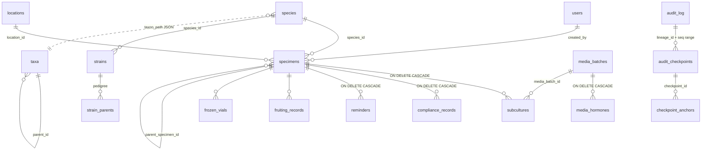

> [!abstract] In one sentence
> The complete SQLite schema at migration head **059** — **61 application tables**, one FTS5 virtual
> table with five shadow tables and three triggers, and roughly a hundred named indexes — built by
> `src-tauri/src/db/migrations.rs` and reached only through `src-tauri/src/db/queries.rs`.

## Ground rules

| Fact | Detail |
|---|---|
| Engine | SQLite via `rusqlite 0.32` with the **bundled** amalgamation — no system SQLite |
| File | `~/.steloptc/stelo_ptc.db` on Linux/macOS, `%APPDATA%\SteloPTC\stelo_ptc.db` on Windows; falls back to `./stelo_ptc.db` if `HOME`/`APPDATA` is unset |
| PRAGMAs (file DB) | `journal_mode=WAL` · `foreign_keys=ON` · `busy_timeout=5000` |
| PRAGMAs (in-memory) | `foreign_keys=ON` **only** — every test and benchmark runs under weaker settings than production |
| Ids | UUIDv4 strings in `TEXT PRIMARY KEY` everywhere except the six vocabulary tables (`INTEGER … AUTOINCREMENT`) and the three single-row config tables (`INTEGER … CHECK (id = 1)`) |
| Timestamps | `TEXT`, mostly `DEFAULT (datetime('now'))` (`YYYY-MM-DD HH:MM:SS`). Audit and event timestamps are written from Rust as RFC-3339-ish `%Y-%m-%dT%H:%M:%S%.3fZ`. The two formats coexist |
| Booleans | `INTEGER` 0/1 |
| Serde contract | **Model field names are the API contract.** There is no `#[serde(rename)]` anywhere in `models/` except `UserRole` (`rename_all = "lowercase"`), so a column name usually reaches the frontend unchanged |

> [!important] What "lab-scoped" means here
> There is **no `lab_id` column anywhere in this repo.** Multi-tenancy runs on one column —
> `specimens.lab_profile` — holding `plant_tissue_culture`, `cell_culture` or `mycology`.
> `specimens` is the **only** table that carries it. Six vocabulary tables carry a `profile` column,
> which is a different thing: it scopes *terms*, not records.
> Everything else falls into one of two groups:
> **scoped through a specimen** (`subcultures`, `compliance_records`, `reminders`, `fruiting_records`,
> `environmental_readings`, `specimen_tags`, `compliance_flag_waivers`, and `frozen_vials` /
> `specimen_passports` when their nullable `specimen_id` is set), or
> **genuinely global and shared across every lab profile** — including `species`, `strains`, `taxa`,
> `media_batches`, `inventory_items`, `locations`, `audit_log` and `users`.
> See [[Lab Profiles]] for how the predicate is applied.



> [!warning] Two relationships the diagram cannot draw
> `species.taxon_path` is a **JSON array of `taxa.id`**, not a foreign key — no referential integrity,
> and a `NULL` there makes the species invisible in the Taxonomy Navigator ([[Taxonomy Backbone]]).
> `specimens.strain_id` names `strains.id` but **declares no `REFERENCES` clause**, so SQLite will
> not stop a strain being deleted out from under a culture.

---

## Tables

### `ai_suggestions`

Every local-AI output, stored as a proposal. `mig 041` · **global** · nothing here is applied to a record until a human approves it.

| Column | Type | Null? | Default | Meaning |
|---|---|---|---|---|
| `id` · **PK** | TEXT | no | — | UUIDv4 primary key |
| `entity_type` | TEXT | no | — | What the suggestion is about · **CHECK IN** ('specimen','subculture','attachment') |
| `entity_id` | TEXT | no | — | Id of that entity — no FK, the target table varies |
| `kind` | TEXT | no | — | Which AI command produced it · **CHECK IN** ('summarize_notes','suggest_passage_comment','analyze_photo') |
| `model_name` | TEXT | no | — | Ollama model that generated it, recorded so a later reader knows what wrote it |
| `prompt` | TEXT | no | — | The exact prompt sent to the local runtime |
| `suggestion` | TEXT | no | — | The generated text. Never applied automatically — approval is a separate command |
| `status` | TEXT | no | `'pending'` | `approve_ai_suggestion` **appends** the text to the target row's `notes`, prefixed `[AI-assisted, approved by <name>]`; `reject_ai_suggestion` only marks the row · **CHECK IN** ('pending','approved','rejected') |
| `created_by` | TEXT | yes | — | → `users(id)`; the acting user |
| `reviewed_by` | TEXT | yes | — | → `users(id)`; who approved or rejected |
| `reviewed_at` | TEXT | yes | — | When the review happened |
| `created_at` | TEXT | no | `datetime('now')` | Row creation timestamp |

**Indexes** — `idx_ai_suggestions_entity ON ai_suggestions(entity_type, entity_id)` · `idx_ai_suggestions_status ON ai_suggestions(status)`

### `app_config`

The single row (`CHECK (id = 1)`) that decides which lab the app is showing. `mig 015`, `domain` added by `mig 032` · **the scoping table itself**.

| Column | Type | Null? | Default | Meaning |
|---|---|---|---|---|
| `id` · **PK** | INTEGER | no | — | Always 1 — single-row table |
| `lab_profile` | TEXT | no | `'plant_tissue_culture'` | **The active lab.** The whole multi-tenancy axis; read via `vocabulary::active_profile` · **CHECK IN** ('plant_tissue_culture','cell_culture','mycology') |
| `updated_at` | TEXT | no | `datetime('now')` | Last profile switch |
| `domain` | TEXT | no | `'Plantae'` | Plantae / Animalia / Fungi — mirrors `lab_profile`, deliberately without a CHECK so a plugin can add one |

### `app_settings`

Untyped key/value store for tunables. `mig 014` · **global**.

| Column | Type | Null? | Default | Meaning |
|---|---|---|---|---|
| `key` · **PK** | TEXT | no | — | Setting name — see the key inventory below |
| `value` | TEXT | no | — | Always TEXT; callers parse. `read_setting` swallows every error and returns its default |
| `updated_at` | TEXT | no | `datetime('now')` | Last write |

### `attachments`

File metadata; the bytes live on disk under the app data directory. `mig 001` · **scoped through its subject**.

| Column | Type | Null? | Default | Meaning |
|---|---|---|---|---|
| `id` · **PK** | TEXT | no | — | UUIDv4 primary key |
| `entity_type` | TEXT | no | — | What the file is attached to · **CHECK IN** ('specimen','subculture','media_batch','compliance') |
| `entity_id` | TEXT | no | — | Id of that entity — no FK |
| `file_name` | TEXT | no | — | Original name as uploaded |
| `file_path` | TEXT | no | — | Absolute path under the app's `attachments/` directory. Writes outside it are refused |
| `file_size_bytes` | INTEGER | yes | — | Size at upload time |
| `mime_type` | TEXT | yes | — | Caller-supplied MIME type |
| `description` | TEXT | yes | — | Optional caption |
| `uploaded_by` | TEXT | yes | — | → `users(id)` |
| `created_at` | TEXT | no | `datetime('now')` | Row creation timestamp |

**Indexes** — `idx_attachments_entity ON attachments(entity_type, entity_id)`

### `audit_checkpoints`

A Merkle root over a contiguous range of one lineage's audit entries. `mig 013`, auto-fields `mig 014` · **global**. See [[Hash-Chained Provenance]].

| Column | Type | Null? | Default | Meaning |
|---|---|---|---|---|
| `id` · **PK** | TEXT | no | — | UUIDv4 primary key |
| `lineage_id` | TEXT | no | — | Which hash chain this checkpoint covers |
| `start_seq` | INTEGER | no | — | First `audit_log.chain_seq` in the range (inclusive) |
| `end_seq` | INTEGER | no | — | Last `chain_seq` in the range (inclusive) |
| `entry_count` | INTEGER | no | — | Number of entries the Merkle tree was built over |
| `merkle_root` | TEXT | no | — | SHA-256 Merkle root, lowercase hex — the thing that gets signed and anchored |
| `created_at` | TEXT | no | `datetime('now')` | Row creation timestamp |
| `created_by` | TEXT | yes | — | → `users(id)` |
| `anchored_txid` | TEXT | yes | — | Blockchain transaction id once anchored; see `checkpoint_anchors` |
| `is_auto` | INTEGER | no | `0` | 1 when produced by the auto-checkpointer rather than a person |
| `auto_source` | TEXT | yes | — | `"backup"` or `"entry_count"` — which trigger fired |

**Indexes** — `idx_audit_checkpoints_created ON audit_checkpoints(created_at)` · `idx_audit_checkpoints_lineage ON audit_checkpoints(lineage_id)`

### `audit_log`

The hash chain. Every meaningful write appends here. `mig 001`, chain columns `mig 008`, `lineage_id` `mig 009` · **global** — audit entries are not filtered by lab profile.

| Column | Type | Null? | Default | Meaning |
|---|---|---|---|---|
| `id` · **PK** | TEXT | no | — | UUIDv4 primary key |
| `user_id` | TEXT | yes | — | → `users(id)`; NULL for system actions |
| `action` | TEXT | no | — | Verb — `create`, `update`, `delete`, `login`, `login_failed`, `login_blocked`, `passage`, `split`, … |
| `entity_type` | TEXT | no | — | Table-ish name of the subject |
| `entity_id` | TEXT | yes | — | Subject id |
| `old_value` | TEXT | yes | — | Previous state, free-form |
| `new_value` | TEXT | yes | — | New state, free-form |
| `ip_address` | TEXT | yes | — | **Dead column.** Present since migration 001; no code path writes it |
| `details` | TEXT | yes | — | Human-readable description; part of the hashed canonical form |
| `created_at` | TEXT | no | `datetime('now')` | Entry timestamp |
| `chain_seq` | INTEGER | yes | — | Position in this lineage's chain. NULL on pre-hash-chain rows |
| `prev_hash` | TEXT | yes | — | `entry_hash` of the previous entry in the lineage; `ZERO_HASH` at genesis |
| `entry_hash` | TEXT | yes | — | `SHA-256(canonical ‖ prev_hash)`, lowercase hex |
| `lineage_id` | TEXT | yes | — | Which chain this belongs to — normally a specimen id |

**Indexes** — `idx_audit_chain_seq ON audit_log(chain_seq)` · `idx_audit_created ON audit_log(created_at)` · `idx_audit_entity ON audit_log(entity_type, entity_id)` · `idx_audit_lineage ON audit_log(lineage_id, chain_seq)` · `idx_audit_user ON audit_log(user_id)`

### `backup_targets`

Cloud/off-machine backup destinations with an encrypted credential blob. `mig 042` · **global**.

| Column | Type | Null? | Default | Meaning |
|---|---|---|---|---|
| `id` · **PK** | TEXT | no | — | UUIDv4 primary key |
| `name` | TEXT | no | — | Operator-chosen label |
| `type` | TEXT | no | — | Destination kind (`local_folder`, `s3`, …). Only local paths are actually connected |
| `config_encrypted` | TEXT | no | — | AES-GCM blob holding bucket/endpoint/credentials, keyed by an Argon2id-derived passphrase that is never stored |
| `schedule_cron` | TEXT | yes | — | 5-field cron string, validated on write. **No scheduler runs it** — backups are manual |
| `last_backup_at` | TEXT | yes | — | Timestamp of the last successful run |
| `last_backup_size_bytes` | INTEGER | yes | — | Size of the last encrypted blob |
| `last_status` | TEXT | yes | — | Outcome of the last run · **CHECK IN** ('ok','failed','pending') |
| `last_error` | TEXT | yes | — | Error text from the last failure |
| `is_enabled` | INTEGER | no | `1` | Soft on/off |
| `created_at` | TEXT | no | `datetime('now')` | Row creation timestamp |

**Indexes** — `idx_backup_targets_enabled ON backup_targets(is_enabled)`

### `breeding_bundle_dispositions`

Per-record decisions taken while importing a coordination bundle. `mig 051` · **global**.

| Column | Type | Null? | Default | Meaning |
|---|---|---|---|---|
| `id` · **PK** | TEXT | no | — | UUIDv4 primary key |
| `bundle_row_id` | TEXT | no | — | → `breeding_bundles(id)` |
| `source_key` | TEXT | no | — | Stable key identifying one record inside the bundle |
| `local_status` | TEXT | no | — | What the importer found locally (`new`, `identical`, `conflict`) |
| `disposition` | TEXT | no | — | The decision applied · **CHECK IN** ('accept','skip') |
| `action_taken` | TEXT | no | — | What actually happened as a result |
| `local_record_id` | TEXT | yes | — | Id of the local row created or matched |
| `created_at` | TEXT | no | `datetime('now')` | Row creation timestamp |

**Indexes** — `idx_breeding_bundle_dispositions_bundle ON breeding_bundle_dispositions(bundle_row_id)`

### `breeding_bundles`

Signed cross-lab breeding-program exchange documents. `mig 051` · **global**. See [[Federated Exchange]].

| Column | Type | Null? | Default | Meaning |
|---|---|---|---|---|
| `id` · **PK** | TEXT | no | — | UUIDv4 primary key |
| `bundle_id` | TEXT | no | — | Issuer-assigned id, unique per direction |
| `direction` | TEXT | no | — | `issued` = we made it · `imported` = we received it · **CHECK IN** ('issued','imported') |
| `issuer_lab` | TEXT | no | — | `app_settings.lab_name` of the issuing lab |
| `issuer_public_key` | TEXT | no | — | Ed25519 public key, base64 |
| `program_name` | TEXT | no | — | Name of the breeding program the bundle carries |
| `content_hash` | TEXT | no | — | SHA-256 over the canonical record list; what the signature covers |
| `record_count` | INTEGER | no | `0` | Records inside |
| `verified` | INTEGER | no | `0` | 1 once the signature checked out. An unverifiable bundle is refused on import |
| `audit_entry` | TEXT | yes | — | Id of the `audit_log` row written for this exchange |
| `bundle_json` | TEXT | no | — | The whole signed document, stored verbatim |
| `created_by` | TEXT | yes | — | → `users(id)`; the acting user |
| `created_at` | TEXT | no | `datetime('now')` | Row creation timestamp |

**UNIQUE** `(direction, bundle_id)`  
**Indexes** — `idx_breeding_bundles_direction ON breeding_bundles(direction)`

### `breeding_programs`

A named selection program. `mig 033` · **global** · two of its columns are field-permission maskable.

| Column | Type | Null? | Default | Meaning |
|---|---|---|---|---|
| `id` · **PK** | TEXT | no | — | UUIDv4 primary key |
| `name` | TEXT | no | — | Display name |
| `goal` | TEXT | yes | — | **Maskable field** — hidden from a role whose `field_permissions` row says so |
| `start_date` | TEXT | yes | — | Program start |
| `target_traits` | TEXT | yes | — | **Maskable field** |
| `founder_strain_ids` | TEXT | yes | — | JSON array of `strains.id` |
| `notes` | TEXT | yes | — | Free text |
| `created_at` | TEXT | no | `datetime('now')` | Row creation timestamp |
| `created_by` | TEXT | yes | — | Username string, not an FK |

### `breeding_records`

One selected strain at one generation within a program. `mig 033`, `origin_lab` `mig 051` · **global**.

| Column | Type | Null? | Default | Meaning |
|---|---|---|---|---|
| `id` · **PK** | TEXT | no | — | UUIDv4 primary key |
| `program_id` | TEXT | no | — | → `breeding_programs(id)` ON DELETE CASCADE |
| `strain_id` | TEXT | no | — | → `strains(id)` |
| `generation_number` | INTEGER | no | `1` | F-number within the program |
| `selection_notes` | TEXT | yes | — | Why this strain was selected forward |
| `fitness_score` | REAL | yes | — | Numeric score, scale is the lab's own |
| `selection_date` | TEXT | yes | — | When the selection was made |
| `selected_by` | TEXT | yes | — | Free-text name |
| `notes` | TEXT | yes | — | Free text |
| `created_at` | TEXT | no | `datetime('now')` | Row creation timestamp |
| `origin_lab` | TEXT | yes | — | Set when the record arrived through a coordination bundle; NULL for locally-made records |

**Indexes** — `idx_breeding_records_program_generation ON breeding_records(program_id, generation_number)` · `idx_breeding_records_program_id ON breeding_records(program_id)` · `idx_breeding_records_strain_id ON breeding_records(strain_id)`

### `checkpoint_anchors`

The prepared OP_RETURN payload for putting a checkpoint's Merkle root on a public chain. `mig 046` · **global** · the app never broadcasts anything.

| Column | Type | Null? | Default | Meaning |
|---|---|---|---|---|
| `id` · **PK** | TEXT | no | — | UUIDv4 primary key |
| `checkpoint_id` | TEXT | no | — | → `audit_checkpoints(id)` |
| `chain_name` | TEXT | no | `'dogecoin'` | Target chain; only `dogecoin` is modelled |
| `merkle_root` | TEXT | no | — | Copied from the checkpoint at prepare time |
| `op_return_hex` | TEXT | no | — | The exact OP_RETURN script to broadcast: `STEL` marker + root |
| `txid` | TEXT | yes | — | 64 hex chars, set by `record_checkpoint_anchor` once a human has broadcast it. **The app never touches a network** |
| `status` | TEXT | no | `'prepared'` | `prepared` → `submitted` → `confirmed` · **CHECK IN** ('prepared','submitted','confirmed') |
| `verified_at` | TEXT | yes | — | When `verify_checkpoint_anchor` last matched the on-chain payload |
| `created_by` | TEXT | yes | — | → `users(id)` |
| `created_at` | TEXT | no | `datetime('now')` | Row creation timestamp |
| `updated_at` | TEXT | no | `datetime('now')` | Last mutation timestamp |

**Indexes** — `idx_checkpoint_anchors_checkpoint ON checkpoint_anchors(checkpoint_id)` · `idx_checkpoint_anchors_txid ON checkpoint_anchors(txid)`

### `cloud_sync_segments`

Which audit-chain ranges each device has published to a shared cloud target. `mig 042` · **global**.

| Column | Type | Null? | Default | Meaning |
|---|---|---|---|---|
| `id` · **PK** | TEXT | no | — | UUIDv4 primary key |
| `target_id` | TEXT | no | — | → `backup_targets(id)` ON DELETE CASCADE |
| `device_id` | TEXT | no | — | Which device published this segment |
| `chain_seq_start` | INTEGER | no | — | First `chain_seq` in the published range |
| `chain_seq_end` | INTEGER | no | — | Last `chain_seq` in the published range |
| `applied_at` | TEXT | no | `datetime('now')` | When this device consumed the segment |

**Indexes** — `idx_cloud_sync_segments_target ON cloud_sync_segments(target_id, device_id)`

### `compliance_agencies`

Profile-scoped vocabulary. `mig 017`, seeded per profile by `mig 018/023/027` · **profile-scoped by its `profile` column**.

| Column | Type | Null? | Default | Meaning |
|---|---|---|---|---|
| `id` · **PK** | INTEGER | no | — | AUTOINCREMENT integer |
| `profile` | TEXT | no | — | Which lab profile the term belongs to |
| `code` | TEXT | no | — | Machine value stored on records |
| `label` | TEXT | no | — | What the UI shows |
| `sort_order` | INTEGER | no | `0` | Display order within the profile |

**UNIQUE** `(profile, code)`  
**Indexes** — `idx_compliance_agencies_profile ON compliance_agencies(profile, sort_order)`

### `compliance_flag_waivers`

An explicit, reasoned suppression of one auto-flag on one specimen. `mig 052` · **scoped through `specimen_id`**.

| Column | Type | Null? | Default | Meaning |
|---|---|---|---|---|
| `id` · **PK** | TEXT | no | — | UUIDv4 primary key |
| `flag_type` | TEXT | no | — | Which auto-flag rule is being waived, by its rule id |
| `specimen_id` | TEXT | no | — | → `specimens(id)` ON DELETE CASCADE |
| `reason` | TEXT | no | — | Required, non-empty — a waiver with no stated reason is refused |
| `waived_by` | TEXT | yes | — | → `users(id)` |
| `waived_at` | TEXT | no | `datetime('now')` | When the waiver was granted |
| `expires_at` | TEXT | yes | — | Optional expiry; a lapsed waiver stops suppressing the flag |
| `revoked` | INTEGER | no | `0` | 1 after `revoke_compliance_waiver` |
| `revoked_at` | TEXT | yes | — | When it was revoked |

**Indexes** — `idx_flag_waivers_lookup ON compliance_flag_waivers(specimen_id, flag_type, revoked)`

### `compliance_record_types`

Profile-scoped vocabulary. `mig 017` · **profile-scoped by its `profile` column**.

| Column | Type | Null? | Default | Meaning |
|---|---|---|---|---|
| `id` · **PK** | INTEGER | no | — | AUTOINCREMENT integer |
| `profile` | TEXT | no | — | Which lab profile the term belongs to |
| `code` | TEXT | no | — | Machine value stored on records |
| `label` | TEXT | no | — | What the UI shows |
| `sort_order` | INTEGER | no | `0` | Display order within the profile |

**UNIQUE** `(profile, code)`  
**Indexes** — `idx_compliance_record_types_profile ON compliance_record_types(profile, sort_order)`

### `compliance_records`

Permits, disease tests, certificates and inspections attached to a specimen. `mig 001`, CHECKs dropped in `mig 017` · **scoped through `specimen_id`**.

| Column | Type | Null? | Default | Meaning |
|---|---|---|---|---|
| `id` · **PK** | TEXT | no | — | UUIDv4 primary key |
| `specimen_id` | TEXT | no | — | → `specimens(id)` ON DELETE CASCADE |
| `record_type` | TEXT | no | — | Validated against `compliance_record_types` for the active profile — the CHECK was dropped in migration 017 |
| `agency` | TEXT | yes | — | Validated against `compliance_agencies`; CHECK dropped in migration 017 |
| `permit_number` | TEXT | yes | — | Permit identifier |
| `permit_expiry` | TEXT | yes | — | Permit expiry date — drives the permit-expiry flag |
| `test_type` | TEXT | yes | — | e.g. mycoplasma, virus indexing |
| `test_method` | TEXT | yes | — | PCR, ELISA, … |
| `test_date` | TEXT | yes | — | Date the test was performed — drives the mycoplasma-interval flag |
| `test_lab` | TEXT | yes | — | Which lab ran it |
| `test_result` | TEXT | yes | — | NULL is explicitly permitted by the CHECK · **CHECK IN** ('positive','negative','inconclusive','pending',NULL) |
| `status` | TEXT | no | `'valid'` | Lifecycle of the record itself · **CHECK IN** ('valid','expired','pending','flagged','revoked') |
| `flag_reason` | TEXT | yes | — | Why it was flagged |
| `chain_of_custody` | TEXT | yes | — | Free-text custody trail |
| `notes` | TEXT | yes | — | Free text |
| `document_path` | TEXT | yes | — | Path to a scanned document |
| `created_by` | TEXT | yes | — | → `users(id)` |
| `created_at` | TEXT | no | `datetime('now')` | Row creation timestamp |
| `updated_at` | TEXT | no | `datetime('now')` | Last mutation timestamp |

**Indexes** — `idx_compliance_specimen ON compliance_records(specimen_id)` · `idx_compliance_status ON compliance_records(status)` · `idx_compliance_type ON compliance_records(record_type)`

### `environmental_readings`

Temperature/humidity/CO₂/light/pH samples. `mig 037` · **scoped through `specimen_id` / `subculture_id`** · a table-level CHECK requires at least one of them.

| Column | Type | Null? | Default | Meaning |
|---|---|---|---|---|
| `id` · **PK** | TEXT | no | — | UUIDv4 primary key |
| `specimen_id` | TEXT | yes | — | → `specimens(id)` ON DELETE CASCADE |
| `subculture_id` | TEXT | yes | — | → `subcultures(id)` ON DELETE CASCADE |
| `reading_type` | TEXT | no | — | What was measured · **CHECK IN** ('temp_c','humidity_pct','co2_ppm','light_lux','ph','custom') |
| `value` | REAL | no | — | Numeric value; must be finite |
| `unit` | TEXT | yes | — | Free-text unit label |
| `source` | TEXT | no | `'manual'` | **A caller-supplied label, not verified provenance.** Nothing has ever legitimately produced a non-`manual` reading · **CHECK IN** ('manual','usb_serial','bluetooth','mqtt') |
| `recorded_at` | TEXT | no | `datetime('now')` | When the measurement was taken |
| `notes` | TEXT | yes | — | Free text |
| `created_by` | TEXT | yes | — | Username string, not an FK |
| `created_at` | TEXT | no | `datetime('now')` | Row creation timestamp |

**Indexes** — `idx_environmental_readings_specimen ON environmental_readings(specimen_id, recorded_at)` · `idx_environmental_readings_subculture ON environmental_readings(subculture_id, recorded_at)`

### `error_logs`

Frontend errors persisted so a failed form entry can be recovered. `mig 003` · **global**.

| Column | Type | Null? | Default | Meaning |
|---|---|---|---|---|
| `id` · **PK** | TEXT | no | — | UUIDv4 primary key |
| `timestamp` | TEXT | no | `datetime('now')` | When the error occurred (frontend clock) |
| `title` | TEXT | no | — | Short label shown in the Error Log view |
| `message` | TEXT | no | — | Full message |
| `module` | TEXT | yes | — | Which UI area reported it |
| `severity` | TEXT | no | `'error'` | Drives the unread badge · **CHECK IN** ('info','warning','error','critical') |
| `user_id` | TEXT | yes | — | → `users(id)` |
| `username` | TEXT | yes | — | Denormalised copy so the log survives user deletion |
| `form_payload` | TEXT | yes | — | JSON snapshot of the form the user was filling in — the point is to make a failed entry recoverable |
| `stack_trace` | TEXT | yes | — | Optional JS stack |
| `is_read` | INTEGER | no | `0` | Cleared in bulk by `mark_errors_read` |
| `created_at` | TEXT | no | `datetime('now')` | Row creation timestamp |

**Indexes** — `idx_error_logs_is_read ON error_logs(is_read)` · `idx_error_logs_module ON error_logs(module)` · `idx_error_logs_severity ON error_logs(severity)` · `idx_error_logs_timestamp ON error_logs(timestamp)`

### `field_permissions`

Which roles may see which maskable fields. `mig 036` seeds 12 permissive rows (4 roles × 3 fields) · **global**. See [[Roles and Permissions]].

| Column | Type | Null? | Default | Meaning |
|---|---|---|---|---|
| `id` · **PK** | TEXT | no | — | UUIDv4 primary key |
| `role` | TEXT | no | — | Which role the rule applies to · **CHECK IN** ('admin','supervisor','tech','guest') |
| `entity_type` | TEXT | no | — | Entity owning the field |
| `field_name` | TEXT | no | — | Field to hide. Only the three registered in `MASKABLE_FIELDS` may be configured |
| `visible` | INTEGER | no | `1` | 0 replaces the value with `[RESTRICTED]` on read. **Absence of a row means visible** |

**UNIQUE** `(role, entity_type, field_name)`  
**Indexes** — `idx_field_permissions_entity ON field_permissions(entity_type, field_name)`

### `frozen_vials`

Cryo inventory — vials in a freezer or dewar. `mig 025` · **scoped through `specimen_id` when set**.

| Column | Type | Null? | Default | Meaning |
|---|---|---|---|---|
| `id` · **PK** | TEXT | no | — | UUIDv4 primary key |
| `specimen_id` | TEXT | yes | — | → `specimens(id)`; NULL once the source specimen is gone |
| `species_id` | TEXT | no | — | → `species(id)` |
| `passage_number` | INTEGER | no | `0` | Passage the cells were at when frozen |
| `cumulative_pdl` | REAL | yes | — | Population doublings at freeze — cell culture |
| `vial_count` | INTEGER | no | `1` | Vials remaining; `thaw_vial` decrements |
| `freeze_date` | TEXT | no | — | Date frozen |
| `freeze_medium` | TEXT | no | — | Cryoprotectant recipe |
| `location` | TEXT | yes | — | Free-text location string |
| `location_freezer` | TEXT | yes | — | Structured address part |
| `location_tower` | TEXT | yes | — | Structured address part |
| `location_box` | TEXT | yes | — | Structured address part |
| `location_position` | TEXT | yes | — | Structured address part |
| `status` | TEXT | no | `'active'` | `depleted` when the count reaches zero · **CHECK IN** ('active','depleted','discarded') |
| `notes` | TEXT | yes | — | Free text |
| `created_by` | TEXT | yes | — | Username string, not an FK |
| `created_at` | TEXT | no | `datetime('now')` | Row creation timestamp |
| `updated_at` | TEXT | no | `datetime('now')` | Last mutation timestamp |

**Indexes** — `idx_frozen_vials_species ON frozen_vials(species_id)` · `idx_frozen_vials_specimen ON frozen_vials(specimen_id)` · `idx_frozen_vials_status ON frozen_vials(status)`

### `fruiting_records`

Mycology harvest records, one per flush. `mig 030` · **scoped through `specimen_id`**.

| Column | Type | Null? | Default | Meaning |
|---|---|---|---|---|
| `id` · **PK** | TEXT | no | — | UUIDv4 primary key |
| `specimen_id` | TEXT | no | — | → `specimens(id)` |
| `flush_number` | INTEGER | no | `1` | Which flush this harvest is |
| `harvest_date` | TEXT | no | — | Date harvested |
| `fresh_weight_g` | REAL | yes | — | Wet yield |
| `dry_weight_g` | REAL | yes | — | Dry yield |
| `fruiting_temp_c` | REAL | yes | — | Chamber temperature during fruiting |
| `fruiting_rh_percent` | REAL | yes | — | Relative humidity |
| `fae_rate` | REAL | yes | — | Fresh-air exchanges per hour |
| `light_hours_per_day` | REAL | yes | — | Photoperiod |
| `notes` | TEXT | yes | — | Free text |
| `created_by` | TEXT | yes | — | Username string, not an FK |
| `created_at` | TEXT | no | `datetime('now')` | Row creation timestamp |
| `updated_at` | TEXT | no | `datetime('now')` | Last mutation timestamp |

**Indexes** — `idx_fruiting_records_specimen_flush ON fruiting_records(specimen_id, flush_number)` · `idx_fruiting_records_specimen_id ON fruiting_records(specimen_id)`

### `hormone_types`

Profile-scoped vocabulary (plant growth regulators, media additives). `mig 017` · **profile-scoped by its `profile` column**.

| Column | Type | Null? | Default | Meaning |
|---|---|---|---|---|
| `id` · **PK** | INTEGER | no | — | AUTOINCREMENT integer |
| `profile` | TEXT | no | — | Which lab profile the term belongs to |
| `code` | TEXT | no | — | Machine value stored on records |
| `label` | TEXT | no | — | What the UI shows |
| `sort_order` | INTEGER | no | `0` | Display order within the profile |

**UNIQUE** `(profile, code)`  
**Indexes** — `idx_hormone_types_profile ON hormone_types(profile, sort_order)`

### `hybridization_events`

The cross that produced a hybrid strain, pinned to both parents' chain positions. `mig 019`, labels `mig 022` · **global**.

| Column | Type | Null? | Default | Meaning |
|---|---|---|---|---|
| `id` · **PK** | TEXT | no | — | UUIDv4 primary key |
| `hybrid_strain_id` | TEXT | no | — | → `strains(id)`; the offspring |
| `parent_a_strain_id` | TEXT | no | — | → `strains(id)` |
| `parent_b_strain_id` | TEXT | no | — | → `strains(id)` |
| `parent_a_chain_seq` | INTEGER | no | — | Parent A's chain position at the moment of the cross — pins the pedigree to a point in the parent's history |
| `parent_b_chain_seq` | INTEGER | no | — | Parent B's chain position at the moment of the cross |
| `notes` | TEXT | yes | — | Free text |
| `created_by` | TEXT | yes | — | → `users(id)` |
| `created_at` | TEXT | no | `datetime('now')` | Row creation timestamp |
| `generation_label` | TEXT | yes | — | F1 / F2 / BC1 …, suggested by `suggest_generation_label` |
| `backcross_depth` | INTEGER | yes | — | How many backcross generations deep, NULL when not a backcross |

**Indexes** — `idx_hybridization_events_hybrid ON hybridization_events(hybrid_strain_id)`

### `installed_plugins`

Registered `.steloplugin` packages. `mig 045` · **global** · no code from a plugin is ever executed.

| Column | Type | Null? | Default | Meaning |
|---|---|---|---|---|
| `id` · **PK** | TEXT | no | — | UUIDv4 primary key |
| `plugin_name` | TEXT | no | — | Unique — reinstalling the same name is rejected |
| `version` | TEXT | no | — | Manifest version string |
| `profile` | TEXT | yes | — | Lab profile the plugin targets, if it declares one |
| `manifest_json` | TEXT | no | — | The validated manifest, verbatim |
| `vocabulary_seeded` | INTEGER | no | `0` | 1 once its vocabulary rows were inserted |
| `installed_at` | TEXT | no | `datetime('now')` | Install timestamp |

**UNIQUE** `(plugin_name)`

### `inventory_categories`

Profile-scoped vocabulary. `mig 017` · **profile-scoped by its `profile` column**.

| Column | Type | Null? | Default | Meaning |
|---|---|---|---|---|
| `id` · **PK** | INTEGER | no | — | AUTOINCREMENT integer |
| `profile` | TEXT | no | — | Which lab profile the term belongs to |
| `code` | TEXT | no | — | Machine value stored on records |
| `label` | TEXT | no | — | What the UI shows |
| `sort_order` | INTEGER | no | `0` | Display order within the profile |

**UNIQUE** `(profile, code)`  
**Indexes** — `idx_inventory_categories_profile ON inventory_categories(profile, sort_order)`

### `inventory_items`

Consumables and reagents with stock levels. `mig 001`, liquid fields `mig 002`, CHECK dropped `mig 017` · **global — shared across all lab profiles**.

| Column | Type | Null? | Default | Meaning |
|---|---|---|---|---|
| `id` · **PK** | TEXT | no | — | UUIDv4 primary key |
| `name` | TEXT | no | — | Item name |
| `category` | TEXT | no | — | Validated against `inventory_categories`; CHECK dropped in migration 017 |
| `unit` | TEXT | no | — | Unit of measure |
| `current_stock` | REAL | no | `0` | `adjust_stock` refuses to take this below zero |
| `minimum_stock` | REAL | no | `0` | Threshold below which the item is a low-stock alert |
| `reorder_point` | REAL | yes | — | Optional second threshold |
| `supplier` | TEXT | yes | — | Supplier name |
| `catalog_number` | TEXT | yes | — | Supplier catalogue number |
| `lot_number` | TEXT | yes | — | Lot as received |
| `storage_location` | TEXT | yes | — | Where it lives |
| `expiration_date` | TEXT | yes | — | Expiry |
| `cost_per_unit` | REAL | yes | — | Unit cost |
| `notes` | TEXT | yes | — | Free text |
| `created_at` | TEXT | no | `datetime('now')` | Row creation timestamp |
| `updated_at` | TEXT | no | `datetime('now')` | Last mutation timestamp |
| `physical_state` | TEXT | yes | `'solid'` | `solid` / `liquid` — decides whether a prepared solution can be made from it |
| `concentration` | REAL | yes | — | Stock concentration for liquids |
| `concentration_unit` | TEXT | yes | — | Unit for the above |

### `locations`

Rooms. `mig 040`, `layout_json` `mig 059` · **global**. See [[Lab Layout Model]].

| Column | Type | Null? | Default | Meaning |
|---|---|---|---|---|
| `id` · **PK** | TEXT | no | — | UUIDv4 primary key |
| `name` | TEXT | no | — | Unique room name |
| `description` | TEXT | yes | — | Free text |
| `floor_plan_image` | TEXT | yes | — | Path or data URI of an uploaded floor-plan image |
| `floor_plan_x` | REAL | yes | — | Pin x on that image |
| `floor_plan_y` | REAL | yes | — | Pin y on that image |
| `created_at` | TEXT | no | `datetime('now')` | Row creation timestamp |
| `updated_at` | TEXT | no | `datetime('now')` | Last mutation timestamp |
| `layout_json` | TEXT | yes | — | **The drawn room plan** — grid size plus furniture, each with a footprint and a shelf breakdown. Read and written whole, never queried across rooms |

column-level **UNIQUE** on `name`  
**Indexes** — `idx_locations_name ON locations(name)`

### `media_batches`

A prepared batch of growth medium. `mig 001`, `is_draft` `mig 011` · **global — shared across all lab profiles**.

| Column | Type | Null? | Default | Meaning |
|---|---|---|---|---|
| `id` · **PK** | TEXT | no | — | UUIDv4 primary key |
| `batch_id` | TEXT | no | — | Human-facing batch code, unique |
| `name` | TEXT | no | — | Recipe name |
| `preparation_date` | TEXT | no | — | When it was made |
| `expiration_date` | TEXT | yes | — | Use-by date — drives the media-expiry reminder |
| `basal_salts` | TEXT | yes | `'MS'` | Salt formulation, e.g. MS |
| `basal_salts_concentration` | REAL | yes | `1.0` | Strength multiplier (1.0 = full strength) |
| `vitamins` | TEXT | yes | — | Vitamin mix |
| `sucrose_g_per_l` | REAL | yes | — | Sugar |
| `agar_g_per_l` | REAL | yes | — | Gelling agent load |
| `gelling_agent` | TEXT | yes | — | Agar, gellan, … |
| `ph_before_autoclave` | REAL | yes | — | pH measured before sterilisation |
| `ph_after_autoclave` | REAL | yes | — | pH measured after |
| `sterilization_method` | TEXT | yes | `'autoclave'` | How it was sterilised |
| `volume_prepared_ml` | REAL | yes | — | Volume made |
| `volume_used_ml` | REAL | yes | `0` | Volume consumed so far |
| `volume_remaining_ml` | REAL | yes | — | Volume left |
| `storage_conditions` | TEXT | yes | — | Storage notes |
| `qc_notes` | TEXT | yes | — | QC observations |
| `supplier_info` | TEXT | yes | — | Where the components came from |
| `cost_per_batch` | REAL | yes | — | Batch cost |
| `osmolarity` | REAL | yes | — | Measured osmolarity |
| `conductivity` | REAL | yes | — | Measured conductivity |
| `is_custom` | INTEGER | no | `0` | 1 for a one-off recipe |
| `needs_review` | INTEGER | no | `0` | 1 for a draft batch created by `create_draft_media_batch` — a name and nothing else, so a passage can be recorded before the recipe is typed up |
| `notes` | TEXT | yes | — | Free text |
| `created_by` | TEXT | yes | — | → `users(id)` |
| `created_at` | TEXT | no | `datetime('now')` | Row creation timestamp |
| `updated_at` | TEXT | no | `datetime('now')` | Last mutation timestamp |
| `employee_id` | TEXT | yes | — | Free-text operator id |
| `is_draft` | INTEGER | no | `0` | 1 while the batch is a placeholder |

column-level **UNIQUE** on `batch_id`  
**Indexes** — `idx_media_batches_draft ON media_batches(is_draft)`

### `media_hormones`

Additives in a batch, one row each. `mig 001`, rebuilt `mig 017` · **global**.

| Column | Type | Null? | Default | Meaning |
|---|---|---|---|---|
| `id` · **PK** | TEXT | no | — | UUIDv4 primary key |
| `media_batch_id` | TEXT | no | — | → `media_batches(id)` ON DELETE CASCADE |
| `hormone_name` | TEXT | no | — | Compound name |
| `hormone_type` | TEXT | yes | — | Validated against `hormone_types`; CHECK dropped in migration 017 |
| `concentration_mg_per_l` | REAL | no | — | Final concentration |
| `supplier` | TEXT | yes | — | Supplier |
| `lot_number` | TEXT | yes | — | Lot |
| `reagent_batch_id` | TEXT | yes | — | Link to the inventory lot actually used |
| `amount_used` | REAL | yes | — | Quantity drawn from stock |
| `amount_unit` | TEXT | yes | — | Unit for the above |

**Indexes** — `idx_media_hormones_batch ON media_hormones(media_batch_id)`

### `ncbi_sync_log`

Every NCBI import, update and conflict. `mig 021` · **global**. See [[Importing NCBI Taxonomy]].

| Column | Type | Null? | Default | Meaning |
|---|---|---|---|---|
| `id` · **PK** | TEXT | no | — | UUIDv4 primary key |
| `sync_type` | TEXT | no | — | What the row records · **CHECK IN** ('import','update','conflict') |
| `taxon_id` | TEXT | yes | — | Local `taxa.id`, when one exists |
| `ncbi_taxon_id` | INTEGER | yes | — | The NCBI id involved |
| `conflict_details` | TEXT | yes | — | JSON describing local vs incoming values |
| `resolved_at` | TEXT | yes | — | When a conflict was settled |
| `resolved_by` | TEXT | yes | — | Who settled it |
| `resolution` | TEXT | yes | — | How it was settled |
| `created_at` | TEXT | no | — | Row creation timestamp |

**Indexes** — `idx_ncbi_sync_log_created ON ncbi_sync_log(created_at DESC)` · `idx_ncbi_sync_log_ncbi_id ON ncbi_sync_log(ncbi_taxon_id)` · `idx_ncbi_sync_log_taxon ON ncbi_sync_log(taxon_id)` · `idx_ncbi_sync_log_type ON ncbi_sync_log(sync_type)`

### `notification_preferences`

Per-user, per-channel delivery settings. `mig 038` · **global**.

| Column | Type | Null? | Default | Meaning |
|---|---|---|---|---|
| `id` · **PK** | TEXT | no | — | UUIDv4 primary key |
| `user_id` | TEXT | no | — | → `users(id)` ON DELETE CASCADE |
| `channel` | TEXT | no | — | Delivery channel. `mobile_push` has no transport · **CHECK IN** ('desktop','email','mobile_push') |
| `enabled` | INTEGER | no | `1` | Per-user toggle — this is the one preference table that is not admin-gated |
| `min_severity` | TEXT | no | `'normal'` | Floor below which nothing is delivered on this channel · **CHECK IN** ('normal','high','critical') |

**UNIQUE** `(user_id, channel)`  
**Indexes** — `idx_notification_preferences_user ON notification_preferences(user_id)`

### `prepared_solutions`

Stock solutions made from an inventory item. `mig 002` · **global**.

| Column | Type | Null? | Default | Meaning |
|---|---|---|---|---|
| `id` · **PK** | TEXT | no | — | UUIDv4 primary key |
| `name` | TEXT | no | — | Solution name |
| `source_item_id` | TEXT | yes | — | → `inventory_items(id)`; the stock it was made from |
| `source_item_name` | TEXT | yes | — | Denormalised name, kept when the item is deleted |
| `concentration` | REAL | no | — | Prepared concentration |
| `concentration_unit` | TEXT | no | — | Unit for the above |
| `solvent` | TEXT | yes | — | Solvent used |
| `volume_ml` | REAL | no | — | Volume made |
| `volume_remaining_ml` | REAL | no | — | Volume left |
| `prepared_by` | TEXT | yes | — | Free-text name |
| `preparation_date` | TEXT | no | — | When it was made |
| `expiration_date` | TEXT | yes | — | Use-by date |
| `storage_conditions` | TEXT | yes | — | Storage notes |
| `lot_number` | TEXT | yes | — | Lot |
| `notes` | TEXT | yes | — | Free text |
| `created_at` | TEXT | no | `datetime('now')` | Row creation timestamp |
| `updated_at` | TEXT | no | `datetime('now')` | Last mutation timestamp |

### `projects`

Optional grouping for specimens. `mig 001` · **global**.

| Column | Type | Null? | Default | Meaning |
|---|---|---|---|---|
| `id` · **PK** | TEXT | no | — | UUIDv4 primary key |
| `name` | TEXT | no | — | Display name |
| `description` | TEXT | yes | — | Free text |
| `lead_user_id` | TEXT | yes | — | → `users(id)` |
| `status` | TEXT | no | `'active'` | Project lifecycle · **CHECK IN** ('active','paused','completed','archived') |
| `created_at` | TEXT | no | `datetime('now')` | Row creation timestamp |
| `updated_at` | TEXT | no | `datetime('now')` | Last mutation timestamp |

### `propagation_methods`

Profile-scoped vocabulary (culture initiation methods). `mig 016` · **profile-scoped by its `profile` column**.

| Column | Type | Null? | Default | Meaning |
|---|---|---|---|---|
| `id` · **PK** | INTEGER | no | — | AUTOINCREMENT integer |
| `profile` | TEXT | no | — | Which lab profile the term belongs to |
| `code` | TEXT | no | — | Machine value stored on records |
| `label` | TEXT | no | — | What the UI shows |
| `sort_order` | INTEGER | no | `0` | Display order within the profile |

**UNIQUE** `(profile, code)`  
**Indexes** — `idx_propagation_methods_profile ON propagation_methods(profile, sort_order)`

### `qr_scans`

Every QR decode, valid or not, kept as an access record. `mig 004` · **global**.

| Column | Type | Null? | Default | Meaning |
|---|---|---|---|---|
| `id` · **PK** | TEXT | no | — | UUIDv4 primary key |
| `raw_data` | TEXT | no | — | Exactly what the scanner decoded |
| `accession_number` | TEXT | yes | — | Parsed accession, NULL when the payload did not parse |
| `scanned_by` | TEXT | yes | — | → `users(id)` |
| `scanned_at` | TEXT | no | `datetime('now')` | Scan timestamp |

**Indexes** — `idx_qr_scans_accession ON qr_scans(accession_number)` · `idx_qr_scans_at ON qr_scans(scanned_at)`

### `reanchor_events`

A record of each taxon-chain re-anchor and how much it touched. `mig 043` · **global**.

| Column | Type | Null? | Default | Meaning |
|---|---|---|---|---|
| `id` · **PK** | TEXT | no | — | UUIDv4 primary key |
| `taxon_id` | TEXT | no | — | → `taxa(id)`; root of the re-anchored subtree |
| `performed_by` | TEXT | no | — | Username string, not an FK |
| `reason` | TEXT | no | — | Required justification — re-anchoring rewrites hashes, so it must be explained |
| `affected_taxa_count` | INTEGER | no | `0` | Rows touched |
| `affected_species_count` | INTEGER | no | `0` | Rows touched |
| `affected_strains_count` | INTEGER | no | `0` | Rows touched |
| `affected_specimens_count` | INTEGER | no | `0` | Rows touched |
| `created_at` | TEXT | no | `datetime('now')` | Row creation timestamp |

**Indexes** — `idx_reanchor_events_taxon ON reanchor_events(taxon_id)`

### `registry_record_dispositions`

Per-record decisions taken while importing a taxonomy registry. `mig 050` · **global**.

| Column | Type | Null? | Default | Meaning |
|---|---|---|---|---|
| `id` · **PK** | TEXT | no | — | UUIDv4 primary key |
| `registry_row_id` | TEXT | no | — | → `taxonomy_registries(id)` |
| `source_key` | TEXT | no | — | Stable key identifying one record inside the registry |
| `record_type` | TEXT | no | — | `taxon` · `species` · `strain` |
| `local_status` | TEXT | no | — | What the importer found locally |
| `disposition` | TEXT | no | — | `accept` takes theirs · `override` keeps ours · `fork` keeps both · **CHECK IN** ('accept','override','fork') |
| `action_taken` | TEXT | no | — | What actually happened |
| `local_record_id` | TEXT | yes | — | Id of the local row created or matched |
| `created_at` | TEXT | no | `datetime('now')` | Row creation timestamp |

**Indexes** — `idx_registry_dispositions_registry ON registry_record_dispositions(registry_row_id)`

### `regulatory_submissions`

The FDA/USDA/CITES submission pipeline's state machine. `mig 048` · **global**. See [[Compliance and Export]].

| Column | Type | Null? | Default | Meaning |
|---|---|---|---|---|
| `id` · **PK** | TEXT | no | — | UUIDv4 primary key |
| `kind` | TEXT | no | — | `part11` · `usda` · `cites` |
| `title` | TEXT | no | — | Operator-chosen title |
| `scope` | TEXT | no | — | JSON scope — date range or specimen id list, depending on `kind` |
| `status` | TEXT | no | `'draft'` | Lifecycle; only a `generated` submission may be marked submitted · **CHECK IN** ('draft','ready','blocked','generated','submitted','acknowledged') |
| `readiness` | TEXT | yes | — | JSON readiness report from the last evaluation |
| `package_path` | TEXT | yes | — | Path to the generated `.zip` bundle |
| `package_signature` | TEXT | yes | — | Ed25519 signature over the bundle |
| `submission_reference` | TEXT | yes | — | Portal confirmation number, required to mark submitted |
| `auto_generate` | INTEGER | no | `0` | 1 lets the background monitor generate the package as soon as it becomes ready |
| `created_by` | TEXT | yes | — | → `users(id)` |
| `created_at` | TEXT | no | `datetime('now')` | Row creation timestamp |
| `updated_at` | TEXT | no | `datetime('now')` | Last mutation timestamp |
| `submitted_at` | TEXT | yes | — | When it was marked submitted |

**Indexes** — `idx_regulatory_submissions_status ON regulatory_submissions(status)`

### `reminders`

Scheduled tasks; the work queue is a view over this table. `mig 001` · **scoped through `specimen_id` when set**.

| Column | Type | Null? | Default | Meaning |
|---|---|---|---|---|
| `id` · **PK** | TEXT | no | — | UUIDv4 primary key |
| `specimen_id` | TEXT | yes | — | → `specimens(id)` ON DELETE CASCADE; NULL for a standalone task |
| `title` | TEXT | no | — | What to do |
| `description` | TEXT | yes | — | Detail |
| `reminder_type` | TEXT | no | — | Category, drives the work-queue grouping · **CHECK IN** ('subculture_due','media_expiry','disease_test','permit_expiry', 'quarantine_review','custom') |
| `due_date` | TEXT | no | — | When it is due — the work queue sorts on this |
| `is_recurring` | INTEGER | no | `0` | 1 to re-arm after completion |
| `recurrence_days` | INTEGER | yes | — | Interval for a simple recurrence |
| `recurrence_rule` | TEXT | yes | — | Free-form rule string |
| `status` | TEXT | no | `'active'` | `dismiss_reminder` writes `snoozed` or `dismissed` · **CHECK IN** ('active','snoozed','dismissed','completed') |
| `snooze_count` | INTEGER | no | `0` | How many times it has been pushed back |
| `urgency` | TEXT | no | `'normal'` | Sort weight in the work queue · **CHECK IN** ('low','normal','high','critical') |
| `assigned_to` | TEXT | yes | — | → `users(id)` |
| `created_by` | TEXT | yes | — | → `users(id)` |
| `created_at` | TEXT | no | `datetime('now')` | Row creation timestamp |
| `updated_at` | TEXT | no | `datetime('now')` | Last mutation timestamp |

**Indexes** — `idx_reminders_due ON reminders(due_date)` · `idx_reminders_specimen ON reminders(specimen_id)` · `idx_reminders_status ON reminders(status)`

### `schema_version`

One row per applied migration. Created by `run_all` itself, not by a migration. See [[Migrations]].

| Column | Type | Null? | Default | Meaning |
|---|---|---|---|---|
| `version` · **PK** | INTEGER | no | — | One row per applied migration; `MAX(version)` is the current head |
| `applied_at` | TEXT | no | `datetime('now')` | When that migration ran |

### `sessions`

Active bearer tokens. `mig 001`, purged by `mig 055` when token storage moved to a digest · **global**.

| Column | Type | Null? | Default | Meaning |
|---|---|---|---|---|
| `id` · **PK** | TEXT | no | — | UUIDv4 primary key |
| `user_id` | TEXT | no | — | → `users(id)` |
| `token` | TEXT | no | — | **SHA-256 digest of the bearer token, base64 URL-safe — never the token itself** |
| `created_at` | TEXT | no | `datetime('now')` | Issue time |
| `expires_at` | TEXT | no | — | Issue + 24h, formatted `%Y-%m-%d %H:%M:%S` for comparison against SQLite `datetime('now')` |

column-level **UNIQUE** on `token`

### `signed_events`

The Ed25519-signed, per-user event ledger. `mig 047` · **global**. See [[Trust Layer]].

| Column | Type | Null? | Default | Meaning |
|---|---|---|---|---|
| `id` · **PK** | TEXT | no | — | UUIDv4 primary key |
| `seq` | INTEGER | no | — | Global monotonic sequence — a gap is how deletion is detected |
| `event_type` | TEXT | no | — | One of `signed_ledger::lifecycle::ALL` |
| `entity_type` | TEXT | no | — | Subject kind |
| `entity_id` | TEXT | yes | — | Subject id |
| `user_id` | TEXT | yes | — | → `users(id)`; whose key signed |
| `payload` | TEXT | no | — | Canonical JSON payload that the signature covers |
| `prev_hash` | TEXT | no | — | Previous `event_hash`, chaining the ledger |
| `event_hash` | TEXT | no | — | SHA-256 over the canonical event |
| `signature` | TEXT | no | — | Ed25519 signature, base64 |
| `public_key` | TEXT | no | — | Signer's public key copied in, so verification survives key rotation or user deletion |
| `created_at` | TEXT | no | — | Event timestamp |

column-level **UNIQUE** on `seq`  
**Indexes** — `idx_signed_events_entity ON signed_events(entity_type, entity_id)` · `idx_signed_events_seq ON signed_events(seq)`

### `signing_keys`

The lab's single Ed25519 identity for signing exports. `mig 044`, `CHECK (id = 1)` · **global**.

| Column | Type | Null? | Default | Meaning |
|---|---|---|---|---|
| `id` · **PK** | INTEGER | no | — | Always 1 — the lab's single export-signing identity |
| `public_key_b64` | TEXT | no | — | Ed25519 public key |
| `private_key_b64` | TEXT | no | — | Ed25519 private key, **stored unencrypted** |
| `created_at` | TEXT | no | `datetime('now')` | Generation time |

### `smtp_config`

Outbound email settings, single row. `mig 038`, `CHECK (id = 1)` · **global**.

| Column | Type | Null? | Default | Meaning |
|---|---|---|---|---|
| `id` · **PK** | INTEGER | no | — | Always 1 — single-row table |
| `host` | TEXT | yes | — | SMTP host |
| `port` | INTEGER | no | `587` | SMTP port |
| `username` | TEXT | yes | — | SMTP username |
| `password` | TEXT | yes | — | **Plaintext.** No OS-keychain integration. `create_backup` redacts it to NULL in the copy and deletes the backup if redaction fails |
| `from_address` | TEXT | yes | — | Envelope sender |
| `use_tls` | INTEGER | no | `1` | 1 to use STARTTLS/TLS |
| `updated_at` | TEXT | no | `datetime('now')` | Last mutation timestamp |

### `species`

The species registry. `mig 001`, taxonomy columns `mig 020` · **global — shared across all lab profiles**. See [[Taxonomy Backbone]].

| Column | Type | Null? | Default | Meaning |
|---|---|---|---|---|
| `id` · **PK** | TEXT | no | — | UUIDv4 primary key |
| `genus` | TEXT | no | — | Genus name — the string `rebuild_species_taxonomy` matches case-insensitively when linking to a genus taxon |
| `species_name` | TEXT | no | — | Specific epithet |
| `common_name` | TEXT | yes | — | Vernacular name |
| `species_code` | TEXT | no | — | Short unique code used in accession numbers |
| `default_subculture_interval_days` | INTEGER | yes | `28` | Feeds the next-passage-due calculation |
| `notes` | TEXT | yes | — | Free text |
| `created_at` | TEXT | no | `datetime('now')` | Row creation timestamp |
| `updated_at` | TEXT | no | `datetime('now')` | Last mutation timestamp |
| `taxon_path` | TEXT | yes | — | **JSON array of `taxa.id` from kingdom down to genus.** The Taxonomy Navigator resolves every column through this one column; a NULL here makes the species invisible in the tree |
| `ncbi_taxon_id` | INTEGER | yes | — | NCBI taxid, when known |

column-level **UNIQUE** on `species_code`

### `specimen_passports`

Signed inter-lab transfer documents for one culture. `mig 049` · **scoped through `specimen_id` when set**.

| Column | Type | Null? | Default | Meaning |
|---|---|---|---|---|
| `id` · **PK** | TEXT | no | — | UUIDv4 primary key |
| `passport_id` | TEXT | no | — | Issuer-assigned id, unique per direction |
| `direction` | TEXT | no | — | `issued` = we made it · `imported` = we received it · **CHECK IN** ('issued','imported') |
| `specimen_id` | TEXT | yes | — | Local specimen the passport refers to; NULL for an import that has not been materialised |
| `issuer_lab` | TEXT | no | — | Issuing lab name |
| `issuer_public_key` | TEXT | no | — | Ed25519 public key, base64 |
| `subject_accession` | TEXT | no | — | Accession number of the culture being transferred |
| `subject_scientific_name` | TEXT | yes | — | Genus + species at issue time |
| `content_hash` | TEXT | no | — | SHA-256 over the canonical passport |
| `entry_count` | INTEGER | no | `0` | Audit entries carried across |
| `verified` | INTEGER | no | `0` | 1 once the signature checked out |
| `audit_entry` | TEXT | yes | — | Id of the `audit_log` row written for this exchange |
| `passport_json` | TEXT | no | — | The whole signed document, verbatim |
| `created_by` | TEXT | yes | — | → `users(id)`; the acting user |
| `created_at` | TEXT | no | `datetime('now')` | Row creation timestamp |

**UNIQUE** `(direction, passport_id)`  
**Indexes** — `idx_specimen_passports_direction ON specimen_passports(direction)` · `idx_specimen_passports_specimen ON specimen_passports(specimen_id)`

### `specimen_tags`

Join table between specimens and tags, with an optional value. `mig 001` · **scoped through `specimen_id`**.

| Column | Type | Null? | Default | Meaning |
|---|---|---|---|---|
| `specimen_id` · **PK** | TEXT | no | — | → `specimens(id)` ON DELETE CASCADE |
| `tag_id` · **PK** | TEXT | no | — | → `tags(id)` ON DELETE CASCADE |
| `value` | TEXT | yes | — | Optional value for a key-style tag |
| `created_at` | TEXT | no | `datetime('now')` | Row creation timestamp |

### `specimens`

The central table: one physical culture. `mig 001`, rebuilt by `mig 002`, `003` and `016`, then extended by nine more · **the only lab-scoped table** — `lab_profile` is stamped at creation and every read path filters on it.

| Column | Type | Null? | Default | Meaning |
|---|---|---|---|---|
| `id` · **PK** | TEXT | no | — | UUIDv4 primary key |
| `accession_number` | TEXT | no | — | Human-facing unique id, generated from the species code |
| `species_id` | TEXT | no | — | → `species(id)` |
| `project_id` | TEXT | yes | — | → `projects(id)` |
| `stage` | TEXT | no | `'explant'` | **No CHECK since migration 016** — validated in code against the `stages` vocabulary for the active profile |
| `custom_stage` | TEXT | yes | — | Free text when `stage = 'custom'` |
| `provenance` | TEXT | yes | — | Where the material came from |
| `source_plant` | TEXT | yes | — | Mother plant / source organism |
| `initiation_date` | TEXT | no | — | Date the culture was started |
| `location` | TEXT | yes | — | **The address string the lab map generates** — `Room / Unit / Shelf / Position` |
| `location_details` | TEXT | yes | — | Extra positional note |
| `propagation_method` | TEXT | yes | — | No CHECK since migration 016 — validated against `propagation_methods` |
| `acclimatization_status` | TEXT | yes | — | CHECK retained · **CHECK IN** ('not_applicable','in_vitro','hardening', 'greenhouse','field','completed') |
| `health_status` | TEXT | yes | `'healthy'` | Free text; `record_specimen_death` sets it to the literal `'0'` |
| `disease_status` | TEXT | yes | — | Known disease state |
| `quarantine_flag` | INTEGER | no | `0` | 1 while quarantined |
| `quarantine_release_date` | TEXT | yes | — | Planned release |
| `permit_number` | TEXT | yes | — | Permit covering this culture |
| `permit_expiry` | TEXT | yes | — | Permit expiry |
| `ip_flag` | INTEGER | no | `0` | 1 when the material is IP-encumbered |
| `ip_notes` | TEXT | yes | — | IP detail |
| `environmental_notes` | TEXT | yes | — | Growth-condition notes |
| `subculture_count` | INTEGER | no | `0` | **Denormalised passage count.** A death row does not increment it |
| `parent_specimen_id` | TEXT | yes | — | → `specimens(id)`; set by a split |
| `qr_code_data` | TEXT | yes | — | Payload encoded into the printed QR label |
| `notes` | TEXT | yes | — | Free text |
| `is_archived` | INTEGER | no | `0` | 1 after archive, death, or split of the parent |
| `archived_at` | TEXT | yes | — | When it was archived |
| `employee_id` | TEXT | yes | — | Free-text operator id |
| `created_by` | TEXT | yes | — | → `users(id)` |
| `created_at` | TEXT | no | `datetime('now')` | Row creation timestamp |
| `updated_at` | TEXT | no | `datetime('now')` | Last mutation timestamp |
| `generation` | INTEGER | no | `0` | Distance from the lineage root in splits |
| `lineage_passage_offset` | INTEGER | no | `0` | Passages inherited from the parent at split time, so a child's passage numbering continues rather than restarting |
| `root_specimen_id` | TEXT | yes | — | → `specimens(id)`; the founding culture of this lineage |
| `contamination_flag` | INTEGER | no | `0` | 1 when contamination has been recorded |
| `contamination_notes` | TEXT | yes | — | Contamination detail |
| `strain_id` | TEXT | yes | — | → `strains(id)`, no FK declared |
| `strain_chain_seq` | INTEGER | yes | — | Strain chain position at accession — pins the culture to a point in the strain's history |
| `cumulative_pdl` | REAL | yes | — | Population doubling level — cell culture |
| `biosafety_level` | TEXT | yes | — | BSL-1 / 2 / 2+ / 3 · **CHECK IN** ('BSL-1','BSL-2','BSL-2+','BSL-3') |
| `origin_type` | TEXT | yes | — | Mycology: `multi_spore` · `isolated_dikaryon` · `tissue_clone` |
| `is_best_performer` | INTEGER | no | `0` | 1 marks a selected line; `search_specimens` can filter on it |
| `location_id` | TEXT | yes | — | → `locations(id)`; the room, separate from the free-text `location` path |
| `lab_profile` | TEXT | no | `'plant_tissue_culture'` | **Stamped at creation and never rewritten.** The lab-isolation discriminator — every list, search and by-id path filters on it |

column-level **UNIQUE** on `accession_number`  
**Indexes** — `idx_specimens_accession ON specimens(accession_number)` · `idx_specimens_archived ON specimens(is_archived)` · `idx_specimens_archived_created ON specimens(is_archived, created_at DESC)` · `idx_specimens_archived_stage_species_created ON specimens(is_archived, stage, species_id, created_at DESC)` · `idx_specimens_created_at ON specimens(created_at)` · `idx_specimens_lab_profile ON specimens(lab_profile, is_archived, created_at)` · `idx_specimens_lab_quarantine ON specimens(lab_profile) WHERE quarantine_flag = 1 AND is_archived = 0` · `idx_specimens_lab_species ON specimens(lab_profile, is_archived, species_id)` · `idx_specimens_lab_stage ON specimens(lab_profile, is_archived, stage)` · `idx_specimens_location_id ON specimens(location_id)` · `idx_specimens_parent ON specimens(parent_specimen_id)` · `idx_specimens_project ON specimens(project_id)` · `idx_specimens_quarantine ON specimens(quarantine_flag)` · `idx_specimens_root ON specimens(root_specimen_id)` · `idx_specimens_species ON specimens(species_id)` · `idx_specimens_stage ON specimens(stage)` · `idx_specimens_strain ON specimens(strain_id)`

### `specimens_fts`

FTS5 virtual table over five `specimens` columns. `mig 054` · trigram tokenizer, external content.

| Column | Type | Null? | Default | Meaning |
|---|---|---|---|---|
| `accession_number` | — | yes | — | Indexed column |
| `notes` | — | yes | — | Indexed column |
| `location` | — | yes | — | Indexed column |
| `provenance` | — | yes | — | Indexed column |
| `source_plant` | — | yes | — | Indexed column |

### `stages`

Profile-scoped stage vocabulary — the CHECK constraint `mig 016` removed from `specimens.stage`. `mig 016` · **profile-scoped by its `profile` column**.

| Column | Type | Null? | Default | Meaning |
|---|---|---|---|---|
| `id` · **PK** | INTEGER | no | — | AUTOINCREMENT integer |
| `profile` | TEXT | no | — | Which lab profile the term belongs to |
| `code` | TEXT | no | — | Machine value written into `specimens.stage` |
| `label` | TEXT | no | — | What the UI shows |
| `sort_order` | INTEGER | no | `0` | Display order within the profile |
| `is_terminal` | INTEGER | no | `0` | 1 means never selectable — `require_selectable_stage` rejects it. Only `archived` is terminal in the PTC seed |

**UNIQUE** `(profile, code)`  
**Indexes** — `idx_stages_profile ON stages(profile, sort_order)`

### `strain_parents`

Parent edges of the strain pedigree graph. `mig 019` · **global**.

| Column | Type | Null? | Default | Meaning |
|---|---|---|---|---|
| `id` · **PK** | TEXT | no | — | UUIDv4 primary key |
| `strain_id` | TEXT | no | — | → `strains(id)`; the child |
| `parent_strain_id` | TEXT | no | — | → `strains(id)` |
| `parent_role` | TEXT | yes | — | `a` / `b`, or a domain-specific role label |
| `parent_chain_seq_at_creation` | INTEGER | yes | — | Parent's chain position when the child was created |

**Indexes** — `idx_strain_parents_parent ON strain_parents(parent_strain_id)` · `idx_strain_parents_strain ON strain_parents(strain_id)`

### `strains`

A named line within a species. `mig 019`, `is_cross_species` `mig 022` · **global — shared across all lab profiles**. See [[Specimens Strains and Species]].

| Column | Type | Null? | Default | Meaning |
|---|---|---|---|---|
| `id` · **PK** | TEXT | no | — | UUIDv4 primary key |
| `species_id` | TEXT | no | — | → `species(id)` |
| `name` | TEXT | no | — | Strain display name |
| `code` | TEXT | no | — | Short code, unique within the species |
| `strain_type` | TEXT | no | `'wildtype'` | Vocabulary differs per domain — plant cultivar, animal cell line, fungal isolate |
| `status` | TEXT | no | `'unverified'` | Verification ladder; transitions are validated by `validate_strain_status_transition` · **CHECK IN** ('unverified','claimed', 'confirmed_manual','confirmed_genomic') |
| `claimed_by` | TEXT | yes | — | Who claimed the identity |
| `claimed_at` | TEXT | yes | — | When it was claimed |
| `confirmation_basis` | TEXT | yes | — | What the confirmation rests on |
| `genomic_fingerprint` | TEXT | yes | — | **Maskable field** — a masked read returns `[RESTRICTED]`, and the write path refuses to store that marker back |
| `is_hybrid` | INTEGER | no | `0` | 1 when produced by `create_hybridization_event` |
| `is_archived` | INTEGER | no | `0` | 1 after `archive_strain` |
| `archived_at` | TEXT | yes | — | When it was archived |
| `created_by` | TEXT | yes | — | → `users(id)` |
| `created_at` | TEXT | no | `datetime('now')` | Row creation timestamp |
| `updated_at` | TEXT | no | `datetime('now')` | Last mutation timestamp |
| `is_cross_species` | INTEGER | no | `0` | 1 when the two parents belonged to different species — requires an admin override to create |

**UNIQUE** `(species_id, code)`  
**Indexes** — `idx_strains_species ON strains(species_id)` · `idx_strains_status ON strains(status)`

### `subcultures`

One passage — or one death. `mig 001`, plus PDL (`mig 024`), event type (`mig 015`) and colonisation (`mig 028`) columns · **scoped through `specimen_id`**. The widest shared-domain table: PTC, cell-culture and mycology columns all live here by design.

| Column | Type | Null? | Default | Meaning |
|---|---|---|---|---|
| `id` · **PK** | TEXT | no | — | UUIDv4 primary key |
| `specimen_id` | TEXT | no | — | → `specimens(id)` ON DELETE CASCADE |
| `passage_number` | INTEGER | no | — | Sequential within the specimen; a death row takes one above the last passage |
| `date` | TEXT | no | — | Date performed |
| `media_batch_id` | TEXT | yes | — | → `media_batches(id)` |
| `ph` | REAL | yes | — | Medium pH |
| `temperature_c` | REAL | yes | — | Incubation temperature |
| `light_cycle` | TEXT | yes | — | Photoperiod description |
| `light_intensity_lux` | REAL | yes | — | Light intensity |
| `experimental_treatment` | TEXT | yes | — | Treatment applied at this passage |
| `vessel_type` | TEXT | yes | — | Vessel used |
| `vessel_size` | TEXT | yes | — | Vessel size |
| `vessel_material` | TEXT | yes | — | Glass, PP, … |
| `vessel_lid_type` | TEXT | yes | — | Closure type |
| `location_from` | TEXT | yes | — | Where it moved from |
| `location_to` | TEXT | yes | — | Where it moved to |
| `temp_before` | REAL | yes | — | Environment before transfer |
| `temp_after` | REAL | yes | — | Environment after transfer |
| `humidity_before` | REAL | yes | — | Environment before transfer |
| `humidity_after` | REAL | yes | — | Environment after transfer |
| `light_before` | TEXT | yes | — | Environment before transfer |
| `light_after` | TEXT | yes | — | Environment after transfer |
| `exposure_duration_hours` | REAL | yes | — | Bench exposure during the transfer |
| `notes` | TEXT | yes | — | Free text |
| `observations` | TEXT | yes | — | What was seen |
| `performed_by` | TEXT | yes | — | → `users(id)` |
| `created_at` | TEXT | no | `datetime('now')` | Row creation timestamp |
| `updated_at` | TEXT | no | `datetime('now')` | Last mutation timestamp |
| `employee_id` | TEXT | yes | — | Free-text operator id |
| `health_status` | TEXT | yes | — | Health recorded at this passage |
| `contamination_flag` | INTEGER | no | `0` | 1 when contamination was seen |
| `contamination_notes` | TEXT | yes | — | Contamination detail |
| `event_type` | TEXT | no | `'passage'` | `passage` or `death`. **A `death` row archives the specimen and does not increment `subculture_count`** |
| `seed_cell_count` | REAL | yes | — | Cell culture: cells seeded |
| `harvest_cell_count` | REAL | yes | — | Cell culture: cells harvested |
| `split_ratio` | REAL | yes | — | Cell culture: split ratio |
| `pdl_gained` | REAL | yes | — | Cell culture: population doublings this passage |
| `doubling_time_hours` | REAL | yes | — | Cell culture: computed doubling time |
| `colonization_pct` | REAL | yes | — | Mycology: substrate colonisation, 0–100 |
| `contaminant_type` | TEXT | yes | — | Mycology: which contaminant was identified |

**Indexes** — `idx_subcultures_contamination ON subcultures(contamination_flag)` · `idx_subcultures_contamination_specimen ON subcultures(contamination_flag, specimen_id)` · `idx_subcultures_created_at ON subcultures(created_at)` · `idx_subcultures_date ON subcultures(date)` · `idx_subcultures_event_type ON subcultures(event_type)` · `idx_subcultures_event_type_created ON subcultures(event_type, created_at DESC)` · `idx_subcultures_specimen ON subcultures(specimen_id)` · `idx_subcultures_specimen_created ON subcultures(specimen_id, created_at DESC)` · `idx_subcultures_specimen_passage ON subcultures(specimen_id, passage_number)`

### `sync_conflicts`

Disagreements found while applying incoming LAN-sync changes. `mig 035` · **global**.

| Column | Type | Null? | Default | Meaning |
|---|---|---|---|---|
| `id` · **PK** | TEXT | no | — | UUIDv4 primary key |
| `lineage_id` | TEXT | no | — | Chain the conflict is on |
| `chain_seq` | INTEGER | no | — | Position where local and incoming disagree |
| `local_entry_hash` | TEXT | yes | — | Our hash at that position |
| `incoming_entry_hash` | TEXT | yes | — | Their hash at that position |
| `incoming_source_device_id` | TEXT | yes | — | Which peer sent it |
| `reason` | TEXT | no | — | Why it was classed a conflict |
| `resolved` | INTEGER | no | `0` | 1 after `resolve_sync_conflict` |
| `resolved_by` | TEXT | yes | — | Username string, not an FK |
| `resolved_at` | TEXT | yes | — | When it was resolved |
| `detected_at` | TEXT | no | `datetime('now')` | When it was detected |

**Indexes** — `idx_sync_conflicts_lineage ON sync_conflicts(lineage_id, chain_seq)` · `idx_sync_conflicts_resolved ON sync_conflicts(resolved)`

### `sync_peers`

Manually registered LAN peers. `mig 035` · **global** · there is no discovery and no transport.

| Column | Type | Null? | Default | Meaning |
|---|---|---|---|---|
| `id` · **PK** | TEXT | no | — | UUIDv4 primary key |
| `device_id` | TEXT | no | — | Peer device id, unique. **Registered by hand — there is no discovery** |
| `device_name` | TEXT | no | — | Human label |
| `last_seen_at` | TEXT | yes | — | Last contact |
| `last_sync_at` | TEXT | yes | — | Last successful exchange |
| `created_at` | TEXT | no | `datetime('now')` | Row creation timestamp |

column-level **UNIQUE** on `device_id`  
**Indexes** — `idx_sync_peers_device ON sync_peers(device_id)`

### `tags`

A two-level tag tree. `mig 001` · **global**.

| Column | Type | Null? | Default | Meaning |
|---|---|---|---|---|
| `id` · **PK** | TEXT | no | — | UUIDv4 primary key |
| `name` | TEXT | no | — | Tag name |
| `category` | TEXT | no | — | Grouping — Health, Disease, Growth, Issue, Contamination Type, Action Needed in the seed |
| `parent_tag_id` | TEXT | yes | — | → `tags(id)`; the tree is two levels deep in the seed |
| `color` | TEXT | yes | — | Hex colour for the chip |
| `created_at` | TEXT | no | `datetime('now')` | Row creation timestamp |

### `taxa`

The classification backbone, kingdom → genus. `mig 020`, provisional columns `mig 034` · **global**. See [[Taxonomy Backbone]].

| Column | Type | Null? | Default | Meaning |
|---|---|---|---|---|
| `id` · **PK** | TEXT | no | — | UUIDv4 primary key |
| `rank` | TEXT | no | — | **Kingdom down to genus only.** Species live in `species`, not here · **CHECK IN** ('kingdom','phylum','class','order','family','genus') |
| `name` | TEXT | no | — | Scientific name at that rank |
| `parent_id` | TEXT | yes | — | → `taxa(id)`; NULL at a root |
| `ncbi_taxon_id` | INTEGER | yes | — | NCBI taxid, when imported or matched |
| `ncbi_updated_at` | TEXT | yes | — | Last time NCBI data was applied |
| `local_override` | INTEGER | no | `0` | 1 when a local edit deliberately diverges from NCBI |
| `taxon_path` | TEXT | yes | — | JSON array of ancestor ids, recomputed over affected subtrees on import |
| `created_at` | TEXT | no | `datetime('now')` | Row creation timestamp |
| `updated_at` | TEXT | no | `datetime('now')` | Last mutation timestamp |
| `status` | TEXT | no | `'accepted'` | `accepted` or `provisional` |
| `provisional_notes` | TEXT | yes | — | Why the taxon is provisional |

**Indexes** — `idx_taxa_name ON taxa(name)` · `idx_taxa_parent ON taxa(parent_id)` · `idx_taxa_rank ON taxa(rank)`

### `taxon_mappings`

Links a provisional taxon to the accepted name it turned out to be. `mig 034` · **global**.

| Column | Type | Null? | Default | Meaning |
|---|---|---|---|---|
| `id` · **PK** | TEXT | no | — | UUIDv4 primary key |
| `provisional_taxon_id` | TEXT | no | — | → `taxa(id)` ON DELETE CASCADE |
| `accepted_taxon_id` | TEXT | yes | — | → `taxa(id)` ON DELETE SET NULL |
| `accepted_ncbi_id` | INTEGER | yes | — | NCBI taxid the provisional name maps to |
| `accepted_name` | TEXT | yes | — | Accepted scientific name |
| `notes` | TEXT | yes | — | Free text |
| `mapped_by` | TEXT | yes | — | Username string, not an FK |
| `mapped_at` | TEXT | no | `datetime('now')` | When the mapping was recorded |

**Indexes** — `idx_taxon_mappings_accepted ON taxon_mappings(accepted_taxon_id)` · `idx_taxon_mappings_provisional ON taxon_mappings(provisional_taxon_id)`

### `taxonomy_registries`

Signed shared-reference-data exchange documents. `mig 050` · **global**. See [[Federated Exchange]].

| Column | Type | Null? | Default | Meaning |
|---|---|---|---|---|
| `id` · **PK** | TEXT | no | — | UUIDv4 primary key |
| `registry_id` | TEXT | no | — | Issuer-assigned id, unique per direction |
| `direction` | TEXT | no | — | `issued` = we made it · `imported` = we received it · **CHECK IN** ('issued','imported') |
| `issuer_lab` | TEXT | no | — | Issuing lab name |
| `issuer_public_key` | TEXT | no | — | Ed25519 public key, base64 |
| `content_hash` | TEXT | no | — | SHA-256 over the canonical record list |
| `record_count` | INTEGER | no | `0` | Total records |
| `taxon_count` | INTEGER | no | `0` | Taxa carried |
| `species_count` | INTEGER | no | `0` | Species carried |
| `strain_count` | INTEGER | no | `0` | Strains carried |
| `verified` | INTEGER | no | `0` | 1 once the signature checked out |
| `audit_entry` | TEXT | yes | — | Id of the `audit_log` row written for this exchange |
| `registry_json` | TEXT | no | — | The whole signed document, verbatim |
| `created_by` | TEXT | yes | — | → `users(id)`; the acting user |
| `created_at` | TEXT | no | `datetime('now')` | Row creation timestamp |

**UNIQUE** `(direction, registry_id)`  
**Indexes** — `idx_taxonomy_registries_direction ON taxonomy_registries(direction)`

### `user_signing_keys`

Per-user Ed25519 keypair for the signed-event ledger. `mig 047` · **global**.

| Column | Type | Null? | Default | Meaning |
|---|---|---|---|---|
| `user_id` · **PK** | TEXT | no | — | → `users(id)`; one signing identity per user |
| `public_key_b64` | TEXT | no | — | Ed25519 public key |
| `private_key_b64` | TEXT | no | — | Ed25519 private key, **stored unencrypted** |
| `created_at` | TEXT | no | `datetime('now')` | Generated lazily on first signed event, then reused |

### `users`

Accounts and roles. `mig 001`, `must_change_password` `mig 006` · **global**.

| Column | Type | Null? | Default | Meaning |
|---|---|---|---|---|
| `id` · **PK** | TEXT | no | — | UUIDv4 primary key |
| `username` | TEXT | no | — | Login name, unique |
| `password_hash` | TEXT | no | — | bcrypt at `DEFAULT_COST` (12). `#[serde(skip_serializing)]`, so it never crosses IPC |
| `display_name` | TEXT | no | — | Shown in the UI and audit entries |
| `email` | TEXT | yes | — | Notification address |
| `role` | TEXT | no | `'tech'` | The permission ladder · **CHECK IN** ('admin','supervisor','tech','guest') |
| `is_active` | INTEGER | no | `1` | 0 blocks login. The failure message is identical to a wrong password |
| `created_at` | TEXT | no | `datetime('now')` | Row creation timestamp |
| `updated_at` | TEXT | no | `datetime('now')` | Last mutation timestamp |
| `must_change_password` | INTEGER | no | `0` | 1 blocks every command except `get_current_user` and `change_password` |

column-level **UNIQUE** on `username`

---

## The full-text index

```sql
CREATE VIRTUAL TABLE specimens_fts USING fts5(
    accession_number, notes, location, provenance, source_plant,
    content='specimens', content_rowid='rowid', tokenize='trigram');
```

**Trigram, not `unicode61`** — a partial accession must still match, so searching `0042` finds
`FIX-00000042`. External content, so the text is not duplicated. SQLite materialises five shadow
tables (`specimens_fts_data`, `_idx`, `_content`, `_docsize`, `_config`); they are implementation
detail and no code touches them.

External-content FTS tables are **not** maintained automatically. Three triggers do it:

| Trigger | Fires | What it does |
|---|---|---|
| `specimens_fts_insert` | `AFTER INSERT ON specimens` | Inserts the new row's five columns |
| `specimens_fts_delete` | `AFTER DELETE ON specimens` | Writes the **OLD** values into the `'delete'` command row |
| `specimens_fts_update` | `AFTER UPDATE ON specimens` | `'delete'` with OLD values, then insert with NEW |

> [!danger] The OLD-values rule
> The delete and update triggers must pass the **old** column values into the `'delete'` command row.
> Passing the new ones leaves stale trigrams behind and search starts returning specimens whose text
> no longer matches. `integrity::run_data_integrity_check` has a `search_index_out_of_sync` check
> precisely for this.

`queries::FTS_MIN_QUERY_LEN = 3`. A shorter needle cannot use a trigram index at all, so
`search_specimens` falls back to the original `LIKE '%q%'` scan rather than silently returning
nothing.

## `app_settings` key inventory

Every key the code reads. `queries::read_setting(conn, key, default)` swallows **all** errors —
missing key, missing table — and returns the default, so an absent row is indistinguishable from a
broken database.

| Key | Default | Seeded by | Read by |
|---|---|---|---|
| `auto_checkpoint_enabled` | `"1"` | `mig 014` | `commands/audit.rs`, `commands/backup.rs` |
| `auto_checkpoint_interval` | `"100"` | `mig 014` | `commands/audit.rs` |
| `auto_checkpoint_on_backup` | `"1"` | `mig 014` | `commands/backup.rs` |
| `backend_type` | `"sqlite"` | `mig 035` | `db/backend.rs` |
| `notification_check_interval_minutes` | `"15"` | `mig 038` | `lib.rs` scheduler loop |
| `pedigree_max_depth` | `"10"` | `mig 039` | `queries.rs`, clamped to `[1, 20]` |
| `analytics_panel_config` | `"{}"` | written on demand | `commands/analytics.rs` |
| `lab_name` | `passport::store::DEFAULT_LAB_NAME` | written on demand | `passport/store.rs` — the lab's federation identity |
| `ai_provider` · `ai_ollama_base_url` · `ai_ollama_text_model` · `ai_ollama_vision_model` | from `AiConfig::default()` | written on demand | `commands/ai.rs` |
| `myco_transfer_interval_days` | `"21"` | — | `commands/compliance.rs` |
| `myco_slow_colonization_pct` | `"30"` | — | `commands/compliance.rs` |
| `myco_slow_colonization_days` | `"7"` | — | `commands/compliance.rs` |
| `mycoplasma_test_interval_days` | `"90"` | — | `commands/compliance.rs` |
| `sensor_<reading_type>_min` / `_max` | per-type default | — | `db/sensors.rs` |

> [!danger] `lab_profile` is read from the wrong table in three places
> `queries::read_setting(conn, "lab_profile", "plant_tissue_culture")` reads **`app_settings`**, but
> the active profile lives in **`app_config.lab_profile`**. Nothing ever writes a `lab_profile` row
> into `app_settings`, so all three call sites always get the default:
> `commands/compliance.rs:235` (`get_compliance_flags`), `commands/compliance.rs:644`
> (`list_compliance_rules`) and `reg_submission/mod.rs:168`.
> The consequence is that **rule gating** always behaves as if the lab were plant tissue culture —
> mycology and cell-culture rules never fire, and the citrus rule is always considered active. The
> row-level predicates *inside* those queries do read `app_config` correctly, so the filtering is
> right while the gating is wrong.

## Denormalised columns that can drift

Not caches in the sense of being rebuildable on demand — these are stored values that a code path
must remember to maintain.

| Column | Maintained by | Drift risk |
|---|---|---|
| `specimens.subculture_count` | `create_subculture`; **not** a death row | Direct SQL, or a new write path, silently desynchronises the passage count |
| `specimens.lineage_passage_offset` | `split_specimen` | Wrong value makes a child's passage numbering restart or jump |
| `specimens.root_specimen_id` | `create_specimen` / `split_specimen` | A wrong root detaches a culture from its lineage view |
| `species.taxon_path` | `create_species`, the genus half of `update_species`, `rebuild_species_taxonomy`, `mig 020`, `mig 058` | This is the one that actually broke: `create_species` did not maintain it until `v0.54.0`, so every species added through the UI was invisible in the taxonomy tree |
| `taxa.taxon_path` | `create_taxon`, `update_taxon`, NCBI import (recomputed over affected subtrees, cycle-safe) | A hand-edited `parent_id` can orphan a path |
| `error_logs.username` | `log_error` | Deliberate — the copy survives user deletion |
| `prepared_solutions.source_item_name` | `create_prepared_solution` | Deliberate — same reason |
| `signed_events.public_key` | `record_signed_event` | Deliberate — verification must survive key rotation |

## Foreign-key behaviour

`PRAGMA foreign_keys=ON` is set on every connection, so declared FKs are enforced.

| Cascade | Tables |
|---|---|
| `ON DELETE CASCADE` | `subcultures`, `compliance_records`, `reminders`, `specimen_tags`, `compliance_flag_waivers`, `environmental_readings` (→ specimens) · `media_hormones` (→ media_batches) · `notification_preferences` (→ users) · `cloud_sync_segments` (→ backup_targets) · `taxon_mappings.provisional_taxon_id` (→ taxa) |
| `ON DELETE SET NULL` | `taxon_mappings.accepted_taxon_id` |
| No FK at all | `specimens.strain_id`, `attachments.entity_id`, `ai_suggestions.entity_id`, `signed_events.entity_id`, `audit_log.entity_id` — all polymorphic |

> [!tip] Specimens are archived, never deleted
> `delete_specimen` sets `is_archived = 1`; it does not issue a `DELETE`. The cascades above
> therefore almost never fire in normal operation, and an "archived" culture keeps its full passage
> history and audit chain.

**Back to [[Home]]**

#steloptc #reference #database #schema
