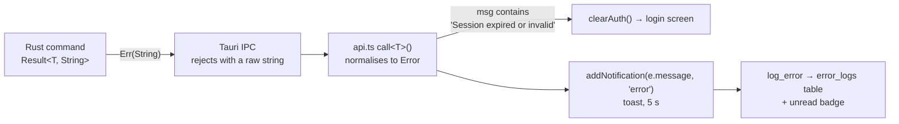

> [!abstract] In one sentence
> Every error string a SteloPTC user can actually see, grouped by where it comes from — plus the
> three full-screen or banner failure states that are not ordinary errors at all.

## How errors reach the screen

There is **no error code and no i18n layer anywhere in this system.** The `String` a Rust command
returns *is* the text the user reads.



| Layer | Type | Convention |
|---|---|---|
| `db::*` pure helpers | `DbResult<T>` = `Result<T, DbError>` | `#[from] rusqlite::Error` |
| Some `db::*` (dashboard, work_queue, sensors, notifications) | `Result<T, String>` | Already user-facing text |
| Every `#[tauri::command]` | **always** `Result<T, String>` | `.map_err(|e| format!("Failed to …: {e}"))` |

`DbError`'s four `Display` forms — `SQLite error: {0}` · `Database not found at {0}` ·
`Migration failed: {0}` · `Constraint violation: {0}` — are what the `{}` in most wrapper messages
expands to.

> [!warning] Toasts vanish; the error log does not
> `addNotification` shows a toast for **5 seconds** and then removes it. Anything raised as
> `error` or `warning` is also written to the `error_logs` table by a fire-and-forget call, along
> with a JSON snapshot of the form the user was filling in — so a failed entry is recoverable from
> **Error Log** in the sidebar even after the toast is gone.

---

## Authentication and session

| Message | Cause | What to do |
|---|---|---|
| `Invalid username or password` | Unknown user · wrong password · deactivated account · **or** the brute-force lockout is active | The single message is deliberate — it must not reveal which usernames exist, or that a lockout is in effect. A locked account clears itself 15 minutes after the last of 5 failures |
| `Session expired or invalid` | Token absent, expired (24 h TTL), or the user was deactivated | **Load-bearing string.** `api.ts` substring-matches on it to call `clearAuth()`; that is the only auto-logout path. Changing either side silently breaks it |
| `A password change is required before continuing.` | `users.must_change_password = 1` | Only `get_current_user` and `change_password` are permitted in this state. The UI shows `ForceChangePassword` instead of the app |
| `Not authenticated` | Thrown by `api.ts`'s `getToken()` **before** any IPC call, when the token store is empty | A frontend-side error, never from Rust |
| `Password must be at least 12 characters` | `MIN_PASSWORD_LEN = 12`, counted in **characters, not bytes** — four emoji are rejected | 12 was chosen over 8 because the login path is local, so guessing runs at CPU speed |
| `Password cannot be only whitespace` | `password.trim().is_empty()` | |
| `Your current password is required to change it.` | A voluntary change with no `current_password` | The forced-change path is exempt |
| `Your current password is incorrect.` | Re-authentication failed | |
| `Your new password must be different from your current one.` | No-op change | |
| `Invalid role '{}'. Must be one of: admin, supervisor, tech, guest` | `create_user` / `update_user_role` with an unrecognised role | Both share `VALID_ROLES`; they used to disagree |
| `This is the last active administrator. Promote another user to admin first.` | Demoting the final admin | Nothing else could restore one — role changes, lab profile and DB reset are all admin-only |
| `Username is required` | Empty username on `create_user` | |

> [!info] Timing is equalised on purpose
> When the username does not exist, `authenticate` still verifies against a `TIMING_EQUALIZER_HASH`
> so the "no such user" path costs the same ~100 ms as the "wrong password" path. The throttle is
> checked **before** the DB lock is taken, so a guessing loop cannot hold the global mutex.

## Permissions

Four predicates produce five message shapes. See [[Roles and Permissions]] and the per-command
gates in [[Command Reference]].

| Message | Guard | Appears in |
|---|---|---|
| `Insufficient permissions` | `can_write()` or `can_manage()` | The most common form — 20+ modules |
| `Insufficient permissions — admin or supervisor role required.` | `can_manage()` | `audit`, `anchoring`, `passport` |
| `Insufficient permissions — a write-capable role is required to <verb>.` | `can_write()` | `passport`, `registry`, `coordination`, `signed_events` |
| `Only supervisors and admins can <verb>` | `can_manage()` | `backup`, `media`, `specimens`, `locations`, `inventory`, `species`, `taxa`, `error_logs`, `analytics`, `cloud_backup`, `compliance_export` |
| `Only admins can <verb>` | `is_admin()` | `auth`, `admin`, `ncbi`, `plugins`, `sync`, `backend_config`, `notifications` (SMTP), `strains` (pedigree depth), `taxa` (re-anchor) |

Three that do not follow the pattern:

| Message | Where |
|---|---|
| `Only admins can manage field permissions` | `db::permissions::validate_admin_role` — a pure function, so it is unit-testable without a DB |
| `Data-integrity checks are restricted to administrators` | `commands/integrity.rs` |
| `Write permission required to import data` | `commands/import.rs` |
| `Cross-species hybridization override requires administrator privileges` | `create_hybridization_event` — the outer gate is only `tech`+ |

## Lab isolation

| Message | Cause |
|---|---|
| `This specimen belongs to the {owner} lab, but the {active} lab is currently active. Switch the active lab profile in Settings to work with it.` | `vocabulary::require_active_lab_profile` — **default-deny**. Every by-id specimen command routes through it, so an id obtained under another profile (from a QR scan, a bookmark, a stale tab, or a crafted IPC call) still cannot be used |
| `Specimen not found` | The id does not exist at all. Also returned by `specimen_lab_profile` |
| `'{code}' is not a valid or selectable stage` | `require_selectable_stage` — the code is not in `stages` for the active profile, or it is a terminal stage (`is_terminal = 1`). Returns false on **any** query error, so unknown codes are always rejected |

> [!important] Not-found and wrong-lab are different messages, on purpose
> A culture that exists in another lab says so and tells you how to reach it. A culture that does
> not exist says `Specimen not found`. The distinction leaks the existence of cross-lab records to
> an authenticated user, which is the intended trade: this is lab-type separation inside one
> organisation, not tenant isolation between strangers. See [[Lab Profiles]].

## Validation

| Message | Where | Rule |
|---|---|---|
| `No fields to update` | 9 modules | An update request with every field `None` |
| `Stock cannot go below zero` | `adjust_stock` | |
| `Split requires at least 2 children` | `split_specimen` | A one-child split is a passage, not a split |
| `Count must be between 1 and 26` | `preview_split_accessions` | The suffix alphabet is A–Z |
| `Cannot record a passage on an archived specimen` | `create_subculture` | |
| `Specimen is already archived — cannot record a death event` | `record_specimen_death` | A specimen dies once |
| `Cross-species hybridization is not permitted: parent strains must belong to the same species` | `create_hybridization_event` | Requires `admin_override_cross_species` **and** admin **and** a reason |
| `Cross-species override requires a documented reason` | as above | `admin_override_reason` must be non-empty after trimming |
| `A reason is required to waive a compliance flag` | `waive_compliance_flag` | |
| `A resolution note is required` | `resolve_sync_conflict` | |
| `Both device_id and device_name are required` | `register_sync_peer` | |
| `Location name is required` | `create_location` | |
| `Floor plan is not valid JSON: {}` | `save_location_layout` | The layout is parsed before it is stored |
| `Passphrase must be at least 8 characters` | `create_backup_target` | Weaker than the 12-character login rule — the passphrase protects an AES-GCM blob, not a login |
| `'{}' is not a valid 5-field cron expression` | `create_backup_target` | Validated on write even though **nothing executes the schedule** |
| `Unknown strain status: '{}'` | `validate_strain_status_transition` | |
| `Confirmation phrase did not match. Type exactly: RESET DATABASE` | `reset_database` | |
| `Unknown submission kind '{}' (expected part11 \| usda \| cites)` | `reg_submission` | |
| `A submission reference (e.g. the portal confirmation number) is required` | `mark_submission_submitted` | |
| `Submission must be 'ready' to generate a package (currently '{}')` | `generate_submission_package` | |
| `Only a 'generated' submission can be marked submitted (currently '{}')` | `mark_submission_submitted` | |
| `Refusing to write outside the attachments directory` | `upload_attachment` | Path-traversal guard |
| `Unknown attachment target type '{}'` / `Attachment target id '{}' is not a valid id` | `upload_attachment` | |
| `A reading must be linked to a specimen or a subculture` | `create_environmental_reading` | Mirrors the table-level CHECK |
| `Unknown reading_type '{}'` · `Reading value for '{}' is not a finite number` · `Sensor payload is empty` · `No recognized reading_type keys found in payload` | `db::sensors` | NaN and infinity are rejected |
| `Refusing to anchor an all-zero Merkle root (empty checkpoint)` | `prepare_checkpoint_anchor` | |
| `A Dogecoin transaction id must be 64 hexadecimal characters` | `record_checkpoint_anchor` | |
| `Anchor is already confirmed; its txid cannot be changed` | `record_checkpoint_anchor` | |

## Database constraints

These are the ones where **raw SQLite text reaches the user**, because the command wraps the error
rather than translating it.

| What the user sees | What they actually did |
|---|---|
| `Failed to create species: UNIQUE constraint failed: species.species_code` | Re-used a species code |
| `Failed to create specimen: UNIQUE constraint failed: specimens.accession_number` | Two specimens with the same accession — usually a race, since accessions are generated |
| `Failed to create strain: UNIQUE constraint failed: strains.species_id, strains.code` | Strain codes are unique **within a species**, not globally |
| `Failed to create media batch: UNIQUE constraint failed: media_batches.batch_id` | Re-used a batch id |
| `Failed to create user: UNIQUE constraint failed: users.username` | |
| `Failed to create location: UNIQUE constraint failed: locations.name` | Room names are globally unique |
| `… CHECK constraint failed: …` | A value outside an enum CHECK — e.g. an `app_config.lab_profile` outside the three allowed, or a `colonization_pct` outside 0–100 |
| `… FOREIGN KEY constraint failed` | `PRAGMA foreign_keys=ON` is set on every connection, so a dangling reference is refused |

> [!warning] The raw-text leak is a real usability gap
> `UNIQUE constraint failed: strains.species_id, strains.code` is precise and unhelpful. The command
> layer catches the error but does not classify it, so the SQLite wording goes straight to a toast.
> Nothing in the code translates constraint names into sentences.

## Import and export

`import_xlsx` never fails wholesale for a bad row. It collects `RowError { sheet, row, message }`
and returns them alongside per-sheet `{ creates, updates, skips }` counts. **`dry_run = true` rolls
the transaction back**, so the counts and errors describe what a real import *would* do.

| Row message | Sheet |
|---|---|
| `Accession number is required` | Specimens |
| `Name is required` | Media Batches · Prepared Solutions · Inventory |
| `Specimen ID is required` | Compliance · Subcultures |
| `Specimen '{}' not found` | Compliance |
| `Specimen '{}' not found — import specimens first, or use accession number in this column` | Subcultures |
| any `DbError` text | every sheet — an insert that fails is reported against its row, not aborted |

Command-level import/export failures:

| Message | Cause |
|---|---|
| `Write permission required to import data` | Role gate |
| `Could not determine exports directory` | `compliance_export` cannot resolve the app data path |
| `Invalid .steloplugin file: {}` · `Not a valid .steloplugin archive: {}` · `Failed to read manifest.json: {}` | Plugin install |
| `Manifest 'name' is required` · `Manifest 'version' is required` · `Duplicate vocabulary seed row: {}.{}` · `Vocabulary seed row for table '{}' is missing code/label` | Manifest validation |

### NCBI import — skips are reported, not swallowed

`import_ncbi_taxonomy` returns `skipped_records`, each with a reason:

| Reason | Meaning |
|---|---|
| `duplicate of an earlier record in this batch` | Two records with the same NCBI id in one paste |
| `rank '{}' is outside the taxonomy backbone (kingdom, phylum, class, order, family, genus) — species and below belong in the Species Registry` | The `taxa` table holds kingdom→genus only ([[Taxonomy Backbone]]) |

| Command error | Cause |
|---|---|
| `Only admins can import NCBI taxonomy data` | Role gate |
| `This conflict has already been resolved` | `resolve_ncbi_conflict` on a settled row |
| `Sync log entry not found: {}` | |

> [!caution] Before `v0.54.0`, out-of-backbone records were dropped with a bare `continue`
> Pasting a page of species-rank records reported "0 imported, 0 updated, 0 conflicts" and gave no
> clue why. `skipped_records` exists because of that. See [[Importing NCBI Taxonomy]].

## Federated import

All three federated importers refuse an unverifiable document rather than importing it
provisionally, and all three refuse a re-import rather than silently duplicating.

| Message | Where |
|---|---|
| `Refusing to import an unverifiable passport: {}` | `passport/store.rs` |
| `Refusing to import an unverifiable registry: {}` | `registry/store.rs` |
| `Refusing to import an unverifiable bundle: {}` | `coordination/store.rs` |
| `Registry '{}' has already been imported.` · `Bundle '{}' has already been imported.` | The `UNIQUE(direction, <x>_id)` constraint, translated |
| `Invalid passport JSON: {}` · `Invalid registry JSON: {}` · `Invalid coordination bundle JSON: {}` | Parse failure |
| `Unknown disposition '{}'.` | A decision outside the allowed set |
| `Lab name cannot be empty.` | `set_lab_name` — this is the lab's federation identity |

The `{}` above expands to one of the verification check failures:

| Check | Failure text |
|---|---|
| `format` | `Unrecognized format '{}' (expected '{}').` |
| `version` | `Unsupported passport version '{}' (expected '{}').` |
| `content_hash` | `The content hash does not match the passport's fields — it was altered after signing.` |
| `issuer_signature` | `The signature does not verify against the issuer's public key.` / `Malformed key or signature: {}` |
| `provenance_chain` | `Broken chain linkage at seq {} — prev_hash does not match the preceding entry.` · `Tampered provenance entry at seq {} — recomputed hash does not match.` · `Entries out of order at seq {} (must be ascending).` |
| `merkle_anchor` | `The Merkle root rebuilt from the provenance does not match the anchored checkpoint root.` |

## Integrity and verification results

These are not `Err` values — the command **succeeds** and returns a report whose `ok`/`verified`
flag is false. A verification that failed to *run* is a different thing from one that ran and found
tampering, and the API keeps them apart. See [[Hash-Chained Provenance]].

### Single entry — `verify_audit_entry`

| `message` | Meaning |
|---|---|
| `Hash matches — this record has not been tampered with.` | `ok: true` |
| `Hash mismatch — this record may have been tampered with!` | `ok: false` |
| `This entry has no chain data (written before the hash chain was introduced in v1.5.0).` | Pre-migration-008 row; nothing to check |
| `Entry not found.` | |

### Whole lineage — `verify_audit_lineage`

| `message` | `first_break_seq` |
|---|---|
| `All {n} entries verified — chain is intact.` | `None` |
| `Chain broken at seq {n} — prev_hash does not match the preceding entry's hash.` | the seq |
| `Tamper detected at seq {n} — stored hash does not match recomputed hash.` | the seq |
| `No chained entries found for this lineage.` | `None` |

### Checkpoint — `verify_against_checkpoint`

Three checks run in order, and the message distinguishes them:

| `message` | What it means |
|---|---|
| `Checkpoint verified — all {n} entries match the recorded Merkle root.` | Clean |
| `Merkle root mismatch — entry at seq {n} was tampered with (content no longer matches its stored hash).` | Content edited, hash not updated |
| `Merkle root mismatch — stored entry_hash values have been altered. Use chain verification for per-entry detail.` | The hashes themselves were rewritten |
| `Content tampered at seq {n} — entry_hash unchanged (Merkle root still matches) but content was modified.` | **The subtle one** — the root still verifies, so only the per-entry content check catches it |

### Portable proof — `verify_exported_proof`

| `message` |
|---|
| `Unsupported proof version '{}'.` |
| `Merkle root mismatch — the proof root does not match the checkpoint's stored root.` |

### Signed-event ledger — `verify_signed_event_ledger`

| `message` | Detects |
|---|---|
| `Ledger sequence gap — expected seq {}, found {} (an entry was removed).` | Deletion |
| `Broken chain linkage at seq {} — prev_hash does not match the previous entry.` | Reordering / removal |
| `Content tampering at seq {} — recomputed hash does not match the stored hash.` | Content edit |
| `Invalid signature at seq {} — the entry was not signed by the stated key.` | Forgery |
| `Signing key mismatch at seq {} — the entry's key differs from the user's registered key.` | Key swap |
| `Missing registered key at seq {} — user '{}' has no registered signing key to verify against (the key row was removed).` | Key-row deletion |

### Lab self-check — `run_data_integrity_check` (admin only)

Ten checks — eight declarative `ORPHAN_CHECKS` plus two bespoke ones, so `checks_run = ORPHAN_CHECKS.len() + 2`. Each returns a count and up to a few example ids.

| `check` | Severity | Title |
|---|---|---|
| `specimen_unknown_lab_profile` | critical | Specimens filed under an unrecognised lab profile (invisible in every lab) |
| `specimen_missing_species` | critical | Specimens referencing a species that no longer exists |
| `specimen_missing_strain` | high | Specimens bound to a strain that no longer exists |
| `specimen_missing_parent` | high | Specimens whose parent specimen no longer exists |
| `subculture_missing_specimen` | critical | Passages/subcultures referencing a specimen that no longer exists |
| `subculture_missing_media` | normal | Passages referencing a media batch that no longer exists |
| `strain_missing_species` | critical | Strains referencing a species that no longer exists |
| `duplicate_accession` | critical | Accession numbers used by more than one specimen |
| `audit_chain_gap` | critical | Audit lineages with a sequence gap (a history row was removed) |
| `search_index_out_of_sync` | critical | Search index disagrees with the specimen table — searches may return wrong or incomplete results. Rebuild it from Admin. |

The check itself can fail to run, and says so: `integrity check '{}' failed: {}`.

> [!tip] `specimen_missing_strain` is the one that will fire first
> `specimens.strain_id` names `strains.id` but declares **no `REFERENCES` clause**, so SQLite will
> not stop a strain being deleted out from under a culture. This check is the only thing that
> notices.

## Backup, restore and cloud

| Message | Cause |
|---|---|
| `Database file not found (using in-memory database)` | Backup attempted in degraded mode — there is no file to copy |
| `Backup file not found` · `Cannot open backup file: {}` | Restore path is wrong |
| `Backup file is not a valid SQLite database` | Header check failed |
| `File does not appear to be a valid SteloPTC backup` | It is a SQLite file, but not this schema |
| `Failed to redact SMTP credential from backup copy: {}` | **The backup file is then deleted.** `smtp_config.password` is stored in plaintext, so a copy that still contains it must not be left on disk |
| `Failed to checkpoint WAL: {}` | The WAL could not be folded into the main file before copying |
| `Not a SteloPTC encrypted backup (bad magic header)` · `Backup blob is too short to be valid` · `Unsupported backup format version {}` | Cloud-backup blob header checks |
| `Key derivation failed (out of memory?): {}` | Argon2id could not allocate |
| `Encryption failed: {}` | AES-GCM |
| `Corrupted stored config JSON: {}` · `Corrupted stored config: too short` | `backup_targets.config_encrypted` could not be decrypted — usually the wrong passphrase |
| `Target type '{}' is not yet connected for restore` / `… for sync` | Only local filesystem paths are actually wired up |

## Local AI

The backend has **no HTTP client for the internet**; `ai/ollama.rs` speaks raw HTTP to a
loopback address only.

| Message | Cause |
|---|---|
| `Failed to send request to the local AI runtime: {}` | Nothing listening at the configured base URL |
| `Failed to read response from the local AI runtime: {}` · `Chunked body truncated` · `Malformed HTTP response: no status line` · `Malformed HTTP response: no header/body separator` · `Invalid chunk size line: '{}'` | The hand-rolled HTTP parser rejected the reply |
| `Invalid port in '{}'` | Malformed base URL |
| `Ollama error: {}` · `AI server error: {}` · `{} returned HTTP {} when listing models: {}` | The runtime replied with an error |
| `Ollama response missing 'response' field` · `Response missing 'choices[0].message.content'` · `Ollama /api/tags response missing 'models' array` · `/v1/models response missing 'data' array` | Unexpected response shape |
| `There are no notes to summarize yet` · `This specimen has no passage history to base a suggestion on` | Nothing to work from |
| `This suggestion was already {}` · `Suggestion not found or already reviewed` | Double review |

---

## The three failure screens

### 1. The degraded-mode banner

A red bar pinned above everything, `role="alert"`:

> **Temporary storage — your work will NOT be saved.**
> SteloPTC could not open its database (*{error}*).
>
> It is running in TEMPORARY mode: nothing you enter will be saved. Close the app and resolve the
> problem before recording any work.

Set only when `Database::new()` fails and `run()` falls back to `Database::new_in_memory()`. The
in-memory database still gets migrations and `seed_defaults`, so **the app looks like a working,
empty lab** — the banner is the only thing preventing that mistake. For a system whose value is an
unbroken audit chain, silently losing a day of passages is the worst possible failure mode.

`get_degraded_reason` is the one command with **no token parameter at all**, precisely so the
warning can arrive before login.

> [!warning] The banner does not appear until after login
> `api.ts` routes `getDegradedReason()` through `call()`, which calls `getToken()` first and throws
> `Not authenticated` on the login screen. `App.svelte` swallows that rejection. The Rust command is
> unauthenticated and ready to answer; the wrapper is what blocks it. See [[The IPC Seam]].

If even the in-memory database cannot be created, the process panics with
`Failed to create even an in-memory database`.

### 2. The Svelte startup-error screen

`App.svelte` renders a full-page card — **SteloPTC** / `Startup Error` / *{message}* / "Try
restarting the application." — when the synchronous part of `onMount` throws. The default message
is `Failed to initialize application`.

Note what does **not** land here: a failed `getCurrentUser()` during session restore is caught
separately, logs `Session restore failed:` to the console, calls `clearAuth()`, and drops the user
on the login screen. That is a normal expiry, not a startup failure.

`startupError` and `degradedReason` are both `$state` for a reason recorded in the source: this
component uses runes, and in runes mode a plain `let` is not reactive — assigning to it would update
the variable and never re-render, silently hiding the screen.

### 3. The pre-mount loader error

Before any module code runs, `index.html` installs `window.onerror` and an `unhandledrejection`
listener that swap the boot spinner for a red box:

> **Application Error**
> *{message}*
>
> *Try restarting the app. If the problem persists, contact support.*

This is the only handler that catches a **module import failure**, when `App.svelte` never mounts at
all. The `#app-loader` overlay is hidden only by `body.app-ready`, which `main.ts` adds after
`mount()` returns — so a failed mount leaves the loader (and its error box) on screen rather than
showing a blank window.

### Boot-time backend failures

Two errors from Tauri's `.setup()` prevent the app from starting at all, and surface as the Tauri
runtime's own failure rather than in any of the three screens above:

| Message | Cause |
|---|---|
| `Migration error: {e}` | `run_all` failed. See the transaction-hazard note in [[Migrations]] |
| `Seed error: {e}` | `seed_defaults` failed on an empty database |

### One warning that only reaches stderr

```
WARN: the database mutex was poisoned by an earlier panic; recovering.
The operation that panicked was rolled back.
```

`AppState::db()` recovers from `Mutex` poisoning instead of propagating it. Propagating would turn a
single panic into an app that keeps running but fails every command with an opaque
"poisoned lock" string. Recovery is sound because rusqlite rolls back any in-flight transaction as
the guard drops during the unwind. **In a bundled desktop app nobody sees stderr**, so this is
invisible in practice — if commands start behaving oddly after an unexplained hiccup, this is the
thing to look for.

**Back to [[Home]]**

#steloptc #reference #errors #troubleshooting
