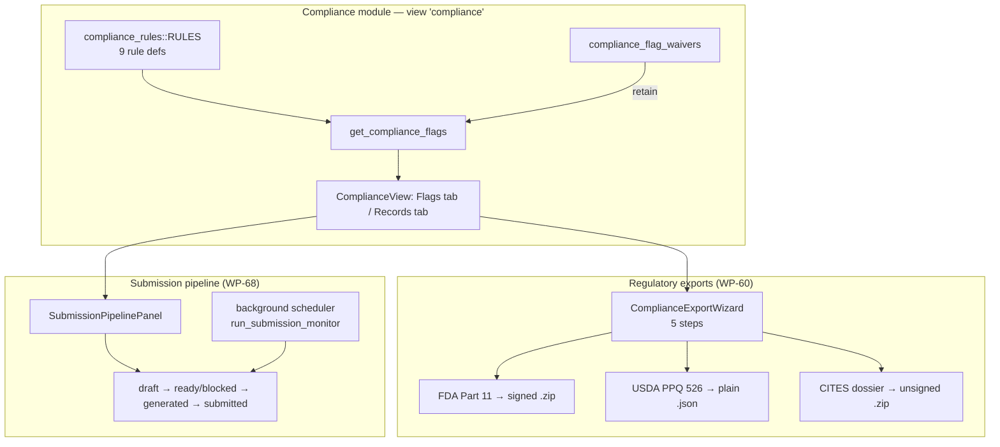
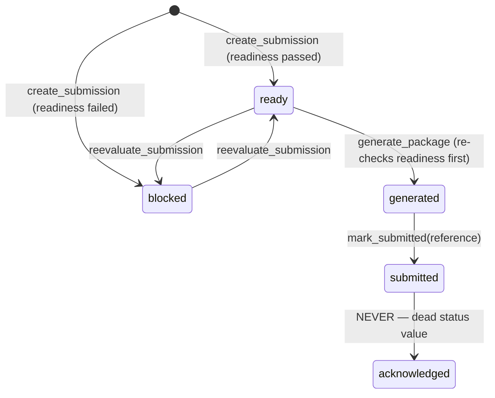
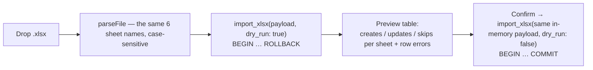

> [!abstract] In one sentence
> Four separate things wear the word "export": a **flag engine** that surfaces compliance problems
> (with waivers to silence them), a **regulatory bundle builder** that writes signed or unsigned
> files to disk, a **submission pipeline** that tracks readiness and auto-generates packages on a
> timer, and the ordinary **CSV / JSON / Excel** data path — and none of them transmit anything to
> anyone.

---

> [!danger] Nothing here submits to any agency, ever
> Every "export" writes a file to the local disk and returns its path. There is no HTTP client, no
> credentials store, no portal client, and no mail step for any regulatory artefact. `mark_submitted`
> records that *a human* submitted it, by storing the confirmation reference they type in.

---

## 1 · Compliance flags

`get_compliance_flags` (any authenticated session) returns
`Vec<ComplianceFlag { specimen_id, accession_number, species_code, flag_type, message, severity,
last_test_date }>`. Nine rules live in `compliance_rules::RULES` — a pure module with no DB and no
I/O:

| `flag_type` | Title | Severity | Scope |
|---|---|---|---|
| `expired_permit` | Expired regulatory permit | critical | all profiles |
| `quarantine_no_release` | Quarantined without scheduled release | high | all profiles |
| `positive_not_quarantined` | Positive disease test but not quarantined | critical | all profiles |
| `missing_hlb_test` | Citrus specimen missing HLB test | critical | `plant_tissue_culture` |
| `myco_open_contamination` | Open contamination — culture not discarded | high | `mycology` |
| `myco_overdue_transfer` | Overdue for transfer | normal | `mycology` |
| `myco_slow_colonization` | Slow colonization | normal | `mycology` |
| `missing_mycoplasma_test` | Missing / overdue mycoplasma test | high | `cell_culture` |
| `environmental_out_of_range` | Latest environmental reading out of range | high | all profiles |

Four tunables come from `app_settings` via `read_setting`:
`myco_transfer_interval_days` (default `21`), `myco_slow_colonization_pct` (`30`),
`myco_slow_colonization_days` (`7`), `mycoplasma_test_interval_days` (`90`).

`is_rule_active(flag_type, profile)` is deliberately **fail-open** for an unknown `flag_type` — a
plugin-supplied rule is not silently disabled.

> [!danger] Profile gating is broken, and it is still broken at `v0.54.0`
> `commands/compliance.rs:235`, `commands/compliance.rs:644` and `reg_submission/mod.rs:168` read the
> lab profile with `queries::read_setting(conn, "lab_profile", "plant_tissue_culture")` — which
> queries the **`app_settings`** table. The lab profile actually lives in **`app_config.lab_profile`**
> (migration 015), written only by `commands/admin.rs::set_lab_profile`. Nothing ever inserts a
> `lab_profile` row into `app_settings`.
>
> Consequences, verified against the code:
> - `get_compliance_flags` always evaluates with `profile = "plant_tissue_culture"`, so
>   **`missing_hlb_test` fires in every lab** — precisely the cross-profile leak WP-74 claims to have
>   closed — and **`myco_*` and `missing_mycoplasma_test` never fire at all**.
> - `list_compliance_rules` always returns the PTC rule set.
> - `reg_submission`'s USDA `profile_ptc` readiness check always passes.
>
> The unit tests in `compliance_rules/mod.rs` pass because they call `is_rule_active` directly. The
> fix is one line per site: `crate::db::vocabulary::active_profile(conn)`. Note the irony that the
> individual **flag SQL blocks** are correctly scoped —
> `AND s.lab_profile = COALESCE((SELECT lab_profile FROM app_config WHERE id = 1), …)` — so the rows
> are right and the rule *selection* is wrong.

> [!warning] Two smaller gating faults
> - **All three mycology rules hang off one `flag_type`.** The whole
>   `get_mycology_compliance_flags` call is wrapped in `if active("myco_open_contamination")`.
>   `myco_overdue_transfer` and `myco_slow_colonization` appear in `list_compliance_rules` but
>   `is_rule_active` is never consulted for them, so a future per-rule toggle would silently not work.
> - **The environmental block is the only rule query with no `lab_profile` filter.** An out-of-range
>   reading on another profile's specimen surfaces in the active lab's flag list.

### Environmental readings

`environmental_out_of_range` is evaluated by the pure `monitoring` module against compile-time
inclusive ranges:

| `reading_type` | min | max |
|---|---|---|
| `temp_c` | 18.0 | 28.0 |
| `humidity_pct` | 40.0 | 95.0 |
| `co2_ppm` | 300.0 | 5000.0 |
| `light_lux` | 500.0 | 15000.0 |
| `ph` | 5.4 | 6.2 |
| `custom` / unknown | never flags | |

Message form: `"Temperature 31.5 above the 18.0–28.0 range"`. There is **no per-lab threshold
editor** and **no hardware transport** — `environmental_readings.source` records provenance, and
`manual` is the only path implemented.

---

## 2 · Waivers — silencing a flag honestly

`ComplianceView.svelte` opens a modal per flag: a **required** reason and an optional expiry date.
The dialog states the semantics itself: *"The flag stops appearing until the waiver expires or is
revoked; the underlying condition is unchanged."*

| Command | Gate | Notes |
|---|---|---|
| `waive_compliance_flag(flag_type, specimen_id, reason, expires_at?)` | `can_write` | empty reason → *"A reason is required to waive a compliance flag"*; audit action `waive` |
| `list_compliance_waivers` | any authenticated | `revoked = 0 AND (expires_at IS NULL OR expires_at >= today)` |
| `revoke_compliance_waiver(waiver_id)` | `can_write` | *"Waiver not found or already revoked"*; audit action `revoke`; toast: *"Waiver revoked — the flag will reappear if still applicable."* |

Semantics: `expires_at = None` is **permanent**; otherwise active while `expires_at >= today` by ISO
lexicographic comparison. Waivers are applied last — `get_compliance_flags` computes every rule
block, then `flags.retain(|f| !is_waived(…))`.

Table: `compliance_flag_waivers(id, flag_type, specimen_id ON DELETE CASCADE, reason NOT NULL,
waived_by, waived_at, expires_at, revoked DEFAULT 0, revoked_at)` with
`idx_flag_waivers_lookup(specimen_id, flag_type, revoked)` (migration 052).

---

## 3 · Regulatory exports (WP-60)

**Compliance → Export Wizard**, five steps: *1. Select Regulation Type · 2. Select Scope ·
3. Preview · 4. Signing Key · 5. Confirm and Generate*. Step 4 is skipped for USDA and CITES —
because, as below, neither is signed.

Every command is `can_manage()` and every one writes an audit row
`action="export", entity_type="compliance_bundle"`. Output lands in
`<db parent>/compliance_exports/` and the command returns
`ComplianceExportResult { ok, file_path, size_bytes }`.

| Export | Scope inputs | Output | Signed? |
|---|---|---|---|
| **FDA Part 11** `export_fda_part11_bundle(from, to, lab_name)` | date range | `fda_part11_{from}_{to}_{YYYYmmdd_HHMMSS}.zip` — 4 documents + 4 `.sig` files + `signing_public_key.b64` | **yes** |
| **USDA PPQ 526** `export_usda_permit(specimen_ids, authorized_scientist)` | specimen picker + scientist name | `usda_ppq526_{ts}.json` — **bare JSON, no zip** | **no** |
| **CITES** `export_cites_dossier(root_specimen_id, cites_appendix)` | root specimen + appendix string | `cites_dossier_{root}_{ts}.zip` containing **only** `cites_dossier.json` | **no** |

> [!warning] `docs/regulatory-exports.md` overstates this
> Its *"Independent verification"* section says you can check a **Part 11 or CITES** export's
> signatures given the document, its detached signature and the bundled public key.
> **`export_cites_dossier` produces no signature and no public key** — it zips one JSON file.
> `export_usda_permit` writes bare JSON with no zip and no signature either. Only the Part 11 bundle
> (and WP-68 submission packages) are signed. Believe the code.

### What is inside each

**Part 11** — four documents: `part11_cover.json` (lab name, `CARGO_PKG_VERSION`, range, entry count,
a fixed attestation, and a `chain_verification_verdict` of `"verified"` or `"broken"`),
`part11_audit_trail.json` (every `audit_log` row in range including `lineage_id`, `chain_seq`,
`prev_hash`, `entry_hash`), `part11_verification.json`, and `part11_user_activity.json` (LEFT JOIN,
so zero-activity users still appear).

`verify_audit_range(conn, from, to)` re-implements per-lineage chain verification as a pure,
connection-only function. Linkage is only enforced once a previous entry for that lineage has been
seen *and* `chain_seq != 0`, so a date-restricted window anchors at its first in-range entry rather
than reporting a false break. See [[Hash-Chained Provenance]] and [[Trust Layer]].

**USDA** — one JSON with `form = "PPQ Form 526 (pre-fill)"`, the specimens (accession, binomial,
common name, provenance, source plant, existing permit number and expiry), quarantine
`compliance_records`, and a `note` disclaiming APHIS submission.

> [!important] The USDA builder *refuses* a cross-lab specimen rather than filtering it
> It calls `require_active_lab_profile` for every id. The source comment states the reason plainly: a
> silently incomplete permit application is worse than one that fails to generate.

**CITES** — `accession_number`, the operator-supplied `cites_appendix` (**SteloPTC has no CITES
species database** — this is a free-text claim), a Darwin Core block rooted at the species' first
`taxon_path` element, the chain of custody
(`WHERE id = ?1 OR parent_specimen_id = ?1 OR root_specimen_id = ?1`), propagation records, and a
**full-history** `verify_audit_range("0000-01-01", "9999-12-31")` summary.

### The signing key

`get_signing_public_key` (`can_manage`, *"Only supervisors and admins can view the signing key"*)
returns the base64 Ed25519 public key, **creating the keypair on first call**. `sign_and_zip` emits,
per document, a `"{name}.sig"` holding the base64 signature, plus the document itself, plus
`signing_public_key.b64` at the end.

> [!warning] Private keys are stored in plaintext
> `signing_keys.private_key_b64` and `user_signing_keys.private_key_b64` sit unencrypted in SQLite
> and travel in every local and cloud backup. Only the SMTP password is redacted from backups.

---

## 4 · The submission pipeline (WP-68)

`SubmissionPipelinePanel.svelte`, opened from Compliance. Kinds are `part11 | usda | cites`
(`from_code` error: *"Unknown submission kind '{}' (expected part11 | usda | cites)"*).

Readiness returns `Readiness { kind, ready, blocking_count, checks: Vec<ReadinessCheck> }`:

| Kind | Check keys |
|---|---|
| `part11` | `date_range` (non-empty, `from <= to`), then `has_entries`, `chain_verified`; always `has_users` |
| `usda` | `profile_ptc`, `has_specimens`, `specimens_exist`, `scientific_names`, `no_expired_permits` |
| `cites` | `root_specimen`, `appendix_set`, `chain_verified` (full history) |

Transitions refuse out-of-order moves with exact strings —
*"Submission must be 'ready' to generate a package (currently '{x}')"*,
*"Only a 'generated' submission can be marked submitted (currently '{x}')"*,
*"A submission reference (e.g. the portal confirmation number) is required"*, and
*"Submission is not currently ready — resolve the blocking checks first."*

> [!success] The automation is real — locally
> `run_submission_monitor` is wired into the background scheduler in `lib.rs`, on the same tick as
> notification dispatch, at `app_settings.notification_check_interval_minutes` (default **15**). It
> re-evaluates every non-terminal submission and, for those that become `ready` **and** carry
> `auto_generate = 1`, generates the package. Errors go to stderr and never stop the loop.
>
> A generated package gets a **top-level detached Ed25519 signature over the exact `.zip` bytes**,
> stored in `regulatory_submissions.package_signature` — an extra guarantee the direct WP-60 exports
> do not have.

> [!caution] `acknowledged` is shipped-but-dead
> The CHECK constraint allows it, migration 048's comment describes it, and
> `docs/regulatory-exports.md` documents it. **No code path ever sets it.**
> `reevaluate_submission` treats it as terminal.

**Every command in `commands/reg_submission.rs` is `can_manage`, including `list_submissions`** —
*"Only supervisors and admins can manage regulatory submissions."*

---

## 5 · Data export — CSV, JSON, Excel

`ExportManager.svelte` (view `export`), three buttons, all any-authenticated:

| Button | Command / path | Filename |
|---|---|---|
| CSV | `export_specimens_csv` | `specimens_{YYYY-MM-DD}.csv` |
| JSON | `export_specimens_json` | `specimens_{YYYY-MM-DD}.json` |
| Excel | client-side `xlsx`, six API reads | a 6-sheet workbook |

Both Rust commands share one `EXPORT_SQL` — **lab-scoped**
(`WHERE s.is_archived = 0 AND s.lab_profile = ?1`), 28 columns, ordered by `accession_number`.

> [!important] An export is not a complete record of the lab
> Archived specimens are excluded from both. And **neither command writes an audit entry** —
> exporting the lab's entire dataset leaves no trace in the chain.

> [!success] CSV formula neutralisation
> `escape_csv` does RFC 4180 quoting **plus** neutralisation: a value starting with
> `= + - @ TAB CR` is prefixed with an apostrophe and quoted, because Excel / LibreOffice / Sheets
> execute `"=cmd|'/c calc'!A1"` even when quoted. The accepted trade-off is documented: a genuine
> `-5` becomes `"'-5"`. Only the leading character triggers it, so `pH=5.8` is untouched. Ten unit
> tests pin the behaviour.

The Excel workbook has **six sheets in this exact order**: `Specimens`, `Subcultures`,
`Media Batches`, `Prepared Solutions`, `Inventory`, `Compliance`. Column layouts live in
`src/lib/exportUtils.ts`, whose inline comments name the Rust model each field read must match —
`SKILLS.md` §7 records that a typo there silently ships a blank column.

---

## 6 · Excel import

`ImportManager.svelte` (view `import`) is a strict **two-phase dry run**:

A missing sheet yields
`Missing sheet(s): {names}. Make sure this file was exported by SteloPTC.`
`import_xlsx` is `can_write` (*"Write permission required to import data"*). Row numbers in errors
are `index + 2` — 1-based with a header row. Processing order inside the transaction is
**Specimens → Media → Prepared Solutions → Inventory → Compliance → Subcultures**, which is *not* the
struct field order.

Matching keys:

| Sheet | Match key | Lab-scoped? |
|---|---|---|
| Specimens | `accession_number = ? AND lab_profile = ?` | **yes** — a cross-lab collision falls through to INSERT and is rejected by the UNIQUE constraint as a visible row error rather than silently mutating another lab's culture |
| Media | `batch_id`, else `name` | no |
| Prepared Solutions | `name` | no |
| Inventory | `name` | no |
| Compliance | specimen resolved by `id = ?1 OR accession_number = ?1`, then always INSERT | no |
| Subcultures | specimen resolved the same way, then `(specimen_id, passage_number)` | no |

> [!warning] Four honest problems with the importer
> - **No audit entries and no signed events are written for any imported row.** A bulk import is
>   invisible in the audit log, which is a real hole in [[Hash-Chained Provenance]].
> - **The stage list is hardcoded and plant-tissue-culture only** — `explant, callus, suspension,
>   protoplast, shoot, root, embryogenic, plantlet, acclimatized, stock, archived, custom`. Anything
>   else becomes `stage = "custom", custom_stage = <raw>`; blank becomes `stock`. This bypasses
>   `require_selectable_stage` and the `stages` vocabulary table entirely, so a mycology import lands
>   every row in `custom`. See [[Lab Profiles]].
> - **An unknown species code with a non-empty species name auto-creates a stub `species` row** —
>   genus from the first word, `species_name` from the rest — with no audit entry. An unknown code
>   with no name leaves `species_id = NULL`, which then violates `NOT NULL` and surfaces as a row
>   error.
> - `xlsx` (the npm package) carries **unfixed prototype-pollution and ReDoS advisories** with no
>   upstream fix, reachable from exactly this user-facing import. Disclosed in `CHANGELOG.md`
>   `[1.53.2]`.

> [!success] Fixed in `v0.54.0`
> A species stub created by the importer now calls `link_species_to_genus`. Before that, a lab that
> imported a spreadsheet got a full Species Registry and an empty Taxonomy Navigator — the same
> symptom as the `create_species` bug, arriving through a different door. See [[Taxonomy Backbone]].

---

## 7 · Printing

`src/lib/printUtils.ts` exports `deliverPrint`, shared by `SpecimenList` (the batch report,
groupable by stage / health / none), `SpecimenDetail`, and `QrModal`.

Strategy: prefer a popup window so the report renders in isolation; fall back to an in-page hidden
frame keyed on a stable `frameId` when `window.open` is unavailable — which is the normal case in
Tauri and restricted WebViews.

> [!important] `window.print()` is always called from the parent WebView context
> Never from an inline `<script>` in the popup. Tauri's CSP `script-src 'self'` blocks inline scripts
> in popup windows, which would silently prevent the print dialog from ever appearing.

Defaults: `@page { size: auto; margin: 0.65in 0.7in }`, overridable per call.

---

## Shipped vs stub, in one table

| Capability | Verdict |
|---|---|
| Compliance rule catalogue + waivers | Catalogue and waiver logic correct and unit-tested; **profile gating broken** by the `app_settings` / `app_config` key mismatch |
| Environmental monitoring (WP-78) | **Shipped** for manual readings; thresholds hardcoded; no lab-profile filter on its flag query |
| FDA Part 11 bundle | **Shipped and signed** |
| USDA PPQ 526 pre-fill | **Shipped, unsigned JSON**; refuses cross-lab specimens |
| CITES dossier | **Shipped, unsigned zip**; appendix is operator-asserted |
| Submission pipeline (WP-68) | **Shipped incl. background auto-generation**; no portal submission; `acknowledged` dead |
| CSV / JSON / Excel export | **Shipped**; lab-scoped; excludes archived; unaudited |
| Excel import | **Shipped**; two-phase dry run; unaudited; PTC-only stage list |
| Printing | **Shipped** |

---

## Where to look

| Concern | File |
|---|---|
| Flag evaluation, waivers, compliance records | `src-tauri/src/commands/compliance.rs` |
| The pure rule catalogue and waiver predicates | `src-tauri/src/compliance_rules/mod.rs` |
| Environmental ranges | `src-tauri/src/monitoring/mod.rs` |
| Bundle builders and chain verification | `src-tauri/src/compliance_export/bundle.rs` |
| Signing, zipping, the three export commands | `src-tauri/src/compliance_export/`, `src-tauri/src/commands/compliance_export.rs` |
| Submission state machine and monitor | `src-tauri/src/reg_submission/mod.rs`, `src-tauri/src/commands/reg_submission.rs` |
| CSV / JSON export SQL and escaping | `src-tauri/src/commands/export.rs` |
| Excel import | `src-tauri/src/commands/import.rs`, `src/lib/importUtils.ts` |
| Export column layouts | `src/lib/exportUtils.ts` |
| Print delivery | `src/lib/printUtils.ts` |
| Views | `ComplianceView.svelte`, `ComplianceExportWizard.svelte`, `SubmissionPipelinePanel.svelte`, `ExportManager.svelte`, `ImportManager.svelte` |

---

## Related

[[Trust Layer]] · [[Hash-Chained Provenance]] · [[Lab Profiles]] · [[Roles and Permissions]] ·
[[Federated Exchange]] · [[Daily Bench Work]] · [[Database Schema]] · [[Command Reference]] ·
[[Failure Reference]] · [[Shipped vs Dormant]]

---

**Back to [[Home]]**

#compliance #export #workflow
