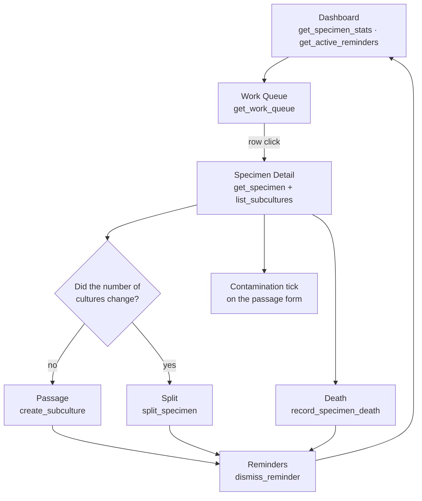

> [!abstract] In one sentence
> The loop a technician actually runs — dashboard, then work queue, then one specimen at a time:
> record a passage or a split, flag contamination, record a death, clear the reminders — where the
> only irreversible decision of the day is **passage vs. split**, because it is what the lineage
> tree is built from.

---

## The loop



Every step is one Tauri command through [[The IPC Seam]]; nothing in this loop touches the network.

---

## 1 · The dashboard, and what each number is actually counting

`Dashboard.svelte` fires ten reads in one `Promise.all` on mount. The stat cards are not all scoped
the same way, and the `title=` tooltips in the source are the authoritative statement of each:

| Card | Counts |
|---|---|
| Active Specimens | non-archived, **current [[Lab Profiles\|lab profile]] only** |
| Total Specimens | active + archived, current profile |
| Quarantined | active + `quarantine_flag = 1`, current profile |
| Recent Subcultures | passages on current-profile specimens in the **last 7 days** |
| Archived | current profile |
| Compliance Flags | open flags — see the profile-gating warning in [[Compliance and Export]] |
| Low Stock | inventory below `minimum_stock` |
| Contaminated / Contamination % | active current-profile specimens with ≥ 1 contaminated vessel event |
| Overdue | past the species' `default_subculture_interval_days` |

Panels below the cards: Upcoming Reminders, Compliance Alerts, by-stage and by-species bars,
Subculture Schedule, Contamination Overview, Lab Map Overview, Inventory Alerts, and — under the
`cell_culture` profile — Passages Due, Mycoplasma overdue, Vials by Line, Cultures Needing Attention.

> [!info] The dashboard is the *summary*; the work queue is the *task list*
> `Dashboard` renders `FirstRun.svelte` instead of stats when `stats.total_specimens === 0`. A
> brand-new install therefore shows an onboarding panel, not an empty grid.

---

## 2 · The work queue — five rules, evaluated in order

`get_work_queue` is a 16-line pass-through to `db::work_queue::compute_work_queue_items`. It is
**fully lab-scoped**: each of the five sub-queries appends `AND {active_lab_sql("s")}`.

| # | `reason_code` | Fires when | `urgency` |
|---|---|---|---|
| 1 | `quarantine` | `quarantine_flag = 1` and the release date is NULL or already past | `critical` |
| 2 | `contamination` | the latest subculture (`MAX(passage_number)`) has `contamination_flag = 1` | `critical` |
| 3 | `no_passages` | `subculture_count = 0` | `high` |
| 4 | `subculture_due` | `subculture_count > 0`, species interval `> 0`, and `days_since_last_passage - interval >= -3` | `high` at ≥ 14 days overdue, else `normal` |
| 5 | `media_expired` | the latest passage's media batch has `expiration_date < today` | `high` |

`WorkQueueItem` carries `days_overdue`: **positive = overdue, negative = due in N days,
`None` = not date-based**. Final sort is `urgency_rank` ascending (`critical=0, high=1, else 2`),
then `days_overdue` descending.

The reason strings are user-visible and exact — *"Subculture overdue by {n} days"*,
*"Contamination detected — check required ({n} days ago)"*,
*"Media batch '{name}' expired {n} day(s) ago — media change needed"*.

`WorkQueue.svelte` is read-only. It sets the amber sidebar badge (`workQueueCount`) and a row click
runs `selectedSpecimenId.set(id); navigateTo('specimen-detail', id)`.

> [!warning] Rule 3 does not dedupe against rules 1 and 2
> Rules 4 and 5 skip specimens already claimed by a higher-priority rule; rule 3 does not. A
> quarantined specimen that has never been passaged appears **twice** — once as `quarantine`, once
> as `no_passages`. `WorkQueue.svelte` keys rows on `specimen_id + reason_code`, so both render.
>
> This is also the sole source of notification candidates, so the duplicate propagates there too.

---

## 3 · The passage-vs-split decision

> [!danger] Get this right at the bench, not afterwards
> **Did the number of cultures on the shelf change?** No → **passage**. Yes → **split**.
>
> This is not editable later. A passage writes one `subcultures` row on the specimen's own audit
> lineage; a split archives the parent and mints N new specimens whose audit entries **share the
> parent's `prev_hash`**, making the fork cryptographically visible. Correcting a mis-recorded event
> means writing correction entries, never rewriting the chain — see [[Hash-Chained Provenance]].

Full mechanics, counters, and genealogy arithmetic live in [[Specimens Strains and Species]]. What a
technician needs at the bench:

| | Passage | Split |
|---|---|---|
| UI | *Record Passage* on `SpecimenDetail` | the same form with **Split** toggled on |
| Command | `create_subculture` (`can_write`) | `split_specimen` (`can_write`) |
| Accession | unchanged | `…-001A`, `…-001B`; nested splits chain `…-001B` → `…-001BA` |
| Minimum | 1 | 2 — *"Split requires at least 2 children"* |
| Preview | — | `preview_split_accessions` pre-fills the child accessions, non-fatally |

`SpecimenDetail.svelte` keeps `splitChildren` in sync with `splitCount` through an `$effect`, and
routes both paths through one `handlePassage` submit handler. A split additionally opens a
confirmation step (`showSplitConfirm`) before `executeSplit` runs — the only confirm in the loop.

### What a passage silently also does

`create_subculture` is not just a log entry. Inside one transaction it:

- refuses an archived specimen — *"Cannot record a passage on an archived specimen"*;
- sets `passage_number = subculture_count + 1` — **per specimen row**, not the lineage-absolute number;
- pushes `specimens.location ← location_to` when given, so **a passage is how a culture moves**;
- pushes `specimens.health_status ← request.health_status` when given;
- accumulates `pdl_gained` into `specimens.cumulative_pdl`;
- writes `log_audit("subcultured", …)` on the specimen's lineage.

> [!tip] The media-date tripwire
> An `$effect` in `SpecimenDetail` warns when the selected media batch was **prepared after** the
> passage date. It is a warning, not a block.

### Post-split check-ins

Each split child may carry `reminder_days`. When set and `> 0`, `split_specimen` inserts a
`reminders` row inside the same transaction:
`title = "Check-in: {accession} ({n} days post-split)"`, `reminder_type = 'custom'`,
`urgency = 'normal'`, due date computed with SQLite `date(?, '+N days')`. This and
`create_reminder` are the only two writers of the `reminders` table.

---

## 4 · Flagging contamination

> [!important] Three columns, three different meanings
> | Column | Means | Set from |
> |---|---|---|
> | `subcultures.contamination_flag` | observed **during this passage** | the tick on the passage form |
> | `specimens.contamination_flag` / `contamination_notes` | recorded **at archive time**; inherited by split children | `split_specimen`, archive paths |
> | `specimens.quarantine_flag` | a **regulatory hold** — a different concept entirely | `update_specimen`, compliance |
>
> The work queue's `contamination` rule reads the first. Its `quarantine` rule reads the third.
> Flagging a culture as contaminated does **not** quarantine it.

Contamination inheritance on a split is deliberately sticky and unit-tested:

```
effective = parent.contamination_flag != 0 || request.contamination_flag == Some(true)
```

A contaminated parent produces contaminated children whether or not the operator ticks the box.

Mycology labs additionally get `subcultures.contaminant_type` — `trich`, `wet_rot`, `cobweb`,
`pin_mold`, `mycelium_abort`, `other`. That column has **no `CHECK` constraint**; the list in
`src/lib/profile.ts` is the de facto vocabulary.

---

## 5 · Recording a death

Death is not a separate screen. `isDeathMode` is a **derived UI state** in `SpecimenDetail.svelte`:

```ts
isDeathMode = showPassageForm && passageHealthValue === 0
              && !subcultureForm.health_unknown && !isSplitting
```

Drag the health slider to `0` (Dead) on the open passage form and the submit routes to
`record_specimen_death` instead of `create_subculture`. The health scale is
`0 Dead · 1 Poor · 2 Fair · 3 Good · 4 Healthy`, with `-1` meaning *Unknown / Awaiting* — chosen by
the "unknown" checkbox, which is why `health_unknown` is part of the `isDeathMode` predicate.

`record_specimen_death` differs from an archive in four ways:

- it inserts a `subcultures` row with `event_type = 'death'` and `health_status = '0'`;
- it **does not increment `subculture_count`** — a death is not a passage;
- it refuses an already-archived specimen: *"Specimen is already archived — cannot record a death event"*;
- it writes its audit entry with `?` rather than `.ok()` (so a failed audit aborts the death) and
  emits **two** signed events, `specimen_died` and `specimen_archived`, because those are two facts
  a verifier may need to check independently.

> [!danger] Archival is one-way
> No command un-archives a specimen. `delete_specimen` and `bulk_archive_specimens` are soft
> deletes; there is no hard-delete path for a specimen anywhere in the command layer.

`SpecimenDetail`'s `realPassageCount` excludes synthetic split events and `event_type === 'death'`,
so a dead culture's passage count does not tick up on the header.

---

## 6 · Closing out reminders

`ReminderList.svelte` (view `reminders`) lists everything; the dashboard panel shows only what
`get_active_reminders` returns — `status IN ('active','snoozed') AND due_date <= date('now','+7 days')`.

| Action | Effect |
|---|---|
| **Snooze** *(pick 1–N days)* | `status = 'snoozed'`, `snooze_count += 1`, `due_date = date(due_date, '+n days')`; `n` is clamped to `1..=365` |
| **Dismiss** | `status = 'dismissed'` |

> [!important] Snoozing twice escalates you
> Once `snooze_count >= 2`, `dismiss_reminder` **forces `urgency = 'critical'`**. Repeatedly pushing
> a reminder back makes it louder, not quieter. Audit action is `"snooze"` or `"dismiss"`.

> [!warning] `get_active_reminders` sorts urgency lexicographically
> The `ORDER BY` is `urgency DESC, due_date ASC` over the raw strings, so the real order is
> `normal > low > high > critical` — **`critical` sorts last**. The dashboard's "Upcoming Reminders"
> panel therefore shows the least urgent items first. Read the badge, not the position.

---

## Batch work, when the loop is per-shelf rather than per-culture

`SpecimenList.svelte` carries a checkbox column and three batch actions over `selectedIds`:

| Action | Command | Note |
|---|---|---|
| Move | `bulk_update_location` | composes the same ` / `-joined address string — see [[Drawing the Lab]] |
| Advance stage | `bulk_update_stage` | re-validates the stage against the profile vocabulary |
| Archive | `bulk_archive_specimens` | soft, and signed (`SPECIMEN_ARCHIVED`) |

The list also hosts QR (`QrModal`, `QrScanner`) and the print report. Scanning writes a `qr_scans`
row via `store_qr_scan`; QR payloads the app mints are `"STELO:{accession_number}"`, and **nothing in
the backend parses that prefix** — resolution is entirely a frontend concern.

---

## Honest limits

> [!warning] Known rough edges on this path at `v0.54.0`
> - **`update_subculture` has no lab guard and no archived-parent check.** A passage record on any
>   specimen in any lab can be edited by any writer who knows the subculture id. Editable fields are
>   only `notes, observations, vessel_type, location_to, contamination_flag, contamination_notes,
>   colonization_pct, contaminant_type`.
> - **`dismiss_reminder` has no role gate at all** — any authenticated session, including `guest`,
>   can snooze or dismiss. See [[Roles and Permissions]].
> - **Reminders are not lab-scoped.** The join to `specimens` is a LEFT JOIN purely for the
>   accession label.
> - **`update_specimen` does not re-validate `stage`** against the vocabulary, unlike
>   `create_specimen` and `bulk_update_stage`.
> - **Four unlinked mechanisms move a specimen**: `update_specimen{location}`,
>   `bulk_update_location`, `create_subculture{location_to}`, and `set_specimen_location_pin` —
>   and only the last touches the `locations` table. See [[Lab Layout Model]].
> - **Vessel types are a hardcoded 15-item array** in `SpecimenDetail.svelte` — one of the few
>   domain vocabularies that is not data-driven.
> - `SplitChild` accepts `media_batch_id` and `vessel_type` at the IPC boundary and **never writes
>   them**; likewise `observations`, `employee_id`, `temperature_c`, `ph`, `light_cycle` on the
>   split request itself.

---

## Where to look

| Concern | File |
|---|---|
| Queue rules | `src-tauri/src/db/work_queue.rs` (command shim: `src-tauri/src/commands/work_queue.rs`) |
| Passage / death | `src-tauri/src/commands/subcultures.rs` |
| Split | `src-tauri/src/commands/specimens.rs` |
| Reminders | `src-tauri/src/commands/reminders.rs` |
| The detail screen | `src/lib/components/SpecimenDetail.svelte` (2703 lines — the largest component) |
| The queue screen | `src/lib/components/WorkQueue.svelte` |
| Health / stage formatting | `src/lib/utils.ts` — `healthLabel`, `stageFmt`, `effectiveHealth` |

---

## Related

[[Specimens Strains and Species]] · [[Hash-Chained Provenance]] · [[Lab Profiles]] ·
[[Drawing the Lab]] · [[Compliance and Export]] · [[Command Reference]] · [[Failure Reference]] ·
[[Roles and Permissions]]

---

**Back to [[Home]]**

#lab-ops #workflow #work-queue
