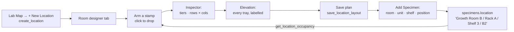

> [!abstract] In one sentence
> Draw a room's furniture on a grid, give each piece its shelf and tray breakdown, save it — and the
> addresses that drawing generates become the location dropdowns in **Add Specimen**, replacing the
> hardcoded Room 1–5 / Rack A–D list that shipped before `v0.54.0`.

---

## The path, end to end



The model behind it — geometry, capacity, the address grammar, why the plan is a JSON blob — is
[[Lab Layout Model]]. This note is the operator path and what each step writes.

---

## 1 · Create the location

Lab Map (`lab-map`) → **+ New Location**. Name is required (blank →
*"Location name is required"*); description, floor-plan image, and pin X/Y are optional and belong to
the **older** pins-and-heat-map system, not to the drawing.

`create_location` needs `can_write()`. `locations.name` is `NOT NULL UNIQUE`.

> [!important] Two location systems live side by side, and the designer only uses one
> | System | Column | Written by |
> |---|---|---|
> | **Drawn plan** | `locations.layout_json` → generates `specimens.location` (free text) | `save_location_layout` |
> | **Map pin** | `specimens.location_id → locations.id` | `set_specimen_location_pin` only |
>
> Nothing synchronises them. A specimen can hold `location = "Room B / Rack 2"` and a
> `location_id` pointing at Room A, and no check detects it. The floor-plan *image* and the pin
> coordinates belong to the pin system; the designer never reads them.

---

## 2 · Switch to the Room designer tab

`LabMap.svelte` has two mode tabs (`role="tablist"`):

- **📍 Pins & heat-map** — the pre-`v0.54.0` view: pins on an uploaded floor-plan image, with
  density / contamination / age heat-maps.
- **✏️ Room designer** — the drawing surface.

The room `<select>` at the top of the designer labels each option with its plan size —
`Growth Room B — 30 positions`, or `— no plan yet` when `layout_json` is NULL. On load, the view
pre-selects **a room that already has a plan** in preference to the alphabetically first one, so
switching to the designer lands somewhere useful.

`LabMap` keys `<LabLayoutEditor>` by `designerLocation.id`, so changing rooms creates a fresh editor
instance rather than mutating one — deliberately, because the editor reads `initialJson` **once**.

---

## 3 · Arm a stamp and drop furniture

Pick a piece from the palette, then click the plan. The palette is `FURNITURE_SPECS` in
`src/lib/labLayout.ts` — fourteen kinds, each with a default footprint *and* a default shelf
breakdown:

| Kind | Palette label | `w × h` | `tiers` | `rows × cols` | Capacity |
|---|---|---|---|---|---|
| `rack` | Culture rack | 3 × 1 | 5 | 2 × 3 | 30 |
| `shelf` | Shelf unit | 4 × 1 | 4 | 1 × 4 | 16 |
| `cabinet` | Cabinet | 2 × 1 | 2 | 2 × 2 | 8 |
| `incubator` | Incubator | 2 × 2 | 3 | 2 × 2 | 12 |
| `growth-chamber` | Growth chamber | 3 × 2 | 4 | 2 × 4 | 32 |
| `fridge` | Fridge | 2 × 2 | 4 | 2 × 2 | 16 |
| `freezer` | Freezer | 2 × 2 | 5 | 2 × 3 | 30 |
| `dewar` | Cryo dewar | 1 × 1 | 6 | 1 × 5 | 30 (canisters × boxes) |
| `hood` | Flow hood | 3 × 2 | 0 | 0 × 0 | **0** |
| `bench` | Bench | 4 × 1 | 0 | 0 × 0 | **0** |
| `autoclave` | Autoclave | 2 × 2 | 0 | 0 × 0 | **0** |
| `sink` · `door` · `wall` | — | 1 × 1 | 0 | 0 × 0 | **0** |

Every number is editable after placing. `capacityOf(item) = tiers × rows × cols`, **zero if any of
the three is zero** — which is the whole point of the last five rows: a hood or a bench is real
furniture with a real footprint that stores nothing.

Auto-naming is load-bearing rather than cosmetic: `nextLabel` gives the first rack `Rack A`, the
second `Rack B`, and `Rack A2` once the alphabet runs out. **The label becomes the middle segment of
every address that piece generates**, so an operator who never renames anything still gets addresses
that read properly.

### Keyboard and pointer

| Input | Effect |
|---|---|
| click armed palette item, then click plan | drop |
| drag body | move |
| drag corner handle | resize |
| `R` | rotate — swaps `w`/`h`, keeps the top-left corner put |
| `Delete` / `Backspace` | remove the selection |
| `←` `→` `↑` `↓` | nudge one cell |
| `Ctrl`/`Cmd` `+ Z` | undo |
| `Ctrl`/`Cmd` `+ Shift + Z`, or `Ctrl`/`Cmd` `+ Y` | redo |
| `Ctrl`/`Cmd` `+ D` | duplicate beside |
| `Escape` | disarm the stamp and deselect |

Two guards worth knowing: the handler returns early when the event target is an `INPUT`, `TEXTAREA`
or `SELECT` — *"never steal keys from a field the operator is typing in"* — and returns early when
`canEdit` is false, so a read-only viewer's arrow keys still scroll the page.

> [!important] Overlaps are tinted, not forbidden
> `findOverlaps` returns the ids of every item intersecting another and the editor shades them. Real
> rooms have a rack tucked under a bench and a dewar wedged beside a freezer; a planner that refuses
> to draw that is one people stop using.

> [!note] Selecting is not editing
> The editor snapshots on `pointerdown` and only **commits** an undo entry if the drag actually
> changed something. Before that fix (landed in `v0.54.0` alongside the feature) clicking an item to
> select it pushed a no-op onto the undo stack and marked the plan unsaved.

---

## 4 · Set shelves and tray grids in the inspector

Selecting a piece opens the inspector: kind, label, footprint (`3×1 cells`), then three numbers that
define what it can hold.

| Field | Meaning | Clamped to |
|---|---|---|
| `tiers` | shelves / levels — `0` means "this holds nothing" | `0 … 30` |
| `rows` | lettered `A, B, C …` | `0 … 26` — one letter per row |
| `cols` | numbered `1, 2, 3 …` | `0 … 40` |

Grid dimensions clamp to `4 … 60` per side; a new empty plan is `20 × 14`. `normalizeItem` clamps
every field, refuses a zero or negative footprint, survives `NaN` out of a number input, and gives a
blank label the placeholder `'Unnamed'` — because a blank one would produce the address
`Room / / Shelf 1`.

`MAX_SLOTS_PER_LAYOUT = 5000` caps total generated addresses per room. The cap is **silent at the
model layer** by design; the editor shows `totalCapacity(layout)` so a caller can compare.

---

## 5 · Read the elevation

Under the inspector, the **elevation** renders the selected piece as its shelves stacked, each shelf
a small grid of trays, each tray labelled with the address a specimen would record if it lived there.

```
Growth Room B / Rack A / Shelf 3 / B2
   room name      label     tier    position
```

| Helper | Produces |
|---|---|
| `rowLetter(i)` | `0 → A`, `25 → Z`, `26 → AA` |
| `positionLabel(row, col)` | `A1`, `A2`, `B1` … — rows lettered, **columns numbered from 1** |
| `tierAddress(room, item, tier)` | `Room 1 / Rack A / Shelf 5` — the heading of one shelf |
| `slotAddress(room, item, tier, row, col)` | the full ` / `-joined path |

Two segments are conditional, and the tests pin both: **the room segment is omitted** when there is
no room name, and **the position segment is dropped** when the shelves carry no grid (`rows` or
`cols` is `0`) — so a five-tier item with no tray grid yields `Room 1 / Rack A / Shelf 1`.

---

## 6 · Occupancy shading

Each piece is tinted by how full it is. The editor derives that from `get_location_occupancy`:

```
fill = color-mix(in srgb, {palette colour} {(1 − used/cap)·100}%, #ef4444)
```

A piece with capacity fills toward red; the badge reads `used/cap`, or `N here` for a
zero-capacity piece that somehow has specimens filed against it. `occupancyBySlot` does the same at
tray granularity for the elevation.

`get_location_occupancy` groups the free-text `specimens.location` strings server-side:

```sql
WHERE sp.is_archived = 0
  AND sp.location IS NOT NULL AND TRIM(sp.location) != ''
  AND {active_lab_sql("sp")}
GROUP BY sp.location
```

Archived specimens are excluded on the principle that *a rack full of archived cultures is an empty
rack*. `contaminated_count` folds in both `quarantine_flag = 1` and any subculture with
`contamination_flag = 1`.

> [!success] Corrected in `v0.54.0`: the aggregates are lab-scoped
> Both `get_location_occupancy` and `get_location_map_data` now go through
> `vocabulary::active_lab_sql("sp")`. `get_location_map_data` had carried the hole since WP-57, so a
> mycology session used to shade its racks with a plant-tissue-culture lab's cultures.
>
> The predicate sits in the map query's **`LEFT JOIN` condition, not its `WHERE` clause**: in `WHERE`
> it would turn the outer join into an inner one and drop every location holding nothing — which is
> exactly the empty shelf someone is looking for when they open the map. There is a test for that.
>
> [[Lab Layout Model]]'s "Known gaps" list still records this as unscoped; that bullet is stale and
> the code is authoritative.

> [!important] Matching is on ` / `-delimited segments, not substrings
> A naive `includes` would let **"Rack A" absorb the count for "Rack A2"**. `occupancyByItem` splits
> the location path on `/`, trims and lower-cases each segment, and stops at the first segment naming
> a piece in the plan. There is a test for exactly that case.

---

## 7 · Save

An explicit **Save plan** button, disabled unless `dirty`, reading `Saved` when clean. There is no
autosave and no confirm-on-navigate; `LabMap` shows
`Floor plan saved for {location name}` as a success toast.

`save_location_layout(location_id, layout_json)` (`can_write()`) is deliberately **separate from
`update_location`** — for the same reason `set_specimen_location_pin` is: it touches exactly one
column, so a layout write can never race a name or image edit and clobber it. Passing `None` clears
the plan. Two checks before the write:

| Check | Failure |
|---|---|
| `json.len() > 512 KiB` | *"Floor plan is too large (N KB). The limit is 512 KB."* |
| `serde_json::from_str::<Value>` | *"Floor plan is not valid JSON: …"* |
| location id not found | *"Location not found"* |

Rejected at write time rather than read time, because a bad blob written now is a Lab Map that fails
to open later with nothing pointing at when it broke. The command logs
`log_audit("update", "location", …)` with details `Floor plan saved` or `Floor plan cleared`.

**Clear all** asks for a `confirm()` — it is the only modal in the editor.

---

## 8 · The addresses show up in Add Specimen

`SpecimenForm.svelte` (hosted by `SpecimenList`) calls `listLocations()` on mount, runs each
`layout_json` through `parseLayout`, and keeps only rooms with **at least one storage item**
(`storageItems(layout).length > 0`). Those become `drawnRooms`.

When `drawnRooms` is non-empty, four dependent dropdowns appear — room, unit, shelf, position — and
`composeLocation()` returns `slotAddress(...)` directly. Selecting a different room or piece
invalidates the shelf and position beneath it, because *shelf 5 of a two-shelf cabinet is not a
place*. Last-used room and unit persist in `localStorage` under `spec_lastLayoutRoom` /
`spec_lastLayoutItem`.

> [!danger] The fallback, stated precisely
> ```ts
> function composeLocation(): string {
>   if (hasDrawnRooms) return layoutAddress;
>   // …otherwise Room {n} / Rack {x} / Shelf {n} / Tray {x}
> }
> ```
> `hasDrawnRooms` is **`drawnRooms.length > 0`** — a global condition across the whole installation,
> not per-room. Concretely:
>
> - **No locations at all, or no location has a plan** → the four **hardcoded** lists:
>   rooms `1–5`, racks `A–D`, shelves `1–5`, trays `A–F`, joined as
>   `Room 1 / Rack A / Shelf 2 / Tray B`. Unchanged from before `v0.54.0`.
> - **A plan exists but contains only zero-capacity furniture** (benches, hoods, a door) → still the
>   hardcoded lists, because `storageItems` filters those rooms out.
> - **At least one room anywhere has at least one storage piece** → the drawn dropdowns, for *every*
>   Add Specimen, and the fixed lists disappear entirely.
>
> A `listLocations()` failure is caught and sets `drawnRooms = []` — *"a lab with no locations is the
> normal starting state, not an error"* — so a backend hiccup degrades to the fixed lists rather than
> blocking the form.

> [!success] What this replaced
> Four invented lists. A lab whose racks are lettered E and F literally could not record where
> anything was. The fallback exists so nothing shifts underneath an existing installation that never
> opens the designer.

---

## Honest limits

> [!warning] Known gaps at `v0.54.0`
> - **Renaming furniture orphans existing addresses.** `specimens.location` holds the label as it was
>   when the specimen was filed; nothing rewrites it and nothing warns.
> - **There is no referential integrity between a drawn slot and the specimens claiming it.** The
>   layout *generates* address strings; it does not own them.
> - **`locations.name` is `UNIQUE` but a furniture `label` is not.** `nextLabel` avoids collisions
>   within a kind in one room; two kinds can share a label and two rooms certainly can, at which
>   point `occupancyByItem` attributes by first matching segment.
> - **`UserManual.md` §20 *Interactive Lab Map* is stale.** It still describes only the
>   pre-`v0.54.0` upload-an-image-and-drop-a-pin workflow and never mentions the designer, the shelf
>   breakdown, or the generated dropdowns. §0 does cover the room plan. Believe the code.
> - **`set_specimen_location_pin` writes no audit entry**, unlike every other location mutation.
> - **`delete_location` is a hard delete** and refuses while any specimen is pinned:
>   *"Cannot delete: {n} specimen(s) are still pinned to this location. Unpin them first."* — the
>   count is not lab-scoped, so a pin from another profile blocks it invisibly.

---

## Where to look

| Concern | File |
|---|---|
| Pure model: geometry, addresses, capacity, occupancy, serialisation | `src/lib/labLayout.ts` |
| Its tests | `src/lib/labLayout.test.ts` |
| The SVG editor | `src/lib/components/LabLayoutEditor.svelte` |
| The hosting view and its two tabs | `src/lib/components/LabMap.svelte` |
| Add Specimen's dropdowns and the fallback | `src/lib/components/SpecimenForm.svelte` |
| Persistence, occupancy, map data | `src-tauri/src/commands/locations.rs` |
| The column | `migration_059_location_layout` in `src-tauri/src/db/migrations.rs` |

---

## Related

[[Lab Layout Model]] · [[Daily Bench Work]] · [[Specimens Strains and Species]] ·
[[Svelte Frontend]] · [[Database Schema]] · [[Migrations]] · [[Command Reference]]

---

**Back to [[Home]]**

#lab-ops #lab-map #workflow
