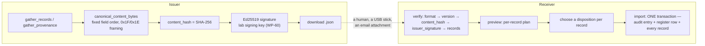

> [!abstract] In one sentence
> Three ways for two labs to share something they can both *verify* — a **specimen passport** (one
> culture's identity and full provenance), a **taxonomy registry** (a lab's taxa, species and
> strains), and a **breeding coordination bundle** (one programme's selection records) — all signed
> Ed25519 JSON documents that move as files a human copies, because there is no server anywhere in
> this design.

---

> [!danger] "Federated" here means files, not a network
> No subscription server, no polling, no key directory, no discovery, no trust store, no revocation
> list. Issuing **downloads a JSON file**; importing **reads one**. The issuer's public key must be
> exchanged out of band. Every one of these subsystems is fully functional with the network cable
> pulled, because there is no network code to disable — see the same evidence laid out in
> [[Importing NCBI Taxonomy]].

All three panels live at the bottom of the **Audit Log** view (`audit`), which the sidebar gates to
`['admin','supervisor']`.

---

## The shape they all share



| | Passport | Registry | Coordination |
|---|---|---|---|
| `format` | `steloptc.specimen-passport` | `steloptc.taxonomy-registry` | `steloptc.breeding-coordination` |
| `version` | `"1"` | `"1"` | `"1"` |
| Register table | `specimen_passports` | `taxonomy_registries` | `breeding_bundles` |
| Migration | 049 | 050 | 051 |
| Dispositions | — (whole document) | `accept` · `override` · `fork` | `accept` · `skip` |
| Duplicate guard | `UNIQUE(direction, passport_id)` | `UNIQUE(direction, registry_id)` | `UNIQUE(direction, bundle_id)` |

Every import writes **one** audit entry inside the same transaction as the register row and every
applied record, so a bad disposition string rolls the whole thing back and the import can be retried.
There is a test for exactly that: `invalid_disposition_rolls_back_and_allows_retry`.

> [!warning] `docs/` names audit actions that do not exist
> `specimen-passport.md`, `taxonomy-registry.md` and `breeding-coordination.md` all claim the import
> writes a `passport_imported` / `registry_imported` / `breeding_merge_imported` entry.
> **The audit `action` is literally `"import"` in all three cases.** What distinguishes them is
> `entity_type`: `specimen_passport`, `taxonomy_registry`, `breeding_coordination`. No `*_imported`
> action string exists anywhere in the code.

### The issuer identity

`get_lab_identity` returns `IssuerIdentity { lab_name, public_key }`. The name comes from
`app_settings.lab_name`, defaulting to `"Unnamed SteloPTC Lab"` and set by `set_lab_name`
(`can_manage`; blank → *"Lab name cannot be empty."*). The key is the **lab-wide WP-60 signing key**,
shared with the regulatory exports in [[Compliance and Export]] — one identity, three uses.

---

## 1 · Specimen passports

**What it is for**: sending one culture to another lab in a way the receiver can check without
trusting you.

```rust
SpecimenPassport {
  format, version, passport_id, issued_at,
  issuer: IssuerIdentity { lab_name, public_key },
  specimen: { specimen_id, accession_number, scientific_name?, strain_id?, stage?,
              generation, origin_type?, provenance_note?, initiation_date? },
  provenance: Vec<PassportAuditEntry { chain_seq, canonical, prev_hash, entry_hash }>,
  merkle_anchor: Option<{ checkpoint_id, merkle_root, anchored_txid? }>,
  content_hash, signature }
```

Each `provenance[].canonical` is **exactly the WP-18 audit canonical string** — see
[[Hash-Chained Provenance]]. The passport is not a summary of the chain; it *is* a slice of it.

### Issuing

`SpecimenPassportPanel` → paste a specimen id → **Issue**. `issue_specimen_passport` is `can_write`
**and** `require_active_lab_profile`, writes an audit entry (`issue` / `specimen_passport`), records
`direction='issued'`, `verified=1`, and hands the JSON back to the frontend, which downloads it as
`passport-{accession}.json`.

It refuses a specimen with nothing to attest:
*"This specimen has no hashed provenance entries to attest — cannot issue a passport."*

### Verifying and importing

`verify_specimen_passport` is any-authenticated and has **no side effects** — the receiver can check
a document before deciding anything. Named checks run in order and stop at the first failure:

`format` → `version` → `content_hash` → `issuer_signature` → `provenance_chain` → `merkle_anchor`
*(only when present)*.

Provenance-chain rules: strictly **ascending** `chain_seq` (not necessarily gapless); each
`prev_hash` equals the preceding `entry_hash`; each `entry_hash == compute_entry_hash(canonical,
prev_hash)`. **The first entry's `prev_hash` is accepted as given** — it may be `ZERO_HASH`, or a
parent lineage's hash for a specimen born from a split — the same rule `verify_audit_lineage` uses.

`import_specimen_passport` (`can_write`) refuses an unverifiable document outright —
*"Refusing to import an unverifiable passport: {message}"* — and refuses a repeat —
*"Passport '{id}' (accession {n}) has already been imported."* The imported row carries
`specimen_id = NULL`: **importing a passport does not create a specimen.** It records that this lab
received and verified a claim, folded into this lab's own audit chain.

> [!important] The Merkle anchor is honest by construction
> `gather_merkle_anchor` attaches an anchor **only when a stored checkpoint's `merkle_root` equals
> the root rebuilt from exactly the exported entry hashes**. A verifier's own rebuild therefore always
> matches — the passport never advertises an anchor it cannot substantiate.

> [!warning] The one lenient read on an otherwise strict path
> `gather_provenance` collects rows with `.filter_map(|r| r.ok())`, unlike the audit-verification
> paths, which use strict `collect::<rusqlite::Result<Vec<_>>>()` precisely so a mapping bug cannot
> look like tampering. A dropped row here produces a passport whose chain breaks only at the
> **receiver's** verification — a confusing failure mode for a document that is supposed to be
> self-attesting.

---

## 2 · The shared taxonomy registry

**What it is for**: two labs agreeing on what things are called, without either becoming the
authority.

### Record kinds and their natural keys

`source_key` is **name-based, never a local UUID and never a `taxon_path`** — the whole point is that
two labs with different databases produce the same key for the same organism.

| Kind | `source_key` | Example |
|---|---|---|
| taxon | `taxon\|{rank}\|{name}` | `taxon\|genus\|Citrus` |
| species | `species\|{Genus species}` | `species\|Citrus sinensis` |
| strain | `strain\|{Genus species}\|{code}` | `strain\|Citrus sinensis\|VAL-EARLY` |

`assemble_and_sign` **sorts records by `source_key` before hashing**, so a re-export of unchanged
data is byte-identical. Verification checks `format` → `version` → `content_hash` →
`issuer_signature` → `records` (per-record hash, plus **unique `source_key`** —
*"Duplicate record key '{}' — reconciliation would be ambiguous."*).

### Export

`export_taxonomy_registry` (`can_write`, audit `export` / `taxonomy_registry`) gathers:

- **taxa** — `SELECT t.rank, t.name, p.name FROM taxa t LEFT JOIN taxa p ON t.parent_id = p.id`;
- **species** — genus, species name, species code, common name (`note` carries the common name);
- **strains** — `WHERE s.is_archived = 0`, joined to species, carrying `strain_type` and `status`.

> [!success] `genomic_fingerprint` is never selected
> There is a test named `export_never_leaks_genomic_fingerprint`. The masked-field discipline from
> [[Roles and Permissions]] holds across the federation boundary too.

> [!warning] `docs/taxonomy-registry.md` says "genus-and-above". The code has no rank filter.
> `gather_records` selects **all** rows from `taxa`. Believe the code.

### Preview — per-record dispositions

`preview_taxonomy_registry_import` returns a `RecordPlan` per record. `plan_for` is recomputed per
record **against the open transaction**, not once up front, which is what makes ordering matter:

| Kind | `identical` when | `conflict` when |
|---|---|---|
| taxon | a local taxon with the same `(rank, name)` and **`local_override = 0`** exists | never |
| species | local `(genus, species_name)` exists **and** both `species_code` and the common-note match | local exists but code or note differ |
| strain | the local species exists **and** a strain with that code sits under it | never |

`suggested_disposition` is `"override"` for a conflict and `"accept"` otherwise. The panel pre-fills
every row with the suggestion and lets the operator change any of them.

| Disposition | `new` record | `identical` / `conflict` record |
|---|---|---|
| **accept** | insert — taxon with `local_override = 0`; species with a de-duplicated code; strain always `status = 'unverified'` | *"Already present locally; kept the local record."* |
| **override** | *"Kept the local record; declined the incoming version."* | same |
| **fork** | insert a divergent copy — taxon named `"{name} (fork · {origin_lab})"` with `local_override = 1`; species code `"{code}-FORK"`; strain `"{name} (fork · {lab})"` / `"{code}-FORK"` | same |

Code collisions are resolved by appending `-2`, `-3`… until free (`unique_species_code`, and
`unique_strain_code` scoped to the species).

> [!danger] A foreign verification claim is never inherited
> `insert_strain` always writes `status = 'unverified'`, `is_hybrid = 0`, and
> `confirmation_basis = "Imported from taxonomy registry issued by {origin_lab} (origin claimed
> '{status}'); re-verify locally."` A partner's `confirmed_genomic` becomes *your* `unverified`. The
> status ladder in [[Specimens Strains and Species]] is a statement about work **this lab** did.

A strain whose species is not local is skipped with an actionable message:
*"Skipped — species '{genus} {species}' is not present locally; accept it first."*

`import_taxonomy_registry` (`can_write`) returns `inserted`, `forked`, `kept_local`, `skipped`.

### The ordering subtlety `v0.54.0` had to solve

> [!important] `species|…` sorts before `taxon|…`, and that is load-bearing
> Records are applied in **`source_key` order**, and lexicographically `species|` < `strain|` <
> `taxon|`. Two consequences fall out of that single fact:
>
> **The good one, relied upon:** a species accepted earlier in the batch is already visible to the
> strain that follows it, because `plan_for` runs per record against the open transaction. Strains
> can therefore find their species without a second pass.
>
> **The one that needed fixing:** `insert_species` **deliberately does not link a genus taxon.**
> Creating the genus at that moment would beat the registry's own `taxon|genus|…` record to it — and
> that record would then find a match and skip, silently turning a 3-record import into 2. So the
> species inserts land with a `NULL` `taxon_path`, which makes them invisible in the Taxonomy
> Navigator: exactly the drift `migration_058` exists to repair, arriving through a different door.
>
> The fix is **one classification pass after every record is applied** — `rebuild_species_taxonomy`
> called just before `tx.commit()`, inside the transaction so a later failure rolls it back with
> everything else. It is idempotent and never touches an already-classified species. See
> [[Taxonomy Backbone]].

`rebuild_species_taxonomy` is also exposed as a supervisor action (`can_manage`, *"Only supervisors
and admins can rebuild the taxonomy"*) from the Species Registry and the navigator's empty state,
returning `{ genera_created, species_linked }`.

> [!warning] Mid-rank taxa can still land orphaned
> Taxon keys are `taxon|{rank}|{name}`, so ranks are applied **alphabetically**:
> `class, family, genus, kingdom, order, phylum`. `insert_taxon` resolves `parent_name` best-effort
> against rows that already exist and falls back to `parent_id = NULL` with a root path. With a full
> hierarchy that means **`class` (whose parent is a phylum) and `family` (whose parent is an order)
> always land with a NULL parent and a root `taxon_path`**, while `genus`, `order` and `phylum`
> resolve correctly. No test covers a multi-rank import — the `registry/store.rs` tests all seed a
> single genus taxon. Repair by hand through `update_taxon`, which now recomputes paths when
> `parent_id` changes.

---

## 3 · Cross-lab breeding coordination

**What it is for**: two labs running the same breeding programme merging their selection records
without a shared database.

One programme per bundle. `BundleProgram` is keyed on `name` — the natural key on both sides.

```
source_key = sel|{program_name}|{Genus species} {code}|g{generation}|{selection_date}|{selected_by}|{disc8}
```

`disc8` is the first 8 hex characters of a SHA-256 over `selection_notes`, `fitness_score` and
`notes` in the same `0x1F`/`0x1E` canonical encoding used everywhere else. The effect is the point:
**byte-identical selections recorded independently in two labs produce the same key and merge to
one.** `gather_records` also dedups by that key locally, so a self-export can never trip
verification's uniqueness check.

### Import

| `local_status` | Meaning | Suggested |
|---|---|---|
| `blocked` | the strain (`species.genus` + `species_name` + `strains.code`) is **not present locally** | `skip` — and the dropdown is disabled |
| `identical` | the `source_key` is already present | `skip` |
| `new` | neither | `accept` |

Dispositions are **`accept` | `skip` only** — there is no fork, because a selection record is an
observation, not a name. An unknown string is `Err("Unknown disposition '{}'.")` and rolls the whole
import back.

`import_coordination_bundle` (`can_write`) ensures the local programme exists first, matching by
name; if absent it creates a shell whose notes read
*"Coordinated copy created from a bundle issued by {origin_lab}."* Inserted rows carry the record's
`origin_lab` so provenance survives a re-export — `breeding_records.origin_lab` is `NULL` for locally
authored rows (migration 051). Result counters: `inserted`, `kept_local`, `skipped`, plus
`program_created`.

The panel states the semantics itself: *"Merging is a set union — accept (merge it in) or skip."*
Blocked records tell the operator what to do first: accept the strain via a taxonomy registry.

> [!warning] `fitness_score` is a cross-language hazard
> `fnum(Option<f64>)` serialises with Rust's `f64::to_string()` — the shortest round-tripping decimal.
> Any non-Rust implementation that formats floats differently will compute a different `disc8`, a
> different `record_hash`, and a failed verification. The docs flag this; there is no mitigation in
> the code.

---

## Honest limits across all three

> [!warning] What federation does **not** give you at `v0.54.0`
> - **No key distribution.** The issuer's public key travels out of band. There is no directory, no
>   trust store, no expiry, and **no revocation** — a compromised lab key stays valid forever from a
>   receiver's point of view.
> - **No transport of any kind.** Issue downloads a file, import reads one. Nothing polls, nothing
>   subscribes, nothing pushes.
> - **Imports are additive-only.** Nothing in any of the three paths deletes or archives a local
>   record. `override` and `skip` mean "decline the incoming version", never "remove mine".
> - **Registry and coordination imports carry no lab-profile scoping**, because `taxa`, `species` and
>   `strains` have none. See [[Lab Profiles]].
> - **A passport import creates no specimen.** If you want the culture in your registry, you accession
>   it yourself; the passport is the evidence, not the record.
> - `SPECIMEN_STATUS_CHANGED` is declared in the signed-ledger vocabulary and **never emitted**, so a
>   stage or health-status change is invisible in the signed ledger a passport draws on. Disclosed in
>   `SKILLS.md` §8. See [[Trust Layer]].

---

## Where to look

| Concern | File |
|---|---|
| Passport document, canonical bytes, `verify_passport` | `src-tauri/src/passport/mod.rs` |
| Passport store: gather, issue, import | `src-tauri/src/passport/store.rs` |
| Registry document and canonical bytes | `src-tauri/src/registry/mod.rs` |
| Registry gather, `plan_for`, `apply_record`, `import_registry` | `src-tauri/src/registry/store.rs` |
| Coordination document and `build_source_key` | `src-tauri/src/coordination/mod.rs` |
| Coordination store and `import_bundle` | `src-tauri/src/coordination/store.rs` |
| Commands | `src-tauri/src/commands/{passport,registry,coordination}.rs` |
| The shared lab signing key | `src-tauri/src/compliance_export/mod.rs` — `load_or_create_lab_signing_key` |
| The species classification pass | `src-tauri/src/db/queries.rs` — `rebuild_species_taxonomy`, `resync_species_paths_under` |
| Panels | `SpecimenPassportPanel.svelte`, `TaxonomyRegistryPanel.svelte`, `BreedingCoordinationPanel.svelte` — all hosted by `AuditLog.svelte` |
| Deep dives | `docs/specimen-passport.md`, `docs/taxonomy-registry.md`, `docs/breeding-coordination.md` |

---

## Related

[[Trust Layer]] · [[Hash-Chained Provenance]] · [[Taxonomy Backbone]] ·
[[Specimens Strains and Species]] · [[Compliance and Export]] · [[Importing NCBI Taxonomy]] ·
[[Roles and Permissions]] · [[Database Schema]] · [[Command Reference]] · [[Shipped vs Dormant]]

---

**Back to [[Home]]**

#trust #federation #workflow
