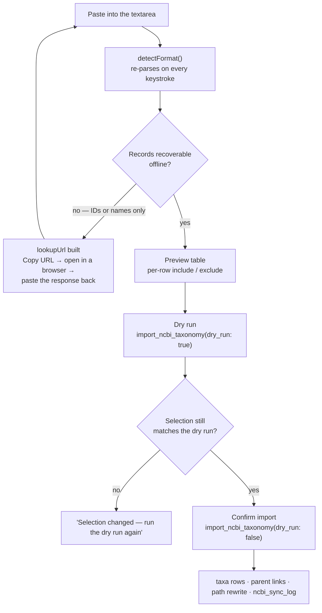
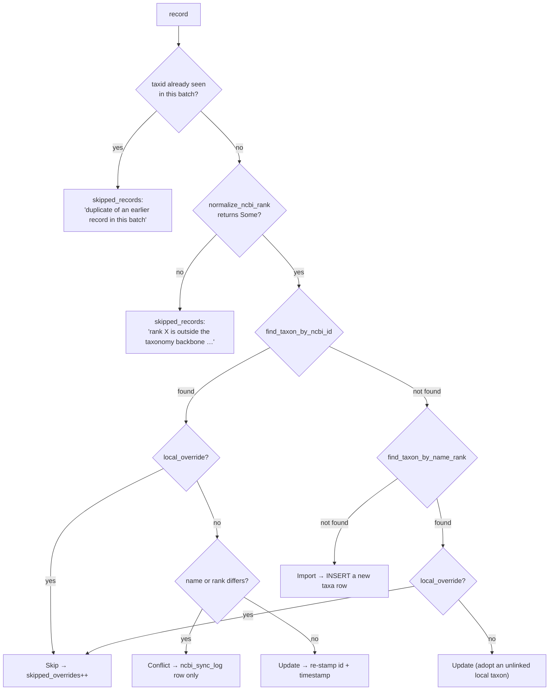

> [!abstract] In one sentence
> An admin pastes whatever they have — E-utilities JSON or XML, `taxdump` rows, a CSV table, a bare
> list of taxon IDs — into one box that parses it offline, previews exactly what it will write with
> per-row checkboxes, dry-runs it, and only then imports kingdom-through-genus taxa into the
> [[Taxonomy Backbone]]; **the application never makes a network request at any point**.

---

> [!danger] The app never calls the network. Not once, not optionally.
> This is not a policy statement, it is a property of the build:
>
> - **There is no HTTP client in the Rust backend.** `src-tauri/Cargo.toml` has no `reqwest`, no
>   `ureq`, no `tauri-plugin-http`. (`reqwest` resolves in `Cargo.lock`, but only under `tauri`'s
>   `cfg(any(target_os = "android", …apple non-macOS…))` target block — on desktop it is never
>   compiled.)
> - **There is no network permission in the Tauri capabilities.**
>   `src-tauri/capabilities/default.json` grants `core:default`, seven `core:window:*` permissions,
>   and `shell:allow-open`. No `http:*`.
> - **The WebView cannot reach out either.** The CSP in `tauri.conf.json` sets
>   `connect-src 'self' ipc: http://ipc.localhost`, and `grep "fetch("` over `src/lib` returns
>   nothing outside `efetch` identifiers.
> - **`package.json` has no `@tauri-apps/plugin-http`.**
>
> `src/lib/ncbiParse.ts` *builds* E-utilities URLs. It never fetches them. The screen hands the URL
> to the operator with a **Copy URL** button and the sentence *"SteloPTC works offline and never
> calls out to the internet on its own. Open this E-utilities URL in a browser, then paste the
> response back into the box above."* The round trip is a human, deliberately.

---

## Who can do this

| Command | Gate | Error |
|---|---|---|
| `import_ncbi_taxonomy` | `is_admin()` | *"Only admins can import NCBI taxonomy data"* |
| `resolve_ncbi_conflict` | `is_admin()` | *"Only admins can resolve NCBI taxonomy conflicts"* |
| `sync_ncbi_taxon` | `is_admin()` | *"Only admins can sync NCBI taxonomy data"* — **no UI caller** |
| `list_ncbi_sync_log` | **authenticated only** | — |

The nav entry `NCBI Sync` is `roles: ['admin']` in `Sidebar.svelte`, and `NcbiSyncPanel.svelte`
independently renders *"Only administrators can manage NCBI taxonomy sync."* for anyone else.

> [!warning] A supervisor can edit taxonomy but cannot import it
> `create_taxon` / `update_taxon` are `can_manage()` (supervisor **or** admin), so a supervisor can
> rename any taxon and flip `local_override` — but cannot run or resolve an import. See
> [[Roles and Permissions]].

---

## The flow



---

## Every input format the box accepts

`detectFormat` runs in this order — the first match wins:

| # | Test | Format | `formatLabel` |
|---|---|---|---|
| 1 | empty | `empty` | *Nothing pasted yet* |
| 2 | starts with `<` | `efetch-xml` | *NCBI E-utilities efetch (XML)* |
| 3 | starts with `{` or `[` | JSON — has a top-level `result` object → `esummary-json`, else `record-json` | *NCBI E-utilities esummary (JSON)* / *JSON taxon records* |
| 4 | contains `\|\t\|`, or (`/\|\s*$/m` and contains `\|`) | `taxdump` | *NCBI taxdump (nodes.dmp / names.dmp)* |
| 5 | first line has a tab or comma, and the header looks recognisable **or** there is more than one line | `delimited` | *Table (CSV / TSV)* |
| 6 | every line matches `^\d+$` | `taxid-list` | *List of taxon IDs* |
| 7 | every line matches `^[A-Za-z][A-Za-z .'\-]*$` | `name-list` | *List of scientific names* |
| 8 | otherwise | `unknown` | *Unrecognised* |

> [!note] Malformed JSON stays JSON
> Step 3 classifies as `record-json` even when the JSON does not parse, so the operator sees the
> parse error instead of the input being silently guessed as a name list.

### What each parser does

| Format | Behaviour |
|---|---|
| **`record-json`** | Array or single object. Each item through `parseRecordObject`; a bad item is reported as an issue and the rest are kept. |
| **`esummary-json`** | Reads `result.uids` for ordering, falling back to every non-`uids` key. Injects the uid into the record before aliasing (`{ uid, ...entry }`). |
| **`efetch-xml`** | `DOMParser`-based, guarded (*"XML parsing is unavailable in this environment"* if absent). **Expands `<LineageEx>` into separate records**, chaining `parent_ncbi_id` from document order, then emits the top-level `<Taxon>` with `ParentTaxId ?? previousId`. So **one efetch record brings its whole backbone**. Text extraction is direct-children-only, so a nested `LineageEx/Taxon/TaxId` is not mistaken for the outer taxon's id. |
| **`taxdump`** | Accepts `nodes.dmp` and `names.dmp` rows **interleaved, in either order**, joined on the taxid. Only `name_class == 'scientific name'` sets the name — synonyms and common names are ignored. A self-parent (the root) becomes `null`. Halves with no partner are reported as issues, never dropped silently. |
| **`delimited`** | Requires a recognisable header, else *"no recognisable header — name the columns taxid, name, rank (and optionally parent_taxid)"*. Tab-split when any tab is present, otherwise comma-split with surrounding-quote stripping. |
| **`taxid-list`** | Produces **no records**. Sets `lookupUrl = buildEfetchUrl(ids)` and a note: *"…a taxon ID alone has no name or rank. Open the link below, then paste the response back here."* |
| **`name-list`** | Produces **no records**. Sets `lookupUrl = buildEsearchUrl(names)` (`term = "<n>[Scientific Name]" OR …`, URL-encoded) and a note explaining the two-hop round trip: esearch gives IDs, then efetch gives records. |

### Field aliases

Keys are normalised with `toLowerCase().replace(/[^a-z0-9]/g,'')`, so `TaxId`, `tax_id`, `taxid` and
`Tax ID` all collapse to the same thing.

| Concept | Accepted spellings |
|---|---|
| id | `ncbitaxonid`, `taxid`, `uid`, `id`, `ncbiid`, `taxonid` |
| name | `name`, `scientificname`, `sciname`, `taxonname`, `nametxt` |
| rank | `rank`, `taxrank`, `taxonrank` |
| parent | `parentncbiid`, `parenttaxid`, `parent`, `parentid`, `parentncbitaxonid` |

The wire shape crossing [[The IPC Seam]] is four fields and nothing else:
`{ ncbi_taxon_id, name, rank, parent_ncbi_id }`. Authority strings, synonyms, common names,
`genetic_code`, `division` — everything NCBI returns beyond those four is discarded at the boundary.

### The three URLs the screen can build (and never opens)

```
https://eutils.ncbi.nlm.nih.gov/entrez/eutils/efetch.fcgi?db=taxonomy&id=<ids>&retmode=xml
https://eutils.ncbi.nlm.nih.gov/entrez/eutils/esummary.fcgi?db=taxonomy&id=<ids>&retmode=json
https://eutils.ncbi.nlm.nih.gov/entrez/eutils/esearch.fcgi?db=taxonomy&term=<encoded>&retmode=json
```

---

## The preview table and per-row selection

`parsed = $derived(parseNcbiInput(rawInput))` — the parser runs on every keystroke and **never
throws** (there is a `never throws on hostile input` test).

Post-processing before the table renders:

1. **De-duplicate by taxid, keeping the first** → note *"N duplicate records collapsed."* A
   lineage-expanded paste repeats shared ancestors; doing it here means the preview shows what will
   really be sent.
2. **Count below-genus rows** → a note explaining that the backbone stores kingdom through genus
   only and species belong in the Species Registry, *"so these are excluded by default"*.
3. **Sort root-first** by rank, with `superkingdom → 0`, `division → 1`, and anything unrecognised
   last — so the preview reads top-down like the tree it builds.

The table columns are: checkbox · Taxon ID · Name · Rank (with a yellow `below genus` badge) ·
Parent · Source. Excluded rows render at `opacity: 0.45`.

```ts
isIncluded(rec) = overrides[rec.ncbi_taxon_id] ?? isBackboneRank(rec.rank)
```

> [!important] Selection is keyed on `ncbi_taxon_id`, not row index
> Re-pasting or re-sorting the input cannot silently move a tick from one row to another.

Bulk buttons: **Backbone only** (clears `overrides`, back to the default), **All**, **None**.
Above the table: a format badge and `N records parsed · M selected for import`. Below it, an issue
box listing the first 8 unusable lines plus *"…and N more"*, and — for a list-shaped paste — the
lookup box with the E-utilities URL and its Copy button.

**Show examples** loads any of five worked examples into the box: *JSON records*,
*E-utilities esummary*, *E-utilities efetch XML*, *Table (CSV / TSV)*, *taxdump rows*.

---

## The dry run

`Dry run (N)` calls `import_ncbi_taxonomy(records, dry_run: true)`. That takes an **entirely separate
branch** in the backend: no transaction, no writes, **not even an `ncbi_sync_log` row**. It classifies
every record exactly as the real run would and predicts parent resolution against the batch and the
database.

`Confirm import` only appears while the dry run still describes the current selection:

```ts
const selectionSignature = $derived(JSON.stringify(selected.map(r => r.ncbi_taxon_id)));
const dryRunIsCurrent    = $derived(!!dryRunResult && selectionSignature === dryRunFor);
```

When it goes stale the button is replaced by
*"Selection changed — run the dry run again before importing."* Derived rather than an effect that
nulls the result: the honest statement is "this dry run no longer describes the current selection",
not "delete the dry run".

> [!warning] The staleness check watches the ID set, not the text
> Editing a **name or rank** in the textarea without changing which taxon IDs are selected leaves the
> dry run considered current. The preview table shows the edited values; the dry-run counters do not.

Two other dry-run fidelity gaps, both small and both real:

| Field | Real run | Dry run |
|---|---|---|
| `conflicts[].sync_log_id` | `Some(uuid)` | `None` |
| `conflicts[].local_name` | `Some(local.name)` | **`None` — hard-coded**, even though the classifier has the value |
| `parents_linked` | also skips when the resolved parent id equals the child id | does not model that guard |

The `local_name: None` is why a *preview* conflict card reads `NCBI #12345` with no "local:" clause
while a post-import card names the local taxon.

---

## What the import actually writes

Everything runs in **one `unchecked_transaction`**; any error aborts the whole batch. Import is
all-or-nothing. One timestamp (`%Y-%m-%dT%H:%M:%S%.3fZ`) is computed once and stamped on every
`ncbi_updated_at` and every `ncbi_sync_log.created_at` in the batch.

### Phase 1 — classification (pure reads)



`normalize_ncbi_rank` accepts `kingdom | superkingdom → kingdom`, `phylum | division → phylum`, and
`class`, `order`, `family`, `genus` verbatim. Everything else — `species`, `subspecies`, `variety`,
`no rank`, `clade`, `subfamily`, `tribe`, `subgenus`, … — returns `None`.

### Phase 2 — the writes

| Action | SQL |
|---|---|
| **Import** | `INSERT INTO taxa (id, rank, name, ncbi_taxon_id, ncbi_updated_at, local_override, taxon_path) VALUES (…, 0, '["<new-id>"]')` — `parent_id` left NULL, set in Phase 3 |
| **Update** | `UPDATE taxa SET ncbi_taxon_id = ?1, ncbi_updated_at = ?2, updated_at = datetime('now') WHERE id = ?3` |
| **Conflict** | **only** an `ncbi_sync_log` row (`sync_type='conflict'`, `conflict_details` JSON). The taxon is untouched and `ncbi_updated_at` is not advanced. |
| **Skip** | nothing at all — not even a log row |

> [!important] "Update" never writes `name` or `rank`
> It is purely a link-and-timestamp operation. A record matched by NCBI id with no differences is a
> no-op touch; a record matched by name + rank gets the NCBI id **stamped onto a previously unlinked
> local row**. That second path is how a hand-built genus gets adopted into the NCBI namespace.

### Phase 3 — parent linking and path rewrite

This is the part `v0.54.0` added, and the reason an import now produces a tree rather than a pile.

1. Build `by_ncbi_id: HashMap<i64, String>` from every `Import` or `Update` action in the batch.
2. For each such action carrying a `parent_ncbi_id`:
   - **skip a self-parent** — *"A taxon that is its own parent is how NCBI marks the root (taxid 1).
     Linking it to itself would build a cycle."*
   - resolve the parent **from the batch first, then from the database**;
   - `set_taxon_parent(child, parent)`, `parents_linked += 1`, push the child onto `touched`.
3. **After every link is in place**, once per touched node:
   `recompute_taxon_path` then `resync_species_paths_under`. Doing it per-link would rewrite
   descendants repeatedly and could read a half-built chain.

`recompute_taxon_path` walks `parent_id` upward with a `HashSet` cycle guard that **breaks rather
than loops** — an infinite loop inside the import transaction would hang the app holding the DB
lock — then recurses into children so descendants inherit the change.

> [!success] `resync_species_paths_under` — the `v0.54.0` completion of that fix
> `species.taxon_path` is a denormalised copy of its genus taxon's path with exactly one writer and,
> before this, no invalidation. Re-parenting a taxon moved the taxon without moving the species
> hanging off it. The failure was quiet rather than blank: species stayed visible (the navigator
> matches a species on the **last** path element, which does not change), but ancestor columns
> counted zero strains and zero specimens, and `locate_species` handed the navigator a one-element
> chain that no longer began at a root — so *"Open in Taxonomy"* from the Species Registry walked
> into nothing. See [[Taxonomy Backbone]].

Local-override rows are excluded from Phase 3 entirely: re-parenting one would move it under NCBI's
hierarchy anyway, which is the thing the flag exists to prevent.

---

## Reading the result counters

```rust
ImportNcbiTaxonomyResult {
    imported,          // rows INSERTed into taxa
    updated,           // rows whose ncbi_taxon_id / ncbi_updated_at were (re)stamped
    skipped_overrides, // matched rows with local_override = 1 — no log row written
    conflicts,         // Vec<NcbiConflictSummary>; logged, taxon untouched
    skipped_records,   // Vec<NcbiSkippedRecord>: unsupported rank OR in-batch duplicate
    parents_linked,    // set_taxon_parent calls (real) / predicted resolvable parents (dry)
    dry_run,
}
```

> [!danger] The sum invariant
> `imported + updated + skipped_overrides + conflicts.len() + skipped_records.len()
> == request.taxa.len()`.
>
> **Every input record lands in exactly one bucket.** If the numbers do not add up, something is
> wrong with the reader, not the import.

The panel renders these as *Would create / Created*, *Would update / Updated*,
*Parent links resolvable / resolved* — annotated in the UI as
*"how much of a tree this builds, not just how many rows"* — *Skipped (local override)*, and
*Conflicts*.

### `parents_linked` is the number that tells you whether you got a tree

`imported` counts rows. `parents_linked` counts **edges**. An import reporting `imported: 9,
parents_linked: 0` has produced nine flat roots: the Taxonomy Navigator's first column fills with
genera and drilling into any of them finds nothing. That was the pre-`v0.54.0` behaviour for every
import, because `parent_ncbi_id` was read off the wire and thrown away.

### `skipped_records` is why nothing happened

Before `v0.54.0` an unusable record hit a bare `continue`, so pasting a page of species-rank records
reported *"0 imported, 0 updated, 0 conflicts"* with no clue why. Now each one comes back with a
reason:

| Reason | Cause |
|---|---|
| `duplicate of an earlier record in this batch` | the same `ncbi_taxon_id` appeared twice — normal for a lineage paste |
| `rank '{x}' is outside the taxonomy backbone (kingdom, phylum, class, order, family, genus) — species and below belong in the Species Registry` | `normalize_ncbi_rank` returned `None` |

The panel lists the first 6 with names and IDs, then *"…and N more."*

---

## Conflicts and how to resolve them

`detect_ncbi_conflict` compares exactly **two** fields, and only when the row was matched by
`ncbi_taxon_id`:

| Field | Comparison |
|---|---|
| `name` | `local.name.trim() != ncbi_name.trim()` — **case-sensitive** |
| `rank` | `local.rank != ncbi_rank`, where `ncbi_rank` is the **normalised** rank, so `division` vs stored `phylum` is *not* a conflict |

Anything else that differs — `parent_id`, `taxon_path`, `status`, `provisional_notes` — is invisible
to conflict detection. Stored shape:

```json
{ "name": { "local": "Citrus", "ncbi": "Hesperellus" },
  "rank": { "local": "genus",  "ncbi": "family" } }
```

The **Pending Conflicts** section renders that as a field-level diff — `local` on a red-tinted chip,
`ncbi` on a green-tinted chip — with three buttons:

| Resolution | Taxon row | Log row |
|---|---|---|
| **Keep local** (`kept_local`) | untouched | marked resolved |
| **Accept NCBI** (`accepted_ncbi`) | `name` and/or `rank` overwritten from `conflict_details.*.ncbi` | marked resolved |
| **Merged** (`merged`) | untouched — the admin is expected to have **already hand-edited** the taxon | marked resolved |

`resolve_ncbi_conflict` refuses an invalid resolution string
(*"Invalid resolution '{x}'. Must be one of: kept_local, accepted_ncbi, merged"*), refuses one
already resolved (*"This conflict has already been resolved"*), and stamps `resolved_by = user.id`.

Because the stored `rank.ncbi` is always a *normalised* rank, `accepted_ncbi` can never violate the
`taxa.rank` CHECK. It deliberately does **not** write `ncbi_taxon_id`, `ncbi_updated_at`,
`parent_id`, or `taxon_path` — so after accepting NCBI's name, `ncbi_updated_at` still reflects the
last successful sync, not this acceptance.

**Recent Sync Log (last 50)** below it shows Date / Type badge / NCBI ID / Local Taxon / Resolution.

---

## `local_override` — "my classification wins"

`taxa.local_override` is the operator saying *never touch this row*. Concretely:

| Surface | Behaviour |
|---|---|
| Import Phase 1 | matched row → `Skip`; counted in `skipped_overrides`; **no `ncbi_sync_log` row at all** |
| Import Phase 3 | excluded from parent linking |
| `sync_ncbi_taxon` | returns a **success** string, not an error: *"Taxon '{name}' (ID {n}) has local_override=true and was not modified."* |
| `resolve_ncbi_conflict` | **does not check it** — `accepted_ncbi` will overwrite a row flagged as an override after the conflict was logged |
| Provisional taxa | `create_provisional_taxon` inserts with `local_override = 1` **and** `status = 'provisional'`; no NCBI code path reads `status`, so the protection comes entirely from the flag |
| Setting it | only `update_taxon` (`can_manage()`). There is no bulk toggle and no affordance inside `NcbiSyncPanel`. |

> [!warning] An override blocks the real taxon, and says so only in aggregate
> A lab that creates a provisional genus `Rosaria` silently blocks ever importing NCBI's `Rosaria`.
> The import result says only *"Skipped (local override): 1"* — no name, no id, no row. Fixing it
> means finding the taxon in the Taxonomy Navigator and clearing the flag through `update_taxon`.

---

## Honest limits

> [!warning] Known defects at `v0.54.0`
> - **The adopt path overwrites an existing NCBI id.** The name + rank match does
>   `UPDATE taxa SET ncbi_taxon_id = ?1` unconditionally. If that local row already carried a
>   *different* NCBI id, it is silently replaced with no conflict and no log of the old value.
> - **Case-sensitivity is inconsistent.** `find_taxon_by_name_rank` matches `name = ?1` (binary);
>   `ensure_genus_taxon` matches `COLLATE NOCASE`. A species-registry genus stored as `citrus` will
>   not be adopted by an NCBI `Citrus` — a duplicate genus row is created instead.
> - **Imported taxa get no audit genesis entry.** `import_ncbi_taxonomy` never calls
>   `queries::log_audit`, while `create_taxon` writes `log_audit_taxon_genesis` and `update_taxon`
>   writes `log_audit`. Hand-created and imported siblings are not equally traceable — see
>   [[Hash-Chained Provenance]].
> - **An unresolvable parent is silently skipped.** The operator is never told "3 of your 9 records
>   have a parent that is not in this paste and not in the database, so they landed as roots."
>   Compare `parents_linked` against the record count to notice.
> - **`resolve_ncbi_conflict` never checks `sync_type = 'conflict'`**, so an `import` or `update` log
>   row can be "resolved". Its two UPDATEs are also **not in a transaction**: a failure of the second
>   leaves the taxon changed and the conflict still pending.
> - **`list_ncbi_sync_log` has no role check** — any authenticated session, including `guest`, can
>   enumerate the whole log. Its `limit` is also computed and then ignored on the `pending_only`
>   branch, so pending conflicts return unbounded.
> - **`taxa.ncbi_taxon_id` has no `UNIQUE` and no index**, despite being the primary lookup key for
>   every import. Two taxa can carry the same NCBI id; `find_taxon_by_ncbi_id` returns whichever row
>   SQLite yields first.
> - **`normalize_ncbi_rank` does not `trim()`; the frontend's `isBackboneRank` does.** A rank with
>   leading whitespace previews as importable and then lands in `skipped_records`. The
>   `ACCEPTED_RANKS` list carries a comment requiring the two to stay in sync.
> - **The taxonomy tables are not lab-scoped.** `taxa`, `species`, `ncbi_sync_log` and
>   `taxon_mappings` have no `lab_profile` column and no filter. Switching from Mycology to Plant
>   Tissue Culture leaves an imported fungal backbone fully visible, and `app_config.domain` is never
>   read by any NCBI code path. Whether that is a shared reference backbone or an unclosed leak is
>   not stated anywhere in the repo — treat it as undocumented. See [[Lab Profiles]].
> - **`sync_ncbi_taxon` is dead in the UI.** `syncNcbiTaxon` is exported from `api.ts` and imported
>   by nothing. It also ignores `parent_ncbi_id` entirely and has no name + rank fallback, so it
>   behaves worse than the batch path. See [[Shipped vs Dormant]].
> - **There are zero Rust tests for any of the four commands.** `commands/` compiles only under the
>   default `tauri-commands` feature, which the sandbox-runnable
>   `cargo test --lib --no-default-features` gate cannot see. Only the pure helpers in `queries.rs`
>   and the 42 `ncbiParse` vitest cases are covered — see [[Build and Test Commands]].
> - **`README.md`, `UserManual.md` and `docs/` say nothing about NCBI at all.** `grep -i ncbi`
>   returns zero hits in each.

---

## Where to look

| Concern | File |
|---|---|
| The four commands | `src-tauri/src/commands/ncbi.rs` |
| Wire shapes and result structs | `src-tauri/src/models/taxon.rs` |
| `normalize_ncbi_rank`, `detect_ncbi_conflict`, `recompute_taxon_path`, `resync_species_paths_under` | `src-tauri/src/db/queries.rs` |
| The tolerant parser — pure, zero-dependency, never fetches | `src/lib/ncbiParse.ts` |
| Its tests | `src/lib/ncbiParse.test.ts` |
| The panel | `src/lib/components/NcbiSyncPanel.svelte` |
| Tables | `migration_020_expanded_taxonomy` (`taxa`), `migration_021_ncbi_sync_log`, `migration_034_provisional_taxa` |

---

## Related

[[Taxonomy Backbone]] · [[Specimens Strains and Species]] · [[Roles and Permissions]] ·
[[Lab Profiles]] · [[Federated Exchange]] · [[Database Schema]] · [[Command Reference]] ·
[[Failure Reference]] · [[Shipped vs Dormant]]

---

**Back to [[Home]]**

#taxonomy #ncbi #workflow #local-first
