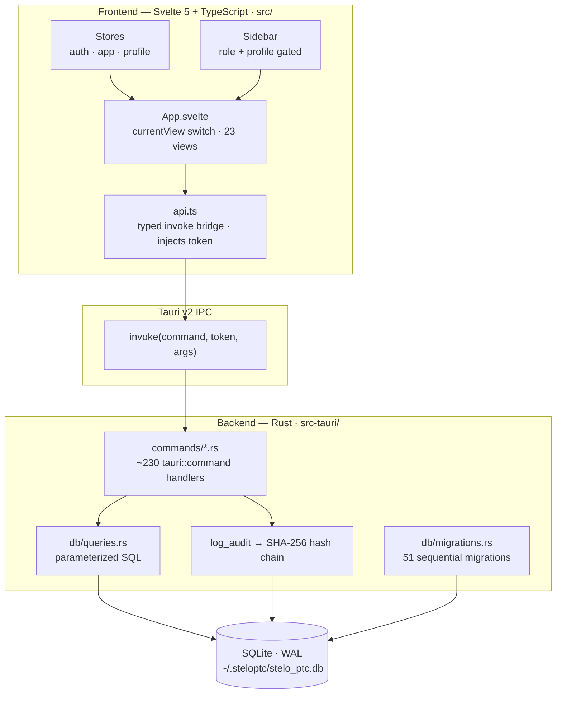
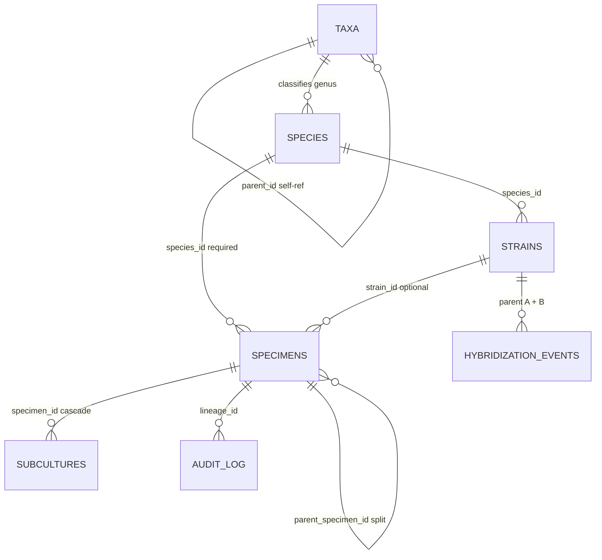
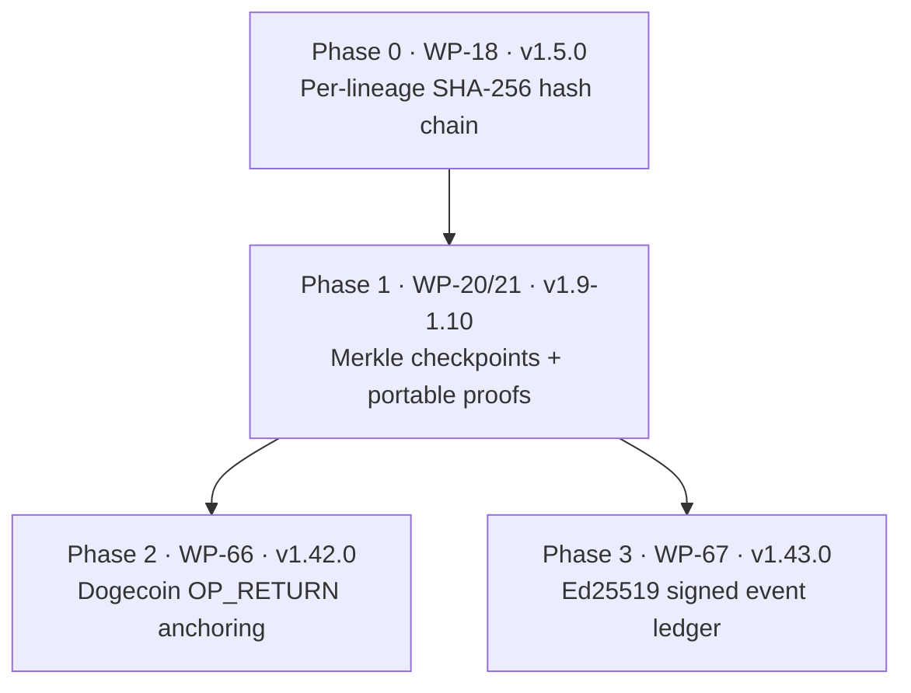
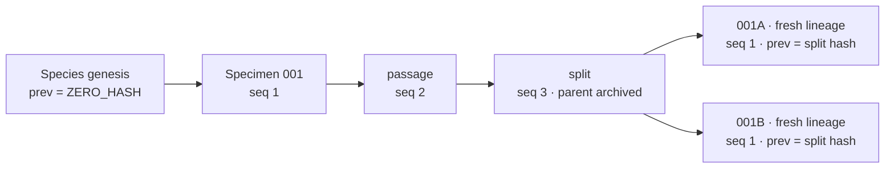
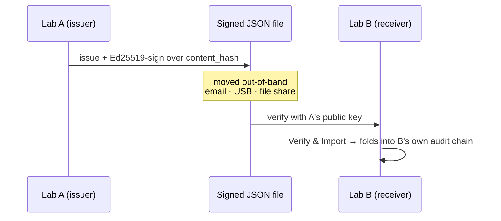

# 🌱 SteloPTC

> [!abstract] Plant Tissue Culture Tracking — with provenance you can prove
> **SteloPTC** is a local-first desktop & mobile platform that tracks lab cultures through their entire lifecycle — initiation, subculture, splitting, cryopreservation, and compliance — on a **tamper-evident, cryptographically verifiable** record. Every meaningful action is written into an append-only **SHA-256 hash chain**; change any past entry and every downstream hash breaks, so the complete provenance of a culture can be *proven*, even dozens of generations and splits later.
>
> One engine serves three lab disciplines out of the box — **Plant Tissue Culture**, **Cell Culture**, and **Mycology** — and extends via plugin vocabulary packs. Built with **Rust + Tauri 2 + Svelte 5**, it runs **fully offline**: your data lives on your machine, never in someone else's cloud.

> [!info]- Vault note — how to use this page
> This is the **Map of Content (MOC)** / home note for the SteloPTC vault. It links out to the canonical repo docs with `[[wikilinks]]`, uses `> [!callouts]` for the things worth remembering, and embeds `mermaid` diagrams for the architecture and provenance model. The frontmatter above is Dataview-ready (`version`, `status`, `tests_rust`, …). Open any linked note — [[README]], [[ROADMAP]], [[UserManual]], [[CHANGELOG]], [[skills]] — to go deeper.

---

## 🧭 Map of Content

| Section | Jump to | Canonical doc |
|---|---|---|
| Overview & philosophy | [[#🔎 What is SteloPTC]] | [[README]] |
| Core concepts | [[#🧩 Core concepts]] | [[UserManual]] |
| Lab profiles & domains | [[#🧬 Lab profiles & domain separation]] | [[vocabulary-system]] |
| Architecture | [[#🏗️ Architecture]] | [[skills]] |
| Data model | [[#🗃️ Data model]] | — |
| Trust Layer (crypto) | [[#🔐 The Trust Layer]] | [[merkle-checkpoints]] · [[signed-event-ledger]] |
| Federated exchange | [[#🛂 Federated inter-lab exchange (Phase G)]] | [[specimen-passport]] |
| Feature catalog | [[#✨ Feature catalog]] | [[ROADMAP]] |
| Security | [[#🛡️ Security & data integrity]] | [[on-chain-anchoring]] |
| Platform maturity | [[#💻 Platform support & maturity]] | [[ROADMAP]] |
| Build / run / test | [[#⚙️ Build, run & test]] | [[README]] |
| Release timeline | [[#📅 Release timeline]] | [[CHANGELOG]] |
| Repository map | [[#🗂️ Repository map]] | [[skills]] |
| Glossary | [[#📖 Glossary]] | — |

> [!tip] Reading order
> - **Lab staff →** [[UserManual]] then [[#🧩 Core concepts]] and [[#✨ Feature catalog]].
> - **Developers →** [[skills]] (the contributor playbook) then [[#🏗️ Architecture]] and [[#🗃️ Data model]].
> - **Auditors / partner labs →** [[#🔐 The Trust Layer]], [[merkle-proofs]], and [[#🛂 Federated inter-lab exchange (Phase G)]].

---

## 🔎 What is SteloPTC

SteloPTC manages the full lifecycle of tissue-culture specimens for commercial and research labs — and does one thing no ordinary lab notebook does: **it makes the history of every culture tamper-evident.**

> [!quote] Core philosophy
> - **Local-first and offline-capable** — no remote API required for day-to-day work.
> - **Data integrity is non-negotiable** — the hash chain is the product.
> - **Species act as protected cryptographic roots.**
> - **Splits create clear lineage branches** while preserving full parent history.
> - **Strain identity is version-bound** at specimen-creation time.
> - The system should make **correct work easy and incorrect work visible.**

**Quick facts**

| | |
|---|---|
| **Current version** | `v1.48.0` (WP-73 — domain-congruence & security hardening) |
| **Stack** | Rust 1.75+ · Tauri 2 · Svelte 5 · TypeScript · Vite 6 · SQLite (WAL) |
| **Disciplines** | Plant Tissue Culture · Cell Culture · Mycology (+ plugin packs) |
| **Integrity** | Per-lineage SHA-256 hash chain · Merkle checkpoints & proofs · Dogecoin `OP_RETURN` anchoring · Ed25519 signed ledger |
| **Backend surface** | ~230 `#[tauri::command]` handlers · 51 DB migrations |
| **Tests** | 608 Rust · 113 TypeScript (green, CI-gated) |
| **License** | Proprietary — `licensing@stelolab.local` |

---

## 🧩 Core concepts

> [!note] Specimen
> An individual culture in the lab. Carries a stable **accession number**, a **species** (its cryptographic root), an optional **strain** binding (version recorded at creation), current **stage / health / location**, a full history of **passages**, and links to its **parent** and **siblings** if born from a split.

> [!note] Species = protected cryptographic root
> Creating a species starts its own hash chain. Every specimen or strain derived from it inherits the species hash as its starting point — a permanent cryptographic link. Once a species has been used, it becomes **heavily protected**: archive it, don't delete it. Hard delete is only allowed for *unused* species.

> [!note] Strain / cultivar
> A named genetic variant sitting between species and specimen. **Accession numbers and strain identity are permanently separate** — the accession identifies the physical lineage and never encodes the strain, so it stays unambiguous even if strain classification is later corrected. Strain status is a **forward-only** four-level model: `unverified → claimed → confirmed_manual → confirmed_genomic` (downgrades are not permitted).

> [!example] Passage vs. Split — the two ways to advance a culture
> | Aspect | **Passage (Subculture)** | **Split** |
> |---|---|---|
> | Parent record | Continues | Archived |
> | New specimens | None | One or more children |
> | Accession number | Unchanged | New suffixed (`001` → `001A` / `001B`) |
> | Lineage chain | Same specimen, `chain_seq++` | Each child starts a **fresh lineage** (seq resets to 1) |
> | Per-child config | N/A | Yes (health, media, vessel, reminders) |
> | Typical use | Routine maintenance | Dividing into independent lines |

> [!warning] Splits demand a physical check
> Before a split is confirmed, SteloPTC **always** shows a verification warning: physically confirm your labels match the software-generated accessions. Further splits recurse (`001B` → `001BA`). A contamination flag on a split applies to the **parent**, and children can inherit "born contaminated" status.

> [!danger] Death is terminal
> Sliding the health slider to **0 (Dead)** turns the primary action into **☠ Record Death & Archive**: it archives the specimen, writes a terminal `event_type = 'death'` subculture row (which does *not* increment the passage count), and appends a `"death"` entry to the hash chain. There is **no automated un-archive path**.

---

## 🧬 Lab profiles & domain separation

SteloPTC runs **one lab profile at a time** (Settings → Lab Profile). The profile is the single switch that adapts the whole app to your discipline — it selects the controlled vocabularies and the biological **domain** the taxonomy tools use. The same engine — accessioning, hash chain, splits & passages, compliance, audit — serves all three.

| Profile | Domain | A "specimen" is… | Example stages | Discipline-specific tracking |
|---|---|---|---|---|
| **Plant Tissue Culture** *(default)* | Plantae | an explant/culture on media | explant, callus, suspension, shoot, plantlet | MS/WPM media batches, auxin/cytokinin hormones, subculture passages |
| **Cell Culture** | Animalia | a cell line / passage in flasks | adherent, suspension, characterization, cryopreserved | Population Doubling Level (PDL), doubling time, cryo vials, mycoplasma & biosafety level |
| **Mycology** | Fungi | a fungal culture / grow | liquid culture, bulk substrate, colonizing, fruiting | colonization %, contaminant typing, fruiting/flush yield |

> [!important] THE GOLDEN RULE — domain separation is by *data*, not code branches
> The three domains are kept apart by **profile-scoped lookup tables** (`UNIQUE(profile, code)`), not `if profile == X` branches. **Never hardcode a domain term** (`explant`, `callus`, `grain spawn`, `passage`, `cell_line`, …) in Rust or Svelte where it should come from the vocabulary. Adding a vocabulary value is a **data insert**, not a schema migration or recompile. Always validate user-supplied vocabulary against the active profile before writing it (`require_selectable_stage`). See [[vocabulary-system]] and [[skills]] §4.

**The six profile-scoped vocabulary tables** — shape `(id, profile, code, label, sort_order, UNIQUE(profile, code))`:

`stages` (has `is_terminal`) · `propagation_methods` · `hormone_types` · `compliance_record_types` · `compliance_agencies` · `inventory_categories`

> [!info]- Domain manifests (frontend)
> `src/lib/profile.ts` holds `PROFILE_DOMAIN` (profile → Plantae/Animalia/Fungi) and `DOMAIN_MANIFESTS`, giving each domain its `rankOrder` (kingdom→species), `strainTypeLabels`, and `confirmationMethodLabels`. As of `v1.48.0` (WP-73), `StrainManager` is the first real consumer of the manifest, and mycology's `origin_type` / `contaminant_type` vocab is single-sourced here (`ORIGIN_TYPE_META`, `CONTAMINANT_TYPE_LABELS`).

---

## 🏗️ Architecture



**Backend map** (Rust — `src-tauri/src/`)

| Area | Path | Notes |
|---|---|---|
| Command registry | `lib.rs` | Every `#[tauri::command]` registered in `generate_handler![]`; builds `AppState { db: Mutex<Database>, dashboard_cache }`, runs migrations, spawns the background scheduler. |
| Commands (API layer) | `commands/*.rs` (40 modules) | Pattern: **lock DB → `validate_session` → permission check → work → `log_audit`**. |
| Queries (SQL) | `db/queries.rs` | Large shared module; hash-chain primitives `compute_entry_hash` / `build_merkle_root` live here. |
| Migrations | `db/migrations.rs` | Append-only, numbered; **51 today, next is 052**. Never edit a shipped migration. |
| Models | `models/*.rs` (22 modules) | serde structs — **field names are the API contract** (no `#[serde(rename)]`). |
| Profiles / vocab | `db/vocabulary.rs` | `active_profile` / `require_selectable_stage` — the domain-separation machinery. |

> [!info] Concurrency & durability
> A single `rusqlite::Connection` sits behind `AppState.db: Mutex<Database>`; every command locks it first. SQLite runs `journal_mode=WAL`, `foreign_keys=ON`, `busy_timeout=5000`. Multi-step writes (`split_specimen`, `create_specimen`, `create_media_batch`, `thaw_vial`, `import_xlsx`) use `unchecked_transaction()` + `commit()` for atomicity. **Never hold the DB mutex across a panic-prone or network call** — a poisoned mutex kills DB access app-wide.

**Frontend map** (Svelte 5 — `src/`)

| Concern | Where | Notes |
|---|---|---|
| Entry | `main.ts` | Svelte 5 `mount(App, …)`; registers the PWA service worker **only** outside Tauri. |
| Navigation | `stores/app.ts` | **No router** — a `currentView` writable (23 `View` values) drives a `{#if}` chain in `App.svelte`; `navigateTo(view, specimenId?)`. |
| API bridge | `lib/api.ts` | ~200 typed wrappers over one private `call<T>()` → `invoke`; auto-injects token, triggers `clearAuth()` on session expiry. |
| Stores | `stores/{auth,app}.ts` + `profile.ts` | `token`/`currentUser`, `darkMode`, `labProfile`; persisted to `localStorage`. |
| Sidebar gating | `components/Sidebar.svelte` | `canSee()` filters nav items by **active profile** then **role**. |
| Tested pure utils | `lib/{exportUtils,importUtils,offlineQueue,profile,utils,printUtils}.ts` | Logic extracted so it's unit-testable without a webview. |

---

## 🗃️ Data model



- **`taxa`** — self-referential `kingdom → phylum → class → order → family → genus`, with `ncbi_taxon_id`, `taxon_path`, and a `status` (`accepted` default; provisional taxa per WP-49).
- **`species`** — `genus`, `species_name`, `species_code` (UNIQUE), `default_subculture_interval_days`, `taxon_path`.
- **`strains`** — `code` (UNIQUE per species), `strain_type`, `status` (four-level, forward-only), `genomic_fingerprint`, `is_hybrid` / `is_cross_species`. Pedigree via `strain_parents` and `hybridization_events`.
- **`specimens`** — `accession_number` (`YYYY-MM-DD-CODE-SEQ`), `stage`, `generation`, `root_specimen_id`, `parent_specimen_id`, `strain_id` + `strain_chain_seq` snapshot, `cumulative_pdl`, `biosafety_level`, `origin_type`, `contamination_flag`.
- **`subcultures`** — one shared record type for `event_type ∈ {passage, death}`; carries PTC pH/media, cell-culture PDL fields, and mycology `colonization_pct` / `contaminant_type` as nullable, documented columns.
- **`audit_log`** — the hash chain (`lineage_id`, `chain_seq`, `prev_hash`, `entry_hash`). See [[#🔐 The Trust Layer]].

> [!tip] The shared-table pattern is intentional
> A `subculture` / `passage` / `colonization` record is **one shared type** with nullable domain-specific columns. Don't "fix" this by forking tables — relabel in the UI instead ([[skills]] §4).

---

## 🔐 The Trust Layer

The cryptographic-integrity stack is delivered in phases, all sharing the same primitives in `db/queries.rs`.



### Hash chain (WP-18)

Each audit row's `entry_hash = SHA-256(canonical_bytes ‖ prev_hash)`. The canonical form is a fixed pipe-delimited string — `lineage_id|chain_seq|timestamp|user_id|entity_type|entity_id|action|details` — with NULLs as empty strings and **field order frozen** (append-only). The genesis entry uses `ZERO_HASH` (64 zeros). Editing any past entry breaks every downstream hash.



> [!success] Forks are cryptographically visible
> On a split, both children start a new lineage at `chain_seq = 1` but inherit the **parent's post-split `entry_hash`** as their `prev_hash` — so the fork point is unambiguous and provable. WP-45 extends the chain *upward* (genus taxon → strain → specimen) for full Kingdom→Specimen provenance.

### Merkle checkpoints & portable proofs (WP-20 / WP-21)

Seal a `chain_seq` range under a single SHA-256 **Merkle root** (`audit_checkpoints`, Bitcoin-style *duplicate-last* odd-node rule, **permanently locked** construction). `verify_against_checkpoint` runs three ordered checks: **count → root rebuild → per-entry content hash**, catching deletions, hash tampering, and content edits respectively.

> [!check] Verifiable *without* SteloPTC
> Export a self-contained **portable proof** (JSON `version "1"`, with per-leaf `merkle_path`) and verify it offline with the standalone, dependency-free Python script in [[merkle-proofs]]. Three stages: content-hash → chain-link → Merkle-root rebuild; exit 0 on PASS, 1 on FAIL.

### On-chain anchoring — Dogecoin (WP-66)

Publish a checkpoint's Merkle root to Dogecoin in a 39-byte `OP_RETURN` script: `0x6a 0x25` + `STEL` marker + `0x01` version + 32-byte root. Lifecycle: `prepared → submitted → confirmed`.

> [!warning] Foundation-only by design — SteloPTC never broadcasts
> The app **prepares the exact bytes and independently verifies** what comes back (trusting only a public block explorer). **Broadcasting the transaction is left to your own external wallet.** The trust guarantee is broadcaster-independent. See [[on-chain-anchoring]].

### Signed event ledger (WP-67)

A second, opt-in ledger (`signed_events`) where lifecycle events are **Ed25519-signed by the acting user's own key** (`user_signing_keys`, one lazily-generated keypair per user). This adds **non-repudiation** on top of tamper-evidence — an entry's authorship can't be forged by someone who can write to the DB but doesn't hold the signer's key. `verify_ledger` checks four invariants: gapless `seq` · chain linkage · content hash · valid signature cross-checked against the user's *registered* key.

> [!bug] Closed in v1.48.0 (WP-73)
> A missing registered key is now a **verification failure** (not a silent skip) — defeating a delete-key-then-re-sign forgery (`deleted_registered_key_forgery_is_detected`). Scope note: only specimen *creation* auto-signs today; wiring the other ~30 mutation commands is disclosed follow-up.

---

## 🛂 Federated inter-lab exchange (Phase G)

Three **signed, self-contained JSON documents** let a receiving lab verify provenance with only the issuer's Ed25519 public key — **no database access, no network**. Each import folds into the receiver's own tamper-evident audit chain. All share the same trust mechanics (control-char canonical form, SHA-256 content hash, detached Ed25519 signature over the hash) and ship a standalone ~40-line Python + PyNaCl verifier.



| Feature | WP · version | Carries | Import model | Doc |
|---|---|---|---|---|
| **Specimen passport** | WP-70 · v1.45.0 | one specimen's identity + full audit-chain provenance | refuses unverifiable / duplicate; writes `passport_imported` | [[specimen-passport]] |
| **Taxonomy registry** | WP-71 · v1.46.0 | shared taxa / species / strains (name-keyed) | additive, per-record **accept / override / fork** | [[taxonomy-registry]] |
| **Breeding coordination** | WP-72 · v1.47.0 | one breeding program's selection log | set-union merge, per-record **accept / skip** | [[breeding-coordination]] |

> [!note] Trust is out-of-band; strain confirmation never transfers
> There is no central authority or certificate chain — labs exchange public keys directly. An imported strain is **always** created locally as `unverified` (the genomic fingerprint is never exported); the origin lab's claimed status is retained only as context in `confirmation_basis`.

---

## ✨ Feature catalog

> [!abstract] The full, exhaustive per-feature list (with the release each shipped in) lives in [[ROADMAP]] and [[CHANGELOG]]. This is the map.

| Area | What it does | Ref |
|---|---|---|
| 🔬 **Specimen tracking** | Accessions, provenance & lineage trees, health/disease status, stages, quarantine & IP flags, generation depth, passage count, PDL | [[UserManual]] §7 |
| 🌿 **Splitting & passages** | Atomic split into letter-suffixed children, per-child config, draft media, safety dialog, vertical passage timeline | [[UserManual]] §8–9 |
| 🧬 **Strains, taxonomy & pedigree** | Strain registry, four-value status model, hybridization wizard (F1–F4 / backcross), Kingdom→Species→Strain navigator, breeding programs, Darwin Core export | [[UserManual]] §5–6 |
| 🧪 **Media, inventory & cryo** | MS/WPM/B5 media batches with auto-calculated salts & hormones, supply inventory with reorder alerts, stock solutions, LN₂ cryostorage with atomic freeze/thaw | [[UserManual]] §22 |
| 📋 **Compliance & reporting** | Auto-flag rules (permits, HLB, quarantine, mycoplasma), agency tracking (USDA APHIS, TX Ag, FL FDACS), print/PDF reports, analytics dashboard | [[regulatory-exports]] |
| 🗺️ **Regulatory exports & pipeline** | FDA 21 CFR Part 11, USDA PPQ 526, CITES bundles (Ed25519-signed); WP-68 submission pipeline auto-generates signed, ready-to-submit packages | [[regulatory-exports]] |
| 🤖 **Local AI assistant** *(optional, on-device)* | Note summaries, passage-comment drafts, photo contamination checks via **Ollama / LocalAI** — every suggestion a human must approve; nothing leaves the device | [[local-ai]] |
| 📷 **QR, photos & portability** | Per-specimen QR generation/print/scan, photo lightbox gallery, multi-sheet Excel/CSV/JSON export + round-trip Excel import, encrypted cloud backup | [[UserManual]] §13–14 |
| 🗺️ **Lab map & analytics** | Interactive floor-plan with density/risk/age heat maps; KPI strip + trend charts + strain/technician reports (inline, no external charting) | [[UserManual]] §20–21 |
| 🔌 **Plugins** | `.steloplugin` vocabulary packs add a lab profile + seed vocabulary (idempotent, profile-isolated) | [[plugin-authoring]] |
| ♿ **Built for real labs** | Mobile-first responsive UI, dark mode, WCAG 2.1 AA pass, keyboard shortcuts, contextual tooltips, role-based access | — |

**Roles (RBAC):** `Admin` · `Supervisor` · `Tech` · `Guest` — bcrypt password hashing, session tokens, forced first-login password change (enforced server-side in `validate_session` since v1.48.0).

---

## 🛡️ Security & data integrity

> [!success] What protects your data
> - **Per-lineage SHA-256 hash chain** — species → strain → specimen; splits fork from the parent hash. Any out-of-band edit is detectable.
> - **Merkle checkpoints & portable proofs** — seal history to a single root; verify offline with a standalone script.
> - **On-chain anchoring** — commit a root to Dogecoin for third-party-verifiable timestamping.
> - **Signed event ledger** — per-user Ed25519 signatures add non-repudiation.
> - **Auth & roles** — bcrypt, session tokens, forced first-login password change, four roles.
> - **Locked-down CSP** — `script-src 'self'`; no remote scripts, no `unsafe-eval`.
> - **Encrypted cloud backup** — Argon2id + AES-256-GCM; passphrase never persisted.

> [!failure] Known caveat, disclosed in-app
> The **SMTP password** for email digests is currently stored *unencrypted* in the local database (no OS-keychain integration yet); it is redacted from backups. Use a dedicated, least-privilege mail account.

---

## 💻 Platform support & maturity

| Platform | Status | Notes |
|---|---|---|
| **Windows** (desktop) | ✅ **Primary — stable** | Signed `.msi` on every Release; built by CI (WiX) |
| **Linux** (desktop) | ✅ Supported | `.deb` / `.AppImage` from source or CI |
| **macOS** (desktop) | ✅ Buildable | From source (Xcode CLT); not yet CI-distributed |
| **Android** 7.0+ (API 24–35) | ✅ **Stable** | Release-signed `.apk` on every Release; RSA-4096 keystore |
| **iOS** 13+ | 🧪 Experimental | CI scaffold only, **never verified end-to-end** — needs a maintainer with a Mac + Apple Developer account |
| **PWA** (browser) | 🧩 Read-only shell | Installable; all read views work offline, but **data mutations require the desktop app** (no remote API yet) |

> [!caution] Foundation-only capabilities (disclosed, tracked in [[ROADMAP]])
> The **verifiable / computable core ships; the credential-bearing network transport is deferred.**
> - [x] PostgreSQL — connector compiles & unit-tested … [ ] not wired to the live query layer (SQLite is the sole live backend) · WP-50
> - [x] LAN sync — change-detection + durable conflict recording … [ ] no network transport, no auto-merge write-back · WP-51
> - [x] Environmental sensors — manual entry, sparklines, threshold alerts … [ ] USB/BLE/MQTT hardware ingestion · WP-54
> - [x] Cloud backup — `local_nas` / `smb` live … [ ] S3 / SFTP config-only, no network client · WP-59
> - [x] Plugins — vocabulary seeding live & tested … [ ] WASM compliance-rule execution not run · WP-61
> - [x] On-chain anchoring — prepares & verifies `OP_RETURN` … [ ] no automatic broadcast (external wallet) · WP-66
> - [ ] iOS end-to-end verification · WP-53

---

## ⚙️ Build, run & test

> [!info]- Prerequisites & first launch
> **Prerequisites:** Rust 1.75+, Node.js 18+, Tauri CLI. Linux also needs `libgtk-3-dev libwebkit2gtk-4.1-dev libayatana-appindicator3-dev librsvg2-dev libssl-dev`.
> **First launch:** on a fresh DB the only account is `admin` / `admin` — the app immediately forces a password change.

```bash
# Run & build
npm install --legacy-peer-deps
cargo tauri dev                  # hot-reload
cargo tauri build --bundles msi  # Windows MSI + exe
cargo tauri build                # Linux .deb / .AppImage

# Android
./scripts/setup-android.sh       # one-time prereqs
npm run android:build-debug      # unsigned, sideloadable APK
npm run android:build            # release APK (needs signing env vars)
```

> [!todo] Verification gates — run before every commit (these are the CI gates)
> ```bash
> npm test            # Vitest — 113 assertions
> npm run check       # svelte-check + TypeScript — 0 errors / 0 warnings
> cd src-tauri && cargo test --lib --no-default-features      # 608 pure-logic tests
> cargo clippy --lib --no-default-features -- -D warnings     # warnings are HARD errors in CI
> ```
> `--no-default-features` runs the pure-logic tests without GTK/WebKit; the full `tauri-commands` build (CI) adds the command-layer tests. See [[skills]] §3.

---

## 📅 Release timeline

> [!abstract] Full detail in [[CHANGELOG]] (65 releases, 2026-06-11 → 2026-07-11). History is organized as one-per-release **work packets** (WP-xx) across Phases A–G.

| Version | Milestone |
|---|---|
| `0.1.20` | Earliest recorded — forced password change on first login (auth/specimens/media already in place) |
| `1.0.0-1` | First **signed** GitHub Release (Windows MSI + Android APK; RSA-4096 keystore) |
| `1.5.0` | **WP-18** — SHA-256 tamper-evident audit log (Trust Layer foundation) |
| `1.6.0` | Per-lineage hash chain; splits fork from parent hash |
| `1.8.0` | Letter-suffix accessions on split + per-child config + draft media |
| `1.10.0` | **WP-21** — portable Merkle proofs + standalone verifier + auto-checkpointing |
| `1.11.0` | **WP-22** — Lab Profile introduced (multi-domain foundation) + Dead/Archive workflow |
| `1.16–1.17` | **Phase TX-1** — strain data model + Strain Manager / Hybrid Wizard / Taxonomy Navigator |
| `1.18–1.22` | **Phase TX-2** — taxonomy backbone, NCBI import, pedigree, advanced navigator |
| `1.23–1.27` | **Phase D** — Cell Culture vertical (PDL, cryo/LN₂, mycoplasma, dashboards) |
| `1.28–1.32` | **Phase E** — Mycology vertical (colonization, fruiting yield, QC rules) |
| `1.33–1.37` | Cross-domain taxonomy chain, breeding programs, advanced hybridization, Darwin Core |
| `1.38–1.41` | **Phase F** — Postgres/LAN foundation, notifications/sensors/permissions, the WP-56–65 mega-release (AI, lab map, analytics, cloud backup, regulatory exports, plugins, PWA, a11y) |
| `1.42.0` | **WP-66** — Trust Layer Phase 2: Dogecoin `OP_RETURN` anchoring |
| `1.43.0` | **WP-67** — Trust Layer Phase 3: Ed25519 signed event ledger |
| `1.44.0` | **WP-68** — automated regulatory submission pipeline |
| `1.45–1.47` | **Phase G** — federated specimen passport → taxonomy registry → breeding coordination |
| `1.48.0` | **WP-73** *(current)* — domain-congruence & security hardening (no schema change) |

---

## 🗂️ Repository map

| Path | What's there |
|---|---|
| `src-tauri/src/` | Rust backend — `lib.rs`, `commands/`, `db/`, `models/`, `anchoring/`, `signed_ledger/`, `passport/`, `registry/`, `coordination/`, `compliance_export/`, `ai/`, `plugins/` |
| `src/` | Svelte 5 frontend — `App.svelte`, `lib/api.ts`, `lib/components/*.svelte` (55), `lib/stores/`, `lib/profile.ts` |
| `docs/` | Specifications — see [[#🔗 Doc index]] |
| Root `.md` | [[README]] · [[ROADMAP]] · [[UserManual]] · [[CHANGELOG]] · [[skills]] · `DailyClaudeRoutineCheckup` |
| `.github/workflows/` | `test.yml` · `build-windows.yml` · `build-android.yml` + Criterion benches |

---

## 📖 Glossary

| Term | Definition |
|---|---|
| **Accession number** | Stable `YYYY-MM-DD-CODE-SEQ` identifier for a physical culture lineage; never encodes strain. Split children get letter suffixes (`001A`). |
| **Lineage** | A single entity's audit chain (`lineage_id`); each row links to the previous via `prev_hash`. A split starts a **new** lineage that forks from the parent's last hash. |
| **`entry_hash`** | `SHA-256(canonical_bytes ‖ prev_hash)`, lowercase hex — the per-row hash-chain link and Merkle leaf. |
| **`ZERO_HASH`** | 64 zeros; the `prev_hash` of a genesis entry and the Merkle root of an empty set. |
| **Merkle checkpoint** | A sealed `chain_seq` range summarized by one Merkle root (`audit_checkpoints`), built with Bitcoin's duplicate-last rule. |
| **Portable proof** | Self-contained JSON (`version "1"`) with per-leaf `merkle_path`, verifiable offline by a standalone Python script. |
| **`OP_RETURN` anchor** | 39-byte Dogecoin script committing a Merkle root (`STEL` + `0x01` + 32-byte root) as a public timestamp. |
| **Signed event** | A `signed_events` row Ed25519-signed by the acting user's own key — adds non-repudiation. |
| **Lab profile** | The active discipline (`plant_tissue_culture` / `cell_culture` / `mycology`) that scopes all vocabulary and the biological domain. |
| **Work packet (WP-xx)** | The roadmap's unit of work — a scoped, dependency-ordered task generally shipped as its own release (WP-01 … WP-73). |
| **Foundation-only** | A capability whose verifiable/computable core ships and is tested, but whose credential-bearing network transport is deliberately deferred and disclosed. |
| **Passage / Split** | Passage continues the same specimen (`chain_seq++`); split archives the parent and forks new child lineages. |
| **PDL** | Population Doubling Level — cell-culture growth metric tracked on subcultures. |

---

## 🔗 Doc index

> [!info] Repository documentation (each is a note in this vault)
> - **Overview & guides:** [[README]] · [[UserManual]] · [[ROADMAP]] · [[CHANGELOG]] · [[skills]]
> - **Trust Layer:** [[merkle-checkpoints]] · [[merkle-proofs]] · [[on-chain-anchoring]] · [[signed-event-ledger]]
> - **Federated exchange:** [[specimen-passport]] · [[taxonomy-registry]] · [[breeding-coordination]]
> - **Extensibility & profiles:** [[vocabulary-system]] · [[plugin-authoring]]
> - **AI & compliance:** [[local-ai]] · [[regulatory-exports]]

---

> [!quote] License
> SteloPTC is **proprietary** software — see the `LICENSE` file. For purchasing, contact `licensing@stelolab.local`.

#project/steloptc #type/moc #topic/provenance
